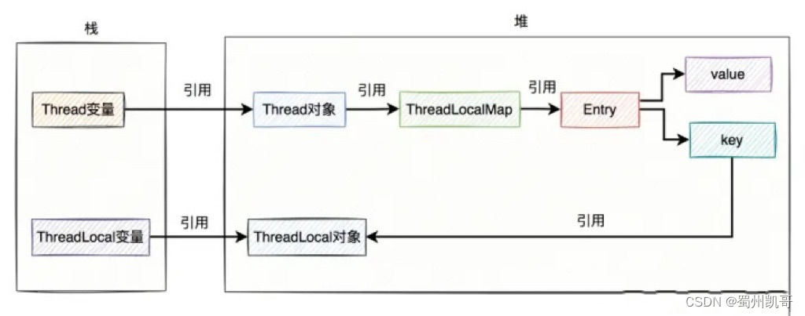
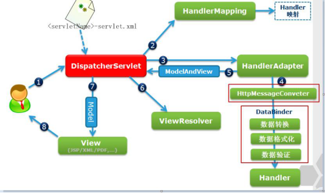
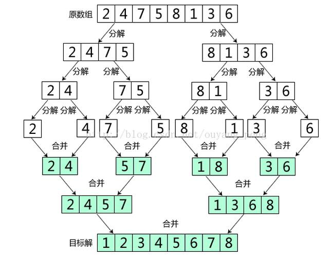

# 																																																																																						JAVA

1——封装、继承和多态
   封装就是把属性和方法放到一个类里面去，并用private修饰，不允许在外部直接访问，只能通过类提供的公开方法进行间接访问
   继承就是子类拥有父类的所有属性和方法，从而实现了实现代码的复用
   多态对于对象就是指可以使用父类引用指向子类对象，对于方法就是重载和重写

2——访问权限
   private：同类可访问
   protected：同一包内的其他类中访问，不同包的子类也可以访问
   默认：同包可访问
   public：任意类均可访问

3——局部变量、成员变量和类变量
   局部变量定义在方法里
   成员变量定义在类里且没有被static修饰
   类变量定义在类里且需要被static修饰

4——为什么重写 equals 还要重写 hashcode？
   因为必须保证重写后的equals方法认定相同的两个对象拥有相同的哈希值，防止在Set、Map等要求元素不可重复的集合出错

5——== 和 equals 比较的区别
   对于引用数据类型（包括String和包装类等），==比较的是对象的地址是否相等，而equals比较的是对象的值是否相等

6——为啥有时会出现 4.0 - 3.6 = 0.40000001 这种现象？

？？？？？

7——final 关键字的作用
   修饰变量：表明该变量不可改变
   修饰类：表明该类不可被继承
   修饰方法：表明该方法不可被子类覆盖

8——介绍 Java 的集合类
   可分为两类Collection和Map，其中Collection·又可分为Set、List、Queue
   Set代表无序的，元素不可重复的集合；
   List代表有序的，元素可以重复的集合；
   Queue代表先进先出（FIFO）的队列；
   Map代表具有映射关系（key-value）的集合，其所有的key是一个Set集合，即key无序且不能重复。

9——ArrayList 和 LinkedList 的区别
   ArrayList 是基于动态数组的（ArrayList的默认初始容量为10，扩容因子为1.5），而 LinkedList 是基于双向链表的

10——接口和抽象类的区别
1、都不可以实例化
2、一个类只能继承一个抽象类，但是可以实现多个接口
3、抽象类除了可以可以有抽象方法外，其他属性和方法的使用与非抽象类一致，接口中属性只有静态常量，方法只有抽象方法和默认方法

11——重写和重载的区别
    重写是子类对父类允许方法进行重写
    重载指的是同一个类下方法的名字可以相同，但是相同名字的方法的参数或返回类型必须不同

12——函数式接口和lambda表达式
    函数式接口就是只有一个抽象函数的接口
    lambda表达式就是匿名函数，可以将方法当成参数一样传递，lambda表达式和函数式接口一般配套使用

13——泛型擦除的解释
    泛型信息只存在于代码编译阶段，在进入 JVM 之前，与泛型被转译成普通的 `Object` 类型，如果指定了上限如`<T extends String>` 则类型参数就被替换成类型上限。

14——反射的解释
    Java的对象在运行时可表现为两种类型，即编译时类型和运行时类型（如Person p = new Student()中Person为编译时类型，Student 为运行时类型），但是我们在编译时无法预知运行时对象属于什么类型（比如运行时的对象为外部传入时，此时不可能在编译时获取运行时对象），此时我们可以通过反射操作获取这个对象的运行时类型，并进一步获取这个运行类的信息、创建该运行类的实例，对这个运行类进行动态代理

15——HashMap/HashSet原理（put/get方法的过程）
    简述：HashMap是一个储存键值对的容器，其特点在于获取和修改数据时间复杂度都为O(n?)
    1、首次扩容：当桶数组为空时扩容至16
    2、计算索引：通过hash算法计算键值对在数组中的索引
    3、插入数据：如果位置非空直接插入；如果位置空且key重复进行覆盖；如果非空且key不重复插入链表末尾，当链表长度达到8时链表转换为红黑树，其时间复杂度为O(logn)或O(n)（删除数据红黑树内键值对个数小于6时发生树转链表）
    4、再次扩容：当数组中的元素个数超过负载因子0.75时扩容为原来两倍

其中HashSet实际上是基于 HashMap 实现的，只存储了键，而值都设置为同一个特殊值（通常是 null）。

16——ConcurrentHashMap原理？

jdk7：jdk7中ConcurrentHashMap是线程安全的哈希表，其底层使用分段锁的机制，ConcurrentHashMap的桶数组的每个元素都是一个段，每个段都有自己的锁，不同段可以被不同线程同时访问，提高了容器的并发性能。

jdk8：jdk8中ConcurrentHashMap 主要通过 volatile + CAS 或者 synchronized 来实现的线程安全的。如果对应的桶数组索引处为空，则利用 CAS 插入头结点；如果对应的桶数组索引处不为空，则使用synchronized获得头结点锁，进行后续的操作。

17——IO流
    实现对数据的输入输出操作
-  按数据流向可分为输入流和输出流
-  按数据类型可分为字节流和字符流

18——浅拷贝和深拷贝

浅拷贝为拷贝一个指针，被拷贝和拷贝的指针指向同一个对象；

深拷贝为申请一块新内存，将被拷贝对象的数据拷贝进新内存中

18——项目、模块、包、类之间的关系？

1、同一个项目下的不同模块是一个独立的部分，可以独自完成编译和运行；

2、同一个模块下的不同包之间进行调用必须使用import导入相关包，才可以调用public权限等级的方法和属性

3、同一个包下的不同类可以对其他public和默认权限等级的类进行调用

19——ArrayList中的数组为什么用transient进行修饰？
    使用transient可以避免使用默认的序列化方式。因为ArrayList数组的实际大小会大于真正的元素量，默认的序列化会将空值也序列化，并且ArrayList自己实现writeObject和readObject方法避免序列化空值
20——Hashmap在jdk7 和jdk 1.8 有什么区别？

数据结构：jdk7为数组+链表，jdk8为数组+链表/红黑树
链表插入：jdk7为头插法，jdk8为尾插法

21——非静态内部类和静态内部类的区别？
    非静态内部类从属于类的实例，静态内部类从属于类
    非静态内部类不可有静态成员，可以访问外部类的所有属性与方法，静态内部类类可以有静态成员，只能访问外部类的静态属性与方法
    非静态内部类可以访问外部类的私有成员，而静态内部类不能直接访问外部类的私有成员，需要通过实例化外部类来访问。
22——遍历List的方法？

1、for

2、增强for

3、迭代器

       Iterator<String> it =list.iterator();
        while(it.hasNext())
        {
            String s=it.next();
        }

23——有序的Set是什么？

TreeSet可保证读取时元素的自然顺序{3,5,2,1,4}->{1,2,3,4,5}

LinkedHashSet可保证读取时元素顺序与写入顺序相同{3,5,2,1,4}->{3,5,2,1,4}

24——为什么说HashMap是线程不安全的？

- 比如两线程并发插入头结点时，可能会出现其中一个头结点直接被覆盖的情况
- 比如一个线程在扩容哈希表时，有其他线程对哈希表进行并发修改，就可能导致数据丢失或出现异常

25——什么是序列化？

序列化是指将Java对象转换为字节序列的过程，而反序列化则是将字节序列转换为Java对象的过程

26——为什么SpringBuilder比String快？

StringBuilder和String的底层实现都是char数组

但是String的char数组使用了final进行修饰，而实际上String进行修改时是通过创建一个StringBuilder来进行修改，如何调用toString方法返回修改后的String，

而StringBuilder进行修改操作时，会直接在char数组上进行修改，无需创建新对象

27——String str = "a"+new String("b");创建了几个对象

1、常量池对象”a“

2、常量池对象“b”

3、堆对象“b“

4、StringBuilder

5、StringBuilder.toString()

28——两个Integer直接使用==比较

使用`==`操作符：如果两个`Integer`对象包含的值在`-128`到`127`的范围内，则通过`==`操作符比较时结果为`true`。如果超出了这个范围，结果为`false`。这是因为Java对小范围的整数进行了缓存处理

29——受检异常和非受检异常

非受检异常一般是程序出现的逻辑问题，java编译器不要求对其进行处理，如空指针、除0错误等

受检异常是由于一些外部偶然因素导致的异常，java编译器要求必须对其进行处理，比如IOException（文件不存在或不可读）、SQLException（数据库服务器不可用、连接字符串错误、网络问题）

# Go

1——Go的垃圾回收算法？

三色标记法+混合写屏障

三色标记法：初始所有对象都为白色，然后从根节点遍历所有对象，将遍历到的对象变成灰色，遍历灰色对象的引用对象也变为灰色，然后将遍历过得灰色对象变成黑色

混合写屏障：将初始栈上的可达对象和扫描过程中在栈上新对象变黑色，将出现被删除或增加引用关系的对象变为灰色

2——CSP模型？

以通信方式方式共享内存，go使用管道完成并行通信，管道使用的是有缓存区的生产者消费者模型，当关闭管道时，未响应的recv返回nil，未响应的send触发panic

3——GPM是什么？

G即协程，相较于线程消耗更少资源

M即工作线程，代表真实的CPU数

P即处理器，代表运行goroutine的上下文，用来调度G和M的关联关系

4——Context是什么？

context的作用就是在不同的goroutine之间同步请求特定的数据、取消信号以及处理请求的截止日期；Context是一个接口，包括设置截止时间的Deadline方法、返回接收取消信号的管道的Done方法、获取取消原因的Err方法，获取Context绑定值的Value方法

5——golang 中 new 和 make 的区别？

make只能用于分配slice、map、chan

new可用于任意类型，返回一个执行该内存的指针

6——GC 的触发条件？

1、runtime主动触发

2、定时触发、阈值触发

7——slice扩容原理

若 slice 容量小于 1024 个元素，扩容乘以 2；一旦元素个数超过 1024 个元素，扩容乘以 1.25

8——Go 中两个 Nil 可能不相等吗？

接口值对比非接口值时这两个nil是可能会不相等的的，因为接口内部实现包含 2 个字段，类型 T 和 值 V，当非接口值比较时会被转变为接口，而导致这两个接口的类型T不相等

9——Go 语言中的内存对齐了解吗？

cpu访问是以字节为单位，如果不进行字节对齐，则小于一个字节的数据可能会需要cpu访问两次，同时还会导致内存读取操作不是原子的

# JVM

1——JVM包含哪几部分？（介绍 JVM 的内存模型？）

   - 类加载器子系统：负责加载字节码文件
   - 运行时数据区：存放运行时的数据，包括：
 -  程序计数器：记录下一条指令的地址，保证多线程可以正确轮换
 -  本地方法栈：管理本地方法的调用
 -  栈：局部变量、操作数栈（保持计算过程的中间结果）、动态链接（对常量池的符号引用）、方法返回地址等
 -  堆：存放对象
 -  方法区：被虚拟机加载的类的信息（包括类的版本、字段、方法、接口和父类等信息）、运行时常量池、串池
   - 执行引擎：字节码指令解释/编译为对应平台上的本地机器指令
   - 本地方法接口：就是java代码调用非java代码（本地方法）的接口

2——类的加载过程

   JVM加载字节码文件（即class文件）可分为三个阶段加载、连接、初始化

   - 加载：通过类的全限定名来获取描述该类的二进制字节流，将该字节流转化为方法区的运行时数据结构，在堆区中生成类的class对象
   - 验证：确保字节流中包含的消息符合虚拟机的要求
   - 准备：为静态变量赋jvm的默认值
   - 解析：将常量池的符号引用换为直接引用（符号引用是一个唯一标识方法、变量、类的字符串，直接引用是一个内存地址）
   - 初始化：生成类的实例，为静态变量赋初始值，执行静态方法

3——java代码是如何运行
   java编译为字节码文件，通过类加载器加载进内存，后被虚拟机进行编译和解释为对应平台上的机器指令后完成运行

4——JVM 内存为什么要分代？为什么年轻代要分为eden区和survivor区？
1、新创建的对象往往很快就变得不可达，存活时间长的对象有更大几率存活

2、使用eden区的好处是降低ygc的发生频率，如果只是简单把年轻代划分为使用两个区域进行标准复制法，那么相当于年轻代的内存空间直接减半，survivor区的好处是将零散的内存碎片通过标志复制法转移到一块连续的内存空间，以提升内存的利用率

5—— JVM中一次完整的GC流程是怎样的
   所有GC都会stop the world即暂停其他用户的线程
   YGC：伊甸区满的时候，将伊甸区内和幸存者1（0）区的剩余对象移至幸存者0（1）区，并且对象年龄加一，当对象的年龄到底阈值时将其移至老年区
   //OGC：老年区内存满了后，对老年区进行清理（只有 CMS 会单独回收老年代）

   //Mixed GC：收集整个新生代，和部分老年代，只有G1有这个模式

   Full GC：当出现主动调用System.gc、老年区空间不足、方法区空间不足时等情况时触发、对这个整个堆和方法区进行清理

6——介绍双亲委派模型，为什么需要它？
   双亲委派就是在完成将java类的字节码加载到内存生成一个类对象时，优先使用它的父类的加载器完成加载（如果父类还有父类继续向上委托），如果父类的加载器无法完成时，才会尝试使用子加载器
   主要优点为：防止重复加载类（如a、b有共同的父类c）；保护核心api不被随意篡改（核心api都在顶层的父类加载器）；

7——Java的四种引用方式

   强引用：使用new产生的对象，只有强引用的对象时可触及，就永远都不会被清理
   软引用：当要发生内存溢出异常前才会清理弱引用，用于做高速缓存，如果还有空闲内存就暂时保留当缓存，否则就清理掉
   弱引用：每次GC都会清理软引用，用于做高速缓存，如果还有空闲内存就暂时保留当缓存，否则就清理掉

   虚引用：与没有引用的效果几乎一样，一般用了做垃圾回收跟踪

8——对象的实例化过程
   父类静态变量初始化——父类静态代码块——子类静态变量初始化——子类静态代码块——父类变量初始化——父类代码块——父类构造器——子类变量初始化——子类代码块——子类构造器

9——元空间是在虚拟机内吗？
   元空间使用的是本地内存（整个电脑）

10——如何找到垃圾？
    可达性分析：通过从一系列GCRoot出发，根据引用关系向下搜索，由此形成引用链，未与引用链相连的对象为不可达对象，标记为垃圾
    GCRoot包括栈中引用的对象、静态变量引用的对象、常量引用的对象、本地方法引用的对象、被同步锁持有的对象及其他一些常驻对象

11——具体是如何清理垃圾？

- 标记-清除：从GCRoot出发标记所有可达对象，然后遍历收集所有不可达对象
- 标准-复制：将内存分两个区，清理垃圾时将所有可达对象复制到其中一个区中，将这个区外内存中对象清理，下一次清理垃圾时，清理和复制的区域对调
- 标记-压缩：将可达对象压缩至内存的一段，然后清理边界外的垃圾

12——如何减少FullGC？

- 扩大方法区
- 扩大老年代，缩小新生代
- 禁用System.gc

13——为什么老年代不使用标记复制
    因为OGC发生的频率较低，更加看重储存的空间（储存空间低了容易出发Full GC），而标记复制的效率高缺浪费空间，不符合OGC的需要

14——为什么新生代和老年代要采用不同的回收算法？
    因为YGC发生的频率高，OGC发生的频率较低且更加看重储存的空间

15——介绍G1垃圾回收器
    G1垃圾回收器不在将固定大小、固定数量的区域划分，而是把堆划分为多个等大的独立区域，每个区域可根据需要成为伊甸区、幸存者区、老年代

16——介绍CMS垃圾回收器
    特点是低延迟，CMS在堆内存使用率达到一定阈值时就会开始回收，分为4个阶段
    1、初始标记：STW，只标记GCRoot及其直接关联的对象
    2、并发标记：无需STW，并发标记垃圾
    3、重新标记：STW，补充并发标记过程发生标记改变的那一部分对象的标记
    4、并发删除：无需STW，删除标记的对象

17——什么时内存泄漏？什么是内存溢出？
    内存泄漏为分配给临时变量的内存，始终没有被GC回收，一直占据着内存，导致这部分内存无法被其他变量使用
    内存溢出为程序运行过程中申请使用的内存大于提供的最大内存就会发生内存溢出

18——内存泄漏如何解决？

-  尽早释放无用变量的引用
-  尽量少的使用静态变量

19——内存溢出如何解决？

-  增加分配的内存
-  查看日志，分析错误
-  使用内存查看工具查看内存使用状态

20——7种垃圾回收器？用过什么垃圾回收器？

Serial GC、Serial Old GC（单线程串行）、PerNew GC(并行回收)、Parallel Scavenge、Parallel Old Scavenge（吞吐量优先串行）、CMS、G1

在JDK8中，默认的垃圾回收器组合是Parallel Scavenge GC（新生代收集器）和Parallel Old Scavenge GC（老年代收集器）

21——JVM是如何优化锁的？

-  锁升级：略
-  锁消除：指的是在某些情况下，JVM 虚拟机如果检测不到某段代码被共享和竞争的可能性，就会将这段代码所属的同步锁消除掉，从而到底提高程序性能的目的。
-  锁粗化：将多个连续的加锁、解锁操作连接在一起，扩展成一个范围更大的锁。

22——CMS和G1的区别？

CMS是老年代垃圾收集器，可以配合年轻代Serial和PerNew使用，使用的算法是标志清除法

G1是同时收集年轻代和老年代的垃圾回收器，使用的算法是标记压缩法

23——JMM内存模型？

JMM是一种抽象的内存划分方法，主存储存所有的变量，工作内存中储存主存的副本，线程对数据的所有操作都必须必须在工作内存中完成，不同线程之间值的传递必须通过主存进行传递

24——java用的什么线程调度算法？

Java虚拟机采用**抢占式**调度模型，是指优先让可运行池中优先级高的线程占用CPU，如果可 运行池中的线程优先级相同，那么就**随机**选择一个线程，使其占用CPU。处于运行状态的线 程会一直运行，直至它不得不放弃 CPU。

25——java对象头里有什么？

包括mark word和类型指针，mark word包括哈希值、GC分代、锁状态标志等，根据不同的锁的状态有不同的mark word

26——说说你知道的几种主要的JVM参数

Xmx最大堆大小

Xms初始堆对象

XX:NewRatio=设置年轻代与老年代的比值。

XX:SurvivorRatio设置年轻代中Eden区与Survivor区的大小比值。

27——如何打破双亲委派模型？

打破双亲委派机制则不仅要继承ClassLoader类，还要重写loadClass和findClass方法。

28——JVM new一个对象的过程？

1、类加载检测：检查这个符号引用代表的类是否已被加载过、解析和初始化过。存在说明已经执行过类加载过程。如果没有，先执行类加载过程。

2、分配内存

3、初始化：jvm将分配到的内存空间都初始化0值(不包含对象头)，目的是为了保证对象的实例字段在java代码中可以不赋初始值就直接使用

4、设置对象头：如hash值、锁状态等消息

5、执行init方法

29——如何解决new对象在内存中的冲突问题？

1、指针碰撞：内存规整的情况，用过的内存放一边，没用的在一边。中间有个分割线。把分割线的指针往没有用过的内存那边挪一点

2、空闲列表：内存不规整的情况，已使用和未使用是散列在堆内存中，jvm需要维护一个列表，记录那些内存块可用，分配的时候从空余的内存快中分配一块和新对象的占用内存大小的给新对象，之后更新列表记录

# JUC

1——线程安全和线程不安全的容器
   java.util包下的大部分线程都是线程不安全的，如ArrayList、LinkedList、HashSet、ArrayDeque、HashMap
   线程安全的容器比如HashTable、java.util.concurrent.* 下的线程安全集合类等

2——创建线程有几种方式
   1、通过继承Thread类并重写run()方法来创建并启动线程
   2、通过实现Runnable接口并重写run()方法，通过Runnable的实现类创建Thread对象启动线程
   3、通过实现Callable接口来创建并重写call()方法，通过Callable的实现类返回一个FutureTask对象，通过FutureTask对象创建Thread对象启动线程并用FutureTask对象接收返回值

3——说说Thread类的常用方法
   静态方法：

   sleep睡眠，但是不会释放锁

   yield当前线程自愿放弃处理器的使用权

   currentThread当前正在执行的线程

   实例方法：

   interrupt该线程中断并抛出异常

   join等待该线程执行完

   getId返回该线程的id

4——volatile 关键字的作用？其原理是什么？
1、使用volatile修饰的变量可以保证可见性和有序性。可见性保证了该变量在读写时工作内存里的值与主存里的值是同步的，防止有其他线程修改了主存内的值导致工作内存里的值与主存里的值不一致；

2、有序性指编译器将该变量写操作之前的代码不会被优化至写操作之后，读操作之后的代码不会被优化至读操作之前；

3、可见性的实现原理为lock前缀指令实现的，将当前工作内存中的值写入主存，并另其他线程的工作内存中该变量的值失效

4、有序性的实现原理是内存屏障，在该变量写操作前插入storestore保证之前的写操作均已完成，写操作之后加入storeload保证之后的读写操作在当前操作完成之后才执行；在该变量读操作前插入loadload保证之前的读操作均已完成，读操作之后插入loadstore后续的写操作在当前操作完成之后才执行

5——run和start的区别？
   run相当于普通方法的调用；start才会创建新线程执行这个方法

6——线程能否重复启动？
   不能，重复启动会抛出异常

7——线程的生命周期？
   新建、就绪、运行、阻塞、死亡

8——如何实现线程同步？
   使用同步方法、同步代码块、可重入锁、volatile修饰变量等

9——什么是线程安全问题？保证线程安全的方法？

   就是 多线程环境中 , 且存在数据共享 , 一个线程访问的共享数据被其他线程修改了, 那么就发生了线程安全问题
   synchronized、Lock、volatile、原子变量、线程本地储存（ThreadLocal类）

10——Java中线程之间通信的方式？
      使用wait、notify；使用阻塞队列

11——讲一讲wait、notify和notifyAll
    wait会当前线程释放持有的锁并进入阻塞状态；notify会唤醒一个正在等待锁对象的线程，使其由阻塞状态变为就绪状态；notifyAll会唤醒所有正在等待锁对象的线程，让其竞争锁的所有权。

12——sleep和wait的区别
    sheep是Thread类的静态方法，sleep 方法可以在任何地方使用，sleep不会释放锁；wait是Object类的成员方法，wait方法则只能在同步方法或同步块中使用，wait会释放锁，且必须通过notify或notifyAll才能重新获取锁

13——如何实现子线程先执行，主线程在执行？
    在子线程启动后，调用该线程的join方法

14——阻塞线程的方法
    sleep；wait；该线程调用一个阻塞式IO方法……

15——synchronized和ReentrantLock的区别？

-  synchronized会在代码执行完或异常时主动释放锁，ReentrantLock不会主动释放锁，必须在finally中释放锁
-  ReentrantLock可设置获取锁失败的超时时间，synchronized不行
-  ReentrantLock默认是非公平锁，但是可以设置为公平锁，synchronized只能为公平锁
-  ReentrantLock可以中断，synchronized不行

16——synchronized的底层实现原理？

- 当进入同步代码块或方法时，如果当前锁对象关联的monitor进入数为0，该线程进入monitor并将进入数置为1，该线程成为monitor的所有者；当进入数大于0，如果为同线程重入，则进入数加1，如果为不同线程进入，该线程进入阻塞状态

- 当退出代码块或方法及出现异常时，monitor的进入数减1，当进入数为零时，该线程退出monitor，不再时该monitor的所有者
- 具体的执行是通过JVM调用操作系统的互斥原语mutex实现的

17——ReentrantLock的实现原理？

ReentrantLock是基于 CAS +AQS实现的，通过对AQS的tryAcquire和tryRelease的重写实现了lock和unlock方法。加锁解锁时通过state是否为0判断是否获得/失去锁的持有，如果大于0，判断持有者是否为自己，为自己则进行重入并state+1

18——synchronized可以修饰静态方法和静态代码块吗？
    synchronized可以修饰静态方法，不可以修饰静态代码块

19——乐观锁和悲观锁的区别
    悲观锁每次去取数据是总是会加上锁，当其他线程也想去取这个数据时将会被锁阻塞
    乐观锁实际上可以认为是无锁，不会阻塞其他线程去获取和改变这个数据，但是每次去更新数据时会进行一个比较预期原值和实际值并交换数据的行为保证数据的可靠

20——公平锁和非公平锁
    公平锁即先被阻塞线程先被唤醒，非公平锁唤醒的线程为随机线程

21——讲讲锁升级
    无锁——偏向锁：当锁初次获取时，将会变成偏向锁，之后这个线程想再次进入时无需进行同步操作
    偏向锁——轻量级锁：当出现两个线程对锁的竞争时（a线程在临界区，b线程尝试访问），将会升级为轻量级锁，轻量级锁是通过对锁对象的头部分完成CAS保证临界区的互斥访问
    轻量级锁——重量级锁：当线程自旋过长或线程数过多将升级为重量级锁，重量级锁是通过操作系统的互斥量和信号量实现的

22——分段锁是如何实现的？
    将容器内的数据划分为多段，每一段数据配一把锁，这样在多线程访问不同段的锁时可以有效提升并发效率。（如ConcurentHashMap就是这么做的）

23——说说你对读写锁的了解
    在Java中ReadWriteLock的主要实现为ReentrantReadWriteLock，其功能为读读不互斥，读写互斥，写写互斥

24——谈谈JUC
    JUC即java.util.concurrent时java提供的并发编程功能的包,主要包括原子类+.util.concurrent.atomic、锁（Lock）、线程池（Executor）、阻塞队列（BlockingQueue）、并发容器（ConcurrentHashMap）、同步器（CountDownLatch）

25——谈谈LongAdder
    LongAdder是用于并发环境下的计数器，其是基于分段锁实现的原子类，在高并发的情况下表现会比原子类AtomicLong、AtomicInt的线程竞争更少，并发效率更高

26——介绍Thread和它的应用场景？ThreadLocal原理？

ThreadLocal将是线程私有的局部变量容器。常见的应用如用于管理Session，将Session保存在ThreadLocal可以保证线程多次处理会话是始终是同一个Session



原理：每个线程Thread都有一个关联ThreadLocalMap对象，它是一个哈希表，其键为ThreadLocal实例，值为对应变量副本，我们通过set、get、remove等进行操作时，会使用ThreadLocal实例为键进行操作（一个线程可以有多个ThreadLocal） ,并且Entry是弱引用对象，原因在于如果执行该代码的线程使用了线程池，一直长期存在，不会被销毁，而ThreadLocal变量生命周期完了，就会造成ThreadLocal对象一直不会被回收，造成了内存泄漏（但是也必须remove方法，因为value也有可能会存在强引用）

附加：线程池中如何共享数据？

在真实的业务场景中，一般很少用单独的线程，绝大多数，都是用的线程池。

那么，在线程池中如何共享ThreadLocal对象生成的数据呢？

因为涉及到不同的线程，如果直接使用ThreadLocal，显然是不合适的。

我们应该使用InheritableThreadLocal完成父子线程之间的数据共享

27——介绍一下线程池？
    线程池用于管理和创建线程。而线程池在系统启动时即创建大量空闲的线程，程序将Runnable对象或Callable对象传给线程池，当这些对象的run或call执行完后，该线程不会死亡，而是返回线程池成为空闲状态，当系统需要大量线程时，可以很好的通过线程池很好的提升性能

28——线程池参数如何设置？
    参数包括核心线程数、最大线程数、救急线程存活时间、等待执行任务的阻塞队列、线程创建工厂、拒绝策略

```java
new ThreadPoolExecutor(10,
               	20,
                30, TimeUnit.SECONDS,
                new LinkedBlockingDeque<>(100000),
                Executors.defaultThreadFactory(),
                new ThreadPoolExecutor.AbortPolicy());
```


    对于CPU密集型任务使用较小的线程池（cpu核心数+1）、对应IO密集型任务使用较大线程池（2*cpu核心数）

29——线程池的拒绝策略？
    当线程池的任务缓存队列已满并且线程池中的线程数目达到maximumPoolSize，如果还有任务到来就会采取任务拒绝策略
    AbortPolicy:丢弃任务并抛出异常
    DiscardPolicy:丢弃任务
    DiscardOldestPolicy：丢弃队列最前的任务，然后并执行当前任务
    CallerRunsPolicy：提交任务的线程自己处理。

30——线程池的工作流程？
    1、创建线程池：首先需要创建一定数量的线程，这些线程会一直存在，直到整个程序结束
    2、提交新任务：首先判断核心线程池是否已满，没满重创建核心线程来执行任务；其次判断阻塞队列是否已满，没满则将新提交的任务添加在阻塞队列；最后，判断整个线程池是否已满，没满则创建一个救急线程来执行任务，已满则执行拒绝策略。
    3、执行完毕的线程回到线程池变，等待执行下一个任务
    4、关闭线程池，可调用shutdown()方法来平缓关闭线程池，或者使用shutdownNow()方法来立即关闭线程池。

31——线程池的状态？
    running：可新提交任务，也可处理阻塞队列的任务
    shutdown：不可新提交任务，但可处理阻塞队列的任务
    stop：不可新提交任务，不可处理阻塞队列的任务，中断正在处理任务的线程
    tidying：线程池及队列为空，所有任务都已中止
    terminated：关闭状态

32——CopyOnWriteArrayList 原理，适用于哪种场景？

写操作时：当进行增删改的写入操作时，将底层数组拷贝一份，在拷贝数组上进行修改，写入完成后再用拷贝的数组替换原数组

读操作时：进行共享的读，不进行上锁

33——什么是AQS？
    AQS即重现队列同步器，是构建锁或其他同步器的模板。AQS的核心思想为当一个共享资源空闲时，将请求的线程设为工作线程，并将共享资源设为锁定状态；当一个共享资源被占用时，将请求的线程加入指定的双端锁队列。基于AQS实现的组件包括：ReentrantLock、Semaphore、ReentrantReadWriteLock
34——什么是CAS？
    CAS就是比较并交换。CAS操作包括三个操作数，内存位置、预期原值、新值。如果内存位置的值与预期原值相同，则将其替换为新值，否则不做任何操作
35——为什么要使用线程池？

1、降低资源的消耗，避免频繁的创建和销毁线程，提高响应的速度
2、方便进行线程的管理

36——并发的意义是什么？

并发是为了减少cpu的等待外部资源的时间。当多个任务顺序执行时，当某个任务因为外部原因被阻塞（如IO），如果是单线程程序则cpu必须等待这个任务解决了外部原因后才可继续执行之后的任务；如果是多线程程序则可将cpu分配给其他空闲线程先完成后续任务，等到被阻塞的任务解决了外部原因后再为其分配cpu

37、**手撕**三个线程顺序打印A、B、C重复10次

1、synchronized-wait-notifyAll

```java
class GulimallAuthServerApplicationTests {
    private static int state = 0;

    private static Object lock = new Object();

    public static void main(String[] args) {
        Thread t1 = new Thread(() -> {
            for (int i = 0; i < 10; i++) {
                synchronized (lock) {
                    while (state % 3 != 0) {
                        try {
                            lock.wait();
                        } catch (InterruptedException e) {
                            throw new RuntimeException(e);
                        }
                    }
                    System.out.println("A");
                    state++;
                    lock.notifyAll();
                }
            }
        });

        Thread t2 = new Thread(() -> {
            for (int i = 0; i < 10; i++) {
                synchronized (lock) {
                    while (state % 3 != 1) {
                        try {
                            lock.wait();
                        } catch (InterruptedException e) {
                            throw new RuntimeException(e);
                        }
                    }
                    System.out.println("B");
                    state++;
                    lock.notifyAll();
                }
            }
        });

        Thread t3 = new Thread(() -> {
            for (int i = 0; i < 10; i++) {
                synchronized (lock) {
                    while (state % 3 != 2) {
                        try {
                            lock.wait();
                        } catch (InterruptedException e) {
                            throw new RuntimeException(e);
                        }
                    }
                    System.out.println("C");
                    state++;
                    lock.notifyAll();
                }
            }
        });

        t1.start();
        t2.start();
        t3.start();
    }


}
```

38——ReentrantLock是如何实现公平锁的？

公平锁在获取锁时多了一个限制条件：hasQueuedPredecessors() 为 false，这个方法就是判断在等待队列中是否已经有线程在排队了，一旦已经有线程在排队了，当前线程就不再尝试获取锁

39——什么事ABA？如何解决？

假设有两个线程T1和T2, 初始时都读取到了内存中的值为A。T1执行CAS操作成功，将A改为B，然后又将B改回A；此时T2也执行CAS操作成功，因为它读取到的值仍然是A。但实际上这个值已经被T1修改过了，因此T2的操作可能会出现问题。
使用版本号或者时间戳等机制来标识数据的变化。

40——线程池的submit和excute的区别
1、返回结果：submit()方法可以接受并返回Future对象。而execute()方法没有返回值，无法获取任务的执行结果。
2、异常处理：submit()方法能够处理任务执行过程中抛出的异常。你可以通过调用Future对象的get()方法来获取任务执行过程中的异常，或者通过捕获ExecutionException异常来处理异常情况。而execute()方法无法处理任务执行过程中的异常，异常会被传播到线程池的未捕获异常处理器(UncaughtExceptionHandler)。
3、方法重载：submit()方法有多种重载形式，可以接受Runnable、Callable和其他可执行任务作为参数。而execute()方法只接受Runnable类型的任务作为参数，没有方法重载的选项。


# MYSQL

1——事务可能存在的四类问题和四大隔离级别是如何实现的？

   1、脏写：一个事务可以修改另外一个正在进行中的事务的数据

   2、脏读：读到了另一个事务未提交的数据

   3、不可重复读：同一个事务读取一个数据前后两次的结果不一致

   4、幻读：同一数据查询一个数据时，第一次存在，第二次不存在

   四大隔离级别：

   2、读未提交，实现机制为事务会对操作的数据加读行锁，可解决脏写问题

   2、读已提交，每次查询时都会生成一个新的ReadView

   3、可重复读，实现机制为1：修改事务只有在首次查询时才会生成MVCC解决了不可重复读问题；2：将行锁升级临键锁，2在事实上解决了幻读问题

   4、串行化，实现机制为将select自动添加共享锁，保证了读写互斥

2——事务的传播

1、PROPAGATION_SUPPORTS

表示当前方法不需要运行在一个是事务中，但如果有一个事务已经存在，该方法加入这个事务

2、PROPAGATION_NOT_SUPPORTED

表示方法不能运行在一个事务中，如果当前存在一个事务，则将这个事务挂起

3、PROPAGATION_REQUIRED

表示当前方法必须运行在一个事务中，如果当前存在一个事务，那么该方法加入这个事务中，否则，将创建一个新的事务

4、PROPAGATION_REQUIRES_NEW

表示当前方法必须运行在自己的事务中，如果当前存在一个事务，那么将旧事务挂起，运行新事务

5、PROPERGATION_MANDATORY

表示方法必须运行在一个事务中，如果当前事务不存在，就抛出异常

6、PROPAGATION_NEVER

表示方法不能运行在一个事务中，否则抛出异常

7、PROPAGATION_NESTED

表示如果当前事务存在，则方法应该运行在一个嵌套事务中。否则，它看起来和PROPAGATION_REQUIRED看起来没什么俩样

3——介绍一下间隙锁
   间隙锁用于锁定一定范围，但不包含锁定数据本身，其可以防止多个事务将记录插入同一范围，导致产生幻读

4——介绍一下行锁？
   Innode的行锁是针对索引上的索引项加锁实现的，如果使用非索引条件进行查询时，Innode只能使用表锁

5——数据库死锁问题如何解决
1、设置合理的超时时间和重试机制，当出现死锁时并死锁时间超过超时时间时，执行重试机制如强制令较早请求的事务回滚或终止
2、对于数据库的多表操作时，尽量按照相同的顺序进行处理，尽量避免同时锁定两个资源，如操作A和B两张表时，总是按先A后B的顺序处理， 必须同时锁定两个资源时，要保证在任何时刻都应该按照相同的顺序来锁定资源。

6——


7——如何优化mysql插入
   对于innode：
   1、禁用唯一性检查，插入数据前执行set unique_check=0禁用检测，插入完成后再用set unique_check=1开启唯一性检测
   2、禁用外键检查，插入完成后再开启外键检测
   3、禁止事务自动提交，插入完成再开启事务自动提交

8——表里包含几千万条数据怎么办

   - 优化sql和索引
   - 增加缓存如redis
   - 读写分离
   - 对表进行垂直拆分和水平拆分

9——如何做慢查询优化
   1、开启慢查询日志。在/etc/my.cnf 中配置 slow_query_log=1

   2、结合explain和慢查询日志分析慢查询语句

10——谈谈explain
    explain后接具体的select语句用于分析查询的效率，具体有：

- possible_keys：可能用到的索引
- key：实际使用到的索引
- key_len：表示索引的长度
- rows：扫描的行数
- type：数据扫描的类型
  - All：全表扫描
  - index：对索引表全扫描
  - range：索引表范围扫描
  - ref：ref 类型表示采用了非唯一索引，或者是唯一索引的非唯一性前缀扫描
  - eq_ref：eq_ref 类型是使用主键或唯一索引扫描
  - const：主键或唯一性索引，返回匹配某个值的行
- Using filesort：使用了group by但是却无法利用索引完成排序操作
- Using temporary：使用了临时表用于保存中间结果
- Using index：使用索引即可获取所需数据，无需进行回表操作

27——数据库设计的三范式
    1范式：数据库中每一列的值都必须具有原子性，即为不可拆分的最小单元；
    2范式：数据库中每一行记录都必须是可唯一标识的。所有的非主键列都必须可由主键全体唯一确定，不能只由主键的一部分确定（如课程、学生名、课程成绩   课程成绩由课程和学生名共同唯一确定，单独的课程或学生名不能唯一确定课程成绩）
    3范式：非主键列不能由其他非主键列唯一确定（如员工编号、员工名、部门编号、部门名  部门名可由非主键部门编号唯一确定，依照第三范式就应该将数据拆分建立一个部门信息表）

28——谈谈你对mysql引擎的了解？

- innodb引擎：

优点：支持事务、行锁、外键
缺点：占用空间较大，读写效率较差

- MyISAM引擎：

和innode相反

- MEMORY：所有的数据都在内存中，数据的处理速度快，但是价格昂贵，安全性不高。

27——谈谈redo log、undo log、binlog

-  redo log中记录了操作数据页的变化，用于保护脏数据不丢失。当脏页刷新到磁盘时出现错误时、系统崩溃等问题时，可使用redo log进行数据恢复，这保证了事务的持久性
-  undo log中记录事务的修改操作，用于事务回滚。
-  bin log记录了所有的对数据库的修改操作，可用于数据备份与恢复、主从节点的数据同步等

28——主从同步是如何实现的？
    1、主库在事务提交时，将数据变更记录在二进制文件binlog中
    2、从库I/O thread从主库读取binlog，写入从库的中继日志relaylog
    3、从库的sql thread监测到本地的relaylog新增了日志内容，将根据relaylog对应改变自己的数据

29——char、varchar和text的区别

- char为定长的字符串，定义长度<=65535
- varchar为长度可变的字符串，定义上限<=65535。当输入字符串长度小于定义的字符串长度，按照输入的字符串长度储存；当输入字符串长度大于定义的字符串长度，报错
- text用于储存长文本数据，不可指定长度，长度固定为65535

32——mysql有哪些锁？

- 全局锁：用全局锁可以阻止其他用户对数据库进行写操作，直到解锁，通常用于数据库维护任务，如备份和升级

- 表级锁

表锁：lock tables table_name read/write

元数据锁：当对数据行进行crud是自动加上元数据读锁，更改表结构时自动加上元数据写锁

意向锁：意向锁的目的是为了快速判断表里是否有记录被加锁，加解行锁时会自动加上对应意向锁

- 行级锁

???????

select … lock in share mode 加表级的意向共享锁

select … for update 加的是行级别的独占锁

记录锁、间隙锁、临键锁

33——什么是联合索引？

通过将多个字段组合成一个索引，该索引就被称为联合索引。比如，联合索引的非叶子节点用两个字段key1, key2的值作为 B+Tree 的 key 值。当在联合索引查询数据时，先按key1字段比较，在 key1相同的情况下再按 key2字段比较。

34——设计MySQL的表结构要考虑什么问题？
    1、应遵照数据库设计的三范式
    2、尽可能的使用非空约束，防止出现空指针
    3、优先考虑逻辑删除而非物理删除
    4、对适合的字段建立索引
35——索引的底层数据结构有哪些实现方式？了解hash索引吗？
    MySQL 常见索引有 B+Tree 索引、HASH 索引、Full-Text 索引。
    B+Tree 索引：是 MySQL 默认存储引擎 InnoDB 采用索引数据结构，所有数据都存储在叶子节点中，非叶子节点只存储索引
    Full-Text 索引：采用倒排索引的方式来实现全文搜索功能，支持关键字搜索和模糊查询。
    哈希索引：哈希索引通过哈希函数计算键的存储位置，适用于等值查找，速度快但不支持范围查找
36——当前读和快照读的区别？

-  当前读可以读取其他事务最新已经提交的事务，执行的过程中会通过加行级锁的方式保证事务的隔离性，比如 select for update、update、 delete 都属于当前读。
-  快照读是无锁的， 主要是基于mvcc机制实现的，可重复读和读已提交的 select 都属于快照读。

37——MySQL如何进行分表？

按照时间分表、按照范围分表、按照业务分表、按照数据的哈希结果分表（目的是将数据均匀分布到多个表中）

38——介绍一下分页和优化方法

分页一般是用limit实现的语法为limit 起始偏离，结束偏离

1、先按照条件分页查询出主键，然后再根据主键再去关联表，查询出所有需要列的记录数，这样可以避免扫描太多数据页

SELECT * FROM student t,(SELECT id FROM student ORDER BY id LIMIT 2000000,10) a WHERE t.id = a.id;

2、如果主键是自增的，可以把limit a,b转为where id>a limit b，这样使用的索引由全表扫描变为范围扫描

39——聚合函数有哪些？
    count统计数据表的行数；avg平均；sum求和；max最大

40——表与表是怎么关联的
    1、内连接 :返回符合连接条件的数据
    from a表 join b表 on a.val1 = b.val2
    2、左/右外连接 :返回符合连接条件的数据和左/右表中的数据
    from a表 left outer join b表 on a.val1 = b.val2

41——sql注入的理解？如何防止sql注入

- sql注入就是将sql代码伪装成输入参数传递到服务器中解析并执行的一种攻击方法
- 使用#代替$传递参数

42——where和having的区别

where是一个约束声明，约束从数据库的读取哪些数据，where是在结果返回前进行约束，不能在where中使用聚合函数
having是一个过滤声明，过滤掉不需要返回的数据，having是在结果返回后进行过滤，可以在having中对组使用聚合函数

43——谈谈索引

索引是帮助数据库高效获取数据的数据结构，其存放在磁盘中

44——如何创建Mysql的索引

- 在创建表的时候创建：
  create table 表名{
  数据类型定义
  [UNIQUE|FULLTEXT|SPATIAL] [INDEX|KEY] [index_name] (col_name [length]) [ASC|DESC]}

```mysql
create table 表名{
  id INT AUTO_INCREMENT PRIMARY KEY,
  name VARCHAR(50) NOT NULL,
  age INT,
  ip_address VARCHAR(100) UNIQUE
  index ip_address_idx (ip_address(16))
}
```

- 在已创建的表上创建索引：
  法一：alter table 表名 add [UNIQUE|FULLTEXT|SPATIAL] [INDEX|KEY] [index_name] (col_name [length]) [ASC|DESC]
  
  法二：

```mysql
alter table 表名 add index ip_address_idx (ip_address(16))
                                         
create index ip_address_idx on 表名 (ip_address(16))
```

45——Mysql如何判断需不需要加索引？

- 当唯一性是某种数据本身的特征时，指定唯一索引；
  在频繁需要进行排序或分组的列上建立索引；
  条件表达式中经常用到的非重复值较多的列上建立索引

- 经常更新的数据少用索引；
  数据量小和重复数据较多的表最好不用；

46——说一说索引实现的原理
    MyISAM和Innode都是基于B+树实现的。
    不同点在于MyISAM的聚簇索引和二级索引的叶子节点都是存放存放数据的地址；Innode聚簇索引的叶子节点存放的完整的数据，而二级索引的叶子节点都是存放主键的值

47——数据库什么时候需要索引重建，如何重建索引？

- 表上频繁更新、删除的时候；
  ……

48——Mysql索引为什么使用B+树？

- 相对于二叉树（红黑树），层级更少，搜索效率高

- 对于 B-Tree，B+树的非叶子节点不存数据，盘块能容纳的结点中关键字数量更多，一次性读入内存中可以查找的关键字也就越多，相对的，IO读写次数也就降低了。而IO读写次数是影响索引检索效率的最大因素。
- 相对于 Hash 索引，B+Tree 支持范围匹配及排序操作

49——谈谈聚簇索引和二级索引？
    聚簇索引：将数据存储与索引放一块，索引结构的叶子节点保存了全部数据 。聚簇索引必须有，而且只有一个 
    二级索引：将数据与索引分开存储，索引结构的叶子节点保存了对应数据的主键，必须通过进行回表才能查询到全部的数据  二级索引可以存在多个

50——事务的四大特性
    1、A原子性：事务是不可分割的工作单位，对于一个事务中的sql语句只有全部成功和全部失败的结果
    2、C一致性：事务执行前后，数据库各个节点的相关数据必须保持一致
    3、I隔离性：事务的执行不受其他并发操作的影响
    4、D持久性：事务一旦提交，其产生的结果就是永久的

51——事务的四大特性是如何实现的？
    1、原子性：使用undo log，undo log中记录事务对数据库修改的操作记录，当进行事务回滚是可以借助undo log撤销执行成功的sql语句
    2、一致性：一致性是事务的最终目的，事务实现原子性、隔离性、持久性的最终目的是为了实现一致性
    3、隔离性：通过锁实现了一个事务的写操作不会对另一个事务的写操作造成影响，只有一个事务获取到对应锁才能对对应的数据进行修改，而事务操作期间会对对应的数据上锁；
    通过MVCC实现一个事务的写操作不会对另一个事务的读操作造成影响。MVCC实现了多个版本的数据可以共享，当事务进行读时只需要对对应版本的数据进行读取
    4、持久性：使用redo log。正常运行情况下，为了提升读写磁盘IO的效率，Innode不会每次事务提交都将数据更新至数据库中，而是会使用Buffer Pool作为缓存，但是当数据库宕机时，缓存中的数据将会丢失，此时可以使用redo log进行数据库的修复，这就保证了事务的持久性

52——MVCC是如何实现的？

MVCC是一种通过版本链来控制并发事务访问同一个版本的数据的技术

基于3个技术实现的
1、隐藏列：InnoDB中每行数据都有隐藏列，隐藏列中最近修改的事务id、指向上一个版本的undo log的指针
2、基于undo log的版本链：每条undo log都指向上一个版本的undo log，从而形成一条版本链
3、ReadView：用于决定具体恢复哪个版本，在进行读操作时将事务id与活跃事务id集合、最小活跃事务id、当前事务id+1等进行比较，判断是否读取这个版本的数据（活跃事务指在创建ReadView是已启动但未提交的事务）

53——怎么优化一个慢SQL？

如果没有建立索引，考虑建立联合索引，如果建立的索引，通过 explain 执行结果，查看 sql 是否走索引，使用时要符合最左匹配法则并要保证索引生效。如果是连表查询最好使用小表驱动大表。如果是分页查询，最好把limit优化为where limit

54——索引怎么提高查询效率的？

通过二分法快速定位到包含该记录的页。定位到该页后，又会在该页内进行二分法快速定位记录所在的分组（槽号），最后在分组内进行遍历查找。

55——一个事务里有特别多sql的弊端？
-  锁定的数据太多，容易造成大量的死锁和锁超时。
-  回滚记录会占用大量存储空间，事务回滚时间长
-  执行时间长，容易造成主从延迟

56——生成分布式ID的算法？

- 雪花算法的原理就是生成一个的 64 位比特位的 long 类型的唯一 id。

最高 1 位固定值 0，因为生成的 id 是正整数，如果是 1 就是负数了。
接下来 41 位存储毫秒级时间戳，2^41/(1000606024365)=69，大概可以使用 69 年。
再接下 10 位存储机器码，包括 5 位 datacenterId 和 5 位 workerId。最多可以部署 2^10=1024 台机器。
最后 12 位存储序列号。同一毫秒时间戳时，通过这个递增的序列号来区分。即对于同一台机器而言，同一毫秒时间戳下，可以生成 2^12=4096 个不重复 id

- UUID版本通过M表示，当前规范有5个版本，M可选值为1, 2, 3, 4, 5。这5个版本使用不同算法，利用当前时间戳、mac地址、名字和名字空间的MD5散列值、随机数等生成UUID，各版本有各自优势，适用于不同情景。具体使用的信息

version 1, date-time & MAC address

基于时间的UUID通过计算当前时间戳、随机数和节点标识：机器MAC地址得到。由于在算法中使用了MAC地址，这个版本的UUID可以保证在全球范围的唯一性。但与此同时，使用MAC地址会带来安全性问题，这就是这个版本UUID受到批评的地方。同时， Version 1没考虑过一台机器上起了两个进程这类的问题，也没考虑相同时间戳的并发问题，所以严格的Version1没人实现，Version1的变种有Hibernate的CustomVersionOneStrategy.java、MongoDB的ObjectId.java、Twitter的snowflake等。

version 2, date-time & group/user id

DCE（Distributed Computing Environment）安全的UUID和基于时间的UUID算法相同，但会把时间戳的前4位置换为POSIX的UID或GID。这个版本的UUID在实际中较少用到。

version 3, MD5 hash & namespace

基于名字的UUID通过计算名字和名字空间的MD5散列值得到。这个版本的UUID保证了：相同名字空间中不同名字生成的UUID的唯一性；不同名字空间中的UUID的唯一性；相同名字空间中相同名字的UUID重复生成是相同的。

version 4, pseudo-random number

根据随机数，或者伪随机数生成UUID。

version 5, SHA-1 hash & namespace

和版本3的UUID算法类似，只是散列值计算使用SHA1（Secure Hash Algorithm 1）算法。
1和4用的最多

57——什么是最左前缀原则？

MySQL中使用联合索引时，必须按照联合索引中字段的顺序，从左到右依次与查询条件进行匹配

# Spring

1——说说你对Spring容器的了解

- Spring主要提供了两种类型的容器，BeanFactory和ApplicationConText
- BeanFactory是基础的IOC容器，使用懒加载的方式创建对象
- ApplicationContext是在BeanFactory的基础上构建的，其支持使用饿加载的方式创建对象，还提供了其他高级特性，比如事件发布、国际化信息支持等

2——谈谈IOC

IOC是控制反转的意思，即将主动new产生的对象转变为通过外部的IOC容器来创建对象，如此做可以降低对象之间的耦合度

3——Spring是如何将配置文件中的数据注入IOC容器创建的对象中的呢？

1、通过setter方法注入

通过setter方法可以更改相应对象的属性，setter方法注入属性是可选的（即可选择注入也可选择不注入该属性）

2、通过构造方法注入

通过构造方法初始化创建对象的属性，构造方法注入属性是必选的（想使用这个构造方法完成注入，构造方法中的参数必须全都注入）

3、自动装配

根据bean所依赖的资源（如bean-Service依赖bean-Dao）在容器中自动查找并注入到bean中的过程称为自动装配，注意需要类中需注入属性必须要有对应的setter方法，一般都是选择按类型注入

4——Spring是如何管理Bean的

Spring通过IOC容器来管理Bean，使用XML或者注解配置，然后通过setter或构造函数注入配置创建对象

5——Bean的作用域

singleton：单例模式

prototype：每次调用getBean方法时创建一个Bean

request：每次HTTP请求创建一个Bean

session：同一个HTTP Session共享一个Bean

globalSession：同一个全局Session共享一个Bean

6——Bean的生命周期

1、实例化：创建Bean对象，并分配内存空间
2、依赖注入：将当前对象依赖的bean对象，从Spring容器中找出来，然后填充到对应的属性中去。
3、bean初始化：回调各种Aware接口、回调各种初始化方法、生成AOP代理对象，其中初始化方法顺序为BeanPostProcessor中的预初始化方法-》PostConstruct注解
的方法-》实现InitializingBean下的afterPropertiesSet或Init-method方法-》
BeanPostProcessor中的后置初始化方法
4、使用bean执行业务操作：
5、关闭/销毁bean：执行bean销毁方法，PreDestroy注解的方法-》实现DisposableBean下的destroy或
destroy-method方法

*Aware接口：Bean是获取不到容器，但是实现了不同aware接口后bean可以获取一部分容器的消息
BeanNameAware	获得容器中bean名称
BeanClassLoaderAware	获得类加载器
BeanFactoryAware	获得bean创建工厂
EnvironmentAware	获得环境变量
EmbeddedValueResolverAware	获取spring容器加载的properties文件属性值
ResourceLoaderAware	获得资源加载器
ApplicationEventPublisherAware	获得应用事件发布器
MessageSourceAware	获得文本信息
ApplicationContextAware	获得当前应用上下文*

**NOTE：BeanPostProcessor中的预/后置初始化方法是所有Bean初始化都会调用的，所以这两个方法不能写在某个具体的 Bean 中，否则（这两个方法）不会执行。 需要另外创建一个类来实现这两个方法**

7——spring是如何解决循环依赖的/介绍spring的三级缓存结构？

一级缓存存放初始化完成的bean对象（IOC容器总要有地方存放bean吧）

二级缓存存放属性还没有注入的bean对象（因为三级缓存中的工厂生成的可能是动态代理对象（比如使用aop时），而每次工厂生成的动态代理对象都是新对象，地址值不一样，必须要保证每个地方注入的动态代理对象都是同一个对象）

三级缓存存放bean工厂（解决循环依赖问题）

**三级缓存可以解决循环依赖问题**（即a调用了b，b也调用了a问题），过程为：1、反射创建a对象，并将a的对象工厂放进a的第三级缓存；

2、依赖注入a对象时发现需要b对象，此时反射创建b对象，并将b的对象工厂放进b的第三级缓存；

3、b对象发现第三级缓存中有a工厂，调用生成a对象，并将返回的a对象放入a的第二级缓存，删除a的第三级缓存；

4、b对象初始化完成，将b对象放入第一级缓存，删除b的二、三级缓存

5、a对象初始化完成，将a对象放入第一级缓存，删除a的二、三级缓存

8——@Autowired和@Resource区别？

1、@Autowired是Spring提供的注解，@Resource是JDK提供的注解。

2、@Autowired是只能按类型注入，@Resource默认按名称注入，也支持按类型注入。

9——Spring提供的单例时线程安全的吗？

Spring容器本身并没有提供Bean的线程安全策略。如果线程中的操作不会对Bean的成员执行查询以外的操作，那么这个单例的Bean是线程安全的；如果线程中的操作会对Bean的成员执行增删改，可以使用ThreadLocal做数据的线程隔离，来保证线程安全

10——谈谈AOP？

AOP即面向切面编程，通过使用JDK动态代理或CGLIB动态代理，在代理类中对被代理对象的方法的执行前，执行后，返回后，抛出异常时等时间点完成各种功能，比如进行日志记录，Spring的事务也是基于AOP实现的

11——AOP对哪些类不能增强？

1、未被IOC容器管理的对象

2、既没有实现接口也不可被继承的类(JDK动态代理的类必须实现了接口；cglib动态代理的类必须可被继承)

12——Spring如何管理事务？

？？？？

13——Spring事务的传播方式？

对于加入事务方来说

required：如果当前有Transactional开启的事务，加入事务；没有事务，新建事务

required_new：始终新建事务

supports：如果当前有Transactional开启的事务管理员事务，加入事务；没有事务，什么都不做

not_supported：事务加入方什么时候都不可以加入或新建事务

mandatory：如果当前有Transactional开启的事务管理员事务，加入事务；没有事务，抛出异常

never：如果当前有Transactional开启的事务管理员事务，抛出异常；没有事务，什么都不做

nested：嵌套在当前存在的事务内执行

14——Spring的事务如何配置，常用注解有哪些？

@Transactional,使用isolation配置事务的隔离级别，使用propagation配置事务的传播机制

15——谈谈对声明式事务的理解？

编程式：自己写代码实现功能
声明式：可以通过AOP将事务的配置模块化，通过配置@Transactional的属性完成事务的实现

16——spring事务什么时候会失效？

由于aop实现造成的原因：

1、既没有实现接口也不可被继承的类

2、对象没有被spring管理

3、在被代理类中发生了自调用（即a类的b方法调用了a类的c方法），此时代理类执行时执行自调用的this指针指向的是被代理类，而不是代理类

其他原因：

4、数据库不支持事务

5、异常没有被抛出去的时候

17——spring中的bean和普通Java类的实例的区别

那就是spring中的bean，在Java类的基础上增加了很多概念属性，比如scope（作用域），isLazyInit（是否延迟初始化），isSingleton（是否单例）等属性特征。

也就是说，普通的Java类是不能完整描述上面的属性的，那Spring就通过BeanDefinition这个类来描述普通的Java类的属性以及额外的cope（作用域），isLazyInit（是否延迟初始化），isSingleton（是否单例）等属性特征。

18——spring的启动流程？

1、获取BeanDefinition：加载分析配置信息，扫描得到所有的BeanDefinition对象

2、创建Bean对象：对BeanFactoey对饿加载的单例根据BeanDefinition创建Bean对象

3、依赖注入：使用setter方法、Autowire注解等进行依赖注入

4、初始化：执行bean初始化方法，顺序为BeanPostProcessor中的预初始化方法-》 PostConstruct注解的方法-》实现InitializingBean下的afterPropertiesSet或Init-method方法-》BeanPostProcessor中的后置初始化方法

19——什么是@RestController，什么是@Controller  
    能（就相当于把两个注解组合在一起）。在使用 @RestController 注解标记的类中，每个方法的返回值都会以 JSON 或 XML 的形式返回对象
20——为什么依赖注入不适合使用字段注入？
    字段注入可能引起的三个问题：
    1、注入对象在容器外部不可见，比如在a类依赖b类，那么在容器外创建的a对象无法访问b对象
    2、可能导致循环依赖
    3、无法设置注入的对象为final，也无法注入静态变量

# SpringMVC

1——什么是MVC？

M负责处理应用程序的数据和业务逻辑

V负责数据的展示

C负责确保M和V的同步，完成根据用户的请求调用相应的模型进行处理

MVC的目的是将M（业务模型）和V（用户界面）的实现代码分离， C（控制器）

1——dao层是做什么的？

Data Access Object即数据访问对象，它专门用于访问数据库

3——SpringMVC的执行流程



1、客户端发出回http请求给服务器，该请求被DispatcherServlet（前端控制器）捕获

2、DispatchServlet根据请求的信息和HandlerMapping（处理器映射器）获取处理器Handler

3、DispatchServlet使用Handler获取处理器适配器HandlerAdapter执行HandlerAdapter处理一系列的操作。如：参数填装、数据验证

4、之后执行处理器Handler，执行完成后返回结果ModelAndView给DispatcherServlet

5、DispatcherServlet将ModelAndView传给ViewResolver视图解析器

6、ViewReslover解析后返回具体的View

7、DispatchServlet对View进行视图渲染，并响应用户

4——SpringMVC的常见注解？

@RequestMapping：用于做请求地址映射的，属性method指定请求类型，value指定请求的实际地址

@RequestParam：将请求参数与Controller的方法参数绑定，属性value指请求参数的对应名称，required为是否必须提供该参数

@PathVariable：  将路径参数与Controller的方法参数绑定，将路径参数绑定在控制器的方法形参上

@ResponseBody注解的作用是将Controller的方法返回的对象，通过适当的转换器转换为指定的格式之后，写入到response对象的body区，通常用来返回JSON数据或者是XML数据。

5——谈谈SpringMVC的拦截器？

SpringMVC的所有拦截器都需要实现HandlerInterceptor接口，该接口下有三个方法preHandle方法、postHandler方法和afterCompletion，程序：会依次执行：

- 执行preHandler方法，其会返回一个布尔值，如果为true继续执行下一步，如果为false直接跳到对应的afterCompletion方法
- 执行拦截方法
- 执行postHandler方法
- 执行afterCompletion方法

6——如何做请求拦截

可以使用拦截器、过滤器或aop进行请求拦截

7——什么是Servlet？和SpringMVC的关系？

Servlet可以视为是服务器端的一部分代码，负责接收来自客户端的请求，进行处理并向客户端返回响应。SpringMVC是对 Servlet 功能的封装和增强，同时保持了对标准 HTTP 请求处理的兼容性

8——拦截器和过滤器的区别 ？

 1）拦截器是基于JAVA反射机制的，而过滤器是基于函数回调的

 2）过滤器依赖于Servlet容器，导致它只能在web程序中使用，而拦截器是一个Spring组件，可以在非web程序中使用

3）拦截器只能对Action请求起作用（Action中的方法），而过滤器可以对几乎所有的请求起作用（CSS JSP JS）

# MyBatis

1——MyBatis输入输出支持的类型有哪些？

简单类型，集合类型（List、Map）、自定义的类（受到IOC管理）

2——MyBatis如何实现一对多关联？（即进行内连接和外连接）

在resultMap中，除了映射主表属性，还要通过collection标签映射子表属性，该标签需包含如下内容：

- 通过property属性指定主表类中子表变量对应名；
- 通过ofType属性指定子表的全类名；
- 通过result子标签定义子表字段和属性的映射关系。

3——MyBatis中#和$的区别

使用#设置参数时，MyBatis会创建预编译SQL语句，在执行SQL时才会为预编译的占位符进行赋值。预编译的sql语句执行效率高，并且可以防止注入攻击

使用$设置参数时，MyBatis会在执行SQL直接将参数并到SQL里，这种方法效率和安全都不如前者

4——MyBatis的xml是如何与dao接口绑定的？

xml文件中会在mapper根标签的namespace属性绑定dao接口的全限定名

5——MyBatis分页和自己写分页那个效率高？

自己写效率高，自己写可以对limit进行优化（如何优化见MYSQL中的问题）

6——谈谈MyBatis的缓存机制？

- 一级缓存：一级缓存是SqlSession级别的缓存。在同一个SqlSession重复查询缓存中已有的数据时，且两次查询间没有进行任何一次的增删改操作，则第二次查询可以直接从一级缓存中获取数据
- 二级缓存：二级缓存时SqlSessionFactory级别的缓存，通过同一个SqlSessionFactory创建的不同SqlSession重复查询缓存中已有的数据时，且两次查询间没有进行任何一次的增删改操作，则第二次查询可以直接从二级缓存中获取数据

7——MyBatis是如何分页的？

1、在mapper中直接写sql语句加上关键字limit

2、使用MyBatis里的Interceptor拦截器在select语句之前动态的去拼接分页的关键字（MyBatisPlus的分页器Page就是基于此原理进行的封装）

# SpringBoot

1——Spring Boot的启动流程（略）、Spring Boot自动装配原理

Spring Boot启动的时候会通过@EnableAutoConfiguration注解找到META-INF/spring.factories配置文件中的所有自动配置类，并对其进行加载，而这些自动配置类都是以AutoConfiguration结尾来命名的，它实际上就是一个JavaConfig形式的Spring容器配置类，它能通过以Properties结尾命名的类中取得在全局配置文件中配置的属性完成自动加载，Properties类是通过@ConfigurationProperties注解与全局配置文件中对应的属性进行绑定的。

3——如何理解Spring Boot中的Starter

Starter包其实就是完成多个依赖包的整合，将这些依赖包加在一起以完成某个功能，并对这些依赖包写一个@Configuration配置类，然后在starter包的META-INF/spring.factories中写入该配置，由Spring Boot完成最终的配置

4——如何保证接口的幂等性

1、前端：前端点击对应按钮后将按钮置灰，避免用户重复点击

2、重定向：将发出post请求的页面重定向到一个新页面

3、token：客户端每次请求都携带一个唯一的token（用户id+商品id构成），服务器验证这个token是否已经使用过，保证不会重复提交

4、数据库：数据库设计时对不可重复的数据建立唯一索引

5、redis：redis新增操作set key value本来就是幂等的无需进行处理

# Redis

1——Redis可以做什么？

缓存、数据库（如点赞，关注、排行等对性能要求高的互联网需求）、分布式锁

2——redis的数据类型

五种一般类型：字符串（String）、列表（List、L）、哈希表（Hash、H）、集合（Set、S）、有序集合（Zset、Z）

三种特殊类型：位图（BitMap）、地理坐标（Geo）、一种基于概率的统计数据的数据结构（HyperLogLog）

3——hash类型底层的数据结构

1、ziplist：压缩链表，可认为是一个内存连续的双向链表，一个压缩列表由多个节点组成，每个节点可以保存一个字节数组或一个整数值。其意义是为了尽可能的节省内存。

2、hashtable：哈希表，redis是使用自己构建的字典实现哈希表，共三级结构字典（是对哈希表的进一步封装，指向了两个哈希表，目的是在进行扩张和收缩哈希表的同时保证哈希表仍然可以正常读写）、哈希表（由多个哈希表表节点构成）、哈希表节点（储存键值对）

3、转化条件：ziplist--某个数据的长度或数据的数量超出上限--》hashtable

4——zset类型底层的数据结构

1、压缩链表

2、同时实现跳表+哈希表：其中跳表在所有数据构成的有序链表的基础上选取部分值作为索引形成的（根据键来查找值使用字典更快，进行范围访问时使用跳表更快）

3、ziplist--某个数据的长度或数据的数量超出上限--》skiplist+字典

5——Redis为什么快？

1、单线程：redis的主要业务（网络IO和键值的读写）都是单线程的，避免了线程切换和竞争的消耗（为什么使用单线程redis是在内存上工作的，其性能瓶颈在于内存和网络带宽，不足于cpu，因此无需使用多线程）

2、内存：redis的大部分操作是在内存上完成的

3、IO多路复用：redis使用了IO多路复用机制，使其能在网络IO操作中能够并发的处理大量的客户端请求

6——如何设计Redis的过期时间?

1、热点数据不设置过期时间，防止缓存击穿

2、其他数据设置随机过期时间，防止缓存雪崩

7——setnx命令是什么？如何实现分布式锁？

Note：setnx为如果key存在则不设置并返回0，如果key不存在则创建键值对并返回1

1、建立：使用setnx创建有过期时间的锁，其中value的值为当前线程的唯一id

2、使用：执行对应代码

3、删除：释放锁前判断当前线程是否为上锁线程，并使用lua脚本保证锁的获取和删除是原子操作

这两步共同保证了删除锁的一定是当前线程，而不是其他线程，以防止出现将要删除的时候锁过期了，别人重新进行了加锁，则会删除了别人的锁

8——说一说Redis的持久化策略？

1、RDB持久化：以快照的形式将当前数据持久化到磁盘中，可使用save或bgsave手动触发也可通过配置选项自动触发

优点：持久化文件小，恢复数据快

缺点：安全性差，没法做到实时的持久化

2、AOF持久化：记录每次写入数据的操作，但是会进行优化，将多次写操作优化为一次写操作

优缺点与RDB相反

3、RDB-AOF混合持久化：发起重写操作时将当前的数据库生成RDB数据并写入AOF文件中，重写操作后将后续写操作追加在AOF文件末尾

9——如何实现Redis高可用？

1、哨兵模式：建立多个哨兵节点，每个哨兵节点监控数据节点和其他哨兵节点，当多数哨兵节点认为其中某个节点已下线时，则认为该节点客观下线，如果下线的是主节点，则会选举一个从节点，成为主节点，并通知其他从节点它们的主节点发生了更替

2、分片集群：redis使用哈希槽来实现数据分片，redis会根据请求键的有效部分利用CRC16计算得一个值并对2^14取模获取哈希槽的索引，完成将数据映射到槽中，而每一个redis节点就负责维护对应的一部分槽中的数据，就完成了redis的分片集群，如果有新增或删除节点时，则进行相对应的均匀化的数据迁移（优点是可以将数据均匀的分布到各个节点中）

10——redis主从同步是如何实现的？

redis主从同步有两种方法，全量同步和增量同步

- 全量同步发生在首次同步数据或repl_baklog中的offset已经被覆盖时

1、主节点会对比从节点发的replid，如果不一致说明是首次同步数据

2、主节点执行bgsave命令，并将生成RDB发给从节点

3、将执行bgsave期间的变化记录在repl_baklog发送给从节点

- 增量同步发送在非首次数据同步是

1、主节点对比从节点发的replid，如果一致说明是非首次同步数据

2、将offset之后的repl_baklog发给从节点

11——内存淘汰策略（建立在没有数据被标注过期且内存满了的情况下）

| **策略**        | **描述**                                                     | **版本** |
| --------------- | ------------------------------------------------------------ | -------- |
| noeviction      | 直接返回错误；                                               |          |
| volatile-ttl    | 从设置了过期时间的键中，选择过期时间最小的键，进行淘汰；     |          |
| volatile-random | 从设置了过期时间的键中，随机选择键，进行淘汰；               |          |
| volatile-lru    | 从设置了过期时间的键中，使用LRU(最近最少使用)算法选择键，进行淘汰； |          |
| volatile-lfu    | 从设置了过期时间的键中，使用LFU（使用频率最低）算法选择键，进行淘汰； | 4.0      |
| allleys-random  | 从所有的键中，随机选择键，进行淘汰；                         |          |
| allkeys-lru     | 从所有的键中，使用LRU算法选择键，进行淘汰；                  |          |
| allkeys-lfu     | 从所有的键中，使用LFU算法选择键，进行淘汰；                  | 4.0      |

12——redis过期策略

惰性删除：访问时发现过期才删除；

定期删除：将设置了过期时间的key放在字典中，每10s对这个字典进行过期扫描

13——缓存穿透、缓存雪崩、缓存击穿？

缓存穿透：查询不存在的数据，使数据库负载过大

- 解决方法：1、当查询不存在的数据时，创建缓存空对象，下次再访问时，直接返回空值；2、布隆过滤器：当访问不存在的数据时，有**大概率**被布隆过滤器过滤掉，直接返回空值

缓存雪崩：缓存数据同时大量失效

- 解决方法：1、设置随机的过期时间；2、使用哨兵模式和分片集群，提高redis服务的可用性；3、启用降级和熔断措施

缓存击穿：热点数据失效，大量请求给数据库带来巨大负担

- 解决方法：1、热点数据不设置过期时间；2、对数据库的访问请求加互斥锁，当第一个线程完成访问后，新的数据缓存将被重建

14——如何保证缓存和数据库的双写一致性？

写数据时，先更新数据库，在删除缓存。选择先操作数据库而不是缓存，是为了保证不会出现数据库更新失败，连带着缓存也被更新失败；选择删除缓存而不是更新缓存是是因为删除缓存的消耗更小，时间更快。

——————————

延迟双删：这种策略也存在一些缺点，例如缓存删除操作失败或由于主从同步的延时导致从库中的旧数据被更新缓存中，就可能导致数据不一致的问题，可以使用消息队列重试缓存删除操作或者使用canal订阅binlog对缓存数据同步

15——redis集群的优缺点？

优点：负载均衡，高可用

缺点：当操作涉及的多个key分布在不同节点时，批量处理操作和事务都会失效

16——如何利用Redis实现分布式Session？

？？？

17——布隆过滤器的原理？

数据要加入布隆过滤器时，对数据使用多个哈希函数生成对应哈希值，然后将对应位数组的下标设为1；当要判断该数据是否在布隆过滤器时，对该数据多个哈希函数生成对应哈希值

- 如果对应的位数组中的值均为1，这个数据大概率在布隆过滤器中（正好每个位都被正好被其他数据置1时会误判）
- 如果对应的位数组中的值存在有值不为1，这个数据一定不在布隆过滤器中

18——哪些数据适合放入缓存？

1、即时性、数据一致性要求不高的数据

2、访问量大且读多写少的数据

19——resdission看门狗机制？

- 当redisson.lock时没有设置过期时间，看门狗机制会生效。

- 在锁业务完成前如果没用使用unlock方法进行手动解锁，则每10s就会给该分布式锁续期30s
- 当加锁业务完成后即使没有调用unlock方法，看门狗也不会给这个分布式锁进行续期，以防止死锁

20——Redis大key会有什么问题？怎么解决？

内存不均：部分有大 key 的 Redis 节点占用内存多，可能会导致节点之间的内存使用不均匀，间接地导致负载不均匀；
阻塞请求：redis为单线程，大key读写需要较长的处理时间，会阻塞后续的请求处理；
阻塞网络：每次获取大 key 产生的网络流量较大，当频繁访问大key时可能会影响该服务器上的其他应用。

解决方式：

拆分成多个小key，读取时使用mget批量读取。
设置合理的过期时间，避免长时间累积的大Key问题。
启用内存淘汰策略，防止大Key长时间占用内存。
数据分片，以减轻单个实例的负担

21——


22——Redis 是单线程还是多线程？
    Redis 程序并不是单线程的，Redis 在启动的时候，是会启动后台线程。Redis 单线程是指redis的主要任务，即（网络IO和键值的读写）是单线程的。但是redis会有后台线程完成处理关闭文件、AOF 刷盘等
23——zset使用场景？
    Zset 类型（Sorted Set，有序集合） 可以根据元素的权重来排序，我们可以自己来决定每个元素的权重值。常见的场景如排行榜
24——redis缓存相较于本地缓存的优点？

Redis相比本地缓存，具有很多优点。首先是支持分布式部署，可以通过增加节点数量来实现水平扩展；其次是提供了更多的高级功能（如事务、Pub/Sub、Lua脚本等），使得它在各种场景下都能够满足需求；此外，Redis也提供了强大的数据持久化机制和备份机制，确保数据不会因为意外情况而丢失。

# RabbitMQ

1——MQ是什么？有什么用？

用于跨进程通信的队列，在上下游之间传递消息

1、流量削峰：当消费者无法一次性处理全部任务，可以使用消息队列作为缓冲

2、应用解耦：消息的消息者和生产者都只需要依赖MQ，不需要依赖其他服务，这样就使得降低各个模块之间的耦合度，当生产者出现问题，消费者的模块仍然可以依靠MQ中遗留的消息进行临时的运行；当消费者出现问题，生产者模块可以发送的消息将被转入死信队列。

3、异步处理：使用MQ就可以完成异步消息的传递，而无需调用的服务一直循环查询处理结果

2——说一说生产者与消费者模式？

生产者与消费者模式包括三大模块：生产者、消费者和共享的数据区。若共享数据区没满，则生产者允许向共享数据区中写入数据；若共享数据区非空，则消费者允许从共享数据区读取数据；

静态实现有三种方法：1、wait/notify；2、await/signal；3、BlockingQueue

3——RabbitMQ如何解决顺序消费？

涉及同一数据的消息发送到同一个队列中，每一个消费者固定消费一个队列，用于同一个队列中的数据一定是保持有序的，也就可以保证顺序消费

4——RabbitMQ如何保证消息不丢？

1、生产者丢失数据或消费者丢失数据？

使用发送确认，当出现nack或超时未响应时进行重试

2、MQ传输数据时丢失

使用持久化将消息持久化到磁盘这样就算rabbitMQ挂了，恢复后也会自动读取之前的数据

5——MQ处理消息失败了怎么办？

将处理失败的消息转入死信队列，等待消费者模块重新恢复运行

6——如何避免mq重复消费？

可能原因：
1、接口幂等性
2、生产者：MQ 响应比较慢，生产者的重试机制导致再次推送了一次消息
3、MQ：MQ 挂了导致没有接收的消费者的响应 ack，然后MQ 恢复后再次推送了该条消息
4、消费者：消费者已经消费完了一条消息，但还没有响应ack就挂了，导致MQ 再次推送了该条消息
解决方法：
消费者消费数据后把消费数据记录在 redis 中，下次消费时先到 redis 中查看是否存在该消息，存在则表示消息已经消费过，直接丢弃消息。
使用数据库的唯一性约束防止重复消费

# Kafka

1——Kafka为什么吞吐量高（持拷分批）

1、顺序读写：Kafka将消息持久化到本地磁盘，并且是使用的顺序读写，效率比随机读写的效率高

2、零拷贝：Kafka使用了零拷贝技术，避免了在用户态和核心态之间多次拷贝数据

3、划分区：Kafka的Topic可以被划分为多个分区，方便集群在不同服务器之间的负载均衡

4、批量读取和批量发送：如此减少了网络IO

# Maven&Git

1——在maven中package和install的区别
   packag在项目下的target目录小生成包，install将当前项目打包并安装到本地仓库

# Nginx

1——Nginx的作用

1、反向代理：对外暴露的是代理服务器的地址，隐藏了真实服务器的地址，客户端通过代理服务器间接的访问真实服务器

2、负载均衡：使用各种算法将请求分发到各个服务器上

3、动静分离：将动态请求和静态请求分离，由Nginx处理静态页面，tomcat处理动态页面

2——负载均衡的算法

1、轮询，按顺序分发到不同服务器

2、weight：按照权重为服务器分配不同数量的请求

3、ip_hash：按照请求的ip的hash结果分配服务器

4、fair：响应时间短服务器优先分配

# Docker

1——docker是什么？docker的原理？

docker是一个容器，所谓容器就是在对进程进行隔离的环境，这个隔离的环境拥有自己的文件系统、IP地址、主机名等。开发者可以将开发的应用和依赖包打包到镜像中，并在任何linux系统运行镜像生成容器，解决了软件开发中棘手的环境配置问题。

原理：docker运用宿主机原有的资源创建一个隔离的环境，具体来说用namespace做资源隔离，cgroup做资源使用上限限制，union fs将多个不同位置的目录联合挂载到同一个目录下并进行合并制成docker的独立的文件系统

2——docker为什么比虚拟机快

1、docker是运用原有宿主机的硬件资源，无需象虚拟机一样进行硬件虚拟化

2、docker运用的是宿主机的内核，无需象虚拟机一样重新加载一个操作系统内核

# ElasticSearch

1——ElasticSearch是什么？

ES是一个分布式的搜索和分析引擎，可以快速的储存、搜索和分析大量数据

2——什么是倒排索引？

其与正排索引是相反的一个过程，正排索引以文档的ID进行匹配，索引表中记录的是某文档下出现过的所有词；而倒排索引以词进行匹配，索引表中记录的是某词对应出现过某词的所有文档

3——了解过 es 分词器有哪些？

常见的分词器如下：

standard 默认分词器，对单个字符进行切分，查全率高，准确度较低

IK 分词器 ik_max_word：查全率与准确度较高，性能也高，是业务中普遍采用的中文分词器

# 分布式

1——什么是CAP？

指的是在一个分布式系统中，C、A、P只可得其二

Consistentency:更新操作前后所有节点的值完全一致

Availability:系统提供的服务必须始终可用，任何请求都必须有回应

Partition Tolerance:部分节点故障不影响整个整个服务的使用

2——什么是BASE？

BASE理论是对CAP的C和A进行进行权衡后的结果，通过牺牲强一致性换取高可用性

B：基本可用（Basically Available）：当分布式系统出现故障时，运行牺牲部分可用性，保证核心可以，如通过流控和降级

S：软状态(Soft State)： 软状态是指允许系统存在中间状态，而该中间状态不会影响系统整体可用性

E：最终一致性(Eventual Consistency)： 最终一致性是指系统中的所有数据副本经过一定时间后，最终能够达到一致的状态

3——分布式事务是什么？

分布式事务实现方案从类型上去分刚性事务、柔型事务：

- 刚性事务满足CAP的CP理论
- 柔性事务满足BASE理论

分布式*事务是*指*事务的参与者*、支持*事务*的服务器、资源服务器*以及事务管理器*分别位于不同的分布式系统的不同节点之上

4——什么是服务熔断？什么是服务降级？

服务熔断的作用类似于我们家用的保险丝，当某服务出现不可用或响应超时的情况时，为了防止整个系统出现雪崩，暂时停止对该服务的调用。（用于服务出现故障的情况）

服务降级一般是指在服务器压力剧增的时候，根据实际业务使用情况以及流量，对一些服务和页面有策略的不处理或者用一种简单的方式进行处理，从而释放服务器资源的资源以保证核心业务的正常高效运行。（用于服务出现过载的情况）

5——谈谈事务的二阶段提交？

两阶段提交（Two-Phase Commit，简称 2PC）是一种分布式事务协议，确保所有参与者在提交或回滚事务时都处于一致的状态。2PC 协议包含以下两个阶段：
准备阶段（prepare phase）：在这个阶段，事务协调者向所有参与者发出准备请求，询问它们是否准备好提交事务。参与者执行所有必要的操作，并回复协调者是否准备好提交事务。如果所有参与者都回复准备好提交事务，协调者将进入下一个阶段。如果任何参与者不能准备好提交事务，协调者将通知所有参与者回滚事务。
提交阶段（commit phase）：在这个阶段，如果所有参与者都已准备好提交事务，则协调者向所有参与者发送提交请求。参与者执行所有必要的操作，并将其结果记录在持久性存储中。一旦所有参与者都已提交事务，协调者将向它们发送确认请求。如果任何参与者未能提交事务，则协调者将通知所有参与者回滚事务

6——用过哪些微服务组件？

SpringCloud Alibaba - Nacos：注册中心（服务发现/注册）
SpringCloud Alibaba - Nacos：配置中心（动态配置管理）
SpringCloud - Ribbon：负载均衡
SpringCloud - Feign：声明式 HTTP 客户端（调用远程服务）
SpringCloud Alibaba - Sentinel：服务容错（限流、降级、熔断）
SpringCloud - Gateway：API 网关（webflux 编程模式）
SpringCloud Alibaba - Seata：分布式事务解决方案
7——用过哪些分布式组件？

mysql、redis、rabbitmq、nacos、seata

# 数据结构与算法

1——**手撕**快速排序

```java
    public void quickSort(int[] nums, int low, int high){
        if (high > low){
            int mid = partation(nums, low, high);
            quickSort(nums, low, mid-1);
            quickSort(nums, mid+1, high);
        }
    }

    public int partation(int[] nums, int low, int high){
        int midVal = nums[low]; 
        while(high > low){
            while (high > low && nums[high] >= midVal){
                high--;
            }
            nums[low] = nums[high];
            while(high > low && nums[low] < midVal){
                low++;
            }
            nums[high] = nums[low];
        }
        nums[low] = midVal;
        return low;
    }
```


2——**手撕**归并排序

核心思想：递归地将数组平分至最小，在递归返回时对这些被平分的数组进行排序



```java
public void mergeSort(int[] nums, int low, int high){
    if (low == high)
        return;
    int mid = low + (high - low)/2;
    mergeSort(nums, low, mid);
    mergeSort(nums, mid+1, high);//必须是后面+1不能是前面-1
    merge(nums, low, high, mid);
}

public void merge(int[] record, int low, int high, int mid){
        int[] temp = new int[high-low+1];
        int index1 = low, index2 = mid+1;
        for (int i = low; i <= high; i++){
            if (index2 == high+1){
                temp[i-low] = record[index1++];
            }
            
            else if (index1 == mid+1){
                temp[i-low] = record[index2++];
            }
            else if (record[index1] <= record[index2]){
                temp[i-low] = record[index1++];
            }
            else{
                temp[i-low] = record[index2++];
                cnt += mid-index1+1;
            }
        }
        for (int i = low; i <= high; i++){
            record[i] = temp[i-low];
        }
    }
```

归并排序的缺点不是原地排序，需要开辟额外的O(n)空间。

归并排序的优点没有最好最坏时间复杂度，任何情况下都是O(nlogn)；

3——**手撕**堆排序(构建大顶堆未进行升序)

[堆排序（超详细图解 java版）_java 堆排序-CSDN博客](https://blog.csdn.net/Javascript_tsj/article/details/124051388)

可分为两个步骤：

1、构建大顶堆（将数组视为顺序二叉树，使之满足父节点>子节点）

2、堆顶节点依次与从后往前的遍历的节点进行交换(达到将大值往后放的效果)，每次交换后需调整大顶堆，结束后得到升序数组

```java
public void heapSort(int[] nums){
    //从最后一个非叶子节点（nums.length/2-1）往前分别进行堆调整
    for (int i = nums.length/2-1; i >= 0; i--){
        adjustHeap(nums, i, nums.length);
    }
    
    for (int i = nums.length - 1; i >= 1; i--){
        int temp = nums[i];
        nums[i] = nums[0];
        nums[0] = temp;
        adjustHeap(nums, 0, i);
    }
}

public void adjustHeap(int[] nums, int i, int len){
    int left = i*2+1, right = i*2+2, largestIndex = i;
   
    //找寻父节点、左子节点、右子节点中的最大值
        if (left < len && nums[left] > nums[largestIndex])
            largestIndex = left;
        if (right < len && nums[right] > nums[largestIndex])
            largestIndex = right;
    
    //如果最大值不是父节点的话
    if (largestIndex != i){	
        int temp = nums[i];
        nums[i] = nums[largestIndex];
        nums[largestIndex] = temp;
        adjustHeap(nums, largestIndex, len);//进行调整后可能会破坏被交换节点所在二叉树的父节点大于子节点特性，递归进行调整
    }
}

```

4——PriorityQueue的put的原理？

新插入元素首先插入数组末端，新加入的元素x可能会破坏小顶堆的性质，因此需要进行调整。调整的过程为：从k指定的位置开始，将x逐层与当前点的parent进行比较并交换，直到满足x.val >= x.parent.val为止。

5—— 红黑树

红黑树的性质：

1、每个节点都是红或黑色的

2、根节点是黑色的

3、叶子节点是黑色的且为null

4、红色节点的子节点是黑色的

5、任意节点到叶子节点经过的黑节点个数相同

- 红黑树的优点（平衡二叉树的缺点）：avl和rb-tree插入时引起树的不平衡时的旋转操作的时间复杂度均为O（1），但是avl删除时引起树的不平衡时的旋转操作的时间复杂度为O（logN）（rb-tree删除操作的时间复杂度均为O（1））

- 红黑树的缺点（平衡二叉树的优点）：avl的二叉树更平衡（最大深度和最小深度只差1）

5——排序稳定是什么意思？

排序稳定指的是在排序过程中，对于具有相同排序关键字的元素，在排序后它们的相对位置保持不变。

# 计算机网络

## Session&Cookie

1——介绍cookie？

cookie是一种储存在用户本地终端上的数据，它是由服务器发送给客户端的小型文本文件，目的是为了让服务端可以识别用户和跟踪会话

2——介绍session？

session是一种储存在服务端的数据， session是依赖于cookie实现的，当客户端访问服务器是，服务器会在服务器内创建一个session对象，该对象具有一个唯一标识的sessionid，并创建一个cookie，并将sessionid存入cookie中返回给客户端。当下一次客户端访问服务器时，服务器获取到客户端请求中的cookie中的sessionid，并可以找到对应的session对象

3——介绍token？

token是一种加密的验证机制，服务端可以通过校验验前端传来的Token的合法性，确定请求来自于哪个用户，且服务端无需维护任何信息。

4——cookie、session的区别？

- cookie存放在客户端，cookie数量和长度都有上限，cookie是不安全的，cookie支持跨域访问。
- session存放在服务端，session没有上限，session是安全的，session不支持跨域访问。

Note1：同域：两网址协议相同，域名相同，端口相同即为同域，浏览器的同源策略导致不允许一个域名的网页去请求另一个域名的资源

Note2：当关闭本次会话时，cookie可以通过设置达到长期有效的效果，session不行

5——cookie和session的各自应用场景

cookie一般用于未登录时的数据、非敏感的数据、需要长期有效的数据

session一般用于登录后数据、敏感的数据

6——jwt原理

一个token分3部分，按顺序为头部、载荷、签名

头部主要包括声明类型（jwt）和加密算法

荷载储存实际的数据，包括过期时间、签发者等

签名为通过使用指定的加密算法对前两部分生成一个秘钥，防止数据被篡改

## HTTP

1——get和post有什么区别？

- 请求参数：get请求参数通过url传递，post请求放在request body中传递
- 长度：post发送的请求长度理论上的没有限制,get请求的url的长度会受到浏览器的约束
- TCP数据包：get产生一个TCP数据包，浏览器会把http header和data一并发送出去，服务器响应200(返回数据);post产生两个TCP数据包，浏览器先发送header，服务器响应100 continue，浏览器再发送data，服务器响应200 ok(返回数据)
- 安全性：post更安全（1、get参数会直接暴露在URL上；2、get请求会被浏览器主动缓存）

2——get请求的参数可以放在body中吗？post请求的参数可以放在url中吗？

可以，但是这样不符合规范，不建议这样做，可能会出现未知的问题

3——post不幂等为什么？（区分post和put）

- 幂等性即n次重复操作和1次操作的结果相同
- put一般用于修改资源，post一般用于新增资源，post发起n次重复的多次请求，将会产生n份相同的资源（幂等性要求只能产生一份），这违背了幂等性

4——常见的Http状态码？

- 正常

200：正常处理

- 重定向

301：URI永久性重定向（请求的资源已被分配了新的URI）

302：URI暂时性重定向（请求的资源已被暂时分配了新的URI）

304：未修改（见协商缓存，表示此时可以直接使用本地缓存的数据）

- 客户端错误

400：请求语法有错

401：发送的请求需要认证

403：禁止访问

404：资源找不到

- 服务端错误

500：服务器处理请求时出现错误

503：服务器正在维护或超负载

504：网关超时（可能是重新了慢查询、代码出现了死循环、死锁等问题）

5——请求数据出现乱码该怎么处理？

服务端出现请求乱码的原因是，客户端编码与服务器解码方案不一致，可以有如下几种解决办法：

1、将获得的数据按照客户端编码转成BYTE，再将BYTE按服务端编码转成字符串，这种方案对各种请求方式均有效，但是十分的麻烦。

2、在接受请求数据之前，显示声明实体内容的编码与服务器一致，这种方式只对POST请求有效。

3、改服务器的配置文件，显示声明请求路径的编码与服务器一致，这种方式只对GET请求有效。

6——为什么要使用https协议？http和https的区别？

HTTPS是一种加密协议，它通过使用SSL/TLS加密通信，用于在网络上安全地传输数据。

1、构成：https是具有安全性的http协议，可认为HTTPS由SSL+HTTP组成的

2、端口：http的端口是80，https的端口是443

3、CA证书：https需要用的CA证书

7——https的混合加密？为什么使用混合加密？

- https采用非对称加密（两把钥匙，公钥加密只有私钥可解密，私钥加密只有公钥可解密）+ 对称加密（一把钥匙负责加密和解密）的混合加密
- 一方面，第一阶段的非对称加密，保证了对称密钥的安全性；另一方面，第二阶段的对称加密，可以提高加密/解密处理的速度，提高数据传输的效率。

8——HTTPS的证书认证过程?/HTTP的四次握手过程？

1、客户端向服务器发送自己支持的加密算法、支持的TLS协议版本和生成一个随机数1；

2、服务器选择一种加密算法和TLS协议版本，生成一个随机数2并加上CA证书返回给客户端；

3、客户端验证服务器证书是否合法，生成随机数3，并从CA证书中拿到公钥对其进行加密并发送给服务器，并发出客户端握手结束通知，此时客户端用协商好的加密算法和三个随机数生成对称加密的秘钥

4、服务器使用公钥获取随机数3，使用同样的方法生成秘钥，并发出服务端握手结束通知。之后服务器和客户端之间就可以使用对称加密的秘钥进行加密解密

9——http请求报文的组成？

1、请求行 ：

求方法字段、URL字段和HTTP协议版本

例如：GET /index.html HTTP/1.1

2、请求头（键值对）

常见的有：Host：主机地址、User-Agent：产生请求的浏览器类型等

3、空行

4、请求体

post方法中，将数据以键值对的形式发送数据

10——HTTP1.0和HTTP1.1的区别

1、长连接：使用长连接代替短连接，多个http请求使用同一个tcp连接

2、管道网络传输：只有第一请求发出后，不必等其回来，就可以发第二个请求出去

11——HTTP1.1和HTTP2.0的区别（多头推进）

1、多路复用：HTTP2.0使用了多路复用技术，可以做到一个连接并发处理多个请求

2、头部压缩：HTTP1.1只能对请求体进行压缩，而HTTP2.0除此之外还可以对请求头进行压缩

3、预推送：HTTP2.0允许服务器在客户端明确请求之前就将某些资源推送给客户端

4、二进制传输：HTTP2.0不再是HTTP1.0中的纯文本形式的报文，而是将请求头和请求体都改为使用二进制格式传输

12——HTTP2.0和HTTP3.0的区别？

HTTP2.0使用TCP，而HTTP3.0使用UDP

13、http的缓存策略？

查询缓存过程分为两个部分：

- （优先）强缓存：浏览器请求服务器之后会在浏览器中留下缓存，并且服务器会发送给浏览器的一个缓存时间，在缓存时间内下次请求直接使用缓存
- （次优先）协商缓存：浏览器将缓存消息中的Etag和Last-Modified发送给服务器，服务器校验完成后如果返回304状态码，则可使用缓存

14——HTTP中的keep-alive和TCP中的区别？

- 长连接：使用长连接的HTTP中的会在请求头/响应头中加入keep-alive，目的是让使用的TCP连接活得更久一点
- 探测：TCP的keep-alive是用来探测TCP连接是否还活着

15——输入一个网址到最后显示的过程？

1、解析URL：并由浏览器发起一个DNS请求，如果本地DNS服务器的缓存中没有其对应的IP地址，则其会依次请求根DNS服务器、顶级域DNS服务器、权威DNS服务器获取其对应的IP地址；

2、TCP连接：通过三次握手建立浏览器与服务器间TCP连接

3、发起HTTP请求：浏览器发出对应HTTP请求

3、IP协议：待发送数据的数据在网络层使用IP协议封装为IP数据报；然后此时会使用到ARP协议，通过查询缓存或广播获取目标的物理地址，完成单个网络间的传输；通过使用OSPF协议衡量网络之间最短路径，完成数据在多个网络之间的传输

5、响应HTTP请求：服务器处理请求并发出http响应消息

6、浏览器显示：浏览器根据响应显示页面

16、重定向和请求转发的区别？（跳跳次享）

1、跳转对象：重定向是浏览器行为，重定向会进行网址的跳转，地址栏会发送变化；请求转发是服务器行为， 请求转发是在服务器内部进行的，地址栏不会发生变化

2、跳转限制：重定向可以跳转至任意URL，请求转发只能在本站内进行跳转

3、请求次数：重定向是浏览器向服务器发送一个请求收到响应后再次向一个新地址发出请求，发送了两次请求；请求转发是服务器收到请求后为完成响应进行的一次地址跳转，发送了一次请求

4、数据共享：重定向前后的两次请求之间不共享数据，请求转发会共享数据

17.http的特点是什么？

1、文本传输：http的消息是以文本的形式进行的传输

2、无状态：http每个请求之间是独立的，服务器不会保留之前请求的信息

3、灵活：http支持使用不同的数据格式进行传输（如html、xml、json等）

18——HTTP请求头里有什么？
    1、Host：指定目标服务器的主机名或IP地址。
    5、Accept-Language：指定客户端首选的自然语言
    12、Cookie：指定请求的Cookie信息，用于跟踪用户会话
	13、Connection：是否使用长连接

19——TSL握手里面的哈希函数用来干什么？

用来计算握手消息的摘要，确保消息的完整性

## TCP/IP

1——介绍七层网络体系

物理层、数据链路层、网络层、传输层、会话层、表示层、应用层

2——五层网络体系

[计算机网络为什么要分为五层结构？其依据是什么？ - 百度文库 (baidu.com)](https://wenku.baidu.com/view/6d0b6acebbf67c1cfad6195f312b3169a551ea56.html?_wkts_=1704974897143&bdQuery=为什么要五层网络)

物理层：完成比特流的传输

数据链路层：完成分组在一个网络（同一网络内设备可通过广播传输数据，通过MAC完成接收设备匹配）上的传输

网络层：完成分组在多个网络（不同网络间的设备只能通过路由通信）间传输的问题

运输层：负责进程间的网络通信（即端口到端口的通信）

应用层：负责为用户的应用进程直接提供服务

3——客户端发送给服务器的请求如何确定具体的协议？

通过URL来确定具体使用的协议，在URL以//分隔符的之前部分为具体协议类型

4——谈谈ARP？

ARP即地址解析协议，是用于根据IP地址获取MAC地址的网络层协议。

具体过程为：

1、当主机A更主机B进行通信时，主机A首先在自己的本地缓存中匹配主机B的MAC地址；

2、如果没有查询到，向本地网络中的所有主机进行广播，所有主机将请求的IP地址与自己的IP地址进行匹配；

3、符合的主机进行数据的反馈并将主机A的IP地址与MAC地址添加入缓存中；

4、不符合的主机抛弃该请求；

5、主机A接收到反馈的数据将其IP地址和MAC地址记录在缓存中

（NOTE：不是本地网络的MAC地址将被发送至网关）

5——对路由协议是否有所了解？

路由协议可分为内部网关协议IGP和外部网关协议EGP，对自治系统内的通信使用IGP，自治系统之间的通信使用EGP（自治系统 AS 是在单一技术管理下的一组路由器，而这些路由器使用一种自治系统内部的路由选择协议和共同的度量）

- RIP：为IGP，通过跳数衡量到底目标网络的距离，通过相邻路由器交换更新信息，限制最大距离为15（16为不可达），适用于小型互联网
- OSPF：为IGP，根据链路状态（即于哪些路由器相邻和到达该路由器的bps）决定距离，使用链路状态更新分组洪泛进行信息更新
- BGP：为EGP，处理各个自治系统间的路由传递

6——应用层报文怎么传输到另一个应用层

- 封装：a机在应用层生成数据，传输层在数据前面添加TCP/UDP头部，在网络层添加IP头部，在数据链路层添加以太网头部和尾部，在物理层转化为比特流
- 解封：b主机接收物理层接收到电信号，将其交给数据链路层解开对应头部尾部进行MAC地址的匹配，如果成功交个网络层解开对应头部进行IP地址的匹配，传输层解开对应包头后交给应用层即可获得数据

7——TCP的三次握手及其意义

1、客户端会初始化自己的序号并将这个序号填入TCP首部的序号中，syn标志位设为1后发送第一次握手的报文，进入syn-sent状态，第一次握手丢失会导致客户端超时重传；

2、服务器接受到第一次握手的包，同样会初始化自己的序号并将其填入TCP首部的序号中，且将客户端序号+1填入确认号中，syn+ack标志位设为1后发送第二次握手的报文，进入syn-rcvd状态，第二次握手丢失会导致客户端超时重传，由于重传的不是ack包，服务器也开启重传

3、客户端接受到第二次握手的包，将服务端序号+1填入确认号中，ack标志位设为1后发送第三次握手的报文，此包发送后客户端和服务器均进入establish状态，第一次握手丢失会导致服务器超时重传

三次的意义：1、确认接收双方都有接收和发送数据的能力；2、阻止旧的历史连接产生错误的初始化（旧的第一次握手因阻塞，导致客户端进行超时重传，而旧的第一次握手由发生了比新的第一次握手先至，服务端根据旧的第一次握手进行初始化，抛弃新的第一次握手，而客户端是根据新的第一次握手进行的初始化，导致了双方的初始化信息不一致）

8——TCP的四次挥手及其意义

1、客户端发送FIN包至服务器，并进入fin-wait1状态，第一次挥手丢失会导致客户端超时重传FIN包

2、服务器收到FIN包，发送ACK包至客户端，进入close-wait状态，客户端进入fin-wait-2状态，第二次挥手丢失会导致客户端超时重传FIN包（服务器发ACK包是不会重传的）

3、服务器将最后的数据发送完之后，发送FIN+ACK包至客户端，进入last-ack状态，第三次挥手丢失会导致服务器超时重传FIN包

4、客户端收到FIN+ACK包后，发生ACK包至服务器，进入time-wait状态，2*MSL（最长报文段寿命）后关闭，服务器接受到该包后进入closed状态，第四次挥手丢失会导致服务器超时重传FIN包

四次的意义：客户端发出FIN包后只是不在发送数据，还会接收数据；服务器收到FIN包后可能仍然有数据待处理

9——为什么要有time_wait状态，为什么是2MSL？

1、防止本次传输的数据由于阻塞，错误的传输至下一次的连接中；

2、保证被动关闭的一方已经关闭

10、time_wait为什么是2MSL？

1、在于保证当前在网络即使存在最长时间的包也已经被抛弃（即发送方发的包被接收方处理后又响应的包，一来一会）

2、如果服务器没有接收到第四次挥手的包，给予一次重发的机会

11、谈谈tcp的粘包、拆包机制？

- 问题描述：TCP是一个“流”协议，所谓流就是没有界限的一长串二进制数据。当应用程序写入的数据大于缓存区时，完整的一个包会被拆开，即拆包；当应用程序写入的数据小于缓存区时，多个包会并在一起，即粘包

- 处理方法：接收方应该循环不断的接收套接字缓存区的数据，并根据数据的长度进行拆分，判断数据长度的方法有两种分别为

      a——格式化数据：每条数据有固定的格式（开始符，结束符）
      
      b——发送长度：发送每条数据时，将数据的长度一并发送

12——TCP和UDP的区别？（连点可拥首）

1、连接：TCP传输数据前必须先建立连接，UDP不用

2、点对点：TCP只能一对一通信，UDP可以一对一，一对多，多对一，多对多通信

3、可靠：TCP保证无差错、不丢失、不重复、按顺序到达，UDP不保证可靠交付

4、拥塞控制、流量控制、超时重传：TCP有，UDP没有

5、首部长度：TCP首部长，20字节，UDP首部短，8字节（源端口、目的端口，数据长度，校验和）

13——TCP首部的构成？

TCP首部占20字节，主要包括源端口、目的端口、序列号、确认号、标志位（包括SYN，ACK，FIN、RST（表示复位，用来异常的关闭连接）、URG、PSH）、校验和，窗口字段等

14、TCP缓存有什么作用？

TCP的两个缓存区，输入缓冲区、输出缓冲区是介于应用层数据和传输层数据的中，当应用层的数据写入输入缓冲区，应用层即可成功返回；传输层数据写入输出缓存区时，传输层即可成功返回

15、TCP的流量控制和拥塞控制？

- TCP的流量控制是通过滑动窗口实现的，当流量过大时，接收方就会发送零窗口大小的报文，此时发送方就会将发送窗口设为0，即停止发送，停止发送后TCP发送方将会周期性的发送一个零窗口探测报文，探测是否仍然是零窗口
- TCP的拥塞控制共四种算法

1、慢开始：拥塞窗口小于慢开始阈值时，每经过一个传输轮次就将拥塞窗口对象加倍

2、拥塞避免：拥塞窗口大于慢开始阈值时，每经过一个传输轮次就将拥塞窗口大小+1，直至发生超时重传时将拥塞窗口设为1

3、快重传：当接收方发现丢了一个中间包的时候，发送三次前一个包的 ACK，发送方知道超时重传是因为个别报文段丢失，而不是网络拥塞

4、快恢复：当发送方知道超时重传是因为个别报文段丢失，而不是网络拥塞时，不启动慢启动算法，而是执行快恢复算法，将拥塞窗口大小减半

16、IP分类？

分为A、B、C三类及特殊地址D、E类。全0、全1的都保留不用

A类：网络号为8位，以0开头（1.0.0.0-126.0.0.0）

B类：网络号为16位，以10开头（128.0.0.0-191.255.0.0）

C类：网络号为24位，以110开头（192.0.0.0-223.225.225.0）

D类：用于广播，以1110开头（224.0.0.0-239.0.0.0）

E类：保留地址，以1111开头（240.0.0.0-255.0.0.0）

特殊地址：

127网段：本地网卡回环测试

17——什么是IP地址？为什么有了MAC地址还要有IP地址？

- IP地址为一个32位的地址，可通过子网掩码划分为两部分：网络号：标识了当前设备所在网络；主机号：在当前网络下唯一标识了对应设备

- IP地址的作用和数据库中索引的作用很像，通过IP地址可以把拥有相同网络地址的终端都在同一范围，路由表只需要维护这个网络地址的方向就行了，大大提升了路由的速度

18——什么是网关？

网关是一个网络到另一个网络的关口，划分网络的标准是IP地址的网络号是否相等（网关是逻辑概念，路由器是物理设备，路由器可以作为网关来使用）

19——Dns基于什么协议实现？udp 还是 tcp？为什么是udp?

DNS 基于UDP协议实现。因为基于UDP实现DNS能够提供低延迟（无连接）、简单快速（无拥塞控制和流量控制）、轻量级（首部占8字节）的特性

20——一台机器理论上可以创建多少TCP连接？

理论上一个服务端进程最多能支持约为 2 的 48次方（2^32 (ip数) * 2^16 (端口数）， 并且一台服务器是可以有多个服务端进程的，每个服务端进程监听不同的端口，这样理论上线就到了2的32次方（ip数）×2的16次方（port数）×2的16次方（服务器port数）个。但是 Linux每维护一条TCP连接都要花费内存资源的，每一条静止状态（不发送数据和不接收数据）的 TCP 连接大约需要吃 3.44K 的内存，那么 8 GB 物理内存的服务器，最大能支持的 TCP 连接数=8GB/3.44KB。并且在实际过程中的 TCP 连接，还会进行发送数据和接收数据了，那么这些过程还是会额外消耗更多的内存资源的。

21——了解过DNS劫持吗？

DNS劫持的原理是攻击者在用户查询DNS服务器时篡改响应，将用户请求的域名映射到攻击者控制的虚假IP地址上，使用户误以为访问的是正常网站

# 操作系统

1——什么是协程？

协程是微线程，可在执行时主动中断（不可进行抢占式中断），转而执行其他子程序，在适当的时候在返回来接着执行

2——为什么协程的开销比线程小?

1、协程是在用户态下进行切换，不涉及内核态的上下文切换和系统调用

2、协程可以在同一个线程内并发执行，避免了线程切换和同步的开销

3、协程是由用户自己管理的，不需要操作系统进行调度和管理

3——线程和进程的区别？

1、线程是处理器调度的最小单位，进程是资源调度的最小调度

2、系统在运行的时候会为每个进程分配不同的内存空间；而对线程而言，除了CPU外，系统不会为线程分配内存

3、线程是进程的一部分，一个进程内可以有多个线程

4、线程的上下文是进程上下文的子集

4——为什么进程切换比线程切换更废资源？

1、当发生进程切换后，页表的缓存就还失效，当进行地址转化时就需要重新去查找页表（页表是进程页与实际存放内存块位置的对应关系）

2、由于线程属于进程，即线程的上下文是进程上下文的子集，线程切换时只需要切换独属于线程的上下文，则切换线程时的上下文开销比切换进程小

5——介绍一下僵尸进程、孤儿进程、守护进程？

僵尸进程：当子进程比父进程先出结束，而父进程又没有回收子进程的资源，则此时子进程将变为一个僵尸进程

孤儿进程：当父进程比子进程先结束，但父进程的一个或多个子进程都还在运行，则这些子进程将变为一个孤儿进程，并由init进程完成对这些进程的状态收集工作

守护进程：在后台运行不受终端控制的进程

6——进程间通信的方式？

1、匿名管道是特殊文件只存在于内存，没有存在于文件系统中，shell 命令中的「|」竖线就是匿名管道，通信的数据是无格式的流并且大小受限，通信的方式是单向的，再来匿名管道是只能用于存在父子关系的进程间通信，并且匿名管道写入的数据缓存在内核中，读取数据也从内核中获取

2、命名管道突破了匿名管道只能在亲缘关系进程间的通信限制，使用命名管道需要在文件系统创建一个类型为 p 的设备文件，毫无关系的进程可以通过这个设备文件进行通信

3、消息队列：消息队列克服了管道通信的数据是无格式的字节流的问题，消息队列的消息体是可以用户自定义的数据类型，消息队列实际上是保存在内核的「消息链表」，消息队列通信的速度不是最及时的，毕竟每次数据的写入和读取都需要经过用户态与内核态之间的拷贝过程。

4、共享内存：映射一块可以能够被其他进程访问的内存，通过对该内存完成读写完成通信

5、信号量：多进程竞争同个共享资源会造成数据的错乱。那么，就需要信号量来保护共享资源。信号量其实是一个计数器，表示的是资源个数，其值可以通过两个原子操作来控制，分别是 P 操作和 V 操作，以确保任何时刻只能有一个进程访问共享资源

6、socket：如果要与不同主机的进程间通信，那么就需要通过套接字（即IP：端口）建立通信了，可分为流套接字（TCP）、数据报套接字（UDP）和原始套接字（其他）

7——进程的五个状态（同线程）？

- 创建态：进程创建时需要申请一个空白PCB，其中填写控制和管理进程的信息。
- 就绪态：进程资源已到位，只需分配CPU即可执行
- 执行态
- 阻塞态：进程资源没到位或等待其他进程完成工作
- 终止态：进程结束和出现错误

8——介绍互斥锁和自旋锁？

互斥锁：线程加锁失败后，会释放CPU给其他线程，然后由用户态切换到核心态，由内核完成线程的切换；

自旋锁：线程加锁失败后，会持续占据CPU，好处是不需要进行用户态到核心态的切换；

9——死锁的条件？如何解决死锁？

- 互斥：资源不允许多个进程同时持有
- 不剥夺：进程持有的资源不可被强行抢占
- 请求和保持：进程保持的某些资源，同时请求获得其他资源
- 循环等待：存在循环等待链，如进程1请求进程2持有的资源，进程2请求进程3持有的资源，进程3请求进程1持有的资源

解决死锁最常见的并且可行的就是使用资源有序分配法，来破环环路等待条件。

那什么是资源有序分配法呢？

线程 A 和 线程 B 获取资源的顺序要一样，当线程 A 是先尝试获取资源 A，然后尝试获取资源 B 的时候，线程 B 同样也是先尝试获取资源 A，然后尝试获取资源 B。也就是说，线程 A 和 线程 B 总是以相同的顺序申请自己想要的资源。

10、阻塞和挂起的区别？

两种都是暂时不能获得CPU的服务了，挂起是将进程映像调度外存里，阻塞的进程映像仍然留着内存中

11——**手撕**生产者消费者模式

```java
public class Test {
        public static void main(String[] args) {
            LinkedList<Integer> shareQueue = new LinkedList<>();

            Thread thread1 = new Thread(new Product(shareQueue));
            Thread thread2 = new Thread(new Consumer(shareQueue));

            thread1.start();
            thread2.start();
        }

}

class Product implements Runnable{
    private LinkedList<Integer> shareQueue;
    private int MAX_SIZE = 5;

    public Product(LinkedList<Integer> shareQueue){
        this.shareQueue = shareQueue;
    }


    @Override
    public void run() {
        int value = 0;
        while (true) {
            synchronized (shareQueue) {
                while (shareQueue.size() == MAX_SIZE) {
                    try {
                        shareQueue.wait();
                    } catch (InterruptedException e) {
                        System.out.println("等待结束");
                    }
                }
                shareQueue.offer(value++);
                System.out.println("放入"+value);
                shareQueue.notify();
            }
        }
    }
}

class Consumer implements Runnable{
    private LinkedList<Integer> shareQueue;

    public Consumer(LinkedList<Integer> shareQueue){
        this.shareQueue = shareQueue;
    }


    @Override
    public void run() {
        while (true) {
            synchronized (shareQueue) {
                while (shareQueue.isEmpty()) {
                    try {
                        shareQueue.wait();
                    } catch (InterruptedException e) {
                        System.out.println("等待结束");
                    }
                }
                int value = shareQueue.poll();
                System.out.println("拿出"+value);
                shareQueue.notify();
            }
        }
    }
}
```

12——为什么进程崩溃不会对其他进程产生很大影响

主要是因为：

进程隔离性：每个进程都有自己独立的内存空间，当一个进程崩溃时，其内存空间会被操作系统回收，不会影响其他进程的内存空间。

进程独立性：每个进程都是独立运行的，它们之间不会共享资源

13——什么是上下文切换？

当进行进程或线程的切换时必须保持当前进程或线程的状态（包括堆栈消息、程序计数器值、cpu寄存器等），方便后续进行现场恢复（进程需要切换页表线程不需要）

14——什么是缺页中断？

首先先说一下什么是分页，分页就是将内存划分为多个大小相同的页，如何进程将所需的数据存放在这些页中，由于这些页是离散的，就需要使用到记录逻辑地址到物理地址的页表，而当进程在执行一条指令时，发现所要访问的页在页表中不存在时，就会产生缺页中断，将磁盘中的数据调度到内存中

## Linux

1——常问命令

进程名：ps -ef|grep 进程名

进程pid：netstat -anp|grep 进程pid

占用端口：netstat -anp|grep 端口号

重新cpu占用和内存占用：top（如何shift+p按cpu占用率排序，shift+m按内存占用率排序）

查找文件：find / -name filename

查看文件占用磁盘：du -sh 文件路径

2——谈谈你对linux内核的了解？

linux有四项工作：1、内存管理：记录了多少内存存储及储存在哪里

2、进程管理：确定哪些进程可以使用CPU、何时使用及使用多久

3、设备驱动程序：充当硬件与进程之间的解释程序

4、系统调用和安全防护

3——谈谈你对linux用户态和内核态的了解？

内核态和用户态是操作系统中的两种运行模式。它们的主要区别在于权限和可执行的操作：

内核态（Kernel Mode）：在内核态下，CPU可以执行所有的指令和访问所有的硬件资源。这种模式下的操作具有更高的权限，主要用于操作系统内核的运行。
用户态（User Mode）：在用户态下，CPU只能执行部分指令集，无法直接访问硬件资源。这种模式下的操作权限较低，主要用于运行用户程序。

4——Linux中硬链接和软链接的区别？

- 软链接相当于是创建一个快捷方式，访问软连接会被重新定向到原始文件

功能：软链接一般用来做快捷方式

- 硬链接相当于对原文件再创建了一个文件别名，硬链接和原文件共享同一数据块，只不过名字不一样（硬链接只是一个别名，不占用内存）

功能：硬链接一般用来做备份

5——什么是系统调用？

应用进程访问系统内核资源称为系统调用，需要程序由用户态切换到内核态再切换到用户态

## 内存与IO

1——谈谈IO多路复用？

IO多路复用的原理在于使用一个线程来处理多个连接的IO事件。当用户线程发起IO请求时，会将请求的流注册到多路复用器Selector上，当有事件到达时进行响应，无事件到达时线程阻塞。

2——select、poll和epoll？

select：select 实现多路复用的方式是，将已连接的 Socket 都放到一个文件描述符集合，然后调用 select 函数将文件描述符集合拷贝到内核里，让内核遍历这个集合来检查是否有网络事件产生，标记为可读或可写，并传回用户态，用户态还需要再通过遍历的方法找到可读或可写的 Socket

poll：与select基本一致，但是poll是使用链表储存的状态，所有没有最大连接数限制

epoll：epoll 在内核里使用红黑树来跟踪进程所有待检测的文件描述字，这样就不需要像 select/poll 每次操作时都传入整个 socket 集合，只需要传入一个待检测的 socket
epoll 使用事件驱动的机制，内核里维护了一个链表来记录就绪事件，不需要像 select/poll 那样轮询扫描整个 socket +‘

4——谈谈IO模型？

所谓的IO模型即对流进行收发的具体方法（linux中一切都是文件，文件本质是一串二进制流），分为五种：阻塞IO、非阻塞IO、IO多路复用、信号驱动IO、异步IO

1、阻塞IO（对应java中的BIO，一个连接一个线程）

<del>当用户线程发起IO请求时，内核会一直等待直到有数据可读或可写才会将数据拷贝给用户线程并退出，期间用户线程进入阻塞态（和互斥锁的优缺点类似）</del>

用户线程每有一个连接请求，服务器就要启动一个线程进行处理

2、非阻塞IO

用户线程发起IO请求时，立即返回一个error，对应数据还没有准备好，当内核中的数据准备好了且再次收到用户线程的请求才会将数据拷贝给用户线程并退出（和自旋锁的优缺点类似）

3、IO多路复用（对应java中NIO，一个请求一个线程)

IO多路复用的原理在于使用一个线程来处理多个连接的IO事件。当用户线程发起IO请求时，会将请求注册到多路复用器Selector上，多路复用器轮询到连接有IO请求时才启动一个线程进行处理

4、信号驱动IO

当用户线程发起IO请求时，会给对应的Socket注册一个信号函数。然后用户线程继续执行，当内核数据准备就绪时发送一个信号给用户线程，用户线程接收到信号后，便在信号函数中调用IO进行读写，一般用于udp中

5、异步IO（对应java中的AIO，一个有效请求一个线程）

用户线程发起IO请求时后即可去做其他事情,不会产生任何阻塞，当操作系统的相应数据准备完成后会向通知用户线程，并将数据拷贝至用户线程，只有5是属于异步IO，其他4种都是同步IO

5——什么是虚拟内存？有什么用？

虚拟内存就是虚拟地址，有两大作用：

1、为了避免直接访问物理内存出现数据冲突，进程访问都是虚拟地址，然后由操作系统负责完成虚拟地址到物理地址的转换，这样就不会出现地址的冲突了。

2、在需要时才对应的页或段装入内存，将暂时不需要的页和段调出内存，以节省内存空间

6——什么是CPU密集型应用程序？什么是IO密集型应用程序？

CPU密集型程序需要大量的CPU运算能力，如图像处理、加密计算等

IO密集型程序需要大量的输入输出操作，如服务器、数据库等

# 设计模式

1——**手撕**单例模式？为什么要用两次检测？为什么要用volatile？

步骤：1、私有WC构造；2、私有静态对象；3、公有静态获取方法
饿汉式

```java
public class Singleton{
    private Singleton(){}
    
    private static Singleton instance = new Singleton();
    
    public static Sington getInstance(){
        return instance;
    }
} 
```

懒汉式

```java
public class Singleton{
    private Sington(){}
    
    private static volatile Singleton instance;
    
    public static Singleton getInstance(){
        if (instance == null){
            synchronized(Singleton.this){
                if (instance == null){
                    instance = new Singleton();
                }
            }
        }
        
        return instance;
    }
}
```

为什么要用两次检测：第一次判断，将单判变为双判是因为双判时的首判就可以过滤掉大部分instance不为null，就不用进入抢锁阶段，大大提升效率；第二次判断是否为null，因为可能有线程在等待锁期间创建了该对象

为什么要用volatile：使用volatile是为了防止指令重排，当进行instance = new Singleton();分为三步，1：申请开辟内存；2：Singleton()调用私有无参构造函数；3：分配的对象地址指向instance变量，当发生指令重排时，执行顺序排序为1->3->2时会返回一个null的对

2——**手撕**简单工厂、工厂模式、抽象工厂

简单工厂：传入不同参数返回不同类型对象（完成一个工厂生产多个产品的功能）

```java
public class SimpleCoffeeFactory {

    public (static静态工厂加上这个） Coffee createCoffee(String type) {
        Coffee coffee = null;
        if("americano".equals(type)) {//在工厂类中还是有耦合
            coffee = new AmericanoCoffee();
        } else if("latte".equals(type)) {
            coffee = new LatteCoffee();
        }
        return coffe;
    }
}
```

工厂方法：改进了简单工厂违反了开闭原则（对扩展开放，对修改关闭）的缺点，无需修改原代码即可添加新的产品

由四部分构成抽象工厂接口、具体工厂类、抽象产品接口、具体产品类，当要进行扩展时无需修改源代码，直接加一个具体工程类和具体产品类

```java
public interface Factory{
    Product createProduxt();
}

public class FactoruSp1{
    public Product createProduct(){
        return new ProductSp1;
    }
}

public interface Product{
    Void use();
}

public class ProductSp1(){
    Void use(){
        System.out.println("using ProductSp1");
    }
}
```

抽象工厂：抽象工厂模式对工厂方法模式进行改进，使其符合合成复用原则（合成复用原则：类的复用应尽量使用组合（整体a由部分b构成，整体a不存在部分b不能独立存在）和聚合（整体a由部分b构成，整体a不存在部分b可以独立存在）关系类构成。其次才考虑使用继承关系来实现）。

由四部分构成抽象工厂接口、具体工厂类、抽象产品接口、具体产品类，最后生成的产品由具体工厂类型和抽象产品类型共同决定。

抽象工厂模式有多个抽象产品类，每个具体工厂类可以生产多个具体产品类

3——说说设计模式的六大原则？

1、开闭原则：程序应对扩展开放，对修改关闭。以实现一个热插拔的效果，方便程序的维护和升级

2、里式替换原则：子类可以扩展父类的功能，不能改变父类的原有功能，即子类尽量不要重写父类的方法

3、依赖倒转原则：高层模块不应该依赖于低层模块，两者都应该依赖于抽象模块，即具体模块应依赖于抽象模块

4、接口隔离原则：一个类不应该被迫依赖于它不使用的方法，一个类对另一个类的一类一个建立在最小的接口上

5、单一职责原则：类应该只有一个职责

6、迪米特原则：两个类之间不应该发生直接的相互作用；如果一个类需要调用另一个类的某一方法，可以通过第三者转发这个调用

4——谈谈静态代理、jdk动态代理、cglib动态代理

   - 静态代理在直接在**代码中编写**了代理类，而动态代理不是；动态代理接口中声明的所有方法都统一在一个方法中进行集中处理，而静态代理当接口增加一个方法，代理类就要相应增加一个方法
   - jdk动态代理通过在运行时**使用反射在内存中生成的代理类，由于代理类和目标类都实现同一接口，这样方法名就相同了**，完成对代理对象的方法进行拦截处理，且必须代理实现接口的类
   - cglib动态代理通过**基于继承的方式动态生成被代理类的子类，通过修改其字节码来实现代理增强，**支持代理无实现接口的类，因为过程中需要继承所以被代理类必须要可以被继承，cglib动态代理在大规模方法拦截和增强等场景表现更优(CGLIB 通过动态生成一个需要被代理类的子类（即被代理类作为父类），该子类重写被代理类的所有不是 final 修饰的方法，并在子类中采用方法拦截的技术拦截父类所有的方法调用)

   Note：远程（Remote）代理就使用了代理模式

# 场景题

1——如何设计一个秒杀系统？

1、数据库和服务独立：秒杀有把我们服务器击垮的风险，如果让它与我们的其他业务使用在同一个数据库或服务中，耦合在一起，就很有可能牵连和影响其他的业务。因此应该单独设计一个秒杀数据库和秒杀服务，防止因为秒杀活动的高并发访问拖垮整个网站。

3、库存预热+快速扣减：提前将库存放入redis中，使用分布式信号量完成扣减，并构建redis集群以提升redis的性能和可用性。
4、队列削峰：使用nginx完成动静分离，静态请求由nginx响应，动态请求由tomcat响应，降低对tomcat的压力
5、秒杀服务将创建订单的请求存入mq，其他服务监听mq进行消费。要崩只会崩秒杀服务，不会打垮其他服务【商品服务、订单服务、购物车服务】。
6、假如在秒杀过程中出现了某个服务器宕机，或者服务不可用，应该进行服务熔断和降级，避免直接返回给用户一个不是直接卡死或服务器错误等生硬的反馈

7、秒杀链接加密：请求需要随机码,在秒杀开始时随机码才会放在商品信息中

8、接口幂等性+非法请求拦截：前端置灰、重定向、token校验、登录和时间校验、

我的实现方案：

拦截器进行登录认证->合法性校验（秒杀时间，token，随机码等）->获取信号量->创建秒杀单->MQ监听订单

2——如何实现单点登录？

创建专门的认证中心服务完成登录校验工作

1、当用户首次进行访问子系统1时，如果没有登录将被拦截器重定向sso认证中心进行登录认证（同时带上自己的地址）

2、sso认证中心发现用户未登录，将用户引导到登录界面

3、用户完成登录，sso认证中心创建并返回token，浏览器被重定向到子系统1

4、子系统1使用token去sso认证中心进行校验并登录

5、当用户首次进行访问子系统1时，如果没有登录将被重定向sso认证中心进行登录认证（同时带上自己的地址）

6、sso认证中心发现用户已登录，返回token

7、子系统2使用token去sso认证中心进行校验并登录

3——如何实现延迟收单？

建立订单事件交换机；建立延时订单队列、释放订单队列、成功订单队列，创建订单时通过create routingkey路由给延时订单队列，当手动取消订单或延时队列到达ttl时（延时队列通过死信路由器和死信routing-key）将发生通过release routingkey路由给释放订单队列，当订单支付成功后将finish routingkey路由给成功订单队列

4——如何设计一个本地缓存？

1、数据结构：最简单的就直接用Map来存储数据，或者复杂的如redis一样提供了多种数据类型哈希，列表，集合，有序集合等

2、对象上限：因为是本地缓存，内存有上限，所以一般都会指定缓存对象的数量

3、清除策略：什么时候清除缓存，清除哪些数据

4、过期时间：设置数据的过期时间

5、线程安全：是像redis一样采样单线程处理，还是使用锁来保证多线程处理的线程安全问题

6、持久化：是否设计持久化功能

5——线上cpu占有率飙升怎么排查？

1、先使用top 查找cpu占用率最高的进程的pid

2、再使用top -Hp pid查找这个进程占用cpu最高的线程的pid，并将其转化为16进制

3、然后使用jstack 进程pid|grep '16进制的线程id'查看线程的堆栈信息，以定位到相关的代码

6——海量数据查询的方法
内存约束问题：分治法，将数据使用hash函数（或用于特殊处理的函数）划分到不同的小文件中，相同的数据将被划分到同一个文件中，（如果有小文件超过了上限再次进行处理），然后依次读取每个小文件进行聚合统计，并对所有小文件的聚合统计做二次统计

重复问题和存在问题：位图法，读取到对应数据将其至为true以判断重复


# Rpc

第一个项目是Rpc框架项目，Rpc框架是一个让客户端可以调用服务端方法像调用本地方法一样简单的框架，本框架使用zookeeper作为注册中心，以Netty框架为基础实现网络通信，支持多种序列化方式，并实现了多种负载均衡算法和服务熔断降级策略，并且实现了spi机制，框架中使用工厂模式、代理模式等设计模式，方便框架进行扩展

第二个项目是商城项目，商城项目是基于 SSM+SpringBoot+SpringCloud实现的一套电商项目，涉及到的中间件包括MySQL、Redis、RabbitMQ、ElasticSearch等，该项目实现了延迟收单、商品秒杀、登录拦截、接口防刷等技术

1——使用代理模式的优点·

使用动态代理可以屏蔽掉远程调用方法的实现细节，发送请求时，实际的传输处理是在代理中实现，这样才能实现让客户端可以调用服务端方法像调用本地方法一样简单

2——序列化的选择和实现方式


3——负载均衡算法选择和实现方式

1、轮询：轮询是一个最基本的负载均衡方式

2、一致性哈希：可以根据用户的IP地址获取哈希值，能够保证相同的请求转发到同一台服务器，具体过程为计算各服务器节点的哈希值，并映射到哈希环上；将服务发来的数据请求使用哈希算法算出对应的哈希值；将计算的哈希值映射到哈希环上，同时沿圆环顺时针方向查找，遇到的第一台服务器就是所对应的处理请求服务器。

4——拦截器做什么？

服务提供方的拦截器可以进行比如token的校验，进行限流等操作

5——SPI是什么？

spi用于在运行时动态地加载实现特定接口的类，而不需要在代码中显式地指定该类，从而实现解耦和灵活性。原理为检查 META-INF目录下文件，并根据文件完成bean的懒加载反射加载

6——懒加载的优点？

这种懒加载思想有以下两个好处：

节省内存、增强灵活性：因为是动态加载的，可以在程序运行时添加和删除实现类

7——为什么使用Netty

Netty是一个比较稳定可靠的框架，且Netty使用了IO多路复用技术和零拷贝技术，能够有效提升吞吐率和低延迟

8——rpc和dubbo的区别，为什么不直接使用dubbo

通过自己实现一个rpc，可以更好的理解rpc使用到的技术，如服务注册发现、负载均衡、降级熔断等。如果只是光看源码可能对rpc的理解不够深刻，造成眼高手低

9——如果要把rpc改成分布式架构要怎么改？


10——rpc为什么要基于tcp能不能用upd？

尽管大部分 RPC 框架都使用 TCP 协议，但其实 UDP 也可以，而 gRPC 干脆就用了 HTTP2。

11——rpc和http的区别

数据传输格式：HTTP通常使用JSON或XML等文本格式来传输数据，而RPC可以使用二进制协议来传输数据

灵活性：RPC 比 HTTP 更加灵活和可扩展，可以根据需要选择不同的传输协议和数据格式。

使用方式：HTTP 主要用于跨不同项目的调用，而 RPC 更适用于同一个项目之间的通信。

12——dubbo和feign的区别？

dubbo协议追求的是数据量小，小则快，适用与内部服务之间的数据交互

而feign是基于通用的http协议开发，适用于不同技术栈的服务进行交互，比如说你的服务a使用的是java，服务b使用的是python，此时就必须使用http协议来进行交互

13——自定的协议是什么？

包括请求头魔数、协议版本号、消息类型、状态、请求id、序列化方式、数据长度和请求体（数据）

# 商城

1——测试结果

|         | 吞吐量/sec | 90%返回时间/ms | cpu占用率 |
| ------- | ---------- | -------------- | --------- |
| Nginx   | 4000       | 11             | 80        |
| Gateway | 20000      | 2              | 20        |
| 秒杀    | 2000       | 36             |           |

2——遇到了什么难题？

最大问题就是就是debug了，最常见的比如空指针、数组越界，经常出现，但是也是最容易改的，报错信息会直接指向重新错误的代码处，还有比如说一些中间件的错误，一般也会显示，大部分错误但是通过断点和日志的发送进行排查，如编码浏览器编码方式和项目的编码方式不一致

