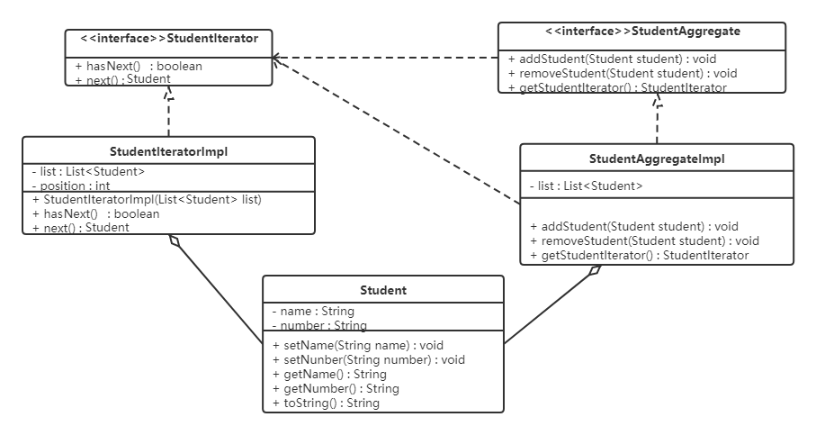

# 软件设计原则

## 开闭原则

**对扩展开放，对修改关闭**。在程序需要进行拓展的时候，不需要去修改原有的代码

## 里式代换原则

子类可以扩展父类的功能，但不能改变父类原有的功能。换句话说，子类继承父类时，尽量**不要重写父类的方法**，而是去创建新的方法。

## 依赖倒转原则

高层模块不应该依赖低层模块，两者都应该依赖其抽象；抽象不应该依赖细节，细节应该依赖抽象。简单的说就是要求**模块应该依赖于抽象**，应该依赖于实现，这样就降低了客户与实现模块间的耦合。（依赖倒转原则是开闭原则的具体实现方法）

## 接口隔离原则

客户端不应该被迫依赖于它不使用的方法；**一个类对另一个类的依赖应该建立在最小的接口上**。

## 迪米特法则

如果**两个软件实体无须直接通信，那么就不应当发生直接的相互调用**，可以通过第三方转发该调用。其目的是降低类之间的耦合度，提高模块的相对独立性。

## 合成复用原则

尽量**优先使用组合（接口）或者聚合（继承）等关联关系来实现**，其次才考虑使用继承关系来实现。

组合表示类之间的整体与部分的关系，部分为整体的一个形容词（如汽车（整体），颜色（部分））

聚合表示类之间的整体与部分的关系，部分为整体的一个子类（如汽车（整体），比亚迪（部分））

# 创建者模式

## 单例模式

### 饿汉式

类加载时就创建对象

#### 静态变量（类变量）创建对象

```java
public class Singleton {
    //私有构造方法
    private Singleton() {}

    //在成员位置创建该类的对象
    private static Singleton instance = new Singleton();

    //对外提供静态方法获取该对象
    public static Singleton getInstance() {
        return instance;
    }
}
```

#### 静态代码块创建对象

```java
public class Singleton {

    //私有构造方法
    private Singleton() {}

    //在成员位置创建该类的对象
    private static Singleton instance;

    static {
        instance = new Singleton();
    }

    //对外提供静态方法获取该对象
    public static Singleton getInstance() {
        return instance;
    }
}
```

### 懒汉式

#### 静态方法创建对象

- 使用双重检查锁的方式，即保证线程安全（由锁保证），又保证了读操作的效率（由一次检查保证，单例模式大部分操作都是读操作），还保证不会有空指针异常的问题（volatile保证）

```java
public class Singleton { 

    //私有构造方法
    private Singleton() {
        /*
           反射破解单例模式需要添加的代码，防止反射调用私有构造器构造多个对象
        */
        if(instance != null) {
            throw new RuntimeException();
        }
    }

    private static volatile Singleton instance;//使用volatile是为了防止指令重排，当进行instance = new Singleton();分为三步，1：申请开辟内存；2：Singleton()调用私有无参构造函数；3：分配的对象地址指向instance变量，当发生指令重排时，当执行顺序为1->3->2时此时会返回一个null的对象

   //对外提供静态方法获取该对象
    public static Singleton getInstance() {
		//第一次判断，将单判变为双判是因为双判时的首判就可以过滤掉大部分instance不为null，就不用进入抢锁阶段，大大提升效率
        if(instance == null) {
            synchronized (Singleton.class) {
                //抢到锁之后再次判断是否为null，因为可能有线程在等待锁期间创建了该对象
                if(instance == null) {
                    instance = new Singleton();
                }
            }
        }
        return instance;
    }
    
     /**
     * 下面是为了解决反序列化破解单例模式，在进行反系列化将会通过反射掉用该readResolve代替原来的对象构造
     */
    private Object readResolve() {
        return instance;
    }
}
```

#### 静态内部类创建对象

```java
public class Singleton {

    //私有构造方法
    private Singleton() {
        /*
           反射破解单例模式需要添加的代码，防止反射调用私有构造器构造多个对象
        */
        if(SingletonHolder.INSTANCE != null) {
            throw new RuntimeException();
        }
    }

    private static class SingletonHolder {
        private static final Singleton INSTANCE = new Singleton();
    }

    //对外提供静态方法获取该对象
    public static Singleton getInstance() {
        return SingletonHolder.INSTANCE;
    }
    
     /**
     * 下面是为了解决反序列化破解单例模式，在进行反系列化将会通过反射掉用该readResolve代替原来的对象构造
     */
    private Object readResolve() {
        return SingletonHolder.INSTANCE;
    }
}
```

#### 枚举创建对象

- 不会被反序列化和反射破坏单例模式

```java
public enum Singleton {
    INSTANCE;
}
```

## 工厂模式

作用：我们使用工厂来生产对象，我们就只和工厂打交道就可以了，彻底和对象解耦；所以说，工厂模式最大的优点就是：**解耦**。

### 简单工厂/静态工厂模式（非经典设计原则）

#### 结构

* 抽象产品 ：定义了产品的规范，描述了产品的主要特性和功能。

同工厂模式

* 具体产品 ：实现或者继承抽象产品的子类

同工厂模式

* 具体工厂 ：提供了创建产品的方法，调用者通过该方法来获取产品。

```java
public class SimpleCoffeeFactory {

    public (static静态工厂加上这个） Coffee createCoffee(String type) {
        Coffee coffee = null;
        if("americano".equals(type)) {//在工厂类中还是有耦合
            coffee = new AmericanoCoffee();
        } else if("latte".equals(type)) {
            coffee = new LatteCoffee();
        }
        return coffe;
    }
}
```

#### 简单工厂+配置文件解除工厂类的耦合

可以通过工厂模式+配置文件的方式解除工厂对象和产品对象的耦合。在工厂类中加载配置文件中的全类名，并创建对象进行存储，客户端如果需要对象，直接进行获取即可。

第一步：定义配置文件

为了演示方便，我们使用properties文件作为配置文件，名称为bean.properties

```properties
american=com.itheima.pattern.factory.config_factory.AmericanCoffee
latte=com.itheima.pattern.factory.config_factory.LatteCoffee
```

Note:左边为键，右边为值

第二步：改进工厂类（根据配置文件，生成hashMap,键为产品名，值为根据产品名生成的对象（反射创建））

```java
public class CoffeeFactory {

    private static Map<String,Coffee> map = new HashMap();

    static {//静态代码块中，目的就是只需要执行一次。
        Properties p = new Properties();
        InputStream is = CoffeeFactory.class.getClassLoader().getResourceAsStream("bean.properties");
        try {
            p.load(is);
            //遍历Properties集合对象
            Set<Object> keys = p.keySet();
            for (Object key : keys) {
                //根据键获取值（全类名）
                String className = p.getProperty((String) key);
                //获取字节码对象
                Class clazz = Class.forName(className);
                Coffee obj = (Coffee) clazz.newInstance();
                map.put((String)key,obj);
            }
        } catch (Exception e) {
            e.printStackTrace();
        }
    }

    public static Coffee createCoffee(String name) {

        return map.get(name);
    }
}
```


### 工厂方法模式

**优点：**

- 用户只需要知道具体工厂的名称就可得到所要的产品，无须知道产品的具体创建过程；
- 具体产品类和具体工厂类满足开闭原则；

**缺点：**

* 每增加一个产品就要增加一个具体产品类和一个对应的具体工厂类，这增加了系统的复杂度。

#### 结构


工厂方法模式的主要角色：

* 抽象工厂（Abstract Factory）：提供了创建产品的接口，调用者通过它访问具体工厂的工厂方法来创建产品。使用**抽象类或接口**

```java
public interface CoffeeFactory {
    Coffee createCoffee();
}
```

* 具体工厂（ConcreteFactory）：主要是实现抽象工厂中的抽象方法，完成具体产品的创建。

```java
public class AmericanCoffeeFactory implements CoffeeFactory{
    public Coffee createCoffee() {
        return new AmericanCoffee();
    }
}
```

* 抽象产品（Product）：定义了产品的规范，描述了产品的主要特性和功能。使用**抽象类或接口**

```java
public abstract class Coffee {

    public abstract String getName();

    //加糖
    public void addsugar() {
        System.out.println("加糖");
    }

    //加奶
    public void addMilk() {
        System.out.println("加奶");
    }
}
```

* 具体产品（ConcreteProduct）：实现了抽象产品角色所定义的接口，由具体工厂来创建，它同具体工厂之间一一对应。

```java
public class AmericanCoffee extends Coffee {

    public String getName() {
        return "美式咖啡";
    }
}
```

- 调用

```
CoffeeFactory factory = new AmericanCoffeeFactory();
Coffee coffee = factory.createCoffee();
```


### 抽象工厂模式

当工厂模式中的产品类中抽象成抽象产品类的公共点过少时，应改为使用抽象工厂模式；

抽象工厂模式是对合成复用原则的使用，其将抽象产品类作为聚合（继承）和具体工厂类作为组合（实现）

####  结构


抽象工厂模式的主要角色如下：

* 抽象工厂（Abstract Factory）：提供了创建产品的接口，它包含多个创建产品的方法，可以创建多个不同等级的产品
* 具体工厂（Concrete Factory）：主要是实现抽象工厂中的多个抽象方法，完成具体产品的创建。**由原来的一对一改为一对多**
* 抽象产品（Product）：定义了产品的规范，描述了产品的主要特性和功能，抽象工厂模式有多个抽象产品。
* 具体产品（ConcreteProduct）：实现了抽象产品角色所定义的接口，由具体工厂来创建，它 同具体工厂之间是多对一的关系。


- 调用

```java
DessertAndCoffeeFactory factory = new ItalyDessertAndCoffeeFactory();

Dessert dessert = factory.createDessert();//具体工厂生产抽象产品
```

### 简单工厂模式、工厂方法模式和抽象工厂模式

简单工厂模式：只有一个工厂，通过if判断这个工厂生产的产品是什么

工厂方法模式：将不同产品的工厂进行抽象，并且一个产品对应一个工厂

抽象工厂模式：：将不同产品的风格进行抽象，产生一种风格对应一个工厂，通过工厂的风格和产品的抽象规范确定最终的产品

## 建造者模式

作用：建造者模式将属性定义与属性getset分离

### 结构


建造者（Builder）模式包含如下角色：

- 产品类（Product）：要创建的复杂对象,描述其属性

```java
public class Bike {
    private String frame;
    private String seat;

    public String getFrame() {
        return frame;
    }

    public void setFrame(String frame) {
        this.frame = frame;
    }

    public String getSeat() {
        return seat;
    }

    public void setSeat(String seat) {
        this.seat = seat;
    }
}
```


* 抽象建造者类（Builder）：这个接口规定要实现复杂对象的那些部分的创建，并不涉及具体的部件对象的创建。 

```java
public abstract class Builder
{
    protected Bike bike = new Bike();

    public abstract  void  buildFrame();

    public abstract void buildSeat();

    public abstract Bike createBike();
}
```

* 具体建造者类（ConcreteBuilder）：实现 Builder 接口，完成复杂产品的各个部件的具体创建方法。在构造过程完成后，提供产品的实例。 

```java
public class OfoBuilder extends Builder {
    @Override
    public void buildFrame() {
        bike.setFrame("碳纤维车架");
    }

    @Override
    public void buildSeat() {
        bike.setSeat("橡胶车座");
    }

    @Override
    public Bike createBike() {
        return bike;
    }
}
```

* 指挥者类（Director）：调用具体建造者来创建复杂对象的各个部分，在指导者中不涉及具体产品的信息，只负责保证对象各部分完整创建或按某种顺序创建。 

```java
public class Director {
    private Builder builder;

    public Director(Builder builder) {
        this.builder = builder;
    }

    public Bike construct() {
        builder.buildFrame();
        builder.buildSeat();
        return builder.createBike();
    }
}
```

### 建造者模式和工厂模式对比

如何获得一辆比亚迪？

工厂模式：比亚迪工厂生产（工厂类）的东西（产品类）就是比亚迪

抽象工厂模式：新能源工厂生产（工厂类）的汽车（产品类）的就是比亚迪

建造者模式：工程师（指挥者类）喷涂白色车漆、安装橡胶轮胎（建造者类）的汽车（产品类）就是比亚迪

# 结构型模式

## 代理模式

作用：控制对对象的访问，在访问基础对象时增加额外功能

Java中的代理按照代理类生成时机不同又分为静态代理和动态代理。静态代理代理类在编译期就生成，而动态代理代理类则是在Java运行时动态生成。动态代理又有JDK代理和CGLib代理两种。

### 结构


代理（Proxy）模式分为三种角色：

* 抽象主题（Subject）类： 通过接口或抽象类声明真实主题和代理对象实现的业务方法。

```
public interface SellTickets {
    void sell();
}
```

* 真实主题（Real Subject）类： 实现了抽象主题中的具体业务，是代理对象所代表的真实对象，是最终要引用的对象。

```
public class TrainStation implements SellTickets {

    public void sell() {
        System.out.println("火车站卖票");
    }
}
```

* 代理（Proxy）类 ： 提供了与真实主题相同的接口，其内部含有对真实主题的引用，它可以访问、控制或扩展真实主题的功能。一共有三种代理方法：

#### 静态代理

针对所有方法，都实现代理

```java
public class ProxyPoint implements SellTickets {

    private TrainStation station = new TrainStation();

    public void sell() {
        System.out.println("代理点收取一些服务费用");
        station.sell();
    }
}
```

#### jdk动态代理

代理类则是在Java运行时动态生成，并且调用处理器一个集中的方法中处理所有方法（通过method区别不同方法）

``` java
public interface Topic {
  public void getInfo(String size);
}

public class GirlTopic implements Topic {
  @Override
  public void getInfo(String size) {
  	System.out.println("GirlTopic->GirlTopic开始......");
  	System.out.println("The girl is " + size +" cup.");
  	System.out.println("GirlTopic->GirlTopic开始......");
  }
}

public class JdkTopicProxy implements InvocationHandler{
  private Object target;
    
  public JdkTopicProxy(Object target){
  	this.target = target;
  }
    
  @SuppressWarnings("unchecked")
  public <T> T getProxy(){
//    三个参数，按照顺序分别是 ClassLoader （类加载器），interfaces(一组接口，接口数组)，InvocationHandler（调用处理器）。
//            1、ClassLoader （类加载器）：
//    我们在计算机硬盘写了代码，编译之后，产生字节码文件，例如A.class，这个字节码文件先要加载到JVM内存中才可以跑起来。从硬盘把字节码加载到JVM内存中，需要一个对象去完成这个操作，这个对象就叫ClassLoader （类加载器）。关于类加载，学习完动态代理，我们再来详细学习一下这个知识点。
//            2、接口数组：
//    这个参数是一个接口数组，假如被代理类有接口A和接口B，那么这个参数传进去的写法就是这样 Class[]{A.class, B.class}，通过这个方法，将创建接口A和接口B的实现类（两个）。
//            3、调用处理器：
//    调用处理器是一个接口。它的作用是：代理对象的几乎所有方法都会调用InvocationHandler的invoke()方法，其中getClass()方法不执行。
  	return (T) Proxy.newProxyInstance(target.getClass().getClassLoader(), target.getClass().getInterfaces(), this);
  }	
    
  @Override
  public Object invoke(Object proxy, Method method, Object[] args) throws Throwable {
  	System.out.println("JdkTopicProxy->invoke开始......");
      Object result = method.invoke(target, args);
      System.out.println("JdkTopicProxy->invoke结束......");
  	return result;
  }
}

public class TestJdkProxyDemo {
  public static void main(String [] args){
    System.out.println("测试开始......");
    // jdk动态代理测试
    Topic topic = new JdkTopicProxy(new GirlTopic()).getProxy();
    topic.getInfo("G");
    System.out.println("测试结束......");
  }
}
```
#### CGLIB动态代理

无需抽象主题类

```java
public class GirlTopic {
  public void getInfo(String size) {
  	System.out.println("GirlTopic->GirlTopic开始......");
  	System.out.println("The girl is " + size +" cup.");
  	System.out.println("GirlTopic->GirlTopic开始......");
  }
}

public class GirlMethodInterceptor implements MethodInterceptor{
  @Override
  public Object intercept(Object obj, Method method, Object[] args, MethodProxy proxy) throws Throwable {
  	System.out.println("GirlMethodInterceptor->intercept开始......");
  	Object object = proxy.invokeSuper(obj, args);
  	System.out.println("GirlMethodInterceptor->intercept结束......");
  	return object;
  }
}

public class TestCglibProxyDemo {
  public static void main(String[] args){
  	Enhancer enhancer = new Enhancer();
  	enhancer.setSuperclass(GirlTopic.class);
  	enhancer.setCallback(new GirlMethodInterceptor());
  	GirlTopic girlTopic = (GirlTopic)enhancer.create();
  	girlTopic.getInfo("F");
  }
}
```

## 适配器模式

​	作用：将一个类的接口转换成客户希望的另外一个接口，使得原本由于接口不兼容而不能一起工作的那些类能一起工作。

### 结构


适配器模式（Adapter）包含以下主要角色：

* 目标（Target）接口：当前系统业务所期待的接口，它可以是抽象类或接口。

```java
//SD卡的接口
public interface SDCard {
    //读取SD卡方法
    String readSD();
    //写入SD卡功能
    void writeSD(String msg);
}
```

* 适配者（Adaptee）类：它是被访问和适配的现存组件库中的组件接口。

```java
public class SDCardImpl implements SDCard {
    public String readSD() {
        String msg = "sd card read a msg :hello word SD";
        return msg;
    }

    public void writeSD(String msg) {
        System.out.println("sd card write msg : " + msg);
    }
}
```

* 适配器（Adapter）类：它是一个转换器，通过继承或引用适配者的对象，把适配者接口转换成目标接口，让客户按目标接口的格式访问适配者。

#### 类适配器模式

通过继承适配器类完成适配

```java
public class SDAdapterTF extends TFCardImpl  implements SDCard{

    @Override
    public String readSD() {
        System.out.println("adapter read");
        return readTF();
    }

    @Override
    public void writeSD(String msg) {
        System.out.println("adapter write");
        writeTF(msg);
    }
}
```

#### 对象适配器模式

通过构造函数传入适配器类完成适配

```java
public class SDAdapterTF  implements SDCard {

    private TFCard tfCard;

    public SDAdapterTF(TFCard tfCard) {
        this.tfCard = tfCard;
    }

    public String readSD() {
        System.out.println("adapter read tf card ");
        return tfCard.readTF();
    }

    public void writeSD(String msg) {
        System.out.println("adapter write tf card");
        tfCard.writeTF(msg);
    }
}
```

Note：接口适配器类在接口有default后已经很少使用了

## 装饰者模式

作用：指在不改变现有对象结构的情况下，动态地给该对象增加一些职责（即增加其额外功能）的模式。常用于对对象进行追加操作（append）和对不可继承的类进行类似于继承的操作

### 结构


装饰（Decorator）模式中的角色：

* 抽象构件（Component）角色 ：定义一个抽象接口以规范准备接收附加责任的对象。

```java
public abstract class FastFood {
    private float price;
    private String desc;
    
    public FastFood(float price, String desc) {
        this.price = price;
        this.desc = desc;
    }

    public float getPrice() {
        return price;
    }

    public String getDesc() {
        return desc;
    }

    public abstract float cost();  //获取价格
}
```

* 具体构件（Concrete  Component）角色 ：实现抽象构件，通过装饰角色为其添加一些职责。

```java
public class FriedRice extends FastFood {

    public FriedRice() {
        super(10, "炒饭");
    }

    public float cost() {
        return getPrice();
    }
}
```

* 抽象装饰（Decorator）角色 ： 继承或实现抽象构件，并包含具体构件的实例，可以通过其子类扩展具体构件的功能。

```java
public abstract class Garnish extends FastFood{

    public FastFood getFastFood() {
        return fastFood;
    }
    
    private FastFood fastFood;

    public Garnish(FastFood fastFood, float price, String desc){
        super(price, desc);
        this.fastFood = fastFood;
    }
}
```

* 具体装饰（ConcreteDecorator）角色 ：实现抽象装饰的相关方法，并给具体构件对象添加附加的责任。

```java
public class Egg extends Garnish{
    public Egg(FastFood fastFood)
    {
        super(fastFood, 1, "鸡蛋");
    }

    //该类是为了与FriedRice保持一致以达成类似继承的效果
    public float cost(){
        return getPrice()+getFastFood().getPrice();
    }

    @Override
    public String getDesc(){
        //由于该类的getDesc已经被重写，所以必须从父类获取未被重写的getDesc
        return super.getDesc()+getFastFood().getDesc();
    }
}
```

### 静态代理和装饰者模式的区别

* 目的不同
  装饰者是为了增强目标对象
  静态代理是为了保护和隐藏目标对象
* 获取目标对象构建的地方不同
  装饰者是由外界传递进来，可以通过构造方法传递
  静态代理是在代理类内部创建，以此来隐藏目标对象

# 行为型模式

## 模板方法模式

作用：模板方法按某种顺序调用其包含的基本方法，其中基本方法包括具体方法、抽象方法（子类实现）和钩子方法（子类继承后可以用于干预父类方法的业务流程，一般为isXXX）。

模板方法模式提高代码复用性；实现了反向控制，可有父类调用子类的方法；

### 结构


模板方法（Template Method）模式包含以下主要角色：

* 抽象类（Abstract Class）：负责给出一个算法的轮廓和骨架。它由一个模板方法和若干个基本方法构成。

```java
public abstract class AbstractClass {
```

  * 模板方法：定义了算法的骨架，按某种顺序调用其包含的基本方法。

    ```java
    public final void cookProcess() {
        if(isTrue()){
            //第一步：倒油
            this.pourOil();
            //第二步：热油
            this.heatOil();
            //第三步：倒蔬菜
            this.pourVegetable();
            //第四步：倒调味料
            this.pourSauce();
        }
    }  
    ```

  * 基本方法：是实现算法各个步骤的方法，是模板方法的组成部分。基本方法又可以分为三种：

    * 抽象方法(Abstract Method) ：一个抽象方法由抽象类声明、由其具体子类实现。

    ```java
    public abstract void pourVegetable();
    
    public abstract void pourSauce();
    ```

    * 具体方法(Concrete Method) ：一个具体方法由一个抽象类或具体类声明并实现，其子类可以进行覆盖也可以直接继承。

    ```java
    public void pourOil() {
        System.out.println("倒油");
    }
    
    //第二步：热油是一样的，所以直接实现
    public void heatOil() {
        System.out.println("热油");
    }
    ```

    * 钩子方法(Hook Method) ：在抽象类中已经实现，包括用于判断的逻辑方法和需要子类重写的空方法两种。

      一般钩子方法是用于判断的逻辑方法，这类方法名一般为isXxx，返回值类型为boolean类型。

    ```java
    public abstract boolean isTrue();
    ```

```java
}
```

* 具体子类（Concrete Class）：实现抽象类中所定义的抽象方法和钩子方法，它们是一个顶级逻辑的组成步骤。

```java
public class ConcreteClass_BaoCai extends AbstractClass{
    @Override
    public void pourVegetable() {
        System.out.println("下锅的蔬菜是包菜");
    }

    @Override
    public void pourSauce() {
        System.out.println("下锅的酱料是辣椒");
    }

    @Override
    public boolean isTrue() {
        return true;
    }
}
```

## 策略模式

作用：方便策略类之间可以自由切换，易于扩展

### 结构


代码如下：

- 定义抽象策略角色：这是一个抽象角色，通常由一个接口或抽象类实现。此角色给出所有的具体策略类所需的接口。

```java
public interface Strategy {
    void show();
}
```

- 定义具体策略角色（Concrete Strategy）：实现了抽象策略定义的接口，提供具体的算法实现或行为。

```java
//为春节准备的促销活动A
public class StrategyA implements Strategy {

    public void show() {
        System.out.println("买一送一");
    }
}

//为中秋准备的促销活动B
public class StrategyB implements Strategy {

    public void show() {
        System.out.println("满200元减50元");
    }
}

//为圣诞准备的促销活动C
public class StrategyC implements Strategy {

    public void show() {
        System.out.println("满1000元加一元换购任意200元以下商品");
    }
}
```

- 定义环境角色（Context）：持有一个策略类的引用，最终给客户端调用。

```java
public class SalesMan {                        
    //持有抽象策略角色的引用                              
    private Strategy strategy;                 
                                               
    public SalesMan(Strategy strategy) {       
        this.strategy = strategy;              
    }                                          
                                               
    //向客户展示促销活动                                
    public void salesManShow(){                
        strategy.show();                       
    }                                          
}                                              
```

- 调用

```java
public class Main {
    public static void main(String[] args) {
        SalesMan salesMan = new SalesMan(new StrategyA());

        salesMan.salesManShow();
    }
}
```

### 策略模式与工厂模式的区别

工厂模式的工厂将实例化的产品对象返回给调用者；

策略模式的环境角色类将实例化的策略对象保存在环境角色中，调用者只能通过环境角色类间接调用实例化对象。

## 责任链模式

类似于Filter

### 结构


职责链模式主要包含以下角色:

* 抽象处理者（Handler）角色：定义一个处理请求的接口，包含抽象处理方法和一个后继连接。

```java
public abstract class Handler {
    protected final static int NUM_ONE = 1;
    protected final static int NUM_THREE = 3;
    protected final static int NUM_SEVEN = 7;

    //该领导处理的请假天数区间
    private int numStart;
    private int numEnd;

    //领导上面还有领导
    private Handler nextHandler;

    //设置请假天数范围 上不封顶
    public Handler(int numStart) {
        this.numStart = numStart;
    }

    //设置请假天数范围
    public Handler(int numStart, int numEnd) {
        this.numStart = numStart;
        this.numEnd = numEnd;
    }

    //设置上级领导
    public void setNextHandler(Handler nextHandler){
        this.nextHandler = nextHandler;
    }

    //提交请假条
    public final void submit(LeaveRequest leave){
        if(0 == this.numStart){
            return;
        }

        //如果请假天数达到该领导者的处理要求
        if(leave.getNum() >= this.numStart){
            this.handleLeave(leave);

            //如果还有上级 并且请假天数超过了当前领导的处理范围
            if(null != this.nextHandler && leave.getNum() > numEnd){
                this.nextHandler.submit(leave);//继续提交
            } else {
                System.out.println("流程结束");
            }
        }
    }

    //各级领导处理请假条方法
    protected abstract void handleLeave(LeaveRequest leave);
}
```

* 具体处理者（Concrete Handler）角色：实现抽象处理者的处理方法，判断能否处理本次请求，如果可以处理请求则处理，否则将该请求转给它的后继者。

```java
public class GroupLeader extends Handler{

    public GroupLeader() {
        //小组长处理1-3天的请假
        super(Handler.NUM_ONE, Handler.NUM_THREE);
    }
    @Override
    protected void handleLeave(LeaveRequest leaveRequest) {
        System.out.println(leaveRequest.getName() + "请假"
                + leaveRequest.getNum() + "天,"
                + leaveRequest.getContent() + "。");
        System.out.println("小组长审批：同意。");
    }
}
```

* 客户类（Client）角色：创建处理链，并向链头的具体处理者对象提交请求，它不关心处理细节和请求的传递过程。

```java
public class Client {
    public static void main(String[] args) {
        LeaveRequest leaveRequest = new LeaveRequest("小花",8,"身体不适");

        GroupLeader groupLeader = new GroupLeader();
        Manager manager = new Manager();
        GeneralManager generalManager = new GeneralManager();
        groupLeader.setNextHandler(manager);
        manager.setNextHandler(generalManager);

        groupLeader.submit(leaveRequest);
    }
}
```

## 观察者模式（发布-订阅模式）

作用：又被称为发布-订阅（Publish/Subscribe）模式，它定义了一种一对多的依赖关系，让多个观察者对象同时监听某一个主题对象。这个主题对象在状态变化时，会通知所有的观察者对象，使他们能够自动更新自己。

###  结构


在观察者模式中有如下角色：

* Subject：抽象主题（抽象被观察者），抽象主题角色把所有观察者对象保存在一个集合里，每个主题都可以有任意数量的观察者，抽象主题提供一个接口，可以增加和删除观察者对象。

```java
public interface Subject {
    void add(Observer observer);

    void remove(Observer observer);

    void notify(String msg);
}
```

* ConcreteSubject：具体主题（具体被观察者），该角色将有关状态存入具体观察者对象，在具体主题的内部状态发生改变时，给所有注册过的观察者发送通知。

```java
public class SubscriptionSubject implements Subject{
    private List<Observer> weChatUsers = new ArrayList<>();
    @Override
    public void add(Observer observer) {
        weChatUsers.add(observer);
    }

    @Override
    public void remove(Observer observer) {
        weChatUsers.remove(observer);
    }

    @Override
    public void notify(String msg) {
        for (Observer observer : weChatUsers)
        {
            observer.update(msg);
        }
    }
}
```

* Observer：抽象观察者，是观察者的抽象类，它定义了一个更新接口，使得在得到主题更改通知时更新自己。

```java
public interface Observer {
    void update(String message);
}
```

* ConcreteObserver：具体观察者，实现抽象观察者定义的更新接口，以便在得到主题更改通知时更新自身的状态。

```java
public class WeChatUser implements Observer{
    // 微信用户名
    private String name;

    public WeChatUser(String name) {
        this.name = name;
    }
    @Override
    public void update(String message) {
        System.out.println(name + "-" + message);
    }
}
```

## 迭代器模式

作用：提供一个对象来顺序访问聚合对象中的一系列数据，而不暴露聚合对象的内部表示。 

### 结构



迭代器模式主要包含以下角色：

* 抽象聚合（Aggregate）角色：定义存储、添加、删除聚合元素以及创建迭代器对象的接口。

```java
public interface StudentAggregate {
    void studentAdd(Student student);

    void studentRemove(Student student);

    StudentIterator getStudentIterator();
}
```

* 具体聚合（ConcreteAggregate）角色：实现抽象聚合类，返回一个具体迭代器的实例。

```java
public class StudentAggregateImpl implements StudentAggregate{
    private List<Student> students = new ArrayList<>();
    @Override
    public void studentAdd(Student student) {
        students.add(student);
    }

    @Override
    public void studentRemove(Student student) {
        students.remove(student);
    }

    @Override
    public StudentIterator getStudentIterator() {
        return new StudentIteratorImpl(students);
    }
}
```

* 抽象迭代器（Iterator）角色：定义访问和遍历聚合元素的接口，通常包含 hasNext()、next() 等方法。

```java
public interface StudentIterator {
    boolean hasNext();
    Student next();
}
```

* 具体迭代器（Concretelterator）角色：实现抽象迭代器接口中所定义的方法，完成对聚合对象的遍历，记录遍历的当前位置。

```java
public class StudentIteratorImpl implements StudentIterator{
    private List<Student> students = new ArrayList<>();
    private int position = 0;

    public StudentIteratorImpl(List<Student> students) {
        this.students = students;
    }
    @Override
    public boolean hasNext() {
        return position != students.size();
    }

    @Override
    public Student next() {
        Student currentStudent = students.get(position++);
        return currentStudent;
    }
}
```
