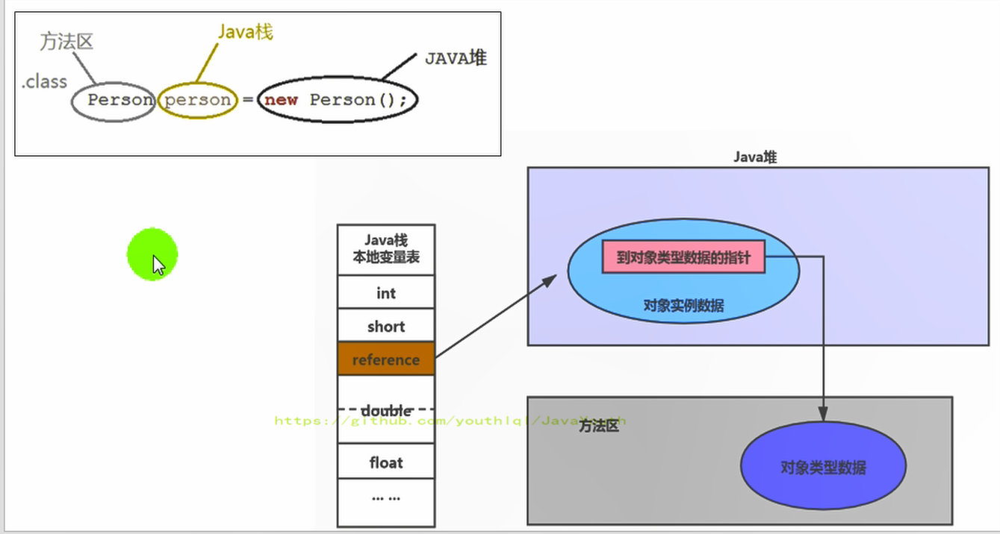
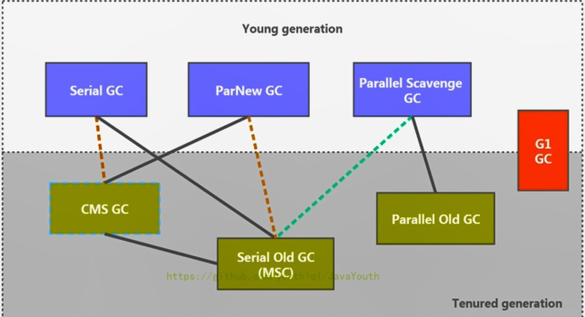

## 编译阶段（该阶段为编译器完成而不是JVM完成）

在内存中生成一个代表这个类的java.lang.Class对象

### 全局常量：static final

- 全局常量就是使用 static final 进行修饰

- 被声明为final的类变量的处理方法则不同，每个全局常量在编译的时候就会被分配了。

# 类加载器子系统


## 双亲委派选择加载器

- 原理：优先委托自己的父类的加载器进行加载（如果父类有父类的父类就继续向上委托），父类无法完成此加载任务，则子加载器才会尝试自己去加载（如果还是不行就继续往下分配任务）

- 优点：

  - 避免类的重复加载（比如 A 类和 B 类都有一个父类 C 类，那么当 A 启动时就会将 C 类加载起来，那么在 B 类进行加载时就不需要在重复加载 C 类了）

  - 保护程序安全，防止核心API被随意篡改（核心API的类加载器在顶层的父类加载器）


## 加载阶段

- 通过一个类的全限定名获取定义此类的二进制字节流
- 将这个字节流所代表的静态存储结构转化为方法区的运行时数据结构
- 在内存中生成一个代表这个类的java.lang.Class对象

### 启动类加载器

> **启动类加载器（引导类加载器，Bootstrap ClassLoader）**

加载Java的核心库，用于提供JVM自身需要的类

### 扩展类加载器

从系统属性所指定的目录中加载类库，或从JDK的安装目录的子目录（扩展目录）下加载类库

### 系统类加载器

该类加载是程序中默认的类加载器，一般来说，Java应用的类都是由它来完成加载

## 链接阶段

链接分为三个子阶段：验证 -> 准备 -> 解析

### 验证(Verify)

目的在于确保Class文件的字节流中包含信息符合当前虚拟机要求，保证类的正确加载与JVM的安全

### 准备(Prepare)

为类变量（static变量）分配内存并且设置该类变量的默认初始值，即零值

### 解析(Resolve)

将常量池内的符号引用转换为直接引用的过程

## 初始化阶段

1. 创建类的实例
2. 访问某个类或接口的静态变量，或者对该静态变量赋值
3. 调用类的静态方法
4. 反射
5. 初始化一个类的子类
6. 略

### 调用clinit() 方法

自动收集类中的所有**类变量**的赋值动作和静态代码块中的语句合并而来，且JVM会保证子类的`<clinit>()`执行前，父类的`<clinit>()`已经执行完毕

# 0-运行时数据区概述


**Note：下图定义变量为局部变量**



## 线程的内存空间

- 线程独有：独立包括程序计数器、栈、本地方法栈
- 线程间共享：堆、方法区

## 线程类别

1.  **虚拟机线程**：这种线程的操作是需要JVM达到安全点才会出现。这些操作必须在不同的线程中发生的原因是他们都需要JVM达到安全点，这样堆才不会变化。这种线程的执行类型括"stop-the-world"的垃圾收集，线程栈收集，线程挂起以及偏向锁撤销
2.  **周期任务线程**：这种线程是时间周期事件的体现（比如中断），他们一般用于周期性操作的调度执行
3.  **GC线程**：这种线程对在JVM里不同种类的垃圾收集行为提供了支持
4.  **编译线程**：这种线程在运行时会将字节码编译成到本地代码
5.  **信号调度线程**：这种线程接收信号并发送给JVM，在它内部通过调用适当的方法进行处理

# 1-程序计数器(PC寄存器)

PC寄存器用来存储指向下一条指令的地址，也即将要执行的指令代码。由执行引擎读取下一条指令，并执行该指令。

## PC寄存器作用（线程切换，明确下一条字节码指令）

- 线程切换时用于中断恢复，切换回来以后知道接着从哪开始继续执行

- JVM的字节码解释器就需要通过改变PC寄存器的值来明确下一条应该执行什么样的字节码指令

## PC寄存器为什么是私有的？（为什么每个线程都要有一个PC寄存器）

- 线程切换时用于中断恢复，切换回来以后知道接着从哪开始继续执行

# 2-本地方法栈

本地方法栈用于管理本地方法的调用

## 本地方法接口

一个本地方法接口是一个Java调用非Java代码（本地方法）的接囗

### 本地方法

本地方法就是非java代码，用java掉用非java代码

# 3-栈

栈的存储单位是栈帧

## 栈帧

- 栈帧的内部结构


### 局部变量表

- 局部变量表是一个数字数组，主要用于存储方法参数和定义在方法体内的局部变量，主要包括以下三类：

1、基本数据类型

2、对象的引用（reference）

3、returnAddress返回值类型

- 局部变量表存在栈中，而栈是线程的私有数据，因此不存在数据安全问题
- 局部变量表所需的容量大小是在编译期确定下来的，并保存在方法的Code属性的**maximum local variable**s数据项中

#### 各种变量类型对比

变量的分类：
1、按照数据类型分：① 基本数据类型  ② 引用数据类型
2、按照在类中声明的位置分：
  2-1、成员变量：定义在类中，在整个类中都可以被访问。在使用前，都经历过默认初始化赋值
       2-1-1、类变量: linking的prepare阶段：给类变量默认赋值
              ---> initial阶段：给类变量显式赋值即静态代码块赋值

- 类变量JDK6及之前存放在方法区中，JDK7及之后存放在堆之中，但是对象实例存放在堆中


2-1-2、实例变量：随着对象的创建，会在堆空间中分配实例变量空间，并进行默认赋值

- 实例变量存放在堆之中，但是对象实例存放在堆中

  2-2、局部变量：局部变量只定义在局部范围内，如：函数内，语句内等，只在所属的区域有效。在使用前，必须要进行显式赋值的！否则，编译不通过。

- 局部变量存放在局部变量表之中，但是对象实例存放在堆中

#### Slot（局部变量槽）

- Slot是局部变量表的最基本的存储单元（数组的组成元素），按照方法体内的调用顺序顺序被复制到局部变量表中
- 32位以内的类型只占用一个slot（包括returnAddress类型），64位的类型占用两个slot（1ong和double）

- 如果当前帧是构造方法或者实例方法（非静态方法）创建的，那么该对象引用this将会存放在index为0的slot处

### 操作数栈

- 操作数栈主要用于保存计算过程的中间结果，同时作为计算过程中变量临时的存储空间。
- 操作数栈虽然只能进行出栈入栈操作，但是操作数栈是用数组来实现的
- 操作数栈的最大深度在编译期就定义好了，保存在方法的Code属性中，为**maxstack**的值
- 我们说Java虚拟机的解释引擎是基于栈的执行引擎，其中的栈指的就是操作数栈

#### 栈顶缓存技术

将栈顶元素全部缓存在物理CPU的寄存器中，以此降低对内存的读/写次数，提升执行引擎的执行效率

### 动态链接

动态链接的作用就是为了将这些符号引用转换为具体调用方法的直接引用

- 符号引用 ：将可能调用常量或者方法存于**常量池**，并用一个符号表示它，目的在于节省空间，不用重复的在不同方法开辟重复的空间

- 直接引用：方法本身

#### 静态链接与动态链接

链接就是将**方法**的符号引用被替换为直接引用的过程

- **静态链接**：

当一个字节码文件被装载进JVM内部时，如果被调用的目标方法在**编译期确定**，且运行期保持不变时，这种情况下将调用方法的符号引用转换为直接引用的过程称之为静态链接

- **动态链接**：

如果被调用的方法在编译期无法被确定下来，也就是说，只能够在程序**运行期确定**，将调用的方法的符号转换为直接引用，由于这种引用转换过程具备动态性，因此也被称之为动态链接。

#### 早期绑定与晚期绑定

绑定是链接的扩大化，绑定是一个**字段、方法或者类**在符号引用被替换为直接引用的过程

- **普通指令：**

1.  invokestatic：调用静态方法，解析阶段确定唯一方法版本，体现为早期绑定，为非虚函数
2.  invokespecial：调用`<init>`方法、私有及父类方法，解析阶段确定唯一方法版本，体现为早期绑定，为非虚函数
3.  invokevirtual：调用所有虚方法，体现为晚期绑定（除了final方法均为虚函数）
4.  invokeinterface：调用接口方法，为虚函数

- **动态调用指令**

invokedynamic：动态解析出需要调用的方法，然后执行

#### 虚方法表

每个类中都有一个虚方法表，表中存放着各个方法的实际入口。虚方法表会在类加载的**链接阶段**在类的**方法区**被创建并开始初始化

 ### 方法返回地址

当一个方法开始执行后，只有两种方式可以退出这个方法

- 方法正常退出时，调用者的pc计数器的值作为返回地址，即调用该方法的指令的下一条指令的地址

- 通过异常退出的，返回地址是要通过异常表来确定，栈帧中一般不会保存这部分信息

### 一些附加信息

略

## 举例栈溢出的情况？

SOF（StackOverflowError），栈大小分为固定的，和动态变化。如果是固定的就可能出现StackOverflowError。如果是动态变化的，内存不足时就可能出现OOM

## 垃圾回收是否涉及到虚拟机栈？

| 位置                                        | 是否有Error | 是否存在GC |
| ------------------------------------------- | ----------- | ---------- |
| PC计数器                                    | 无          | 不存在     |
| 虚拟机栈                                    | 有，SOF     | 不存在     |
| 本地方法栈(在HotSpot的实现中和虚拟机栈一样) |             |            |
| 堆                                          | 有，OOM     | 存在       |
| 方法区                                      | 有          | 存在       |

## 方法中定义的局部变量是否线程安全？

- 如果对象本身是线程安全，则一定线程安全（如对象使用synchronized加锁）

- 如果对象是在内部产生，并在内部消亡，没有返回到外部，那么它就是线程安全的，反之则是线程不安全的。


# 4-堆

- 堆针对一个JVM进程来说是唯一的，进程包含多个线程，他们是共享同一堆空间的

- 所有的对象实例以及数组都应当在运行时分配在堆上（除非使用了逃逸分析和标量替换技术）
- 

## 新生区

### Eden空间

new的对象优先放入伊甸园区（除非是大对象，大对象会直接放在老年区）

#### TLAB（Thread Local Allocation Buffer）

- JVM为每个线程分配了一个私有缓存区域，它包含在Eden空间内，以减少使用锁
- 一旦对象在TLAB空间分配内存失败时，JVM就会尝试着通过**使用加锁机制确保数据操作的原子性**，从而直接在Eden空间中分配内存。

### Minor GC（YGC）

- 当伊甸园的空间填满时（幸存者填满时不会触发），程序又需要创建对象，JVM的垃圾回收器将对伊甸园区进行垃圾回收Minor GC

- Minor GC会引发SSTW（Stop The World），暂停其它用户的线程，等垃圾回收结束，用户线程才恢复运行

### Survivor0空间和Survivor1空间（from区、to区）

- 触发Minor GC后，将**伊甸园和幸存者1（或0）区**中的剩余对象移动到**幸存者0（或1）区**（即1区和0区轮流使用），且其年龄+1
- 当幸存者群的空间填满时，程序又需要创建对象，此时对象将直接进入老年区

## 老年区

当幸存者区的对象的年龄达到年龄限制（**-XX:MaxTenuringThreshold**=N设置，默认为15）将进入老年区

### Major GC（OGC）

- 当老年区内存不足时，再次触发GC：Major GC，进行老年区的内存清理
- 若老年区执行了Major GC之后，发现依然无法进行对象的保存，就会产生OOM异常。

## Full GC

- 当出现以下情况时进行Full GC

1.  调用System.gc()时，系统建议执行FullGC，但是不必然执行
3.  方法区空间不足
4.  minor gc后存活的对象大小超过老年代剩余空间
4.  

- Full GC会对堆和方法区进行内存清理

## VM 参数设置堆

```java
/**
 * 测试堆空间常用的jvm参数：
 * -XX:+PrintFlagsInitial : 查看所有的参数的默认初始值
 * -XX:+PrintFlagsFinal  ：查看所有的参数的最终值（可能会存在修改，不再是初始值）
 *      具体查看某个参数的指令： jps：查看当前运行中的进程
 *                             jinfo -flag SurvivorRatio 进程id
 *
 * -Xms：初始堆空间内存 （默认为物理内存的1/64）
 * -Xmx：最大堆空间内存（默认为物理内存的1/4）
 * -Xmn：设置新生代的大小。(初始值及最大值)
 * -XX:NewRatio：配置新生代与老年代在堆结构的占比
 * -XX:SurvivorRatio：设置新生代中Eden和S0/S1空间的比例（默认8:1:1）
 * -XX:MaxTenuringThreshold：设置新生代垃圾的最大年龄（默认15）
 * -XX:UseTLAB：设置是否开启TLAB空间）（默认开启）
 * XX:TLABWasteTargetPercent：设置TLAB空间所占用Eden空间的百分比大小
 * -XX:+PrintGCDetails：输出详细的GC处理日志
 * 打印gc简要信息：① -XX:+PrintGC   ② -verbose:gc
 * -XX:HandlePromotionFailure：是否设置空间分配担保
 */
```


### 空间分配担保（检查老年代是否可能会溢出）

在发生Minor GC之前，虚拟机会检查老年代最大可用的连续空间是否大于新生代所有对象的总空间。

*   如果大于，则此次Minor GC是安全的
*   如果小于，则虚拟机会查看**-XX:HandlePromotionFailure**设置值是否允担保失败。
    *   如果HandlePromotionFailure=true，那么会继续检查**老年代最大可用连续空间是否大于历次晋升到老年代的对象的平均大小**。
        *   如果大于，则尝试进行一次Minor GC，但这次Minor GC依然是有风险的；
        *   如果小于，则进行一次Full GC。
    *   如果HandlePromotionFailure=false，则进行一次Full GC。

## 代码优化

### 逃逸分析

- 没有发生逃逸的对象，则可以分配到栈

- 如何快速的判断是否发生了逃逸分析，大家就看new的对象实体是否有可能在方法外被调用。（针对的是方法而非变量）

### 栈上分配

将堆分配转化为栈分配。如果一个对象在子程序中被分配，要使指向该对象的指针永远不会发生逃逸，对象可能是栈上分配的候选，而不是堆上分配

### 同步省略

同步块所使用的锁对象是否只能够被一个线程访问而没有被发布到其他线程，这将会锁将会被消除

### 标量替换

在JIT阶段，如果经过逃逸分析，发现一个对象不会被外界访问的话，那么经过JIT优化，就会把这个对象拆解成若干个其中包含的若干个成员变量来代替。这个过程就是标量替换。

# 5-方法区

## 版本区别

### 永久代和元空间

- 我们可以将方法区类比为Java中的接口，将永久代或元空间类比为Java中具体的实现类

- JDK7及以前方法区由永久代实现，永久代使用的是JVM 虚拟机内存
- JDK8及以后方法区由元空间实现，元空间使用物理机本地内存

Note：原因在于永久代设置空间大小是很难确定的且很难调优

### 静态变量和StringTable

静态变量和StringTable在JDK6及以前存在方法区；

静态变量和StringTable在JDK7及以后存在堆区

Note：原因在于方法区垃圾回收频率低，大量的字符串无法及时回收，容易进行Full GC产生STW或者容易产生OOM

### 直接内存

接内存是在Java堆外的、直接向系统申请的内存区间，不属于JVM的内存

## 内部结构

### 类型信息

对每个加载的类型（类class、接口interface、枚举enum、注解annotation），JVM必须在方法区中存储以下类型信息：

1.  全名：这个类型的完整有效名称（全名=包名.类名）
2.  父类：这个类型直接父类的完整有效名（对于interface或是java.lang.Object，都没有父类）
3.  修饰符：这个类型的修饰符（public，abstract，final的某个子集）
4.  接口：这个类型直接接口的一个有序列表

### 域（Field）信息

> 也就是我们常说的成员变量，域信息是比较官方的称呼

1.  JVM必须在方法区中保存类型的所有域的相关信息以及域的声明顺序。

2.  域的相关信息包括：域名称，域类型，域修饰符（public，private，protected，static，final，volatile，transient的某个子集）

### 方法（Method）信息

JVM必须保存所有方法的以下信息，同域信息一样包括声明顺序：

1.  方法名称
2.  方法的返回类型（包括 void 返回类型），void 在 Java 中对应的为 void.class
3.  方法参数的数量和类型（按顺序）
4.  方法的修饰符（public，private，protected，static，final，synchronized，native，abstract的一个子集）
5.  方法的字节码（bytecodes）、操作数栈、局部变量表及大小（abstract和native方法除外）
6.  异常表（abstract和native方法除外），异常表记录每个异常处理的开始位置、结束位置、代码处理在程序计数器中的偏移地址、被捕获的异常类的常量池索引

### 运行时常量池

#### 常量池

常量池不在内存中，而是在字节码文件中，包括各种字面量（例如1，“hello”等）和对类型、域和方法的符号引用

**为什么需要常量池？**

通过**引用的方式**，来加载、调用所需的结构，减少重复

#### 运行时常量池

- 运行时常量池就是常量池在程序运行时的称呼，但是会将常量池中的符号地址了换为真实地址

- 运行时常量池具有动态性，即运行期间一样也可以让新常量入池

## 方法区垃圾回收

### 废弃的常量

常量的定义包括：

- 字面量
- 类和接口的全限定名
- 字段的名称和描述符
- 方法的名称和描述符

HotSpot虚拟机对常量池的回收策略是很明确的，只要常量池中的常量没有被任何地方引用，就可以被回收

### 不再使用的类

需要同时满足下面三个条件：

- Example：该类所有的实例都已经被回收，也就是Java堆中不存在该类及其任何派生子类的实例。

- ClassLoader：加载该类的类加载器已经被回收，这个条件除非是经过精心设计的可替换类加载器的场景，如OSGi、JSP的重加载等，否则通常是很难达成的。

- Class：该类对应的java.lang.Class对象没有在任何地方被引用，无法在任何地方通过反射访问该类的方法。

# 对象的实例化内存布局与访问定位

## 对象创建的方式

1.  new：最常见的方式、单例类中调用getInstance的静态类方法，XXXFactory的静态方法
2.  Class的newInstance方法：在JDK9里面被标记为过时的方法，因为只能调用空参构造器，并且权限必须为 public
3.  Constructor的newInstance(Xxxx)：反射的方式，可以调用空参的，或者带参的构造器
4.  使用clone()：不调用任何的构造器，要求当前的类需要实现Cloneable接口中的clone方法
5.  使用序列化：从文件中，从网络中获取一个对象的二进制流，序列化一般用于Socket的网络传输
6.  第三方库 Objenesis

## 对象创建的步骤

1、判断对象对应的类是否加载、链接、初始化

2、为对象分配内存

- 如果内存规整：

采用指针碰撞分配内存。即所有用过的内存在一边，空闲的内存放另外一边，中间放着一个指针作为分界点的指示器，分配内存就仅仅是把指针往空闲内存那边挪动一段与对象大小相等的距离罢

- 如果内存不规整：

虚拟机将维护了一个列表，记录上哪些内存块是可用的，再分配的时候从列表中找到一块足够大的空间划分给对象实例，并更新列表上的内容。这种分配方式成为了 “空闲列表（Free List）”

3、处理并发问题

- 法1：采用CAS+失败重试保证更新的原子性

- 法2：每个线程预先分配TLAB

4、初始化分配到的空间，为所有属性（静态变量）设置默认值

5、设置对象的对象头（见下）

6、执行init方法进行初始化

## 对象的内存布局


## 对象的访问定位

**1、句柄访问**

略

**2、直接指针（HotSpot采用）**


# 执行引擎

作用：将字节码指令解释/编译为对应平台上的本地机器指令

## 字节码

1.  字节码是一种中间状态（中间码）的二进制代码（文件），它比机器码更抽象，需要直译器转译后才能成为机器码

2.  字节码主要为了实现特定软件运行和软件环境、与硬件环境无关。

## 前端编译（由编译器完成）

从Java程序-字节码文件的这个过程叫前端编译

## 后端编译

将字节码文件翻译为机器指令，java采用的是半编译半解释的方法进行翻译，即解释器和编译器混合使用

### 解释执行

即使用解释器进行编译，当Java虚拟机启动时会根据预定义的规范对字节码采用**逐行**解释的方式**执行**，将每条字节码文件中的内容“翻译”为对应平台的本地机器指令执行。

- 优点

无需编译启动快，跨平台

- 缺点

运行效率低

### 即时编译（JIT）

就是虚拟机将源代码**一次性直接**编译成和本地机器平台相关的机器语言（.so文件），**但并不是马上执行**。

- 优点

运行效率高

- 缺点

需要编译启动满，与硬件平台绑定不可跨平台

## 热点代码

一个被多次调用的方法，或者是一-个方法体内部循环次数较多的循环体都可以被称之为“热点代码“，”热点代码“将会被本地机器码

### 方法调用计数器

1.  这个计数器就用于统计方法被调用的次数，它的默认阈值在Client模式下是1500次，在Server模式下是10000次。超过这个阈值，就会触发JIT编译。

2.  这个阈值可以通过虚拟机参数 -XX:CompileThreshold 来人为设定。

### 热度衰减

1. 进行热度衰减的动作是在虚拟机进行垃圾收集时顺便进行的，可以使用虚拟机参数 -XX:-UseCounterDecay 来关闭热度衰减

2. 如果方法的调用次数仍然不足以让它提交给即时编译器编译，那这个方法的调用计数器就会被减少一半，这个过程称为方法调用计数器热度的衰减

### 回边计数器

它的作用是统计一个方法中循环体代码执行的次数，在字节码中遇到控制流向后跳转的指令称为“回边”，该计数器和方法调用计数器之和为是否热度代码的阈值

# StringTable（串池）

## String结构

```java
// JDK8及之前
private final char value[];
// JDK9及之后
private final byte[] value；
```

改为byte[]的原因：大多数字符串对象只包含拉丁字符（Latin-1）。这些字符只需要一个字节的存储空间，因此这些字符串对象的内部char数组中有一半的空间将不会使用，产生了大量浪费

## String生成对象

### 情况1：String = “ab”；

只有一个对象是：字符串常量池中的对象"ab"。

### 情况2：new String(“ab”)

一个对象是：new关键字在堆空间创建的对象

另一个对象是：字符串常量池中的对象"ab"。

### 情况3：new String(“a”) + new String(“b”) 

对象1：new StringBuilder()

对象2： new String("a")

对象3： 常量池中的"a"

对象4： new String("b")

对象5： 常量池中的"b"

对象6 ：new String("ab")

### 情况4：intern()方法

- JDK6及之前
  - 如果串池中有对象，则不会放入。返回串值中的对象的地址
  - 如果串值中没有对象，则会此对象复制一份，放入串池，并返回该对象地址

- JDK7及之后
  - 如果串池中有对象，则不会放入。返回串值中的对象的地址
  - 如果串值中没有对象，则会此对象的引用地址复制一份，放入串池，并返回该对象地址

# 垃圾回收

## 什么是垃圾？

1.  垃圾是指**在运行程序中没有任何指针指向的对象**，这个对象就是需要被回收的垃圾。

## 相关回收算法

### 标记阶段

#### 引用计数算法

java不用，略

#### 可达性分析算法

也可以称为根搜索算法、追踪性垃圾收集

##### 实现过程

1.  可达性分析算法是以根对象集合（GCRoots）为起始点，按照从上至下的方式**搜索被根对象集合所连接的目标对象是否可达。**
2.  使用可达性分析算法后，内存中的存活对象都会被根对象集合直接或间接连接着，搜索所走过的路径称为**引用链**（Reference Chain）

3. 如果目标对象没有任何引用链相连，则是不可达的，就意味着该对象己经死亡，可以标记为垃圾对象

##### GC Roots可以是哪些元素？

1.  虚拟机栈中引用的对象
    - 比如：各个线程被调用的方法中使用到的参数、局部变量等。
2.  本地方法栈内JNI（通常说的本地方法）引用的对象
3.  方法区中类静态属性引用的对象
    - 比如：Java类的引用类型静态变量
4.  方法区中常量引用的对象
    - 比如：字符串常量池（StringTable）里的引用
5.  所有被同步锁synchronized持有的对象
6.  Java虚拟机内部的引用。
    - 基本数据类型对应的Class对象，一些常驻的异常对象（如：NullPointerException、OutofMemoryError），系统类加载器。

#### finalize() 方法机制

finalize()方法将会在GC之前被调用，finalize() 方法允许在子类中被重写，**用于在对象被回收时进行资源释放**。通常在这个方法中进行一些资源释放和清理的工作，比如关闭文件、套接字和数据库连接等。

Note：谨慎使用，可能会导致对象复活

### 清除阶段

#### 标记-清除算法

**执行过程**

1.  标记：Collector从引用根节点开始遍历，标记所有被引用的对象。一般是在对象的Header中记录为可达对象。
    *   注意：标记的是被引用的对象，也就是可达对象，并非标记的是即将被清除的垃圾对象
2.  清除：Collector对堆内存从头到尾进行线性的遍历，如果发现某个对象在其Header中没有标记为可达对象，则将其回收

​	2.1.如果内存规整

采用指针碰撞的方式进行内存分配

​	2.2如果内存不规整

虚拟机需要维护一个空闲列表

采用空闲列表分配内存

#### 复制算法（幸存者区所用的算法）

- 将活着的内存空间分为两块，每次只使用其中一块，在垃圾回收时将正在使用的内存中的存活对象复制到未被使用的内存块中，之后清除正在使用的内存块中的所有对象，交换两个内存的角色，最后完成垃圾回收

**优点**

1.  没有标记和清除过程，实现简单，运行高效
2.  复制过去以后保证空间的连续性，不会出现“碎片”问题。

**缺点**

1.  此算法的缺点也是很明显的，就是需要两倍的内存空间。
2.  对于G1这种分拆成为大量region的GC，复制而不是移动，意味着GC需要维护region之间对象引用关系，不管是内存占用或者时间开销也不小

#### 标记-压缩算法（老年区所用算法）

**执行过程**

1.  第一阶段和标记清除算法一样，从根节点开始标记所有被引用对象

2.  第二阶段将所有的存活对象压缩到内存的一端，按顺序排放。之后，清理边界外所有的空间。

**优点**

1.  消除了标记-清除算法当中，内存区域分散的缺点，我们需要给新对象分配内存时，JVM只需要持有一个内存的起始地址即可。
2.  消除了复制算法当中，内存减半的高额代价。

**缺点**

1.  从效率上来说，标记-整理算法要低于复制算法。
2.  移动对象的同时，如果对象被其他对象引用，则还需要调整引用的地址（因为HotSpot虚拟机采用的不是句柄池的方式，而是直接指针）
3.  移动过程中，需要全程暂停用户应用程序。即：STW

### 垃圾回收算法小结

> **对比三种清除阶段的算法**

1. 效率上来说，复制算法是当之无愧的老大，但是却浪费了太多内存。

2. 而为了尽量兼顾上面提到的三个指标，标记-整理算法相对来说更平滑一些，但是效率上不尽如人意，它比复制算法多了一个标记的阶段，比标记-清除多了一个整理内存的阶段。

   

   

|              | 标记清除           | 标记整理         | 复制                                  |
| ------------ | ------------------ | ---------------- | ------------------------------------- |
| **速率**     | 中等               | 最慢             | 最快                                  |
| **空间开销** | 少（但会堆积碎片） | 少（不堆积碎片） | 通常需要活对象的2倍空间（不堆积碎片） |
| **移动对象** | 否                 | 是               | 是                                    |

### 增量收集算法（并发收集垃圾）

垃圾收集线程只收集一小片区域的内存空间，接着切换到应用程序线程。依次反复，直到垃圾收集完成

### 分区算法（并行收集垃圾）

分代算法将按照对象的生命周期长短划分成两个部分，分区算法将整个堆空间划分成连续的不同小区间。每一个小区间都独立使用，独立回收。

## 内存溢出和内存泄露

### 内存溢出

1.  Java虚拟机的堆内存设置不够。
2.  代码中创建了大量大对象，并且长时间不能被垃圾收集器收集（存在被引用）

### 内存泄露

只有对象不会再被程序用到了，但是GC又不能回收他们的情况，才叫内存泄漏

## 垃圾回收的并行与并发

### 并行

并行（Parallel）：指多条垃圾收集线程并行工作，但此时用户线程仍处于等待状态。

### 串行

串行（Serial）：如果内存不够，则程序暂停，启动JVM垃圾回收器进行垃圾回收

### 并发

并发（Concurrent）：指**用户线程与垃圾收集线程同时执行**（但不一定是并行的，可能会交替执行），垃圾回收线程在执行时不会停顿用户程序的运行。

## Stop The World

STW是JVM在**后台自动发起和自动完成**的。停顿产生时整个应用程序线程都会被暂停，没有任何响应

## Hotspot算法实现细节

### 根节点枚举

- 所有收集器在根节点枚举这一步骤时都是必须暂停用户线程的（即时有些算法可以并发运行，但根节点枚举始终还是必须在一个能保障一致性的快照（及该并发过程中不可以发生对象变更）中才得以进行）

- 目前主流Java虚拟机使用的都是**准确式垃圾收集**，不需要真正一个不漏地从方法区等GC Roots开始查找，而是使用一组称为**OopMap的数据结构**来达到这个目的

### 安全点和安全区域

**安全点（Safepoint）**

程序执行时并非在所有地方都能停顿下来开始GC，只有在特定的位置才能停顿下来开始GC，这些位置称为“安全点

**如何在GC发生时，检查所有线程都跑到最近的安全点停顿下来呢？**

主动式中断：设置一个中断标志，各个线程运行到Safe Point的时候**主动轮询**这个标志，如果中断标志为真，则将自己进行中断挂起。

**安全区域（Safe Region）**

安全区域是指在一段代码片段中，对象的引用关系不会发生变化，在这个区域中的任何位置开始GC都是安全的

**安全区域的执行流程**

1.  当线程运行到Safe Region的代码时，首先标识已经进入了Safe Region，如果这段时间内发生GC，JVM会忽略标识为Safe Region状态的线程
2.  当线程即将离开Safe Region时，会检查JVM是否已经完成根节点枚举（即GC Roots的枚举），如果完成了，则继续运行，否则线程必须等待直到收到可以安全离开Safe Region的信号为止；

### 记忆集与卡表

记忆集就是用来记录跨代引用的表，是一种从非收集区域指向收集区域的指针集合的抽象数据结构。（年轻代和老年代）

**具体记录方式**

- 字长精度：每个记录精确到一个机器字长（就是处理器的寻址位数，如常见的32位或64位，这个 精度决定了机器访问物理内存地址的指针长度），该字包含跨代指针。 
- 对象精度：每个记录精确到一个对象，该对象里有字段含有跨代指针。 
- （使用该方法实现的记忆表就是**卡表**）卡精度：每个记录精确到一块内存区域，该区域内有对象含有跨代指针。

# 引用

## 强引用

- 使用方法

当在Java语言中使用new操作符创建一个新的对象，并将其赋值给一个变量的时候，这个变量就成为指向该对象的一个强引用。

- 强引用是默认的引用类型**。**只要强引用的对象是可触及的，垃圾收集器就永远不会回收掉被引用的对象。

## 软引用

- 使用方法

```java
Object obj = new Object();// 声明强引用
SoftReference<Object> sf = new SoftReference<>(obj);
obj = null; //销毁强引用
```

- 软引用只有在系统将要发生内存溢出异常前，才会把这些对象列进回收范围之中进行回收

## 软引用

- 使用方法

```java
// 声明强引用
Object obj = new Object();
WeakReference<Object> sf = new WeakReference<>(obj);
obj = null; //销毁强引用
```

- 在系统GC时，只要发现弱引用，不管系统堆空间使用是否充足，都会回收掉只被弱引用关联的对象

## 虚引用

- 使用方法

```java
// 声明强引用
Object obj = new Object();
// 声明引用队列
ReferenceQueue phantomQueue = new ReferenceQueue();
// 声明虚引用（还需要传入引用队列）
PhantomReference<Object> sf = new PhantomReference<>(obj, phantomQueue);
obj = null; 
```

- 如果一个对象仅持有虚引用，那么它和没有引用几乎是一样的。为一个对象设置虚引用关联的唯一目的在于跟踪垃圾回收过程，当持有虚引用的对象被回收时，回收的对象将存入到引用队列中。

# 垃圾回收器

## 评价垃圾回收器的指标

1.  **吞吐量：运行用户代码的时间占总运行时间的比例（总运行时间 = 程序的运行时间 \+ 内存回收的时间）**
2.  垃圾收集开销：吞吐量的补数，垃圾收集所用时间与总运行时间的比例。
3.  **暂停时间：执行垃圾收集时，程序的工作线程被暂停的时间。**
4.  收集频率：相对于应用程序的执行，收集操作发生的频率。
5.  **内存占用：Java堆区所占的内存大小。**
6.  快速：一个对象从诞生到被回收所经历的时间。

Note：吞吐量、暂停时间、内存占用这三者共同构成一个“不可能三角”。

## 垃圾收集器的组合




1. 两个收集器间有连线，表明它们可以搭配使用：

   *   Serial/Serial old
   *   Serial/CMS    （JDK9废弃）
   *   ParNew/Serial Old （JDK9废弃）
   *   ParNew/CMS
   *   Parallel Scavenge/Serial Old  （JDK14废弃）
   *   Parallel Scavenge/Parallel Old
   *   G1

   Note:JDK14中删除了CMS垃圾回收器

## Serial 回收器：串行回收

Serial收集器提供用于执行年轻代垃圾收集的Serial收集器，还提供用于执行老年代垃圾收集的Serial Old收集器

## ParNew 回收器：并行回收

**参数设置**

-XX:+UseParNewGC 手动指定使用ParNew收集器执行内存回收任务

-XX:ParallelGCThreads 限制线程数量，默认开启和CPU数据相同的线程数

## Parallel  Scavenge 回收器：吞吐量优先

**参数设置**

-XX:+UseParallelGC 手动指定年轻代使用Parallel并行收集器执行内存回收任务。

-XX:+UseParallelOldGC：手动指定老年代都是使用并行回收收集器。

-XX:ParallelGCThreads：设置年轻代并行收集器的线程数。一般地，最好与CPU数量相等，以避免过多的线程数影响垃圾收集性能。

-XX:MaxGCPauseMillis 设置垃圾收集器最大停顿时间（即STW的时间）。单位是毫秒。

**-XX:GCTimeRatio垃圾收集时间占总时间的比例**，即等于 1 / (N+1) ，用于衡量吞吐量的大小。（默认99）

Note：该点是实行吞吐量优先的关键

-XX:+UseAdaptiveSizePolicy 设置Parallel Scavenge收集器具有**自适应调节策略**

## CMS 回收器：低延迟（暂停时间短）

**CMS回收器会在当堆内存使用率达到某一阈值时，便开始进行回收**，以确保应用程序在CMS工作过程中依然有足够的空间支持应用程序运行。要是CMS运行期间预留的内存无法满足程序需要，就会出现一次“Concurrent Mode Failure”失败，这时虚拟机将启动**后备预案：临时启用Serial old收集器来重新进行老年代的垃圾收集**，这样停顿时间就很长了。

**具体过程**

1.  初始标记（Initial-Mark）阶段：在这个阶段中，程序中所有的工作线程都将会因为“Stop-the-World”机制而出现短暂的暂停，**这个阶段的主要任务仅仅只是标记出GC Roots能直接关联到的对象**。一旦标记完成之后就会恢复之前被暂停的所有应用线程。由于直接关联对象比较小，所以这里的**速度非常快**。
2.  并发标记（Concurrent-Mark）阶段：从GC Roots的直接关联对象开始遍历整个对象图的过程，这个过程耗时较长但是**不需要停顿用户线程**，**可以与垃圾收集线程一起并发运行**。
3.  重新标记（Remark）阶段：由于在并发标记阶段中，程序的工作线程会和垃圾收集线程同时运行或者交叉运行，**因此为了修正并发标记期间，因用户程序继续运作而导致标记产生变动的那一部分对象的标记记录，**这个阶段的停顿时间通常会比初始标记阶段稍长一些，并且也会导致“Stop-the-World”的发生，但也远比并发标记阶段的时间短。
4.  并发清除（Concurrent-Sweep）阶段：此阶段清理删除掉标记阶段判断的已经死亡的对象，释放内存空间。**由于不需要移动存活对象，所以这个阶段也是可以与用户线程同时并发的**

**参数配置**

-XX:+UseConcMarkSweepGC：手动指定使用CMS收集器执行内存回收任务。

**开启该参数后会自动将-XX:+UseParNewGC打开。**

-XX:CMSInitiatingOccupanyFraction：设置堆内存使用率的阈值，一旦达到该阈值，便开始进行回收。（JDK6及以上版本默认值为92%）

-XX:+UseCMSCompactAtFullCollection：用于指定在执行完Full GC后对内存空间进行压缩整理，以此避免内存碎片的产生。不过由于内存压缩整理过程无法并发执行，所带来的问题就是停顿时间变得更长了。

-XX:CMSFullGCsBeforeCompaction：设置在执行多少次Full GC后对内存空间进行压缩整理。

-XX:ParallelCMSThreads：设置CMS的线程数量。

## G1 回收器：区域化分代式

**具体过程**

1. 年轻代 GC：扫描GC Roots，并更新处理记忆集，进行对象在幸存者区间移动

2. 并发标记过程：进行并发标记和重新标记（过程和CMS回收器类似），然后STW按照存活对象和GC回收比例进行排序
3. 混合回收过程：按照排序进行回收，包括八分之一的老年代内存分段，Eden区内存分段，Survivor区内存分段
4. （可选备用）Full GC：如果上述算法过程中出现了问题，就会进行Full GC

## 垃圾回收器总结


1.  如果是内存小于100M或单核、单机程序，并且没有停顿时间的要求，串行收集器
2.  如果是多CPU、需要高吞吐量、允许停顿时间超过1秒，选择并行或者JVM自己选择
3.  如果是多CPU、追求低停顿时间，需快速响应（比如延迟不能超过1秒，如互联网应用），使用并发收集器

## GC日志分析

```
1.  -XX:+PrintGC ：输出GC日志。类似：-verbose:gc
2.  -XX:+PrintGCDetails ：输出GC的详细日志
3.  -XX:+PrintGCTimestamps ：输出GC的时间戳（以基准时间的形式）
4.  -XX:+PrintGCDatestamps ：输出GC的时间戳（以日期的形式，如2013-05-04T21: 53: 59.234 +0800）
5.  -XX:+PrintHeapAtGC ：在进行GC的前后打印出堆的信息
6.  -Xloggc:…/logs/gc.log ：日志文件的输出路径
```


