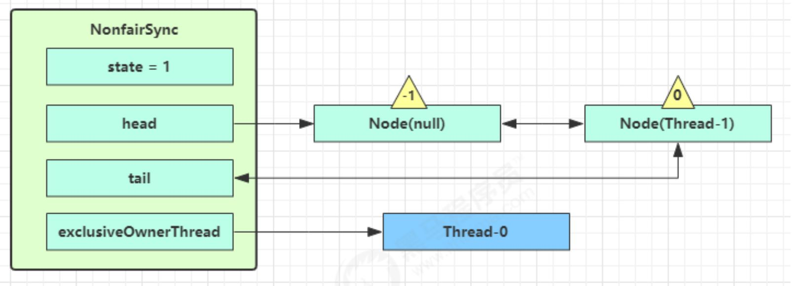

# 实现多线程

## 实现多线程方式一：继承Thread类

- 方法介绍

  | 方法名       | 说明                                        |
  | ------------ | ------------------------------------------- |
  | void run()   | 在线程开启后，此方法将被调用执行            |
  | void start() | 使此线程开始执行，Java虚拟机会调用run方法() |

- 代码演示

  ```java
  public class MyThread extends Thread {
      @Override
      public void run() {
  		线程内容
          }
      }
  }
  public class MyThreadDemo {
      public static void main(String[] args) {
          MyThread my1 = new MyThread();
          my1.run();//直接调用，相当于普通方法的调用
          my1.start();//启动线程；然后由JVM调用此线程的run()方法
      }
  }
  ```

## 实现多线程方式二：实现Runnable接口

- Thread构造方法

  | 方法名                               | 说明                           |
  | ------------------------------------ | ------------------------------ |
  | Thread(Runnable target)              | 分配一个新的Thread对象         |
  | Thread(Runnable target, String name) | 分配一个新的Thread对象，并命名 |

- 代码演示

```java
  public class MyRunnable implements Runnable {
      @Override
      public void run() {
          线程内容
      }
  }
  public class MyRunnableDemo {
      public static void main(String[] args) {
          //创建MyRunnable类的对象
          MyRunnable my = new MyRunnable();
  
          Thread t1 = new Thread(my,"线程名");
  
          //启动线程
          t1.start();
      }
  }
```

## 实现多线程方式三：实现Callable接口

+ 方法介绍

  | 方法名                           | 说明                                               |
  | -------------------------------- | -------------------------------------------------- |
  | V call()                         | 计算结果，如果无法计算结果，则抛出一个异常         |
  | FutureTask(Callable<V> callable) | 创建一个 FutureTask，一旦运行就执行给定的 Callable |
  | V get()                          | 如有必要，等待计算完成，然后获取其结果             |

  + 代码演示

    ```java
    public class MyCallable implements Callable<String> {
        @Override
        public String call() throws Exception {
            线程内容
        }
    }
    public class Demo {
        public static void main(String[] args) {
            //线程开启之后需要执行里面的call方法
            MyCallable mc = new MyCallable();
    
            //可以获取线程执行完毕之后的结果.也可以作为参数传递给Thread对象
            FutureTask<String> ft = new FutureTask<>(mc);
    
            //创建线程对象
            Thread t1 = new Thread(ft);
    
            String s = ft.get();
            //开启线程
            t1.start();
            
            System.out.println(s);
        }
    }
    ```

三种实现方式的对比

+ 实现Callable接口（与Runnable区别在于有返回值传递给FutureTask）
  + 好处: 扩展性强，实现该接口的同时还可以继承其他的类
  + 缺点: 编程相对复杂，不能直接使用Thread类中的方法

+ 实现Runnable接口（Runnable是把线程和任务分开了）
  + 好处: 扩展性强，实现该接口的同时还可以继承其他的类
  + 缺点: 编程相对复杂，不能直接使用Thread类中的方法
+ 继承Thread类（Thread线程和任务合并在了一起）
  + 好处: 编程比较简单，可以直接使用Thread类中的方法
  + 缺点: 可以扩展性较差，不能再继承其他的类

## 设置和获取线程的属性

- 方法介绍

  | 方法名                     | 说明                               |
  | -------------------------- | ---------------------------------- |
  | void  setName(String name) | 将此线程的名称更改为等于参数name   |
  | String  getName()          | 返回此线程的名称                   |
  | Thread  currentThread()    | 返回对当前正在执行的线程对象的引用 |

- 线程调度

  - 两种调度方式

    - 分时调度模型：所有线程轮流使用 CPU 的使用权，平均分配每个线程占用 CPU 的时间片
    - 抢占式调度模型：优先让优先级高的线程使用 CPU，如果线程的优先级相同，那么会随机选择一个，优先级高的线程获取的 CPU 时间片相对多一些

  - Java使用的是抢占式调度模型

  - 随机性

    假如计算机只有一个 CPU，那么 CPU 在某一个时刻只能执行一条指令，线程只有得到CPU时间片，也就是使用权，才可以执行指令。所以说多线程程序的执行是有随机性，因为谁抢到CPU的使用权是不一定的

- 优先级相关方法

  | 方法名                                  | 说明                                                         |
  | --------------------------------------- | ------------------------------------------------------------ |
  | final int getPriority()                 | 返回此线程的优先级                                           |
  | final void setPriority(int newPriority) | 更改此线程的优先级线程默认优先级是5；线程优先级的范围是：1-10 |

### 守护线程

所谓守护线程，是指在程序运行的时候在后台提供一种通用服务的线程，比如垃圾回收线程就是一个很称职的守护者，并且这种线程并不属于程序中不可或缺的部分。

- 当所有的非守护线程结束时，程序也就终止了，同时会杀死进程中的所有守护线程。
- 守护进程是**脱离于终端并且在后台运行的进程**

- 相关方法

  | 方法名                           | 说明                                                         |
  | -------------------------------- | ------------------------------------------------------------ |
  | final void setDaemon(boolean on) | 将此线程标记为守护线程，当运行的线程都是守护线程时，Java虚拟机将退出 |


## 开启线程run

| 方法                | 说明                                            |
| ------------------- | ----------------------------------------------- |
| public void start() | 启动一个新线程，Java虚拟机调用此线程的 run 方法 |
| public void run()   | 线程启动后调用该方法                            |

Note1：直接调用run方法不会开启线程，只是单纯的执行该方法。

## 线程休眠sleep

+ 使线程进入 Timed Waiting 状态（不会释放锁），在millis时间后进入就绪态

  | 方法名                         | 说明                                                         |
  | ------------------------------ | ------------------------------------------------------------ |
  | static void sleep(long millis) | 使当前正在执行的线程停留（暂停执行）指定的毫秒数，结束睡眠后该线程触发一个异常（触发异常同interrupt()） |

## 中断线程interrupt

- 相关方法

| 方法名                       | 说明                                                         |
| ---------------------------- | ------------------------------------------------------------ |
| void interrupt()             | 中断线程，这个操作本质上就是给该线程触发一个异常             |
| static boolean interrupted() | interrupted 方法是一个静态 方法， 它检测当前的线程是否被中断。 而且， 调用 interrupted 方法会清除该线程的中断状态（设为false）。 |
| boolean Interrupted()        | islnterrupted 方法是一个实例方法，可用来检验是否有线程被中断，不会清除该线程的中断状态 |

- 阻塞状态（包括sleep、wait、join），打断线程**会清空打断状态**（打断状态:false）
- 运行状态（包括正常线程、park线程），不会清空打断状态（打断状态:true）

Note：park的作用于sleep类似，但是当打断状态为true时不会执行park（park属于LockSupport 类）

## 礼让线程yield

礼让线程即将线程变成就绪态，将CPU资源让给其他的线程来使用，但锁资源不会释放。

- 相关方法

  | 方法名                     | 说明       |
  | -------------------------- | ---------- |
  | public static void yield() | 礼让该线程 |

## 插入线程join

如果线程A中调用了线程B的join方法，那么线程A阻塞，直到线程B执行完后，线程A从阻塞状态转为就绪状态，等待获取CPU的使用权。

一般用于线程同步，保证运行顺序

- 相关方法

  | 方法名                   | 说明                                     |
  | ------------------------ | ---------------------------------------- |
  | public final void join() | 插入对应线程运行，令当前运行线程立即阻塞 |
  | public final void  join(long n) | 等待线程运行结束,最多等待 n  毫秒 |

## wait-ify

需要获取对象锁后才可以调用 `锁对象.wait()`**将当前线程挂入等待序列WaitSet，**notify 随机唤醒一个线程**将会将该线程加入阻塞序列EntryList**，notifyAll 唤醒所有线程去竞争 CPU**将会将所有线程加入阻塞序列EntryList**

Note：唤醒后并不意味者立刻获得锁，**需要进入 EntryList 重新竞争**

### 对比sleep

- sleep属于Thread类，可以在任意地方调用；wait属于Object类，必须在同步控制方法和同步代码块中使用
- sleep不会释放锁；wait会释放锁

### 虚假唤醒

有多个线程执行了wait()方法，需要其他线程执行notify()或者notifyAll()方法去唤醒它们，假如多个线程都被唤醒了，但是只有其中一部分是有用的唤醒操作，其余的唤醒都是无用功；对于不应该被唤醒的线程而言，便是虚假唤醒。

## park-un

是一种线程原语，可类比生产者和消费者模式

park & unpark **以线程为单位**来阻塞和唤醒线程，可以在没有park的情况下先 unpark，park 不会释放锁资源

# 锁

## 锁原理

## CAS操作

 CAS,compare and swap的缩写，中文翻译成比较并交换。

CAS 操作包含三个操作数 —— 内存位置（V）、预期原值（A）和新值(B)。 如果内存位置的值与预期原值相匹配，那么处理器会自动将该位置值更新为新值 。否则，处理器不做任何操作。

### 对象头

- Mark Word 结构（32位）：最后两位是**锁标志位**


### Monitor

Monitor 被翻译为监视器或管程

每个 Java 对象都可以关联一个 Monitor 对象，Monitor 也是 class，其**实例存储在堆中**


## 偏向锁

偏向锁的思想是偏向于让第一个获取锁对象的线程，这个线程之后重新获取该锁不再需要同步操作

当锁对象第一次被线程获得的时候进入偏向状态，使用 CAS 操作将线程 ID 记录到 Mark Word

- 如果之后这个线程想再次进入时，不需要再进行任何同步操作
- 如果有其他线程想进入时，偏向状态就宣告结束，此时会将偏向锁升级为轻量级锁

**批量撤销**：如果对象被多个线程访问，但没有竞争，这时偏向了线程 T1 的对象仍有机会重新偏向 T2，重偏向会重置对象的 Thread ID

* 批量重偏向：当撤销偏向锁阈值超过 20 次后，JVM 会觉得是不是偏向错了，于是在给这些对象加锁时重新偏向至加锁线程
* 批量撤销：当撤销偏向锁阈值超过 40 次后，JVM 会觉得自己确实偏向错了，根本就不该偏向，于是整个类的所有对象都会变为不可偏向的，新建的对象也是不可偏向的

## 轻量级锁

-如何实现：轻量级锁是同过在对象头部分使用CAS操作来实现的，当一个线程尝试获取轻量级锁时，它会使用CAS将线程中锁记录与对象中的MarkWord进行交接

-锁的竞争:当一个线程尝试获取轻量级锁时，如果没有竞争，可以成功获取锁，并继续执行。如果有竞争，那么轻量级锁会膨胀为重量级锁。

-开销:相对于重量级锁，轻量级锁的获取和释放的开键，因为它不需要涉及操作系统层面的调度和上下文切换。

## 重量级锁

-如何实现:重量级锁通过操作系统的互斥量(Mutex) 或信号量(Semaphore) 实现。当一个线程获得 重量级锁时会进入阻塞状态，如果已经被其他线程持有，那么当前线程就会被挂起等待锁的释放。

-锁的竞争:重量级锁存在严格的竞争关系，当多个线程同时请求一个重量级锁时，只有一个线程能够成功获取锁，其他线程会进入排队状态

-开销:相对于轻量级锁,重量级锁的获取和释放的开销更大，因为它涉汲到操作系统层面的调度和上下文切换,需要更多的系统资源。

## 锁升级

**synchronized 是可重入、不公平的重量级锁**，所以可以对其进行优化

```java
无锁 -> 偏向锁 -> 轻量级锁 -> 重量级锁	// 随着竞争的增加，只能锁升级，不能降级
```


## 锁膨胀

当轻量级锁出现了竞争，这时需要进行锁膨胀，将轻量级锁变为**重量级锁** ，创建Monitor并将对象的拥有线程记录在Owner将竞争的线程加入EntryList

## 锁优化

#### 自旋锁

重量级锁竞争时，尝试获取锁的线程不会立即阻塞，可以使用**自旋**（默认 10 次）来进行优化，采用循环的方式去尝试获取锁

#### 锁消除（去掉锁）

锁消除是指对于被检测出不可能存在竞争的共享数据的锁进行消除，这是 JVM **即时编译器的优化**

锁消除主要是通过**逃逸分析**来支持

#### 锁粗化（合并锁）

对相同对象多次加锁，可以使用锁粗化方式优化如果虚拟机探测到一串的操作都对同一个对象加锁，将会把加锁的范围扩展（粗化）到整个操作序列的外部

# 同步synchronized

Note：synchronized加载的锁具有可见性、原子性（无有序性）

## 同步代码块

格式：

```java
private Object lock = new Object();//创建锁对象
……
synchronized(lock) { 
	多条语句操作共享数据的代码 
}
```

synchronized(锁对象)：就相当于给代码加锁了，任意对象就可以看成是一把锁

- 同步的好处和弊端 

好处：解决了多线程的数据安全问题

弊端：当线程很多时，因为每个线程都会去判断同步上的锁，这是很耗费资源的，无形中会降低程序的运行效率

## 同步方法

- 同步方法的格式

  同步方法：就是把synchronized关键字加到方法上

  ```java
  修饰符 synchronized 返回值类型 方法名(方法参数) { 
  	方法体；
  }
  ```

  同步方法的锁对象是什么呢? this

  等价于

  ```
  修饰符 返回值类型 方法名(方法参数) {
  	synchronized(this)
  	{
  			方法体；
  	}
  }
  ```

- 静态同步方法

  同步静态方法：就是把synchronized关键字加到静态方法上

  ```java
  修饰符 static synchronized 返回值类型 方法名(方法参数) { 
  	方法体；
  }
  ```

  同步静态方法的锁对象是什么呢? 类名.class

  等价于
  
  ```
  修饰符 static 返回值类型 方法名(方法参数) {
  	synchronized(this.class)
  	{
  			方法体；
  	}
  }
  ```
  
  Note:普通方法和静态方法的锁不是同一个锁，不存在互斥

# 内存

## JMM

根据 JMM 的设计，系统存在一个主内存（Main Memory），Java 中所有变量都存储在主存中，对于所有线程都是共享的；每条线程都有自己的工作内存（Working Memory），工作内存中保存的是主存中某些**变量的拷贝**

Note：JMM和JVM中的内存划分是两套对内存划分的维度，之间没有直接联系

### 内存交互


* lock：作用于主内存，将一个变量标识为被一个线程独占状态（对应 monitorenter）
* unclock：作用于主内存，将一个变量从独占状态释放出来，释放后的变量才可以被其他线程锁定（对应 monitorexit）
* read：作用于主内存，把一个变量的值从主内存传输到工作内存中
* load：作用于工作内存，在 read 之后执行，把 read 得到的值放入工作内存的变量副本中
* use：作用于工作内存，把工作内存中一个变量的值传递给**执行引擎**，每当遇到一个使用到变量的操作时都要使用该指令
* assign：作用于工作内存，把从执行引擎接收到的一个值赋给工作内存的变量
* store：作用于工作内存，把工作内存的一个变量的值传送到主内存中
* write：作用于主内存，在 store 之后执行，把 store 得到的值放入主内存的变量中

### 三大特性

#### 可见性

可见性：是指当多个线程访问同一个变量时，一个线程修改了这个变量的值，其他线程能够立即看得到修改的值

原因：存在不可见问题的根本原因是由于缓存的存在，线程持有的是共享变量的副本，无法感知其他线程对于共享变量的更改

#### 原子性

原子性：不可分割，完整性，也就是说某个线程正在做某个具体业务时，中间不可以被分割，需要具体完成，要么同时成功，要么同时失败，保证指令不会受到线程上下文切换的影响 

#### 有序性

有序性：在本线程内观察，所有操作都是有序的；在一个线程观察另一个线程，所有操作都是无序的，无序是因为发生了指令重排序

原因：为了提高性能，编译器和处理器会对指令重排

如：

```
int a = 1;
String b = "at"; 
```

可能被优化为

```
String b = "at";
int a = 1;
```

## volatile

volatile 是 Java 虚拟机提供的**轻量级**的同步机制（三大特性）

- 保证可见性
- 不保证原子性
- 保证有序性（禁止指令重排）

### 原理（内存屏障）

* 对 volatile 变量的写指令后会加入写屏障
  - 写屏障之前的对共享变量的改动，都同步到主存
  - 写屏障之前的代码不会被优化为排在写屏障之后
* 对 volatile 变量的读指令前会加入读屏障
  - 读屏障之后的对共享变量的改动，都同步到主存
  - 读屏障之后的代码不会被优化为排在读屏障之前

### DCL（双端检测）

DCL（双端检锁）机制不一定是线程安全的，原因是有指令重排的存在，加入 volatile 可以禁止指令重排

```java
public final class Singleton {
    private Singleton() { }
    private static Singleton INSTANCE = null;
    
    public static Singleton getInstance() {
        //#0
        if(INSTANCE == null) { 
            synchronized(Singleton.class) {
                if (INSTANCE == null) { 
                    //在字节码文件中可以看出调用Singleton的构造方法和INSTANCE的赋值是可重拍的，若此时t1线程切换到t2线程,并执行#0处的代码（#0处的代码没有被synchronized加锁），将会出现返回为被初始化的对象
                    INSTANCE = new Singleton();
                }
            }
        }
        return INSTANCE;
    }
}
```

## Atomic

### 原子基本类AtomicInteger

**AtomicInteger 原理**：自旋锁  + CAS 算法（CAS必须借助volatile实现）

* 当旧的预期值 A == 内存值 V   此时可以修改，将 V 改为 B
* 当旧的预期值 A !=  内存值 V   此时不能修改，并重新获取现在的最新值，重新执行原子操作（即自旋） 

synchronized使用了悲观锁；AtomicInteger使用了乐观锁（CAS）


AtomicBoolean： 原子更新布尔类型

AtomicInteger：   原子更新整型

AtomicLong：	原子更新长整型

以上3个类提供的方法几乎一模一样，所以本节仅以AtomicInteger为例进行讲解，AtomicInteger的常用方法如下：

```java
public AtomicInteger()：	   			    初始化一个默认值为0的原子型Integer
public AtomicInteger(int initialValue)：  初始化一个指定值的原子型Integer
    
int get():   			 				获取值
int getAndIncrement():      			 以原子方式将当前值加1，注意，这里返回的是自增前的值。
int incrementAndGet():     				 以原子方式将当前值加1，注意，这里返回的是自增后的值。
int addAndGet(int data):				 以原子方式将输入的数值与实例中的值（AtomicInteger里的value）相加，并返回结果。
int getAndSet(int value):   			 以原子方式设置为newValue的值，并返回旧值。
```

### 原子引用AtomicReference

原子引用：对 Object 封装为原子类

原子引用类：AtomicReference、

AtomicStampedReference（可通过getStamp获取对象被修改次数）

```java
AtomicStampedReference<String> ref = new AtomicStampedReference<>("A", 0);
……
int stamp = ref.getStamp();
……
ref.compareAndSet(prev, "C", stamp, stamp + 1);
```

AtomicMarkableReference（查看对象是否被修改过）

```java
AtomicMarkableReference<GarbageBag> ref = new AtomicMarkableReference<>(bag, true);
……
boolean success = ref.compareAndSet(prev, new GarbageBag("空垃圾袋"), true, false);
```

### 原子数组AtomicIntegerArray

原子数组类：AtomicIntegerArray、AtomicLongArray、AtomicReferenceArray

### 原子更新器AtomicReferenceFieldUpdater

原子更新器类：AtomicReferenceFieldUpdater、AtomicIntegerFieldUpdater、AtomicLongFieldUpdater

利用字段更新器，可以针对对象的某个域（Field）进行原子操作，只能配合 volatile 修饰的字段使用

```java
AtomicIntegerFieldUpdater fieldUpdater = AtomicIntegerFieldUpdater
            		.newUpdater(UpdateDemo.class, "field");
```

### 原子累加器LongAdder

原子累加器类：LongAdder、DoubleAdder、LongAccumulator、DoubleAccumulator 

## ThreadLocal 

ThreadLocal 类用来提供线程内部的局部变量，分配在堆内的 **TLAB** 中

对比 synchronized：

|        | synchronized                                                 | ThreadLocal                                                  |
| ------ | ------------------------------------------------------------ | ------------------------------------------------------------ |
| 原理   | 同步机制采用**以时间换空间**的方式，只提供了一份变量，让不同的线程排队访问 | ThreadLocal 采用**以空间换时间**的方式，为每个线程都提供了一份变量的副本，从而实现同时访问而相不干扰 |
| 侧重点 | 多个线程之间访问资源的同步                                   | 多线程中让每个线程之间的数据相互隔离                         |

### 常用方法

| 方法                       | 描述                         |
| -------------------------- | ---------------------------- |
| ThreadLocal<>()            | 创建 ThreadLocal 对象        |
| protected T initialValue() | 返回当前线程局部变量的初始值 |
| public void set( T value)  | 设置当前线程绑定的局部变量   |
| public T get()             | 获取当前线程绑定的局部变量   |
| public void remove()       | 移除当前线程绑定的局部变量   |

### LocalMap

ThreadLocalMap 是 ThreadLocal 的内部类，没有实现 Map 接口，用独立的方式实现了 Map 的功能，其内部 Entry 也是独立实现，Map 里面存储 ThreadLocal 对象（key）和线程的私有变量（value）

# PV操作

## AQS

AQS：AbstractQueuedSynchronizer，是阻塞式锁和相关的同步器工具的框架，许多同步类实现都基于AQS模版开发的。

AQS的核心思想为当一个共享资源空闲时，将请求的线程设为工作线程，并将共享资源设为锁定状态。当一个共享资源被占用时，将请求的线程加入指向的双端锁队列



### state

* state 使用了int 来维护同步状态，独占模式 0 表示未加锁状态，大于 0 表示已经加锁状态

* state 表示线程重入的次数（独占模式）或者剩余许可数（共享模式）

  ```java
  private volatile int state;
  ```

### 队列设计

* 表示 Node 节点的状态，有以下几种状态：

  ```java
  // 默认为 0
  volatile int waitStatus;
  // 由于超时或中断，此节点被取消，不会再改变状态
  static final int CANCELLED =  1;
  // 此节点后面的节点已（或即将）被阻止（通过park），【当前节点在释放或取消时必须唤醒后面的节点】
  static final int SIGNAL    = -1;
  // 此节点当前在条件队列中
  static final int CONDITION = -2;
  // 将releaseShared传播到其他节点
  static final int PROPAGATE = -3;
  ```

* 使用了 FIFO 先入先出队列，并不支持优先级队列，**同步队列是双向链表，便于出队入队**

  ```java
  // 头结点，指向哨兵节点
  private transient volatile Node head;
  // 阻塞队列的尾节点，阻塞队列不包含头结点，从 head.next → tail 认为是阻塞队列
  private transient volatile Node tail;
  
  static final class Node {
      // 枚举：共享模式
      static final Node SHARED = new Node();
      // 枚举：独占模式
      static final Node EXCLUSIVE = null;
      // node 需要构建成 FIFO 队列，prev 指向前继节点
      volatile Node prev;
      // next 指向后继节点
      volatile Node next;
      // 当前 node 封装的线程
      volatile Thread thread;
      // 条件队列是单向链表，只有后继指针，条件队列使用该属性
      Node nextWaiter;
  }
  ```


### 模板方法

AQS 使用了模板方法模式，自定义同步器时需要重写下面几个 AQS 提供的模板方法：

```java
isHeldExclusively()		//该线程是否正在独占资源。只有用到condition才需要去实现它
tryAcquire(int)			//独占方式。尝试获取资源，成功则返回true，失败则返回false
tryRelease(int)			//独占方式。尝试释放资源，成功则返回true，失败则返回false
tryAcquireShared(int)	//共享方式。尝试获取资源。负数表示失败；0表示成功但没有剩余可用资源；正数表示成功且有剩余资源
tryReleaseShared(int)	//共享方式。尝试释放资源，成功则返回true，失败则返回false
```

## 可重入锁ReentrantLock

- ReentrantLock构造方法

  | 方法名          | 说明                        |
  | --------------- | --------------------------- |
  | ReentrantLock() | 创建一个ReentrantLock的实例 |

- 加锁解锁方法

  | 方法名        | 说明   |
  | ------------- | ------ |
  | void lock()   | 获得锁 |
  | void lock(10, TimeUnit.SECONDS)   | 加锁以后10秒钟自动解锁，看门狗不续命 |
  | void unlock() | 释放锁 |

- 基本语法

    ```java
    private ReentrantLock lock = new ReentrantLock();
    ……
    // 获取锁
    lock.lock();
    try {
     // 临界区
    } finally {
     // 释放锁
     reentrantLock.unlock();
    }
    ```

### 可异步（使用lockAsync）

lockAsync不用等待加锁是否成功，继续执行下面的代码

```java
try {
    lock.lockAsync();
} catch (InterruptedException e) {
	……
}finally {
    lock.unlock();
}
```


### 可非阻塞（使用tryLock）

tryLock是去尝试，拿不到就返回false，拿到返回true。

面的代码

```java
try {
    lock.tryLock();
} catch (InterruptedException e) {
	……
}finally {
    lock.unlock();
}
```


### 可重入

ReentrantLock允许一个*线程*使用`lock()` 方法多次锁定一个特定的资源（相应需要同样次数的unlock（）才能解锁）

### 可打断

- 不可打断模式(lock.lock)：即使它被打断，仍会驻留在 AQS 阻塞队列中，一直要**等到获得锁后才能得知自己被打断**了
- 可打断模式(lock.lockInterruptibly)：**被打断后会直接抛出异常**

使用lockInterruptibly进行加锁，被阻塞后可被其他线程用interrupt打断执行catch中的内容

```java
try {
    lock.lockInterruptibly();
} catch (InterruptedException e) {
	……
}finally {
    lock.unlock();
}
```


### 锁超时

在指定时间内没有获取到锁后返回false

```java
try {
    if (!lock.tryLock(1, TimeUnit.SECONDS)) {
        //未获取到锁的处理
    }
} catch (InterruptedException e) {
   ……
} finally {
    lock.unlock();
}
```


### 可公平锁

- 公平锁通过检查当前线程是否为哨兵节点的下一节点，否则不参与竞争

ReentrantLock与synchronized相同默认实现是非公平锁，但是ReentrantLock的时候通过传进参数`true`创建公平锁,如果传入的是`false`或没传参数则创建的是非公平锁。

公平锁即先被阻塞等待的线程先被唤醒，公平锁一般没有必要，会降低并发度

### 条件变量（多等待区）


每一个Condition对象都是一个独立的条件变量等待区

- 总体流程是将 await 线程包装成 node 节点放入 ConditionObject 的条件队列，如果被唤醒就将 node 转移到 AQS 的执行阻塞队列，等待获取锁，**每个 Condition 对象都包含一个等待队列**

```java
Condition waitCigaretteQueue = lock.newCondition();
```

#### await

当前线程进入指定条件变量等待区

- 调用 await，线程进入 ConditionObject 等待，直到被唤醒或打断，调用 await 方法的线程都是持锁状态的

```java
waitCigaretteQueue.await();
```

#### signal

唤醒该条件变量等待区的所有线程

- 进入 ConditionObject 的 doSignal 流程，**取得等待队列中第一个 Node**

```java
waitCigaretteQueue.signal();
```

## 读写锁ReentrantReadWriteLock（读读不互斥，读写互斥，写写互斥）

- 基本语法

```java
    private ReentrantReadWriteLock rw = new ReentrantReadWriteLock();
    private ReentrantReadWriteLock.ReadLock r = rw.readLock();
    private ReentrantReadWriteLock.WriteLock w = rw.writeLock();
	……
    r.lock();
    try {
        ……
    } finally {
        r.unlock();
    }
	……
    w.lock();
    try {
        ……
    } finally {
        w.unlock();
    }
```

读写锁用的是同一个 Sycn 同步器，因此等待队列、state 等也是同一个，原理与 ReentrantLock 加锁相比没有特殊之处，不同是**写锁状态占了 state 的低 16 位，而读锁使用的是 state 的高 16 位**

* 统计变量：

  ```java
  // 用来移位
  static final int SHARED_SHIFT   = 16;
  // 高16位的1
  static final int SHARED_UNIT    = (1 << SHARED_SHIFT);
  // 65535，16个1，代表写锁的最大重入次数
  static final int MAX_COUNT      = (1 << SHARED_SHIFT) - 1;
  // 低16位掩码：0b 1111 1111 1111 1111，用来获取写锁重入的次数
  static final int EXCLUSIVE_MASK = (1 << SHARED_SHIFT) - 1;
  ```

* 获取读写锁的次数：

  ```java
  // 获取读写锁的读锁分配的总次数
  static int sharedCount(int c)    { return c >>> SHARED_SHIFT; }
  // 写锁（独占）锁的重入次数
  static int exclusiveCount(int c) { return c & EXCLUSIVE_MASK; }
  ```

### StampedLock

基本用法

* 加解读锁：

  ```java
  long stamp = lock.readLock();
  lock.unlockRead(stamp);			// 类似于 unpark，解指定的锁
  ```

* 加解写锁：

  ```java
  long stamp = lock.writeLock();
  lock.unlockWrite(stamp);
  ```

* 乐观读，StampedLock 支持 `tryOptimisticRead()` 方法，读取完毕后做一次**戳校验**，如果校验通过，表示这期间没有其他线程的写操作，数据可以安全使用，如果校验没通过，需要重新获取读锁，保证数据一致性

  ```java
  long stamp = lock.tryOptimisticRead();
  // 验戳
  if(!lock.validate(stamp)){
  	// 锁升级
  }
  ```

**读读并发时，不会加锁，而是采用乐观读的方式验证戳是否有被修改过**

**读写并发时，此时的乐观读将会被升级为读锁**

##  倒计时门栓CountDownLatch(count次countDown后运行)	

| 方法                             | 解释                                      |
| -------------------------------- | ----------------------------------------- |
| public CountDownLatch(int count) | 参数传递线程数，表示等待线程数量          |
| public void await()              | 让线程等待,直到执行了count次的countDown() |
| public void countDown()          | 当前线程执行完毕                          |

**使用场景：** 让某一条线程等待其他线程触发count次countDown之后再执行

```java
	CountDownLatch latch = new CountDownLatch(10);
    ExecutorService service = Executors.newFixedThreadPool(10);

    for (int j = 0; j < 10; j++) {
        service.execute(() -> {
            latch.countDown();
        });
    }
    latch.await();
```

 ## 障栅CyclicBarrier(parties次await后signal所有线程)

- CyclicBarrier的相关方法

```java
public CyclicBarrier(int parties, Runnable barrierAction)   // 用于在线程到达屏障时，优先执行barrierAction，方便处理更复杂的业务场景
public int await()											// 每个线程调用await方法告诉CyclicBarrier我已经到达了屏障，然后当前线程被阻塞
```

CyclicBarrier可以重复使用，而CountdownLatch不能重复使用。即在每次都需要parties次调用await后才会解除阻塞

##  交换器Exchanger

Exchanger（交换者）是一个用于线程间协作的工具类。Exchanger用于进行线程间的数据交换。

- Exchanger常用方法

```java
public Exchanger()							// 构造方法
public V exchange(V x)						// 进行交换数据的方法，参数x表示本方数据 ，返回值v表示对方数据
```

这两个线程通过exchange方法交换数据，如果第一个线程先执行exchange()方法，它会一直等待第二个线程也执行exchange方法，当两个线程都到达同步点时，这两个线程就可以交换数据，

## 信号量Semaphore

Semaphore（信号量）用来限制能同时访问共享资源的线程上限（而非限制资源数，一般用于线程数与资源数一致的情况），非重入锁

- Semaphore常用方法

  * `public Semaphore(int permits)`：permits 表示许可线程的数量（state）
  * `public Semaphore(int permits, boolean fair)`：fair 表示公平性，如果设为 true，下次执行的线程会是等待最久的线程
  
  - `public void acquire() throws InterruptedException`	表示获取许可
  - `public void release()`								表示释放许可

- 基本语法

```java
Semaphore semaphore = new Semaphore(3);
……
try {
    semaphore.acquire();
} catch (InterruptedException e) {
    throw new RuntimeException(e);
}
try {
    ……
} finally {
    semaphore.release();
}
```

# 线程安全

## 线程安全类

这些线程安全类都只能保证同时调用同一个方法是是线程安全的

- 遗留的线程安全类（HashTable、Vector等）：均使用synchronized修饰
- Collections 装饰的线程安全集合(Collections.synchronizedCollection Collections.synchronizedList Collections.synchronizedMap等)：所有方法使用synchronized(mutex)修饰

-  java.util.concurrent.* 下的线程安全集合类，主要包含三种

### 阻塞队列

阻塞队列所谓的"阻塞"，指的是某些情况下线程会挂起（比如阻塞队列为空时消费者线程尝试获取数据），一旦条件满足，被挂起的线程又会自动唤醒。使用BlockingQueue，不需要关心什么时候需要阻塞线程，什么时候需要唤醒线程

+ 阻塞队列继承结构

  


+ 常见BlockingQueue:

  - ArrayBlockQueue：由数组结构组成的有界阻塞队列，是提前创建好Node数组
  - LinkedBlockingQueue：由链表结构组成的无界（默认大小 Integer.MAX_VALUE）的阻塞队列，是懒惰的
  - PriorityBlockQueue：支持优先级排序的无界阻塞队列
  - DelayedWorkQueue：使用优先级队列实现的延迟无界阻塞队列
  - SynchronousQueue：不存储元素的阻塞队列，它没有容量，没有线程来取是放不进去的
  - LinkedTransferQueue：由链表结构组成的无界阻塞队列
  - LinkedBlockingDeque：由链表结构组成的**双向**阻塞队列

+ BlockingQueue的核心方法:


| 操作 | 抛异常     | 特定值   | 阻塞（最常用） | 超时                        |
| ---- | ---------- | -------- | -------------- | --------------------------- |
| 插入 | add(o)     | offer(o) | put(o)         | offer(o, timeout, timeunit) |
| 移除 | remove(o)  | poll(o)  | take(o)        | poll(timeout, timeunit)     |
| 检查 | element(o) | peek(o)  |                |                             |

#### BlockingQueue加锁分析

用了两把锁和 dummy 节点：

putLock：保证last节点在put操作时的线程安全；

takeLock：保证head节点在take操作时的线程安全；（这两把锁保证了生产者线程和消费者线程可以同时执行）

dummy节点：保证了节点总数等于2时（一个dummy和一个正常节点），两把锁不会产生竞争

### 非阻塞队列ConcurrentLinkedQueue 

使用循环 CAS 算法实现完成非阻塞

### ConHashMap

略

### CopyOnWrite

CopyOnWriteArrayList（包括CopyOnWriteArraySet）适合读多写少的应用场景

- 写操作：**写入时拷贝**的思想，增删改操作会将底层数组拷贝一份，在拷贝数组上进行修改，修改完成了再用拷贝数组替换旧的数组
- 读操作：不加锁

## 什么时候有线程安全问题

- 有多个线程调用
- 有更改成员变量的方法，且改变量不为线程安全类

# 线程

## 运行原理

* Java 的线程是内核级线程（1:1 线程模型），每个 Java 线程都映射到一个操作系统原生线程，需要消耗一定的内核资源（堆栈）
* **线程的调度是在内核态运行的，而线程中的代码是在用户态运行**，所以线程切换（状态改变）会导致用户与内核态转换进行系统调用，这是非常消耗性能

## 线程状态

### 操作系统的五种状态

创建态、就绪态、运行态、阻塞态、终止态

### Java的六种状态

线程状态被定义在了java.lang.Thread.State枚举类中，State枚举类的源码如下：

```java
public class Thread {
    
    public enum State {
    
        /* 新建 */
        NEW , //等价于操作系统的创建态

        /* 可运行状态 */
        RUNNABLE , //等价于操作系统的就绪态、运行态、阻塞态

        /* 阻塞状态 */
        BLOCKED , //当一个线程试图获取一个对象锁，而该对象锁被其他的线程持有，则该线程进入 Blocked 状态

        /* 无限等待状态 */
        WAITING , //造成线程等待的原因有两种，分别是调用Object.wait()、join()方法。

        /* 计时等待 */
        TIMED_WAITING , //造成线程限时等待状态的原因有三种，分别是：Thread.sleep(long)，Object.wait(long)、join(long)。

        /* 终止 */
        TERMINATED;//等价于操作系统的终止态
    
	}
    
    // 获取当前线程的状态
    public State getState() {
        return jdk.internal.misc.VM.toThreadState(threadStatus);
    }
    
}
```

# 线程池

## 线程池-ThreadPoolExecutor

### 线程池状态 

ThreadPoolExecutor 使用 int 的高 3 位来表示线程池状态，低 29 位表示线程数量


### 构造方法

```aspectj
public ThreadPoolExecutor(int corePoolSize,
                          int maximumPoolSize,
                          long keepAliveTime,
                          TimeUnit unit,
                          BlockingQueue<Runnable> workQueue,
                          ThreadFactory threadFactory,
                          RejectedExecutionHandler handler) {
}
```

- `corePoolSize`：该参数表示的是线程池的核心线程数。当任务提交到线程池时，**如果线程池的线程数量还没有达到corePoolSize**，那么就会新创建的一个**核心线程**来执行任务，改线程为常驻线程，完成任务后不会被回收

- `maximumPoolSize`：该参数表示的是线程池的核心线程数+救急线程数，当任务提交到线程池时**如果线程池的线程数量超过了corePoolSize且不大于maximumPoolSize且拥塞队列满了的时候**，将会新创建一个**救急线程**，该线程在经过keepAliveTime*unit的空闲时间后将会被回收

- `keepAliveTime`：空闲救急线程的存活时间

- `unit`：空闲救急线程的存活时间单位

- `workQueue`：任务队列，用来存放任务。该队列的类型是阻塞队列，常用的阻塞队列有`ArrayBlockingQueue、LinkedBlockingQueue、SynchronousQueue、PriorityBlockingQueue`等。  

- `threadFactory`：线程池工厂，用来创建线程。一般用来给线程起名字

- `handler`：拒绝策略。当任务队列已满，线程数量达到maximumPoolSize后，线程池就不会再接收新的任务了，这个时候就需要使用拒绝策略来决定最终是怎么处理这个任务

> `AbortPocily`：不再接收新任务，直接抛出异常。
>
> `CallerRunsPolicy`：提交任务的线程自己处理。
>
> `DiscardPolicy`：不处理，直接丢弃。
>
> `DiscardOldestPolicy`：丢弃任务队列中排在最前面的任务，并执行当前任务。（排在队列最前面的任务并不一定是在队列中待的时间最长的任务，因为有可能是按照优先级排序的队列）

  在使用ThreadPoolExecutor时，可以使用`execute(Runnable task)`方法向线程池中提交一个任务，没有返回值。也可以使用`submit()`方法向线程池中添加任务，有返回值，返回值对象是Future。submit()方法有三个重载的方法。

## Executors

Executors 提供了四种线程池的创建：newCachedThreadPool、newFixedThreadPool、newSingleThreadExecutor、newScheduledThreadPool

###  newFixedThreadPool(无限阻塞队列)

- 核心线程数 == 最大线程数（没有救急线程被创建），因此也无需超时时间 

- 阻塞队列是无界的，可以放任意数量的任务

    ```java
    ExecutorService executorService = Executors.newFixedThreadPool();
    executorService.submit(() -> {
    //执行的代码});
    ```

###  newCachedThreadPool（无限救急线程）

- 核心线程数是 0， 最大线程数是 Integer.MAX_VALUE，救急线程的空闲生存时间是 60s，意味着 
  - 全部都是救急线程（60s 后可以回收）
  - 救急线程可以无限创建
  
- 队列采用了 SynchronousQueue 实现特点是，它没有容量，没有线程来取是放不进去的（一手交钱、一手交 货）

    ```java
    - ExecutorService executorService = Executors.newCachedThreadPool();
      executorService.submit(() -> {
      //执行的代码});
    ```
    
    ### newSingleThreadExecutor（单线程）

- 线程数固定为 1，任务数多于 1 时，会放入无界队列排队。任务执行完毕，这唯一的线程 也不会被释放。

- 这种方法保证即使某个线程挂掉不会影响整个线程池的运行

    ```java
    ExecutorService executorService = Executors.newSingleThreadExecutor();
    executorService.submit(() -> {
    //执行的代码});
    ```
    
    

### newScheduledThreadPool（定时和延时线程）

#### 延时执行

```java
ScheduledExecutorService executor = Executors.newScheduledThreadPool(1);
executor.schedule(() -> {}, 1000, TimeUnit.MILLISECONDS);//1000ms后执行任务
```

#### 定时执行

```java
ScheduledExecutorService executor = Executors.newScheduledThreadPool(1);
executor.scheduleAtFixedRate(() -> {}, 1, 1, TimeUnit.SECONDS);//1s后首次执行，之后每隔1s执行一次
```

## 提交任务

```java
// 执行任务
void execute(Runnable command);

// 提交任务 task，用返回值 Future 获得任务执行结果(如果提交Runable则返回的Future为空)
<T> Future<T> submit(Callable<T> task);

// 提交 tasks 中所有任务
<T> List<Future<T>> invokeAll(Collection<? extends Callable<T>> tasks) throws InterruptedException;

// 提交 tasks 中所有任务，带超时时间
<T> List<Future<T>> invokeAll(Collection<? extends Callable<T>> tasks,
 long timeout, TimeUnit unit) throws InterruptedException;

// 提交 tasks 中所有任务，哪个任务先成功执行完毕，返回此任务执行结果，其它任务取消
<T> T invokeAny(Collection<? extends Callable<T>> tasks) throws InterruptedException, ExecutionException;

// 提交 tasks 中所有任务，哪个任务先成功执行完毕，返回此任务执行结果，其它任务取消，带超时时间
<T> T invokeAny(Collection<? extends Callable<T>> tasks,long timeout, TimeUnit unit) throws InterruptedException, ExecutionException, TimeoutException;

```

## 关闭线程池

```java
/*
线程池状态变为 SHUTDOWN
- 不会接收新任务
- 但已提交任务会执行完
- 此方法不会阻塞调用线程的执行
*/
void shutdown();

/*
线程池状态变为 STOP
- 不会接收新任务
- 会将队列中的任务返回
- 并用 interrupt 的方式中断正在执行的任务
*/
List<Runnable> shutdownNow();
```

## 执行异常

- try……catch……
- 使用Future接收

## Fork/Join略
