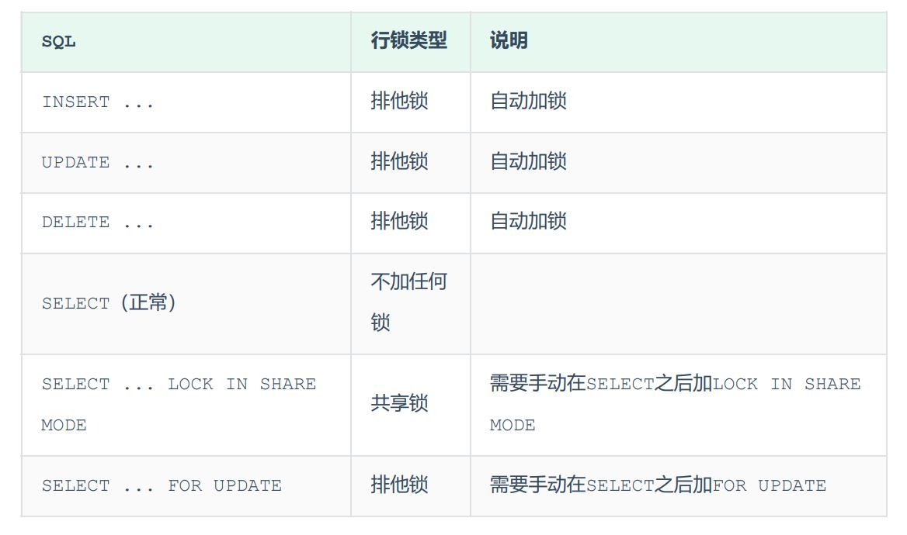
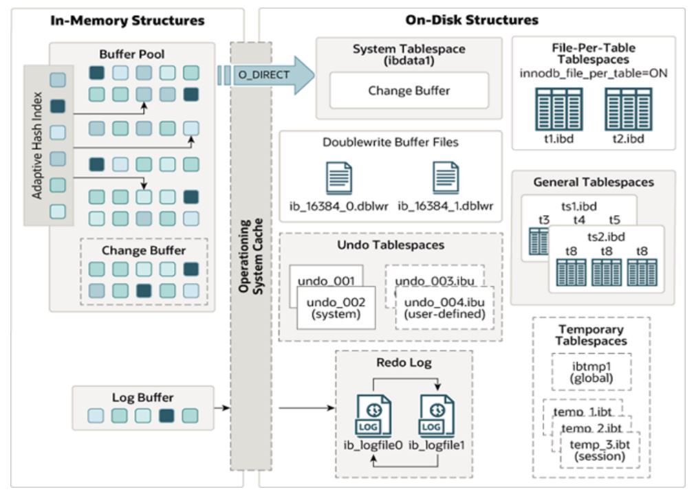

## 锁

锁的粒度分，分为以下三类：

 全局锁：锁定数据库中的所有表。 表级锁：每次操作锁住整张表。 行级锁：每次操作锁住对应的行数据。

### 全局锁

全局锁就是对整个数据库实例加锁，一般用于·数据库的备份（在InnoDB引擎中，我们可以在备份时加上参数 --single-transaction 参数来完成不加锁的一致 性数据备份。）

语法 

- 加全局锁 

```mysql
flush tables with read lock ;
```

- 释放锁 

```mysql
unlock tables ;
```

### 表级锁

表级锁，每次操作锁住整张表。锁定粒度大，发生锁冲突的概率最高，并发度最低。应用在MyISAM、 InnoDB、BDB等存储引擎中。

 对于表级锁，主要分为以下三类： 

表锁 元数据锁（meta data lock，MDL） 意向锁 

#### 表锁 

对于表锁，分为两类： 

- 表共享读锁（read lock）：任何客户端都可以读，任何客户端都不可以写

- 表独占写锁（write lock）：本客户端可以读写，其他客户端不可以读写

加表锁：

```mysql
lock tables 表名... read/write
```

释放锁： 

```mysql
unlock tables / 客户端断开连接
```

#### 元数据锁（表自动加锁）

数据锁 meta data lock , 元数据锁，简写MDL。

MDL加锁过程是系统自动控制，无需显式使用，在访问一张表的时候会自动加上。

当对一张表进行增删改查的时候，加MDL读锁(共享读/写锁)（保证增删改查时无法进行更改列）；当对表结构进行变更操作的时候，加MDL写锁(排他)(保证更改列时无法进行增删改查和更改另一个列)

**什么是元数据？**

元数据指的是非数据表内的数据，如列名，数据库名，用户名，版本名等

#### 意向锁（意向锁与表锁存在互斥，与行锁不存在互斥）

在执行DML操作时，会对涉及的行加行锁，同时也会对该表加上意向锁。而其他客户端，在对这张表加表锁的时候，会根据该表上所加的意向锁来判定是否可以成功加表锁，而 不用逐行判断行锁情况了。

- 意向共享锁(IS): 由语句select ... lock in share mode添加 。 与 表锁共享锁 (read)兼容，与表锁排他锁(write)互斥。 

- 意向排他锁(IX): 由insert、update、delete、select...for update添加 。与表锁共享锁(read)及排他锁(write)都互斥，意向锁之间不会互斥。

### 行级锁

#### 行锁（Record Lock）（锁住数据）

锁定单个行记录的锁，防止其他事务对此行进行update和delete。在 RC、RR隔离级别下都支持。



**无索引行锁升级为表锁**

 #### 间隙锁（Gap Lock）（锁住间隙）

锁定索引记录间隙（不含该记录），确保索引记录间隙不变，防止其他事务在这个间隙进行insert，产生幻读。在RR隔离级别下都支持。

  #### 临键锁（Next-Key Lock）

行锁+间隙锁=临键锁，同时锁住数据，并锁住数据前面的间隙Gap。 在RR隔离级别下支持。

## 事务

事务是一组操作的集合，事务会把所有操作作为一个整体一起向系统提交或撤销操作请求，即这些操作要么同时成功，要么同时失败。

事务操作：

- 查看事务提交方式

  ```mysql
  SELECT @@AUTOCOMMIT;  		-- 会话，1 代表自动提交    0 代表手动提交
  SELECT @@GLOBAL.AUTOCOMMIT;	-- 系统
  ```

- 修改事务提交方式

  ```mysql
  SET @@AUTOCOMMIT=数字;	-- 系统
  SET AUTOCOMMIT=数字;		-- 会话
  ```

- **系统变量的操作**：

  ```sql
  SET [GLOBAL|SESSION] 变量名 = 值;					-- 默认是会话
  SET @@[(GLOBAL|SESSION).]变量名 = 值;				-- 默认是系统
  ```

  ```sql
  SHOW [GLOBAL|SESSION] VARIABLES [LIKE '变量%'];	  -- 默认查看会话内系统变量值
  ```

* 显式开启事务

  ```mysql
  START TRANSACTION [READ ONLY|READ WRITE|WITH CONSISTENT SNAPSHOT]; #可以跟一个或多个状态，最后的是一致性读
  BEGIN [WORK];
  ```

  说明：不填状态默认是读写事务

* 回滚事务，用来手动中止事务

  ```mysql
  ROLLBACK;
  ```

* 提交事务，显示执行是手动提交，MySQL 默认为自动提交

  ```mysql
  COMMIT;
  ```

* 保存点：在事务的执行过程中设置的还原点，调用 ROLLBACK 时可以指定回滚到哪个点

  ```mysql
  SAVEPOINT point_name;						#设置保存点
  RELEASE point_name							#删除保存点
  ROLLBACK [WORK] TO [SAVEPOINT] point_name	#回滚至某个保存点，不填默认回滚到事务执行之前的状态
  ```

### 四大特性ACID

- 原子性(Atomicity)：事务是不可分割的最小操作单位，要么全部成功，要么全部失败
- 一致性(Consistency)：事务完成时，必须使所有数据都保持一致状态，不同节点中数据的值是一致的（redolog 与 undolog保证）
- 隔离性(Isolation)：数据库系统提供的隔离机制，保证事务在不受外部并发操作影响的独立环境下运行（MVCC （隐藏字段+undolog+readview）+ 锁实现RR）
- 持久性(Durability)：事务一旦提交或回滚，它对数据库中的数据的改变就是永久的

### 并发事务

| 问题  | 描述  |
| ------------ | ------------ |
| 脏读  | 一个事务读到另一个事务还没提交的数据  |
| 不可重复读  | 一个事务先后读取同一条记录，但两次读取的数据不同  |
| 幻读  | 一个事务按照条件查询数据时，没有对应的数据行，但是再插入数据时，又发现这行数据已经存在  |

> 这三个问题的详细演示：https://www.bilibili.com/video/BV1Kr4y1i7ru?p=55cd 

并发事务隔离级别：

| 隔离级别  | 脏读  | 不可重复读  | 幻读  |
| ------------ | ------------ | ------------ | ------------ |
| Read uncommitted  | √  | √  | √  |
| Read committed  | ×  | √  | √  |
| Repeatable Read(默认)  | ×  | ×  | √  |
| Serializable  | ×  | ×  | ×  |

- √表示在当前隔离级别下该问题会出现
- Serializable 性能最低；Read uncommitted 性能最高，数据安全性最差

查看事务隔离级别：
`SELECT @@TRANSACTION_ISOLATION;`
设置事务隔离级别：
`SET [ SESSION | GLOBAL ] TRANSACTION ISOLATION LEVEL {READ UNCOMMITTED | READ COMMITTED | REPEATABLE READ | SERIALIZABLE };`
SESSION 是会话级别，表示只针对当前会话有效，GLOBAL 表示对所有会话有效

### redo log（记录了操作的数据页的变化，类似于redis中的RDB）

作用：如果缓冲区的脏页刷新到磁盘时出现错误，而事务却提交成功，这就违反了事务的持久性。此时就可以使用redo log进行数据恢复

### undo log（记录所有的操作，类似redis中的AOP）

作用：提供回滚(保证事务的原子性) 和 MVCC(多版本并发控制) 。

### MVCC（维护一个数据的多个版本， 使得读写操作没有冲突）

- 当前读

读未提交的数据

- 快照读

读已提交的数据

- 隐藏字段

除了我们自己创建的字段以外，InnoDB还会自动的给我们添加三个隐藏字段及其含义分别是：


- undo log(建立在隐藏字段上)

依靠隐藏字段DB_TRX_ID和DB_ROLL_PTR建立起版本链

- readview（建立在undo log上）


不同的隔离级别，生成ReadView的时机不同： 

READ COMMITTED ：在事务中每一次执行快照读时生成ReadView。 

REPEATABLE READ：仅在事务中第一次执行快照读时生成ReadView，后续复用该ReadView。

## 存储引擎

MySQL体系结构：


存储引擎就是存储数据、建立索引、更新/查询数据等技术的实现方式。存储引擎是基于表而不是基于库的，所以存储引擎也可以被称为表引擎。
默认存储引擎是InnoDB。

相关操作：

```mysql
-- 查询建表语句
show create table account;
-- 建表时指定存储引擎
CREATE TABLE 表名(
	...
) ENGINE=INNODB;
-- 查看当前数据库支持的存储引擎
show engines;
```

### InnoDB

InnoDB 是一种兼顾高可靠性和高性能的通用存储引擎，在 MySQL 5.5 之后，InnoDB 是默认的 MySQL 引擎。

特点：

- DML 操作遵循 ACID 模型，支持**事务**
- **行级锁**，提高并发访问性能
- 支持**外键**约束，保证数据的完整性和正确性

文件：

- xxx.ibd: xxx代表表名，InnoDB 引擎的每张表都会对应这样一个表空间文件，存储该表的表结构（frm、sdi）、数据和索引。

参数：innodb_file_per_table，决定多张表共享一个表空间还是每张表对应一个表空间

知识点：

查看 Mysql 变量：
`show variables like 'innodb_file_per_table';`

从idb文件提取表结构数据：
（在cmd运行）
`ibd2sdi xxx.ibd`

#### 逻辑存储结构


1). 表空间 

表空间是InnoDB存储引擎逻辑结构的最高层， 如果用户启用了参数 innodb_file_per_table(在 8.0版本中默认开启) ，则每张表都会有一个表空间（xxx.ibd），一个mysql实例可以对应多个表空 间，用于存储记录、索引等数据。 

2). 段 

段，分为数据段（Leaf node segment）、索引段（Non-leaf node segment）、回滚段 （Rollback segment），InnoDB是索引组织表，数据段就是B+树的叶子节点， 索引段即为B+树的 非叶子节点。段用来管理多个Extent（区）。 

3). 区 （保证相邻的页的距离不会太远）

区，表空间的单元结构，每个区的大小为1M。 默认情况下， InnoDB存储引擎页大小为16K， 即一 个区中一共有64个连续的页。 

4). 页 

页，是InnoDB 存储引擎磁盘管理的最小单元，每个页的大小默认为 16KB。为了保证页的连续性， InnoDB 存储引擎每次从磁盘申请 4-5 个区。

 5). 行 

行，InnoDB 存储引擎数据是按行进行存放的。

#### 内存结构



- Buffer Pool 

物理硬盘与内存之间的缓冲，调节二者速度不一致。 

在InnoDB的缓冲池中不仅缓存了索引页和数据页，还包含了undo页、插入缓存、自适应哈希索引以及 InnoDB的锁信息等等。

- Change Buffer

 Change Buffer，更改缓冲区（针对于非唯一二级索引页），这些页的数据变更存在更改缓冲区 Change Buffer 中，在未来数据被读取时，再将数据合并恢复到Buffer Pool中。

- Adaptive Hash Index

系统根据情况自动完成哈希索引

- Log Buffer

日志缓冲区，用来保存要写入到磁盘中的log日志数据（redo log 、undo log）

#### 磁盘结构

- System Tablespace

系统表空间是更改缓冲区的存储区域。默认的文件名叫 ibdata1

- File-Per-Table Tablespaces

每张表对应的表空间。文件名叫*.idb

可通过数组innodb_file_per_table （该参数默认开启），设置是否使用File-Per-Table Tablespaces储存每张表

- General Tablespaces 

通用表空间，需要通过 CREATE TABLESPACE 语法创建通用表空间，在创建表时，可以指定该表空间。

A. 创建表空间

```mysql
CREATE TABLESPACE 通用表空间名 ADD DATAFILE '文件名' ENGINE = 引擎名
```

B. 创建表时指定表空间


```mysql
CREATE TABLE xxx ... TABLESPACE 通用表空间名;
```

- Undo Tablespaces 

撤销表空间，MySQL实例在初始化时会自动创建两个默认的undo表空间（初始大小16M），用于存储 undo log日志。 

- Temporary Tablespaces 

InnoDB 使用会话临时表空间和全局临时表空间。存储用户创建的临时表等数据。 

- Doublewrite Buffer 

双写缓冲区，innoDB引擎将数据页从Buffer Pool刷新到磁盘前，先将数据页写入双写缓冲区文件 中，便于系统异常时恢复数据。 

- Redo Log 

重做日志，是用来实现事务的持久性。该日志文件由两部分组成：重做日志缓冲（redo log buffer）以及重做日志文件（redo log）,前者是在内存中，后者在磁盘中。当事务提交之后会把所 有修改信息都会存到该日志中, 用于在刷新脏页到磁盘时,发生错误时, 进行数据恢复使用。

#### 后台线程

- Master Thread 

核心后台线程，负责调度其他线程，还负责将缓冲池中的数据异步刷新到磁盘中, 保持数据的一致性， 还包括脏页的刷新、合并插入缓存、undo页的回收 。

- IO Thread 

在InnoDB存储引擎中大量使用了AIO来处理IO请求, 这样可以极大地提高数据库的性能，而IO Thread主要负责这些IO请求的回调。

```mysql
 show engine innodb status \G;
```


- Purge Thread 

主要用于回收事务已经提交了的undo log，在事务提交之后，undo log可能不用了，就用它来回收。

- Page Cleaner Thread 

协助 Master Thread 刷新脏页到磁盘的线程，它可以减轻 Master Thread 的工作压力，减少阻塞。

### MyISAM

MyISAM 是 MySQL 早期的默认存储引擎。

特点：

- 不支持事务，不支持外键
- 支持表锁，不支持行锁
- 访问速度快

文件：

- xxx.sdi: 存储表结构信息
- xxx.MYD: 存储数据
- xxx.MYI: 存储索引

### Memory

Memory 引擎的表数据是存储在内存中的，受硬件问题、断电问题的影响，只能将这些表作为临时表或缓存使用。

特点：

- 存放在内存中，速度快
- hash索引（默认）

文件：

- xxx.sdi: 存储表结构信息

### 存储引擎特点

| 特点  | InnoDB  | MyISAM  | Memory  |
| ------------ | ------------ | ------------ | ------------ |
| 存储限制  | 64TB  | 有  | 有  |
| 事务安全  | 支持  | -  | -  |
| 锁机制  | 行锁  | 表锁  | 表锁  |
| B+tree索引  | 支持  | 支持  | 支持  |
| Hash索引  | -  | -  | 支持  |
| 全文索引  | 支持（5.6版本之后）  | 支持  | -  |
| 空间使用  | 高  | 低  | N/A  |
| 内存使用  | 高  | 低  | 中等  |
| 批量插入速度  | 低  | 高  | 高  |
| 支持外键  | 支持  | -  | -  |

### 存储引擎的选择

在选择存储引擎时，应该根据应用系统的特点选择合适的存储引擎。对于复杂的应用系统，还可以根据实际情况选择多种存储引擎进行组合。

- InnoDB: 如果应用对事物的完整性有比较高的要求，在并发条件下要求数据的一致性，数据操作除了插入和查询之外，还包含很多的更新、删除操作，则 InnoDB 是比较合适的选择
- MyISAM: 如果应用是以读操作和插入操作为主，只有很少的更新和删除操作，并且对事务的完整性、并发性要求不高，那这个存储引擎是非常合适的。
- Memory: 将所有数据保存在内存中，访问速度快，通常用于临时表及缓存。Memory 的缺陷是对表的大小有限制，太大的表无法缓存在内存中，而且无法保障数据的安全性

电商中的足迹和评论适合使用 MyISAM 引擎，缓存适合使用 Memory 引擎。

## 索引

索引是帮助 MySQL **高效获取数据**的**数据结构（有序）**。在数据之外，数据库系统还维护着满足特定查找算法的数据结构，这些数据结构以某种方式引用（指向）数据，这样就可以在这些数据结构上实现高级查询算法，这种数据结构就是索引。

优缺点：

优点：

- 提高数据检索效率，降低数据库的IO成本
- 通过索引列对数据进行排序，降低数据排序的成本，降低CPU的消耗

缺点：

- 索引列也是要占用空间的
- 索引大大提高了查询效率，但降低了更新的速度，比如 INSERT、UPDATE、DELETE

### 创建索引

#### 创建表的时候创建索引

使用CREATE TABLE创建表时，除了可以定义列的数据类型外，还可以定义主键约束、外键约束或者唯一性约束，而不论创建哪种约束，在定义约束的同时相当于在指定列上创建了一个索引。

基本语法格式如下：

```mysql
CREATE TABLE table_name (
    数据类型规定
[UNIQUE | FULLTEXT | SPATIAL] [INDEX | KEY] [index_name] (col_name [length]) [ASC |
DESC])
```

如：

```mysql
CREATE TABLE test1(
id INT NOT NULL,
name varchar(30) NOT NULL,
UNIQUE INDEX uk_idx_id(id)
);
```

* UNIQUE 、 FULLTEXT 和 SPATIAL 为可选参数，分别表示唯一索引、全文索引和空间索引； 
* **INDEX 与 KEY 为同义词**，两者的作用相同，用来指定创建索引； 
* index_name 指定索引的名称，为可选参数，如果不指定，那么MySQL默认col_name为索引名； 
* col_name 为需要创建索引的字段列，该列必须从数据表中定义的多个列中选择； 
* length 为可选参数，表示索引的长度，只有字符串类型的字段才能指定索引长度； 
* ASC 或 DESC 指定升序或者降序的索引值存储。

#### 在已经存在的表上创建索引

在已经存在的表中创建索引可以使用ALTER TABLE语句或者CREATE INDEX语句。

**1. 使用ALTER TABLE语句创建索引** ALTER TABLE语句创建索引的基本语法如下：

```mysql
ALTER TABLE table_name ADD [UNIQUE | FULLTEXT | SPATIAL] [INDEX | KEY]
[index_name] (col_name[length],...) [ASC | DESC]
```

**2. 使用CREATE INDEX创建索引** CREATE INDEX语句可以在已经存在的表上添加索引，在MySQL中， CREATE INDEX被映射到一个ALTER TABLE语句上，基本语法结构为：

```mysql
CREATE [UNIQUE | FULLTEXT | SPATIAL] INDEX index_name
ON table_name (col_name[length],...) [ASC | DESC]
```

### 查看索引
```mysql
SHOW INDEX FROM table_name;
```

### 删除索引

**1. 使用ALTER TABLE删除索引**  ALTER TABLE删除索引的基本语法格式如下：

```mysql
ALTER TABLE table_name DROP INDEX index_name;
```

**2. 使用DROP INDEX语句删除索引** DROP INDEX删除索引的基本语法格式如下：

```mysql
DROP INDEX index_name ON table_name;
```

> 提示: 删除表中的列时，如果要删除的列为索引的组成部分，则该列也会从索引中删除。如果组成索引的所有列都被删除，则整个索引将被删除。

### 索引结构

| 索引结构  | 描述  |
| ------------ | ------------ |
| B+Tree  | 最常见的索引类型，大部分引擎都支持B+树索引  |
| Hash  | 底层数据结构是用哈希表实现，只有精确匹配索引列的查询才有效，不支持范围查询  |
| R-Tree(空间索引)  | 空间索引是 MyISAM 引擎的一个特殊索引类型，主要用于地理空间数据类型，通常使用较少  |
| Full-Text(全文索引)  | 是一种通过建立倒排索引，快速匹配文档的方式，类似于 Lucene, Solr, ES  |

| 索引  | InnoDB  | MyISAM  | Memory  |
| ------------ | ------------ | ------------ | ------------ |
| B+Tree索引  | 支持  | 支持  | 支持  |
| Hash索引  | 不支持  | 不支持  | 支持  |
| R-Tree索引  | 不支持  | 支持  | 不支持  |
| Full-text  | 5.6版本后支持  | 支持  | 不支持  |

#### B-Tree


二叉树的缺点可以用红黑树来解决：
红黑树也存在大数据量情况下，层级较深，检索速度慢的问题。

为了解决上述问题，可以使用 B-Tree 结构。


B-Tree (多路平衡查找树) 以一棵最大度数（max-degree，指一个节点的子节点个数）为5（5阶）的 b-tree 为例（每个节点最多存储4个key，5个指针）

#### B+Tree

结构图：


与 B-Tree 的区别：

- 所有的数据都会出现在叶子节点
- 叶子节点形成一个单向链表

MySQL 索引数据结构对经典的 B+Tree 进行了优化。在原 B+Tree 的基础上，增加一个指向相邻叶子节点的链表指针，就形成了带有顺序指针的 B+Tree，提高区间访问的性能。

#### Hash

哈希索引就是采用一定的hash算法，将键值换算成新的hash值，映射到对应的槽位上，然后存储在hash表中。
如果两个（或多个）键值，映射到一个相同的槽位上，他们就产生了hash冲突（也称为hash碰撞），可以通过链表来解决。

特点：

- Hash索引只能用于对等比较（=、in），不支持范围查询（between、>、<、...）

NOTE:in中的数据是离散的，between中的数据是连续的

- 无法利用索引完成排序操作
- 查询效率高，通常只需要一次检索就可以了，效率通常要高于 B+Tree 索引

存储引擎支持：

- Memory
- InnoDB: 具有自适应hash功能，hash索引是存储引擎根据 B+Tree 索引在指定条件(与java的自适应红黑树转HashTable原理类似)下自动构建的

#### 面试题

1. 为什么 InnoDB 存储引擎选择使用 B+Tree 索引结构？

- 相对于二叉树（红黑树），层级更少，搜索效率高
- 对于 B-Tree，B+树的内部结点相比于b树更小，盘块能容纳的结点中关键字数量更多，一次性读入内存中可以查找的关键字也就越多，相对的，IO读写次数也就降低了。而IO读写次数是影响索引检索效率的最大因素。
- 相对于 Hash 索引，B+Tree 支持范围匹配及排序操作

### 索引分类

| 分类  | 含义  | 特点  | 关键字  |
| ------------ | ------------ | ------------ | ------------ |
| 主键索引  | 针对于表中主键创建的索引  | 默认自动创建，只能有一个  | PRIMARY  |
| 唯一索引  | 避免同一个表中某数据列中的值重复  | 可以有多个  | UNIQUE  |
| 常规索引  | 快速定位特定数据  | 可以有多个  |   |
| 全文索引  | 全文索引查找的是文本中的关键词，而不是比较索引中的值  | 可以有多个  | FULLTEXT  |

在 InnoDB 存储引擎中，根据索引的存储形式，又可以分为以下两种：

| 分类  | 含义  | 特点  |
| ------------ | ------------ | ------------ |
| 聚簇索引(Clustered Index) | 将数据存储与索引放一块，索引结构的叶子节点保存了全部数据 | 必须有，而且只有一个  |
| 二级索引(Secondary Index)  | 将数据与索引分开存储，索引结构的叶子节点保存了对应的主键子节点及部分对应建立索引数据，但一般并不包含记录的全部数据，必须通过进行回表才能查询到全部的数据 | 可以存在多个  |

演示图：

聚簇索引：


二次索引：


聚集索引选取规则：

- 如果存在主键，主键索引就是聚集索引
- 如果不存在主键，将使用第一个唯一(UNIQUE)索引作为聚集索引
- 如果表没有主键或没有合适的唯一索引，则 InnoDB 会自动生成一个 rowid 作为隐藏的聚集索引

1\. 以下 SQL 语句，哪个执行效率高？为什么？

```mysql
select * from user where id = 10;
select * from user where name = 'Arm';
-- 备注：id为主键，name字段创建的有索引
```

答：第一条语句，因为第二条需要回表查询，相当于两个步骤。

2\. InnoDB 主键索引的 B+Tree 高度为多少？

答：假设一行数据大小为1k，一页中可以存储16行这样的数据。InnoDB 的指针占用6个字节的空间，主键假设为bigint，占用字节数为8.
可得公式：`n * 8 + (n + 1) * 6 = 16 * 1024`，其中 8 表示 bigint 占用的字节数，n 表示当前节点存储的key的数量，(n + 1) 表示指针数量（比key多一个）。算出n约为1170。

如果树的高度为2，那么他能存储的数据量大概为：`1171 * 16 = 18736`；
如果树的高度为3，那么他能存储的数据量大概为：`1171 * 1171 * 16 = 21939856`。

另外，如果有成千上万的数据，那么就要考虑分表，涉及运维篇知识。

3.为什么我们还需要一次 回表 操作呢？直接把完整的用户记录放到叶子节点不OK吗？

如果把完整的用户记录放到叶子结点是可以不用回表。但是`太占地方`了，相当于每建立一课B+树都需要把所有的用户记录再都拷贝一遍，这就有点太浪费存储空间了。

### 使用规则

#### 最左前缀法则

如果索引关联了多列（联合索引），要遵守最左前缀法则，最左前缀法则指的是查询从索引的最左列开始，并且不跳过索引中的列。

如果跳跃某一列，索引将部分失效（后面的字段索引失效）。

联合索引中，出现范围查询（<, >），范围查询右侧的列索引失效。可以用>=或者<=来规避索引失效问题。

以idx_user_pro_age_stat索引为例

```mysql
explain select * from tb_user where profession = '软件工程' and age = 31 and status = '0';#全可以使用索引
explain select * from tb_user where profession = '软件工程' and age = 31 ;#全可以使用索引
explain select * from tb_user where profession = '软件工程' and status = '0';#status索引失效
explain select * from tb_user where age = 31;#不可以使用索引


explain select * from tb_user where profession = '软件工程' and age > 31 and status = '0';#status索引失效
explain select * from tb_user where profession = '软件工程' and age >= 30 and status = '0';#全可以使用索引
```

#### 索引失效情况

1. 在索引列上进行运算操作，索引将失效。如：`explain select * from tb_user where substring(phone, 10, 2) = '15';`
2. 字符串类型字段使用时，不加引号，索引将失效。如：`explain select * from tb_user where phone = 17799990015;`，此处phone的值没有加引号
3. 模糊查询中，如果仅仅是尾部模糊匹配，索引不会是失效；如果是头部模糊匹配，索引失效。如：`explain select * from tb_user where profession like '%工程';`，前后都有 % 也会失效。
4. 用 or 分割开的条件，如果 or 其中一个条件的列没有索引，那么涉及的索引都不会被用到。
5. 如果 MySQL 评估使用索引比全表更慢，则不使用索引。

#### SQL 提示

是优化数据库的一个重要手段，简单来说，就是在SQL语句中加入一些人为的提示来达到优化操作的目的。

例如，使用索引：
`explain select * from tb_user use index(idx_user_pro) where profession="软件工程";`
不使用哪个索引：
`explain select * from tb_user ignore index(idx_user_pro) where profession="软件工程";`
必须使用哪个索引：
`explain select * from tb_user force index(idx_user_pro) where profession="软件工程";`

use 是建议，实际使用哪个索引 MySQL 还会自己权衡运行速度去更改，force就是无论如何都强制使用该索引。

#### 覆盖索引&回表查询

尽量使用覆盖索引（查询使用了索引，并且需要返回的列，在该索引中已经全部能找到，**即select中所有列都可以用一个二级索引找到，无需进行回表**），减少 select *。

explain 中 extra 字段含义：
`using index condition`：查找使用了索引，但是需要回表查询数据（二级查询）
`using where; using index;`：查找使用了索引，但是需要的数据都在索引列中能找到，所以不需要回表查询

如果在聚集索引中直接能找到对应的行，则直接返回行数据，只需要一次查询，哪怕是select \*；如果在辅助索引中找聚集索引，如`select id, name from xxx where name='xxx';`，也只需要通过辅助索引(name)查找到对应的id，返回name和name索引对应的id即可，只需要一次查询；如果是通过辅助索引查找其他字段，则需要回表查询，如`select id, name, gender from xxx where name='xxx';`

所以尽量不要用`select *`，容易出现回表查询，降低效率，除非有联合索引包含了所有字段

面试题：一张表，有四个字段（id, username, password, status），由于数据量大，需要对以下SQL语句进行优化，该如何进行才是最优方案：
`select id, username, password from tb_user where username='itcast';`

解：给username和password字段建立联合索引，则不需要回表查询，直接覆盖索引

#### 前缀索引

当字段类型为字符串（varchar, text等）时，有时候需要索引很长的字符串，这会让索引变得很大，查询时，浪费大量的磁盘IO，影响查询效率，此时可以只降字符串的一部分前缀，建立索引，这样可以大大节约索引空间，从而提高索引效率。

语法：`create index idx_xxxx on table_name(columnn(n));`

Note:取前n个字符作为索引

前缀长度：可以根据索引的选择性来决定，而选择性是指不重复的索引值（基数）和数据表的记录总数的比值，索引选择性越高则查询效率越高，唯一索引的选择性是1，这是最好的索引选择性，性能也是最好的。
求选择性公式：

```mysql
select count(distinct email) / count(*) from tb_user;
select count(distinct substring(email, 1, 5)) / count(*) from tb_user;
```

show index 里面的sub_part可以看到接取的长度

#### 单列索引&联合索引

单列索引：即一个索引只包含单个列
联合索引：即一个索引包含了多个列
在业务场景中，如果存在多个查询条件，考虑针对于查询字段建立索引时，建议建立联合索引，而非单列索引。

单列索引情况：
`explain select id, phone, name from tb_user where phone = '17799990010' and name = '韩信';`
这句只会用到phone索引字段

##### 注意事项

- 多条件联合查询时，MySQL优化器会评估哪个字段的索引效率更高，会选择该索引完成本次查询

### 设计原则

1. 针对于数据量较大，且查询比较频繁的表建立索引
2. 针对于常作为查询条件（where）、排序（order by）、分组（group by）操作的字段建立索引
3. 尽量选择区分度高的列作为索引，尽量建立唯一索引，区分度越高，使用索引的效率越高
4. 如果是字符串类型的字段，字段长度较长，可以针对于字段的特点，建立前缀索引
5. 尽量使用联合索引，减少单列索引，查询时，联合索引很多时候可以覆盖索引，节省存储空间，避免回表，提高查询效率
6. 要控制索引的数量，索引并不是多多益善，索引越多，维护索引结构的代价就越大，会影响增删改的效率
7. 如果索引列不能存储NULL值，请在创建表时使用NOT NULL约束它。当优化器知道每列是否包含NULL值时，它可以更好地确定哪个索引最有效地用于查询

## 性能分析

### 查看执行频次（语句类型次数）

- 查看 SQL语句执行次数

```mysql
SHOW [SESSION|GLOBAL] STATUS LIKE 'Com_____';
-- SESSION: 显示当前会话连接的统计结果，默认参数
-- GLOBAL: 显示自数据库上次启动至今的统计结果
```

查询 SQL 语句影响的行数：

```mysql
SHOW STATUS LIKE 'Innodb_rows_%';
```

| 参数                 | 含义                                                         |
| :------------------- | ------------------------------------------------------------ |
| Com_select           | 执行 SELECT 操作的次数，一次查询只累加 1                     |
| Com_insert           | 执行 INSERT 操作的次数，对于批量插入的 INSERT 操作，只累加一次 |
| Com_update           | 执行 UPDATE 操作的次数                                       |
| Com_delete           | 执行 DELETE 操作的次数                                       |
| Innodb_rows_read     | 执行 SELECT 查询返回的行数                                   |
| Innodb_rows_inserted | 执行 INSERT 操作插入的行数                                   |
| Innodb_rows_updated  | 执行 UPDATE 操作更新的行数                                   |
| Innodb_rows_deleted  | 执行 DELETE 操作删除的行数                                   |
| Connections          | 试图连接 MySQL 服务器的次数                                  |
| Uptime               | 服务器工作时间                                               |
| Slow_queries         | 慢查询的次数                                                 |

### 慢查询日志（超时语句）

慢查询日志记录了所有执行时间超过指定参数（long_query_time，单位：秒，默认10秒）的所有SQL语句的日志。
MySQL的慢查询日志默认没有开启，需要在MySQL的配置文件（/etc/my.cnf）中配置如下信息：

开启慢查询日志开关

​	slow_query_log=1

设置慢查询日志的时间为2秒，SQL语句执行时间超过2秒，就会视为慢查询，记录慢查询日志

​	long_query_time=2
更改后记得重启MySQL服务，日志文件位置：/var/lib/mysql/localhost-slow.log，在该路径下使用tail -f localhost-slow.log进行实时查看

查看慢查询日志是否打开：
`show variables like 'slow_query_log';`

### profile

show profile 能在做SQL优化时帮我们了解时间都耗费在哪里。通过 have_profiling 参数，能看到当前 MySQL 是否支持 profile 操作：
`SELECT @@have_profiling;`
profiling 默认关闭，可以通过set语句在session/global级别开启 profiling：
`SET profiling = 1;`

查看所有语句的耗时：
`show profiles;`
查看指定query_id的SQL语句各个阶段的耗时：
`show profile for query query_id;`
查看指定query_id的SQL语句CPU的使用情况
`show profile cpu for query query_id;`

### explain（当前语句索引使用详情）

EXPLAIN 或者 DESC 命令获取 MySQL 如何执行 SELECT 语句的信息，包括在 SELECT 语句执行过程中表如何连接和连接的顺序。
语法：
	直接在select语句之前加上关键字 explain 
	EXPLAIN SELECT 字段列表 FROM 表名 HWERE 条件;

EXPLAIN 各字段含义：

- id：select 查询的序列号，表示查询中执行 select 子句或者操作表的顺序（id相同，执行顺序从上到下；id不同，值越大越先执行）
- select_type：表示 SELECT 的类型，常见取值有 SIMPLE（简单表，即不适用表连接或者子查询）、PRIMARY（主查询，即外层的查询）、UNION（UNION中的第二个或者后面的查询语句）、SUBQUERY（SELECT/WHERE之后包含了子查询）等
- type：表示连接类型，性能由好到差的连接类型为 NULL、system、const、eq_ref、ref、range、index、all
- possible_key：可能应用在这张表上的索引，一个或多个
- Key：实际使用的索引，如果为 NULL，则没有使用索引
- Key_len：表示索引中使用的字节数，该值为索引字段最大可能长度，并非实际使用长度，在不损失精确性的前提下，长度越短越好
- rows：MySQL认为必须要执行的行数，在InnoDB引擎的表中，是一个估计值，可能并不总是准确的
- filtered：表示返回结果的行数占需读取行数的百分比，filtered的值越大越好
- Extra：

| 关键字                       | 备注                                                         |
| ---------------------------- | ------------------------------------------------------------ |
| Using filesort               | 将用外部排序而不是按照索引顺序排列结果，数据较少时从内存排序，否则需要在磁盘完成排序，代价非常高，需要添加合适的索引。 |
| Using temporary              | 需要创建一个临时表来存储结果，这通常发生在对没有索引的列进行GROUP BY时，或者ORDER BY里的列不都在索引里，需要添加合适的索引。 |
| Using index                  | 表示MySQL使用覆盖索引避免全表扫描，不需要再到表中进行二次查找数据，这是比较好的结果之一。注意不要和type中的index类型混淆。 |
| Using where                  | 通常是进行了全表/全索引扫描后再用WHERE子句完成结果过滤，需要添加合适的索引。 |
| Impossible WHERE             | 对Where子句判断的结果总是false而不能选择任何数据，例如where 1=0，无需过多关注。 |
| Select tables optimized away | 使用某些聚合函数来访问存在索引的某个字段时，优化器会通过索引直接一次定位到所需要的数据行完成整个查询，例如MIN()\MAX()，这种也是比较好的结果之一。 |

## SQL 优化

### 插入数据

普通插入：

1. 采用批量插入（一次插入的数据不建议超过1000条）
2. 手动提交事务，多条插入语句执行完后再提交事务
3. 主键顺序插入，主键乱序插入时可能会产生页分裂（类似于B+树的分裂操作）

大批量插入：
如果一次性需要插入大批量数据，使用insert语句插入性能较低，此时可以使用MySQL数据库提供的load指令插入。

```mysql
# 客户端连接服务端时，加上参数 --local-infile（这一行在bash/cmd界面输入）
mysql --local-infile -u root -p
# 设置全局参数local_infile为1，开启从本地加载文件导入数据的开关
set global local_infile = 1;
select @@local_infile;
# 执行load指令将准备好的数据，加载到表结构中
load data local infile '/root/sql1.log' into table 'tb_user' fields terminated by ',' lines terminated by '\n';
```

### 主键优化

数据组织方式：在InnoDB存储引擎中，表数据都是根据主键顺序组织存放的，这种存储方式的表称为索引组织表（Index organized table, IOT）

页分裂：页可以为空，也可以填充一般，也可以填充100%，每个页包含了2-N行数据（如果一行数据过大，会行溢出），根据主键排列。
页合并：当删除一行记录时，实际上记录并没有被物理删除，只是记录被标记（flaged）为删除并且它的空间变得允许被其他记录声明使用。当页中删除的记录到达 MERGE_THRESHOLD（默认为页的50%），InnoDB会开始寻找最靠近的页（前后）看看是否可以将这两个页合并以优化空间使用。

MERGE_THRESHOLD：合并页的阈值，可以自己设置，在创建表或创建索引时指定

主键设计原则：

- 满足业务需求的情况下，尽量降低主键的长度
- 插入数据时，尽量选择顺序插入，选择使用 AUTO_INCREMENT 自增主键（保证主键顺序插入）
- 尽量不要使用 UUID 做主键或者是其他的自然主键，如身份证号（保证主键顺序插入）

### order by优化

1. Using filesort：通过表的索引或全表扫描，读取满足条件的数据行，然后在排序缓冲区 sort buffer 中完成排序操作，所有不是通过索引直接返回排序结果的排序都叫 FileSort 排序
2. Using index：通过有序索引顺序扫描直接返回有序数据，这种情况即为 using index，不需要额外排序，操作效率高

如果order by字段全部使用升序排序或者降序排序，则都会走索引，但是如果一个字段升序排序，另一个字段降序排序，则不会走索引，explain的extra信息显示的是`Using index, Using filesort`，如果要优化掉Using filesort，则需要另外再创建一个索引，如：`create index idx_user_age_phone_ad on tb_user(age asc, phone desc);`，此时使用`select id, age, phone from tb_user order by age asc, phone desc;`会全部走索引

总结：

- 根据排序字段建立合适的索引，多字段排序时，也遵循最左前缀法则
- 尽量使用覆盖索引（where中用过的索引）
- 多字段排序，一个升序一个降序，此时需要注意联合索引在创建时的规则（ASC/DESC）
- 如果不可避免出现filesort，大数据量排序时，可以适当增大排序缓冲区大小 sort_buffer_size（默认256k）

### group by优化

- 在分组操作时，可以通过索引来提高效率
- 分组操作时，索引的使用也是满足最左前缀法则的

如索引为`idx_user_pro_age_stat`，则句式可以是`select ... where profession order by age`，这样也符合最左前缀法则

### limit优化

常见的问题如`limit 2000000, 10`，此时需要 MySQL 排序前2000000条记录，但仅仅返回2000000 - 2000010的记录，其他记录丢弃，查询排序的代价非常大。
优化方案：一般分页查询时，通过创建覆盖索引能够比较好地提高性能，可以通过**覆盖索引加子查询形式**进行优化

- 优化为内连接查询，在索引列 id 上完成排序分页操作，最后根据主键关联回原表查询所需要的其他列内容

例如：

```mysql
-- 此语句耗时很长
select * from tb_sku limit 9000000, 10;
-- 通过覆盖索引加快速度，直接通过主键索引进行排序及查询
select id from tb_sku order by id limit 9000000, 10;
-- 下面的语句是错误的，因为 MySQL 不支持 in 里面使用 limit
-- select * from tb_sku where id in (select id from tb_sku order by id limit 9000000, 10);
-- 通过连表查询即可实现第一句的效果，并且能达到第二句的速度
select * from tb_sku as s, (select id from tb_sku order by id limit 9000000, 10) as a where s.id = a.id;
```

### count优化

MyISAM 引擎把一个表的总行数存在了磁盘上，因此执行 count(\*) 的时候会直接返回这个数，效率很高（前提是不适用where）；
InnoDB 在执行 count(\*) 时，需要把数据一行一行地从引擎里面读出来，然后累计计数。
优化方案：自己计数，如创建key-value表存储在内存或硬盘，或者是用redis

count的几种用法：

- 如果count函数的参数（count里面写的那个字段）不是NULL（字段值不为NULL），累计值就加一，最后返回累计值
- 用法：count(\*)、count(主键)、count(字段)、count(1)
- count(主键)跟count(\*)一样，因为主键不能为空；count(字段)只计算字段值不为NULL的行；count(1)引擎会为每行添加一个1，然后就count这个1，返回结果也跟count(\*)一样；count(null)返回0

各种用法的性能：

- count(主键)：InnoDB引擎会遍历整张表，把每行的主键id值都取出来，返回给服务层，服务层拿到主键后，直接按行进行累加（主键不可能为空）
- count(字段)：没有not null约束的话，InnoDB引擎会遍历整张表把每一行的字段值都取出来，返回给服务层，服务层判断是否为null，不为null，计数累加；有not null约束的话，InnoDB引擎会遍历整张表把每一行的字段值都取出来，返回给服务层，直接按行进行累加
- count(1)：InnoDB 引擎遍历整张表，但不取值。服务层对于返回的每一层，放一个数字 1 进去，直接按行进行累加
- count(\*)：InnoDB 引擎并不会把全部字段取出来，而是专门做了优化，不取值，服务层直接按行进行累加

按效率排序：count(字段) < count(主键) < count(1) < count(\*)，所以**尽量使用 count(\*)**

### update优化（避免行锁升级为表锁）

InnoDB 的行锁是针对索引加的锁，不是针对记录加的锁，并且该索引不能失效，否则会从行锁升级为表锁。

如以下两条语句：
`update student set no = '123' where id = 1;`，这句由于id有主键索引，所以只会锁这一行；
`update student set no = '123' where name = 'test';`，这句由于name没有索引，所以会把整张表都锁住进行数据更新，解决方法是给name字段添加索引

- 使用索引进行update，否则行锁将升级为表锁

# 数据类型

## 整型

| 类型名称      | 取值范围                                  | 大小    |
| ------------- | ----------------------------------------- | ------- |
| TINYINT       | -128〜127                                 | 1个字节 |
| SMALLINT      | -32768〜32767                             | 2个宇节 |
| MEDIUMINT     | -8388608〜8388607                         | 3个字节 |
| INT (INTEGHR) | -2147483648〜2147483647                   | 4个字节 |
| BIGINT        | -9223372036854775808〜9223372036854775807 | 8个字节 |

无符号在数据类型后加 unsigned 关键字。

## 浮点型

| 类型名称            | 说明               | 存储需求   |
| ------------------- | ------------------ | ---------- |
| FLOAT               | 单精度浮点数       | 4 个字节   |
| DOUBLE              | 双精度浮点数       | 8 个字节   |
| DECIMAL (M, D)，DEC | 压缩的“严格”定点数 | M+2 个字节 |

## 日期和时间

| 类型名称  | 日期格式            | 日期范围                                          | 存储需求 |
| --------- | ------------------- | ------------------------------------------------- | -------- |
| YEAR      | YYYY                | 1901 ~ 2155                                       | 1 个字节 |
| TIME      | HH:MM:SS            | -838:59:59 ~ 838:59:59                            | 3 个字节 |
| DATE      | YYYY-MM-DD          | 1000-01-01 ~ 9999-12-3                            | 3 个字节 |
| DATETIME  | YYYY-MM-DD HH:MM:SS | 1000-01-01 00:00:00 ~ 9999-12-31 23:59:59         | 8 个字节 |
| TIMESTAMP | YYYY-MM-DD HH:MM:SS | 1980-01-01 00:00:01 UTC ~ 2040-01-19 03:14:07 UTC | 4 个字节 |

## 字符串

| 类型名称   | 说明                                         | 存储需求                                                   |
| ---------- | -------------------------------------------- | ---------------------------------------------------------- |
| CHAR(M)    | 固定长度非二进制字符串                       | M 字节，1<=M<=255                                          |
| VARCHAR(M) | 变长非二进制字符串                           | L+1字节，在此，L< = M和 1<=M<=255                          |
| TINYTEXT   | 非常小的非二进制字符串                       | L+1字节，在此，L<2^8                                       |
| TEXT       | 小的非二进制字符串                           | L+2字节，在此，L<2^16                                      |
| MEDIUMTEXT | 中等大小的非二进制字符串                     | L+3字节，在此，L<2^24                                      |
| LONGTEXT   | 大的非二进制字符串                           | L+4字节，在此，L<2^32                                      |
| ENUM       | 枚举类型，只能有一个枚举字符串值             | 1或2个字节，取决于枚举值的数目 (最大值为65535)             |
| SET        | 一个设置，字符串对象可以有零个或 多个SET成员 | 1、2、3、4或8个字节，取决于集合 成员的数量（最多64个成员） |

## 二进制类型

| 类型名称       | 说明                 | 存储需求               |
| -------------- | -------------------- | ---------------------- |
| BIT(M)         | 位字段类型           | 大约 (M+7)/8 字节      |
| BINARY(M)      | 固定长度二进制字符串 | M 字节                 |
| VARBINARY (M)  | 可变长度二进制字符串 | M+1 字节               |
| TINYBLOB (M)   | 非常小的BLOB         | L+1 字节，在此，L<2^8  |
| BLOB (M)       | 小 BLOB              | L+2 字节，在此，L<2^16 |
| MEDIUMBLOB (M) | 中等大小的BLOB       | L+3 字节，在此，L<2^24 |
| LONGBLOB (M)   | 非常大的BLOB         | L+4 字节，在此，L<2^32 |

# 数据库设计的规范

## 第一范式

第一范式主要确保数据库中每个字段的值必须具有`原子性`，也就是说数据表中每个字段的值为`不可再次拆分`的最小数据单元

## 第二范式

第二范式要求，在满足第一范式的基础上，还要**满足数据库里的每一条数据记录，都是可唯一标识的。而且所有非主键字段，都必须完全依赖主键，不能只依赖主键的一部分**。

## 第三范式

第三范式是在第二范式的基础上，确保数据表中的每一个非主键字段都和主键字段直接相关，也就是说，**要求数据表中的所有非主键字段不能依赖于其他非主键字段**。（即，不能存在非主属性A依赖于非主属性B，非主属性B依赖于主键C的情况，即存在“A->B->C"的决定关系）通俗地讲，该规则的意思是所有`非主键属性`之间不能由依赖关系，必须`相互独立`。

例如：`员工信息表 `：每个员工有员工编号、姓名、部门编号、所属部门名，此时所属部门名就依赖于部门编号，依照第三范式就应该将数据拆分建立部门信息表

# 常用工具

## mysql （执行mysql命令工具）

该mysql不是指mysql服务，而是指mysql的客户端工具

- 语法 ： 

mysql [options] [database] 

- 选项 ： 

-u, --user=name #指定用户名

-p, --password[=name] #指定密码 

-h, --host=name #指定服务器IP或域名 

-P, --port=port #指定连接端口 

-e, --execute=name #执行SQL语句并退出

- 例：

```mysql
ysql -uroot –p123456 db01 -e "select * from stu";
```

##  mysqladmin (执行mysql管理操作工具)

mysqladmin 是一个执行管理操作的客户端程序。可以用它来检查服务器的配置和当前状态、创建并 删除数据库等。

- 语法:

mysqladmin [options] command ... 

- 选项: 

-u, --user=name #指定用户名 

-p, --password[=name] #指定密码 

-h, --host=name #指定服务器IP或域名 

-P, --port=port #指定连接端口

- 例：

```mysql
mysqladmin -uroot –p1234 drop 'test01';
mysqladmin -uroot –p1234 version;
```

## mysqlbinlog(二进制日志管理工具)

mysqlbinlog 二进制日志管理工具。

- 语法 ： 

mysqlbinlog [options] log-files1 log-files2 ... 

- 选项 ： 

-d, --database=name 指定数据库名称，只列出指定的数据库相关操作。 

-o, --offset=# 忽略掉日志中的前n行命令。 

-r,--result-file=name 将输出的文本格式日志输出到指定文件。 

-s, --short-form 显示简单格式， 省略掉一些信息。 

--start-datatime=date1 --stop-datetime=date2 指定日期间隔内的所有日志。 

--start-position=pos1 --stop-position=pos2 指定位置间隔内的所有日志。

## mysqlshow(客户端对象查找工具) 

mysqlshow 客户端对象查找工具，用来很快地查找存在哪些数据库、数据库中的表、表中的列或者索引。

- 语法 ： 

mysqlshow [options] [db_name [table_name [col_name]]] 

- 选项 ： 

--count 显示数据库及表的统计信息（数据库，表 均可以不指定） 

-i 显示指定数据库或者指定表的状态信息

- 例：

```mysql
#查询test库中book表的详细情况 

mysqlshow -uroot -p2143 test book --count
```

##  mysqldump（数据库备份工具）

- 语法 ： 

mysqldump [options] db_name [tables] 

mysqldump [options] --database/-B db1 [db2 db3...] 

mysqldump [options] --all-databases/-A 

- 连接选项 ： 

-u, --user=name 指定用户名 

-p, --password[=name] 指定密码 

-h, --host=name 指定服务器ip或域名 

-P, --port=# 指定连接端口 

- 输出选项： 

--add-drop-database 在每个数据库创建语句前加上 drop database 语句 -

-add-drop-table 在每个表创建语句前加上 drop table 语句 , 默认开启 ; 不开启 (--skip-add-drop-table) 

-n, --no-create-db 不包含数据库的创建语句 

-t, --no-create-info 不包含数据表的创建语句 

-d --no-data 不包含数据 -T, --tab=name 自动生成两个文件：一个.sql文件，创建表结构的语句；一 个.txt文件，数据文件

-T, --tab=name 自动生成两个文件：一个.sql文件，创建表结构的语句；一 个.txt文件，数据文件

- 例子

```
mysqldump -uroot -p1234 -T /root db01 score
```

- mysqlimport 

mysqlimport 是客户端数据导入工具，用来导入mysqldump 加 -T 参数后导出的文本文件。

- 语法 ： 

mysqlimport [options] db_name textfile1 [textfile2...] 

- 示例 ： 

mysqlimport -uroot -p2143 test /tmp/city.txt

Note:mysql内可以使用source 指令

语法 ： 

```
source /root/xxxxx.sql
```

# 日志

## 错误日志 

错误日志是 MySQL 中最重要的日志之一，它记录了当 mysqld 启动和停止时，以及服务器在运行过 程中发生任何**严重错误**时的相关信息。当数据库出现任何故障导致无法正常使用时，建议首先查看此日志。 

该日志是默认开启的，默认存放目录 /var/log/，默认的日志文件名为 mysqld.log 。查看日志 位置： 

```mysql
 show variables like '%log_error%';
```

## 二进制日志

介绍 二进制日志（BINLOG）记录了所有的 **DDL**（数据定义语言）语句和 **DML**（数据操纵语言）语句，但 不包括数据查询（SELECT、SHOW）语句。 

```
show variables like '%log_bin%';
```

作用：①. 灾难时的数据恢复；②. MySQL的主从复制。在MySQL8版本中，默认二进制日志是开启着 的，涉及到的参数如下： 

### 格式

```
show variables like '%binlog_format%';
```

MySQL服务器中提供了多种格式来记录二进制日志，具体格式及特点如下：


通过/etc/my.cnf 中配置 binlog_format 参数即可

### 查看

mysqlbinlog

### 删除


也可以在mysql的配置文件中配置二进制日志的过期时间，设置了之后，二进制日志过期会自动删除。 

```
show variables like '%binlog_expire_logs_seconds%';
```

## 查询日志

记录所有操作语句，默认未开启的。

修改MySQL的配置文件 /etc/my.cnf 文件，添加如下内容可以打开查询日志：

```
#该选项用来开启查询日志 ， 可选值 ： 0 或者 1 ； 0 代表关闭， 1 代表开启
general_log=1
#设置日志的文件名 ， 如果没有指定， 默认的文件名为 host_name.log
general_log_file=mysql_query.log
```

## 慢查询日志

略

# 主从复制

主从复制是指将主数据库的 DDL 和 DML 操作通过二进制日志传到从库服务器中，然后在从库上对这些日志重新执行（也叫重做），从而使得从库和主库的数据保持同步。

- 优点：

1、主库出现问题，可以快速切换到从库提供服务。 

2、实现读写分离，降低主库的访问压力。 

3、可以在从库中执行备份，以避免备份期间影响主库服务。

### 主从结构

1. Master 主库在事务提交时，会把数据变更记录在二进制日志文件 Binlog 中。 
2. 从库的I/O thread读取主库的二进制日志文件 Binlog ，写入到从库的中继日志 Relay Log 。  
3. 从库的SQL thread监测本地 relay log 中新增了日志内容，将改变反映它自己的数据。

### 主主结构

主主结构就是两个数据库之间总是互为主从关系，这样在切换的时候就不用再修改主从关系

循环复制：在库 A 上更新了一条语句，然后把生成的 binlog 发给库 B，库 B 执行完这条更新语句后也会生成 binlog，会再发给 A

- 同步与异步

异步复制有数据丢失风险，例如数据还未同步到从库，主库就给客户端响应，然后主库挂了，此时从库晋升为主库的话数据是缺失的

同步复制，主库需要将 binlog 复制到所有从库，等所有从库响应了之后主库才进行其他逻辑，这样的话性能很差，一般不会选择

- 搭建主库

1、关闭防火墙

systemctl stop firewalld

systemctl disable firewalld

2、修改配置文件 /etc/my.cnf

```
#mysql 服务ID，保证整个集群环境中唯一，取值范围：1 – 232-1，默认为1 

server-id=1 

#是否只读,1 代表只读, 0 代表读写 

read-only=0
```

3、重启MySQL服务器

4、登录mysql，创建远程连接的账号，并授予主从复制权限

```mysql
#创建itcast用户，并设置密码，该用户可在任意主机连接该MySQL服务
CREATE USER 'itcast'@'%' IDENTIFIED WITH mysql_native_password BY 'Root@123456'
;
#为 'itcast'@'%' 用户分配主从复制权限
GRANT REPLICATION SLAVE ON *.* TO 'itcast'@'%';
```

5、通过指令，查看二进制日志坐标

```mysql
show master status ;
```

- 搭建从库

1、修改配置文件 /etc/my.cnf

```mysql
#mysql 服务ID，保证整个集群环境中唯一，取值范围：1 – 2^32-1，和主库不一样即可
server-id=2
#是否只读,1 代表只读, 0 代表读写
read-only=1
```

2、重新启动MySQL服务

3、登录mysql

```
CHANGE REPLICATION SOURCE TO SOURCE_HOST='192.168.200.200', SOURCE_USER='itcast',
SOURCE_PASSWORD='Root@123456', SOURCE_LOG_FILE='binlog.000004',
SOURCE_LOG_POS=663;
```

设置主库配置 上述是8.0.23中的语法。如果mysql是 8.0.23 之前的版本，执行如下SQL：

```
CHANGE MASTER TO MASTER_HOST='192.168.200.200', MASTER_USER='itcast',
MASTER_PASSWORD='Root@123456', MASTER_LOG_FILE='binlog.000004',
MASTER_LOG_POS=663;
```


4、开启同步操作

```
start replica ; #8.0.22之后
start slave ; #8.0.22之前
```

5、查看主从同步状态

```
show replica status ; #8.0.22之后
show slave status ; #8.0.22之前
```

# 分库分表

## 垂直拆分（按列拆分）

### 垂直分库

垂直分库：以表为依据，根据业务将不同表拆分到不同库中。 

特点： 

每个库的表结构都不一样。 

每个库的数据也不一样。 

所有库的并集是全量数据。

### 垂直分表

垂直分表：以字段为依据，根据字段属性将不同字段拆分到不同表中。 

特点：

每个表的结构都不一样。 

每个表的数据也不一样，一般通过一列（主键/外键）关联。 

所有表的并集是全量数据。

## 水平拆分（按行拆分）

### 水平分库

水平分库：以字段为依据，按照一定策略，将一个库的数据拆分到多个库中。 

特点： 

每个库的表结构都一样。 

每个库的数据都不一样。 

所有库的并集是全量数据。

### 水平分表

水平分表：以字段为依据，按照一定策略，将一个表的数据拆分到多个表中。 

特点： 

每个表的表结构都一样。 

每个表的数据都不一样。 

所有表的并集是全量数据。

## MyCat


### 配置

- schema.xml(配置MyCat结构)

```mysql
<?xml version="1.0"?>
<!DOCTYPE mycat:schema SYSTEM "schema.dtd">
<mycat:schema xmlns:mycat="http://io.mycat/">
	<!--定义逻辑库
	name：指定自定义的逻辑库库名
	checkSQLschema：在SQL语句操作时指定了数据库名称，执行时是否自动去除；true：自动去
除，false：不自动去除
	sqlMaxLimit：如果未指定limit进行查询，列表查询模式查询多少条记录
 -->
	<schema name="DB01" checkSQLschema="true" sqlMaxLimit="100">
		<!--定义逻辑表
		name：定义逻辑表表名，在该逻辑库下唯一
		dataNode：定义逻辑表所属的dataNode，该属性需要与dataNode标签中name对应；多个
		dataNode逗号分隔
		rule：分片规则的名字，分片规则名字是在rule.xml中定义的
		primaryKey：逻辑表对应真实表的主键
		type：逻辑表的类型，目前逻辑表只有全局表和普通表，如果未配置，就是普通表；全局表，配
置为 global
 -->
		<table name="TB_ORDER" dataNode="dn1,dn2,dn3" rule="auto-sharding-long" />
	</schema>
	
	<!--定义分片节点  
	name：定义数据节点名称
	dataHost：数据库实例主机名称，引用自 dataHost 标签中name属性
	database：定义分片所属数据库
-->
	<dataNode name="dn1" dataHost="dhost1" database="db01" />
	<dataNode name="dn2" dataHost="dhost2" database="db01" />
	<dataNode name="dn3" dataHost="dhost3" database="db01" />
	
	<!--定义节点主机 
	name：唯一标识，供上层标签使用
	maxCon/minCon：最大连接数/最小连接数
	balance：负载均衡策略，取值 0,1,2,3
	writeType：写操作分发方式（0：写操作转发到第一个writeHost，第一个挂了，切换到第二
个；1：写操作随机分发到配置的writeHost）
	dbDriver：数据库驱动，支持 native、jdbc 
-->
	<dataHost name="dhost1" maxCon="1000" minCon="10" balance="0"
			  writeType="0" dbType="mysql" dbDriver="jdbc" switchType="1"  slaveThreshold="100">
		<heartbeat>select user()</heartbeat>
		
		<writeHost host="master" url="jdbc:mysql://192.168.200.210:3306?useSSL=false&amp;serverTimezone=Asia/Shanghai&amp;characterEncoding=utf8" user="root" password="1234" />
	</dataHost>
	
	<dataHost name="dhost2" maxCon="1000" minCon="10" balance="0"
			  writeType="0" dbType="mysql" dbDriver="jdbc" switchType="1"  slaveThreshold="100">
		<heartbeat>select user()</heartbeat>
		
		<writeHost host="master" url="jdbc:mysql://192.168.200.213:3306?useSSL=false&amp;serverTimezone=Asia/Shanghai&amp;characterEncoding=utf8" user="root" password="1234" />
	</dataHost>
	
	<dataHost name="dhost3" maxCon="1000" minCon="10" balance="0"
			  writeType="0" dbType="mysql" dbDriver="jdbc" switchType="1"  slaveThreshold="100">
		<heartbeat>select user()</heartbeat>
		
		<writeHost host="master" url="jdbc:mysql://192.168.200.214:3306?useSSL=false&amp;serverTimezone=Asia/Shanghai&amp;characterEncoding=utf8" user="root" password="1234" />
	</dataHost>
</mycat:schema>
```

- rule.xml（分片规则）
- server.xml（系统配置信息）

## 读写分离

读写分离,简单地说是把对数据库的读和写操作分开,以对应不同的数据库服务器。主数据库提供写操 作，从数据库提供读操作，这样能有效地减轻单台数据库的压力。
