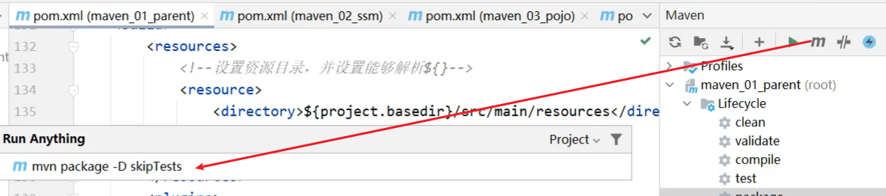

# 父工程（聚合工程）pom.xml配置

```xml
<?xml version="1.0" encoding="UTF-8"?>
<project xmlns="http://maven.apache.org/POM/4.0.0"
         xmlns:xsi="http://www.w3.org/2001/XMLSchema-instance"
         xsi:schemaLocation="http://maven.apache.org/POM/4.0.0 http://maven.apache.org/xsd/maven-4.0.0.xsd">
    <modelVersion>4.0.0</modelVersion>

    <groupId>com.itheima</groupId>
    <artifactId>maven_01_parent</artifactId>
    <version>1.0-RELEASE</version>

    <!--聚合工程的打包方式必须为pom-->
    <packaging>pom</packaging>

    <!--聚合：多个模块组织成一个整体，同时进行项目构建的过程称为聚合-->
    <!--设置管理的模块名称-->
    <modules>
        <module>../maven_02_ssm</module>
        <module>../maven_03_pojo</module>
        <module>../maven_04_dao</module>
    </modules>

    <!--共有依赖：继承的子项目必须继承的jar包-->
    <dependencies>
        <dependency>
            <!--groupId：定义当前Maven项目隶属组织名称（通常是域名反写，例如：com.itheima）-->
            <groupId>org.springframework</groupId>

            <!--artifactId：定义当前Maven项目名称（通常是模块名称，例如 order-service）-->
            <artifactId>spring-core</artifactId>

            <!--version：定义当前项目版本号-->
            <version>${spring.version}</version>

            <!--scope：设置对应jar包的作用范围：编译环境、测试环境、运行环境，默认为compile-->
            <scope>compile</scope>
        </dependency>
    </dependencies>

    <!--定义属性-->
    <properties>
        <!--属性可用于配置pom.xml-->
        <spring.version>5.2.10.RELEASE</spring.version>
        <junit.version>4.12</junit.version>
        <mybatis-spring.version>1.3.0</mybatis-spring.version>
        <!--属性也可用于配置peoperties-->
        <jdbc.url>jdbc:mysql://127.0.0.1:3306/ssm_db</jdbc.url>
    </properties>

    <!--依赖管理：继承的子项目可选择性继承的jar包,继承后子类无需写版本号和作用范围-->
    <dependencyManagement>
        <dependencies>
            <dependency>
                <groupId>junit</groupId>
                <artifactId>junit</artifactId>
                <!--调用属性-->
                <version>${junit.version}</version>
                <scope>test</scope>
            </dependency>
        </dependencies>
    </dependencyManagement>

    <!--配置多环境-->
    <profiles>
        <!--开发环境-->
        <profile>
            <id>env_dep</id>
            <properties>
                <jdbc.url>jdbc:mysql://127.1.1.1:3306/ssm_db</jdbc.url>
            </properties>
            <!--设定是否为默认启动环境-->
            <activation>
                <activeByDefault>true</activeByDefault>
            </activation>
        </profile>
        <!--生产环境-->
        <profile>
            <id>env_pro</id>
            <properties>
                <jdbc.url>jdbc:mysql://127.2.2.2:3306/ssm_db</jdbc.url>
            </properties>
        </profile>
        <!--测试环境-->
        <profile>
            <id>env_test</id>
            <properties>
                <jdbc.url>jdbc:mysql://127.3.3.3:3306/ssm_db</jdbc.url>
            </properties>
        </profile>
    </profiles>

    <build>
        <resources>
            <!--设置资源目录-->
            <resource>
                <directory>${project.basedir}/src/main/resources</directory>
                <!--设置能够解析${}，默认是false -->
                <filtering>true</filtering>
            </resource>
        </resources>
        <plugins>
            <plugin>
                <artifactId>maven-surefire-plugin</artifactId>
                <version>2.12.4</version>
                <configuration>
                    <!--skipTests:如果为true，则跳过所有测试，如果为false，则不跳过测试-->
                    <skipTests>false</skipTests>
                    <!--排除掉不参与测试的内容,includes为加入测试的内容-->
                    <excludes>
                        <exclude>**/BookServiceTest.java</exclude>
                    </excludes>
                </configuration>
            </plugin>
        </plugins>
    </build>
</project>
```

# 子工程（继承工程）的pom.xml配置（依赖的传递）

```xml
<?xml version="1.0" encoding="UTF-8"?>

<project xmlns="http://maven.apache.org/POM/4.0.0" xmlns:xsi="http://www.w3.org/2001/XMLSchema-instance"
         xsi:schemaLocation="http://maven.apache.org/POM/4.0.0 http://maven.apache.org/xsd/maven-4.0.0.xsd">
    <modelVersion>4.0.0</modelVersion>

    <groupId>com.itheima</groupId>
    <artifactId>maven_02_ssm</artifactId>
    <version>1.0-SNAPSHOT</version>
    <packaging>war</packaging>

    <!--配置当前工程继承自parent工程-->
    <parent>
        <groupId>com.itheima</groupId>
        <artifactId>maven_01_parent</artifactId>
        <version>1.0-RELEASE</version>
        <relativePath>../maven_01_parent/pom.xml</relativePath>
    </parent>

    <!--如果不写version，就是完成从父工程进行选择性继承jar包-->
    <dependencies>
        <dependency>
            <groupId>junit</groupId>
            <artifactId>junit</artifactId>
            <scope>test</scope>
        </dependency>

        <!--依赖dao运行，具有依赖传递性，可继承maven_04_dao下的除排除依赖外的所有jar-->
        <dependency>
            <groupId>com.itheima</groupId>
            <artifactId>maven_04_dao</artifactId>
            <version>1.0-SNAPSHOT</version>
            <!--可选依赖，令maven_04_dao变透明，见下可选依赖和排查依赖-->
            <optional>true</optional>
            <!--排除依赖，排除maven_04_dao依赖的mybatis，见下可选依赖和排查依赖-->
            <exclusions>
                <exclusion>
                    <groupId>org.mybatis</groupId>
                    <artifactId>mybatis</artifactId>
                </exclusion>
            </exclusions>
        </dependency>
    </dependencies>

    <build>
        <plugins>
            <plugin>
                <groupId>org.apache.tomcat.maven</groupId>
                <artifactId>tomcat7-maven-plugin</artifactId>
                <version>2.1</version>
                <configuration>
                    <port>80</port>
                    <path>/</path>
                </configuration>
            </plugin>
        </plugins>
    </build>
</project>
```

## Maven常用命令

* compile ：编译，在项目下会生成一个 `target` 目录，并在target生成字节码文件

* clean：清理，，删除项目下的 `target` 目录

* test：测试，执行所有的测试代码

* package：打包，在项目的 `terget` 目录下生成包

* install：安装，将当前项目打成jar包，并安装到本地仓库

## 依赖范围

| **依赖范围** | 编译classpath | 测试classpath | 运行classpath | 例子              |
| ------------ | ------------- | ------------- | ------------- | ----------------- |
| **compile**  | Y             | Y             | Y             | logback           |
| **test**     | -             | Y             | -             | Junit             |
| **provided** | Y             | Y             | -             | servlet-api       |
| **runtime**  | -             | Y             | Y             | jdbc驱动          |
| **system**   | Y             | Y             | -             | 存储在本地的jar包 |

* compile ：作用于编译环境、测试环境、运行环境。
* test ： 作用于测试环境。典型的就是Junit坐标，以后使用Junit时，都会将scope指定为该值
* provided ：作用于编译环境、测试环境。我们后面会学习 `servlet-api` ，在使用它时，必须将 `scope` 设置为该值，不然运行时就会报错
* runtime  ： 作用于测试环境、运行环境。jdbc驱动一般将 `scope` 设置为该值，当然不设置也没有任何问题 

## 可选依赖和排除依赖

* `A依赖B,B依赖C`,`C`通过依赖传递会被`A`使用到，现在要想办法让`A`不去依赖`C`
* 可选依赖是在B上设置`<optional>`,`A`不知道有`C`的存在，
* 排除依赖是在A上设置`<exclusions>`,`A`知道有`C`的存在，主动将其排除掉。

## 跳过测试

- 命令行跳过测试



使用Maven的命令行：

mvn 指令 -D skipTests

- 配置插件实现跳过测试

见上

- IDEA工具实现跳过测试


图中的按钮为`Toggle 'Skip Tests' Mode`,

## 切换环境


使用Maven的命令行：

mvn 指令 -P 环境定义ID

