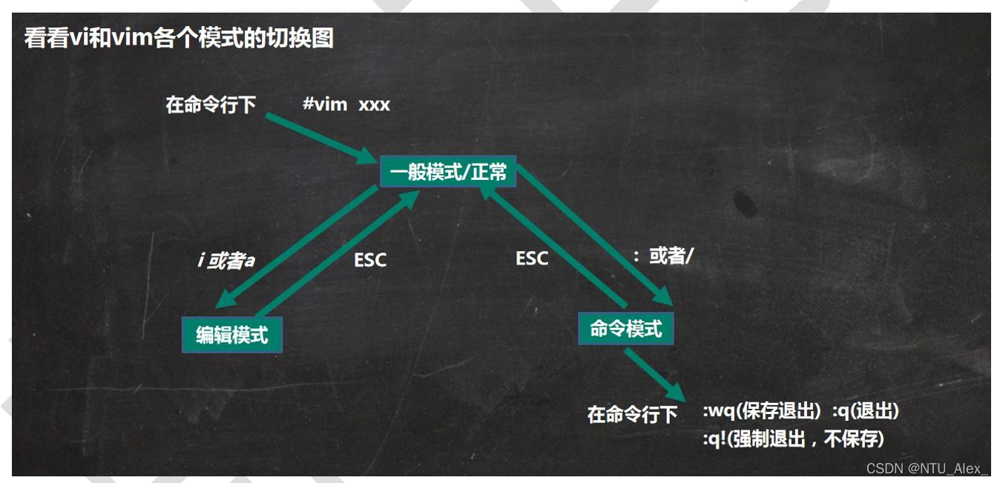
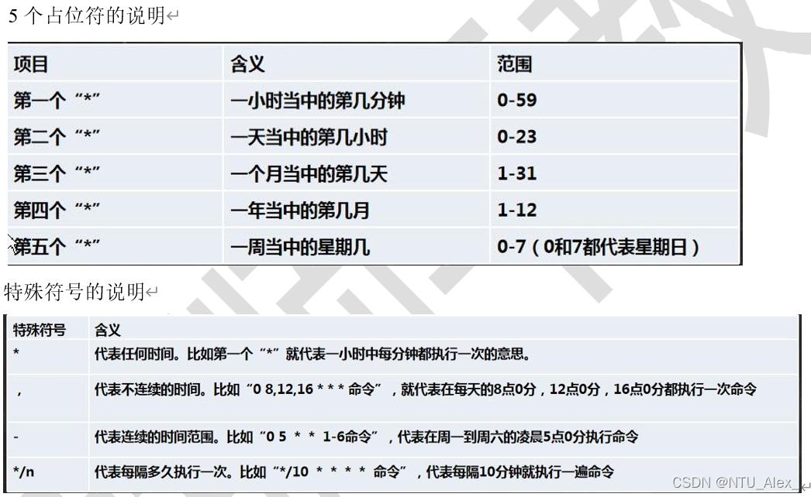
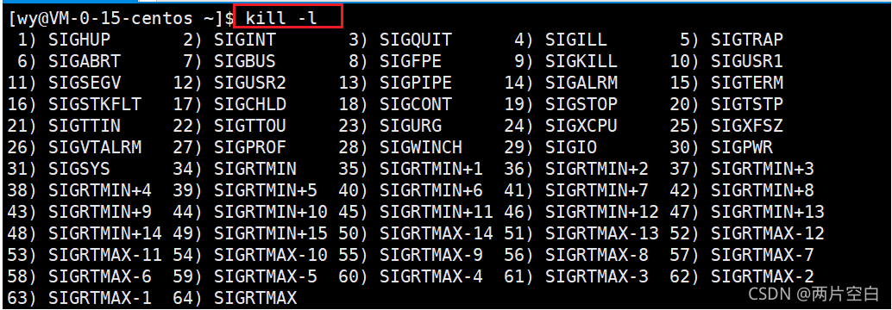

切换中文和英文	ctrl+space
打开终端		ctrl+alt+t

# 1、目录结构

具体的目录结构(不要背，了解就好)

| /bin        | 是 Binary 的缩写, 这个目录存放着最经常使用的命令；子目录：/usr/bin 和 /usr/local/bin |
| ----------- | ------------------------------------------------------------ |
| /sbin       | s 就是 Super User 的意思，这里存放的是系统管理员使用的系统管理程序；子目录：/usr/sbin 和 /usr/local/sbin |
| /home       | 存放普通用户的主目录，在 Linux 中每个用户都有一个自己的目录，一般该目录名是以用户的账号命名 |
| /root       | 该目录为系统管理员，也称作超级权限者的用户主目录             |
| /lib        | 系统开机所需要最基本的动态连接共享库，其作用类似于 Windows 里的 DLL 文件。几乎所有的应用程序都需要用到这些共享库 |
| /lost+found | 这个目录一般情况下是空的，当系统非法关机后，这里就存放了一些文件(该目录隐藏起来了，使用命令可以看到) |
| /etc        | 所有的系统管理所需要的配置文件和子目录, 比如安装 mysql 数据库 my.conf |
| /user       | 这是一个非常重要的目录，用户的很多应用程序和文件都放在这个目录下，类似与 windows 下的 program files 目录 |
| /boot       | 存放的是启动 Linux 时使用的一些核心文件，包括一些连接文件以及镜像文件 |
| /proc       | 不能动这个文件，可能造成系统崩溃	这个目录是一个虚拟的目录，它是系统内存的映射，访问这个目录来获取系统信息 |
| /srv        | 不能动	service 缩写，该目录存放一些服务启动之后需要提取的数据 |
| /sys        | 不能动	这是 linux2.6 内核的一个很大的变化。该目录下安装了 2.6 内核中新出现的一个文件系统 sysfs |
| /tmp        | 这个目录是用来存放一些临时文件的                             |
| /dev        | 类似于 windows 的设备管理器，把所有的硬件用文件的形式存储    |
| /media      | linux 系统会自动识别一些设备，例如 U 盘、光驱等等，当识别后，linux 会把识别的设备挂载到这个目录下 |
| /mnt        | 系统提供该目录是为了让用户临时挂载别的文件系统的，我们可以将外部的存储挂载在/mnt/上，然后进入该目录就可以查看里的内容了。 (比如共享文件) |
| /opt        | 这是给主机额外安装软件所存放的目录(想要安装某个软件，把它的安装软件放在这个目录下)。如想要在虚拟系统上安装 ORACLE 数据库就可以先把其安装文件放在该目录下。默认为空 |
| /user/local | 这是另一个给主机额外安装软件所安装的目录(软件安装后的目标目录)。一般是通过编译源码方式安装的程序 |
| /var        | 这个目录中存放着在不断扩充着的东西，习惯将经常被修改的目录放在这个目录下。包括各种日志文件 |
| /selinux    | security-enhanced linux	SELinux 是一种安全子系统,它能控制程序只能访问特定文件, 有三种工作模式，可以自行设置. 类似于360，保证系统安全。这个目录看不到，因为没有被启用 |

# 2、Vi 和 Vim 编辑器



| 快捷键 | 模式     | 介绍                |
| ------ | -------- | ------------------- |
| yy     | 正常模式 | 复制当前行          |
| 5yy    | 正常模式 | 复制当前行向下的5行 |
| 1,5yy  | 命令模式 | 复制1-5行           |
| dd     | 正常模式 | 删除当前行          |
| 5dd    | 正常模式 | 删除当前行向下的5行 |
| p      | 正常模式 | 粘贴                |

# 3、常用命令

## pwd

 功能：显示当前目录的绝对路径

## ls [选项] [目录或是文件] 

常用选项： 

-a：显示当前目录所有的文件和目录，包括隐藏的。 

-l：以列表的方式显示信息

## cd [参数]	 

cd ~ 回到当前用户的家目录  

cd .. 回到当前目录的上一级目录

cd / 回到当前用户的根目录
cd . 回到当前目录

## mkdir [选项] 要创建的目录路径 

功能：创建目录 

常用选项： -p：创建多级目录

## rmdir [选项] 

要删除的空目录路径 功能：删除一个空目录

## touch 文件名称 

功能：创建空文件

# du -sh 文件夹路径 

功能：查看文件占用空间

## cp [选项] 被拷贝的文件 拷贝到哪个地方 

功能：拷贝文件到指定目录 

常用选项： -r：递归复制整个文件夹

## rm	[选项] 要删除的文件或目录 

功能：移除文件或目录 

常用选项： 

-r：递归删除整个文件夹 

-f：强制删除不提示

## mv	原文件名 新文件名 	     

功能描述：重命名

## mv  被移动的文件 移动到哪   

功能描述：移动文件

## more 要查看的文件 

功能： more 指令是一个基于 VI 编辑器的文本过滤器，它以全屏幕的方式按页显示文本文件的内容。 more 指令中内置了若干快捷键(交互的指令)，详见操作

## less 要查看的文件(大文件)
功能：
less 指令用来分屏查看文件内容，它的功能与 more 指令类似，但是比 more 指令更加强大，支持各种显示终端。
less 指令在显示文件内容时，并不是一次将整个文件加载之后才显示，而是根据显示需要加载内容，对于显示大型文件具有较高的效率。

有一个文件是100M，用vim查看会将其全部加载再显示出来，这样会很慢。
使用less，会先加载一部分显示出来，再根据指令显示剩下的，这样更快。

所以要查找一些大的文件，建议用less

## echo [选项]	[输出内容] 

功能：输出内容到控制台

## \>指令和>>指令： 

\>输出重定向(覆盖)    

\>>追加

## ln -s [原文件或目录] [软链接名] 

给原文件创建一个软链接  软链接也称为符号链接，类似于 windows 里的快捷方式，主要存放了链接其他文件的路径

## history

查看已经执行过历史命令,也可以执行历史指令

## find [搜索范围] [选项] 

-name 按照文件名找文件

-user 按照属于指定用户名找文件

-size 按照文件大小找文件

## locate 搜索文件

可以快速定位文件路径。利用事先建立的系统中所有文件名称及路径的 locate 数据库实现快速定位给定的文件。Locate 指令无需遍历整个文件系统，查询速度较快。为了保证查询结果的准确度，管理员必须定期更新 locate 时刻

## free命令查看内存使用情况

Linux free命令或top命令用于**显示内存状态**。

free指令会显示内存的使用情况，**包括实体内存，虚拟的交换文件内存，共享内存区段，以及系统核心使用的缓冲区等。**

参数如下：

```
-b 以Byte为单位显示内存使用情况。 -k 以KB为单位显示内存使用情况。 -m 以MB为单位显示内存使用情况。 -h 以合适的单位显示内存使用情况，最大为三位数，自动计算对应的单位值。
```

## 	zip [选项] XXX.zip 将要压缩的内容   

功能描述：压缩文件和目录的命令

zip 常用选项
	-r：递归压缩，即压缩目录

## unzip [选项] XXX.zip

功能描述：解压文件	        

unzip 的常用选项
	-d<目录> ：指定解压后文件的存放目录

## tar [选项] 压缩包名.tar.gz（文件夹名） 文件夹名（压缩包名.tar.gz）

将该文件夹压缩成压缩包名.tar.gz
tar -zcvf 压缩包名.tar.gz 文件夹名

将压缩包名.tar.gz解压到指定文件夹
tar -zxvf pc.tar.gz -C 文件夹名

## grep [选项] 查找内容 源文件

常用选项：
	-n：显示匹配行及行号

​	-i ：忽略字母大小写

​    -c：统计行数 		

​	-r：递归搜索

​	-v：取反搜索

"/正则表达式/“匹配正则表达式

​	


案例 1: 请在 hello.txt 文件中，查找"yes"所在行，并且显示行号
	写法 1:  cat /home/hello.txt	| grep "yes"  引号写不写都行			
	写法 2:  grep "yes" /home/hello.txt

## awk 强大的文本处理工具

对文件的每一行做处理（awk的索引从1开始）

**语法格式：**

```bash
awk [选项] ‘条件{动作}  条件{动作} ... ...’  文件名
1
```

- 内置变量

| 变量名 | 描述                                           |
| ------ | ---------------------------------------------- |
| NR     | 输入数据流的当前行号                           |
| NF     | 当前行的列数                                   |
| $0     | 当前行的全部数据内容                           |
| $n     | 当前行的第n列的数据内容                        |
| RS     | 输入数据划分为不同行的分隔符，默认\n           |
| FS     | 输入数据划分为不同列的分隔符，默认空格或制表符 |
| ORS    | 输出数据划分为不同行的分隔符，默认\n           |
| OFS    | 输出数据划分为不同列的分隔符，默认空格         |

- 使用 -v 自定义变量

```bash
awk -v x="bob" -v y=10 '{print x,y}' /tmp/hosts #等号左右不要有空格
awk -v shell=$SHELL '{print shell}' /tmp/hosts	#调用系统定义变量
awk -v RS="." '{print $1}' /tmp/hosts		#指定.作为行分隔符
```

- 使用- F 指定输入分隔符相当于 -v FS=

```bash
awk -F: '{print $1}' /etc/passwd		#以冒号作为分隔符
awk -F"[:,_]" '{print $1}' /etc/passwd	#使用集合定义分隔符
```

- print指令

可以输出常量和变量，如果是字符串常量需要用双引号括起来，数字常量可以直接打印

```bash
awk '{print 123}' /tmp/hosts
awk '{print "IP:",$1}' /tmp/hosts
```

- BEGIN和END

BEGIN导致动作指令仅在开始读取数据记录之前执行一次，END导致动作指令结束读取数据记录后执行一次
BEGIN可以进行数据初始化，END可以进行数据汇总

``` bash
awk 'BEGIN{print "用户名 UID 解释器"} \        
{print 数据内容} \
END {print "共有"NR"个账号."}' /etc/passwd
```

- if（for和while同理）

```bash
awk '{if(判断条件){
动作指令1;
} else if(判断条件2){
动作指令2;
} else {
动作指令N;
}}'
```

- 正则表达式匹配

```bash
awk '$0=/正则表达式/{匹配成功后的行为}' nowcoder.txt
```

## sed在线编辑器
选项与参数：
-f ：直接将 sed 的动作写在一个文件内， -f filename 则可以运行 filename 内的 sed 动作；
-i ：直接修改读取的文件内容，而不是输出到终端。

function：
a ：新增， a 的后面可以接字串，而这些字串会在新的一行出现(目前的下一行)～
c ：取代， c 的后面可以接字串，这些字串可以取代 n1,n2 之间的行！
d ：删除，因为是删除啊，所以 d 后面通常不接任何咚咚；
i ：插入， i 的后面可以接字串，而这些字串会在新的一行出现(目前的上一行)；
p ：列印，亦即将某个选择的数据印出。通常 p 会与参数 sed -n 一起运行～
s ：取代，可以直接进行取代的工作哩！通常这个 s 的动作可以搭配正规表示法！例如 1,20s/old/new/g 就是啦！

如：

sed -i "s/shan/hua/g" lishan.txt

  把当前目录下lishan.txt里的shan都替换为hua

## 其他

- cat - 读取文件内容

-n：对输出行编号

形式：cat 文件名

- tr-转换或删除字符

-s 原字符 目标字符：将原字符替换为目标字符，如果原字符有多个，则缩减值一个且替换为目标字符！

- sort-默认字典序排序

-n : 按照数值大小进行排序；

-r : 以相反的顺序排序

- uniq：检查及删除文本文件中重复出现的行列
  一般与sort命令结合使用。后跟参数-c，然后就会在每列旁边显示该行重复出现的次数
- xargs ：多行变单行
- head -n 行数：可以获取文件最前几行
- tail -n 行数： 输出文件的最后几行
- wc -w： 获取当前行的所有列数

# 4、用户管理

## 添加用户

```java
语法：useradd 用户名
```

## 指定/修改密码

```java
语法：passwd 用户名 
```

## 删除用户

```java
语法： userdel 用户名
```

## 查询用户信息

```java
语法：id 用户名
```

## 切换用户

```java
语法： su - 切换用户名
```

## 查看当前用户/登录用户

```java
语法：who am i 或者 who am I
```

## 修改文件/目录的拥有者

```
chown 组名 文件名
```

## 用户组

- 新增组：groupadd 组名

- 删除组：groupdel 组名
- 增加一个用户zwj，把他直接放到组wudang中 useradd -g wudang  	
- 增加一个组wudang，组中直接添加用户zwj中groupadd wudang

# 5、组管理和权限管理

## 组的创建

```java
groupadd 组名
```

## 查看文件/目录所在组 

```java
ls –ahl  或者ll
```

## 修改文件/目录的拥有组

```
chgrp 组名 文件名
```

## 改变用户所在组 

```
usermod	–g	新组名	用户名 

usermod	–d	目录名	用户名	 (改变该用户登陆的初始目录)
```

## 修改权限-chmod
基本说明：通过 chmod 指令，可以修改文件或者目录的权限。

**第一种方式：通过 + 、-、=  变更权限**
	u:所有者	
	g:所在组(同一个组的其他用户)	
	o:其他人(不同一个组的其他用户)	
	a:所有人(所有用户)(u、g、o 的总和)
	

	chmod 	u=rwx,g=rx,o=x	文件/目录名  (该文件/目录的u的权限是rwx，g的权限是rx，o的权限是x)
	chmod	o+w				文件/目录名  (该文件/目录的o的权限加上w)
	chmod	a-x				文件/目录名  (取消该文件/目录的a的x权限)

**第二种方式：通过数字变更权限** 

权限可以用数字代替：r=4 w=2 x=1	   

chmod u=rwx,g=rx,o=x 文件/目录名 

相当于  

chmod 751		     文件/目录名
## 修改文件/目录的所有者-chown

```java
chown	newowner			文件/目录	(修改所有者)
chown 	newowner:newgroup	文件/目录 	(同时修改所有者和所在组)
```

# 6、定时任务调度

## crond定时执行任务调度

输入crontab -e  就会进入crontab文件 

然后在文件中写入定时任务：

​					*/1 * * * * （每个*代表分、时、）命令或执行文件



## at一次性定时任务

- at 命令格式
  	at [选项] [时间]
  	然后输入两次：Ctrl + D	(结束 at 命令的输入)

- at 指定时间的方法：

(1)	接受在当天的 hh:mm（小时:分钟）式的时间指定。
	假如该时间已过去，那么就放在第二天执行。 例如：04:00
(2)	使用 midnight（深夜），noon（中午），teatime（饮茶时间，一般是下午 4 点）等比较模糊的词语来指定时间。
(3)	采用 12 小时计时制，即在时间后面加上 AM（上午）或 PM（下午）来说明是上午还是下午。 
	例如：12pm
(4)	指定命令执行的具体日期，指定格式为 month day（月 日）或 mm/dd/yy（月/日/年）或 dd.mm.yy（日.月.年），指定的日期必须跟在指定时间的后面。 
	例如：04:00 2021-03-1 (小的时间写前面，大的时间写后面)
(5)	使用相对计时法。
	指定格式为：now + count time-units
	now 就是当前时间，time-units 是时间单位，这里能够是 minutes（分钟）、hours（小时）、days（天）、weeks（星期）。
	count 是时间的数量，几天，几小时。 
	例如：now + 5 minutes
(6)	直接使用 today（今天）、tomorrow（明天）来指定完成命令的时间。

# 7、进程管理

## ps [选项]    

选项： 	

-a		显示当前终端的所有进程信息 	

-u		以用户的格式显示进程信息 	

-x		显示后台程序运行的参数

-e		显示所有进程

-f		全格式

常用： -aux和-ef

## kill 和 killall指令：终止进程
1.介绍:
若是某个进程执行一半需要停止时，或是已经消耗了很大的系统资源时，此时可以考虑停止该进程。
使用 kill 命令来完成此项任务。

2.基本语法：

**kill [选项] 进程号**	

功能描述：通过进程号杀死/终止进程

-9   表示强制终止进程 	 (系统觉得某个程序重要，可能会屏蔽你的kill指令，这时使用选项-9强制终止进程)

**killall 进程名称**	    

功能描述：通过进程名称杀死进程，也支持通配符，这在系统因负载过大而变得很慢时很有用，使用killall，会将该进程的所有子进程也都删除/终止。
3.常用选项： 



| 信号    | 描述                                                         |
| ------- | ------------------------------------------------------------ |
| SIGHUP  | 当用户退出终端时，由该终端开启的所有进程都退接收到这个信号，默认动作为终止进程。 |
| SIGINT  | 程序终止(interrupt)信号, 在用户键入INTR字符(通常是Ctrl+C)时发出，用于通知前台进程组终止进程。 |
| SIGQUIT | 和SIGINT类似, 但由QUIT字符(通常是Ctrl+\)来控制. 进程在因收到SIGQUIT退出时会产生core文件, 在这个意义上类似于一个程序错误信号。 |
| SIGKILL | 用来立即结束程序的运行. **本信号不能被阻塞、处理和忽略**。   |
| SIGTERM | 程序结束(terminate)信号, 与SIGKILL不同的是该信号可以被阻塞和处理。通常用来要求程序自己正常退出。 |
| SIGSTOP | 停止(stopped)进程的执行. 注意它和terminate以及interrupt的区别:该进程还未结束, 只是暂停执行. **本信号不能被阻塞, 处理或忽略**. |

## 查看进程树 pstree

1.基本语法：pstree [选项] 
功能：可以更加直观的来看进程信息(树的形式)

2.常用选项：
-p :显示进程的 PID (父进程ID)
-u :显示进程的所属用户

## 服务(service)管理

### 介绍
服务(service) 本质就是进程，但是是运行在后台的，
通常都会监听某个端口，等待其它程序的请求，比如(mysqld , sshd防火墙等)，
因此我们又称为守护进程，是 Linux 中非常重要的知识点。

### service 管理指令
(1)	service	服务名 [start | stop | restart | reload | status（在 CentOS7.0 后很多服务不再使用 service指令管理,而是使用 systemctl）
start 	开启服务
stop 	终止服务
restart 重启服务
reload 	重载服务
status 	查看服务的状态

### systemctl 管理指令

基本语法：systemctl [start | stop | restart | status] 服务名

systemctl 指令管理的服务在 /usr/lib/systemd/system 查看

- systemctl 设置服务的自启动状态
  systemctl list-unit-files [ | grep 服务名] (查看服务开机启动状态, grep 可以进行过滤) 
  systemctl enable 服务名 		(设置服务开机自启动)
  systemctl disable 服务名 	(关闭服务开机自启动)
  systemctl is-enabled 服务名  (查询某个服务是否是自启动的)

centos7之后运行级别只有3和5，所以以上指令对3和5运行级别同时适用


### 服务的运行级别(runlevel)
Linux 系统有 7 种运行级别(runlevel)：常用的是级别 3 和 5

运行级别 0：系统停机状态，系统默认运行级别不能设为 0，否则不能正常启动
运行级别 1：单用户工作状态，root 权限，用于系统维护，禁止远程登陆
运行级别 2：多用户状态(没有 NFS)，不支持网络
运行级别 3：完全的多用户状态(有 NFS)，无界面，登陆后进入控制台命令行模式
运行级别 4：系统未使用，保留
运行级别 5：X11 控制台，登陆后进入图形 GUI 模式
运行级别 6：系统正常关闭并重启，默认运行级别不能设为 6，否则不能正常启动

## top [选项]（动态监控进程）

top 与 ps 命令很相似。
它们都用来显示正在执行的进程。
top 与 ps 最大的不同之处在于: top 在执行一段时间可以更新正在运行的的进程。

常用选项：

| 选项    | 功能                        |
| ------- | --------------------------- |
| -d 秒数 | top指令每隔几秒进行更新     |
| -i      | top指令不显示闲置或僵尸进程 |
| -p      | 指定进程ID进行监控          |

交互指令：

| 操作 | 功能                        |
| ---- | --------------------------- |
| P    | 按CPU占用率进行排序（默认） |
| M    | 按内存使用率进行排序        |
| N    | 按PID进行排序               |
| q    | 退出top                     |

## netstat [选项]（监控网络状态）

常用选项：

-an	按一定顺序排列输出
-p	显示哪个进程在调用

# 8、Shell 脚本

## 脚本格式要求
​	脚本以 #!/bin/bash 开头 --->确定shell的类型
​    脚本需要有可执行权限
​    shell脚本文件以.sh结尾，也可以不以.sh结尾

## Shell 的变量
(1)	Linux Shell 中的变量分为:系统变量和用户自定义变量。

(2)	系统变量比如：$HOME、$PWD、$SHELL、$USER 等等。可以通过 set 指令显示出shell中的所有系统变量。

### 设置自定义变量

基本语法： 

{1}定义变量：变量名=值  --->不加空格 

{2}撤销变量：unset 变量名 

{3}声明静态变量：readonly 变量 (改变量不能 unset撤销)

### 设置环境变量(全局变量)

可以将变量提升为全局环境变量，供多个shell程序共同使用。

基本语法：
{1}	export 	变量名=变量值 	
（功能描述：将 shell 变量输出为环境变量/全局变量）

{2}	source 	配置文件		    
（功能描述：在某文件中定义环境变量之后，要对该文件进行刷新才能使其生效，即让修改后的配置信息立即生效）

### 将命令的返回值赋给变量A

{1}	A=`date`反引号，运行里面的命令，并把结果返回给变量 A  

{2}	A=$(date) 等价于反引号

## 位置参数变量

当我们执行一个 shell 脚本时，如果希望获取到命令行的参数信息，就可以使用到位置参数变量

比如： ./myshell.sh 100 200中的100和200就是位置参数

基本语法
$n （功能描述：n 为数字，$0 代表命令本身(如./myshell.sh)，$1-$9 代表第一到第九个参数(如：$1 就是100 $2 就是200)，十以上的参数需要用大括号包含，如${10}）
$* （功能描述：这个变量代表命令行中所有的参数，$*把所有的参数看成一个整体）
$@ （功能描述：这个变量也代表命令行中所有的参数，不过$@把每个参数区分对待）
$# （功能描述：这个变量代表命令行中所有参数的个数）

## 预定义变量

预定义变量是 shell 设计者事先已经定义好的变量，可以直接在 shell 脚本中使用

2.基本语法：
(1)	$$ （功能描述：当前进程的进程号（PID））
(2)	$! （功能描述：后台运行的最后一个进程的进程号（PID））
(3)	$？（功能描述：最后一次执行的命令的返回状态。如果这个变量的值为 0，证明上一个命令正确执行；如果这个变量的值为非 0（具体是哪个数，由命令自己来决定），则证明上一个命令执行不正确了。

## 基础运算符

2.基本语法：
三种写法：
	$((运算式))
	$[运算式]
	`expr m + n` 	(expression 表达式)

## 条件判断式/循环迭代式

```java
1.基本语法：
((循环或条件式))
```

？？？？？[ 条件式 ] （注意 condition 前后要有空格）好像用不了

## 流程控制

### if 语句

```java
if 条件判断式
then
	代码
elif 条件判断式
then
	代码
fi
```

### case 语句

```java
case $变量名 in
"值 1")
如果变量的值等于值 1，则执行程序 1
;;
"值 2")
如果变量的值等于值 2，则执行程序 2
;;
…省略其他分支…

*)
如果变量的值都不是以上的值，则执行此程序
;;
esac
```

### for 循环

```java
第一种方式：

for 变量 in  值 1  值 2  值 3… 
do
程序/代码
done
    
第二种方式：

for 循环迭代式
do
程序/代码
done
```

### while 循环

```java
while 条件判断式
do
程序/代码
done
```

## read\[选项][参数]				（读取控制台输入)


选项：
	-p：指定读取值时的提示符；
	-t：指定读取值时等待的时间（秒），如果没有在指定的时间内输入，就不再等待了
参数：
	变量：指定读取值的变量名

例子：
	read -t 10 -p "请输入一个数 NUM2=" NUM2 

# 函数
shell 编程和其它编程语言一样，有系统函数，也可以自定义函数。系统函数中，我们这里就介绍两个。

## 系统函数

```
1.basename 基本语法
功能：返回完整路径最后 / 的部分，常用于获取文件名
basename [pathname] [suffix]
basename [string] [suffix]	

功能描述：basename 命令会删掉所有的前缀包括最后一个（‘/’）字符，然后将字符串显示出来。
选项：suffix 为后缀，如果 suffix 被指定了，basename 会将 pathname 或 string 中的 suffix 去掉。

案例 1：请返回 /home/aaa/test.txt 的 "test.txt" 部分
basename /home/aaa/test.txt
返回test.txt
```

```
2.dirname 基本语法
功能：返回完整路径最后 / 的前面的部分，常用于返回路径部分
dirname 文件绝对路径 

功能描述：从给定的包含绝对路径的文件名中去除文件名（非目录的部分），然后返回剩下的路径（目录的部分）

案例 1：请返回 /home/aaa/test.txt 的 /home/aaa 
dirname /home/aaa/test.txt
返回/home/aaa
```

## 自定义函数
基本语法：
[ function ] funname[()]
{
	Action; 
	[return int;]
}

调用直接写函数名：funname	[值]

```
案例 1：计算输入两个参数的和(动态的获取) testFun.sh
	#!/bin/bash

	#定义函数 getSum 
	function getSum() {
		SUM=$[$n1+$n2] 
		echo "和是=$SUM"
	}
	
	#输入两个值
	read -p "请输入一个数 n1=" n1 
	read -p "请输入一个数 n2=" n2
	
	#调用自定义函数
	getSum $n1 $n2

sh testFun.sh 
请输入一个数 n1=10
请输入一个数 n2=90
和是=100
```

# Linux常见操作过程

## Linux静态网络怎么配置？

1、网络配置的配置文件在/etc/sysconfig/network-scripts/下，文件名前缀为ifcfg-后面跟的就是网卡的名称，可以使用ifconfig查看，也可以使用命令： ls /etc/sysconfig/network-scripts/ifcfg-* 列出所有的设备配置文件

2、打开配置文件进行编辑

```
vim /etc/sysconfig/network-scripts/ifcfg-****
```

3、这时候如果想修改成静态的，首先把BOOTPROTO="dhcp"改成BOOTPROTO="static"表示静态获取，然后在最后追加比如下面的配置：

```
BROADCAST=192.168.1.255 IPADDR=192.168.1.33 NETMASK=255.255.255.0 GATEWAY=192.168.1.1
```

BROADCAST设置的是局域网广播地址，IPADDR就是静态IP，NETMASK是子网掩码，GATEWAY就是网关或者路由地址

## Linux如何设置开机启动？

方法1：编辑rc.loacl脚本

linux开机之后会执行/etc/rc.local文件中的脚本。

所以可以直接在/etc/rc.local中添加启动脚本。

```
$ vim /etc/rc.local
```

方法二：添加一个开机启动服务。

将启动脚本复制到 /etc/init.d目录下，并设置脚本权限, 假设脚本为test

```
 $ mv test /etc/init.d/test  $ sudo chmod 755 /etc/init.d/test
```

将该脚本放倒启动列表中去

```
 $ cd .etc/init.d
 $ sudo update-rc.d test defaults 95
```

注：其中数字95是脚本启动的顺序号，按照自己的需要相应修改即可。在有多个启动脚本，而它们之间又有先后启动的依赖关系时就知道这个数字的具体作用了。

将该脚本从启动列表中剔除

```
 $ cd /etc/init.d
 $ sudo update-rc.d -f test remove
```

# 10、Windows常用命令

**查找指定端口**

```
netstat -ano | findstr 8080
```

**杀死指定进程**

```sh
taskkill -pid pidnumber -f
```
