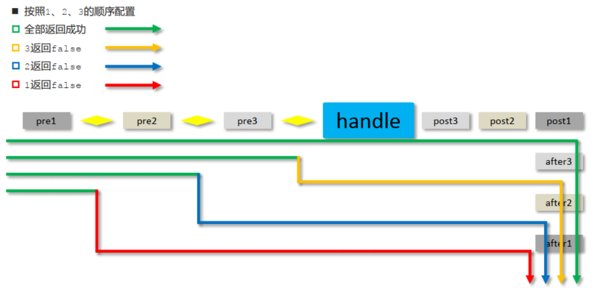

# 1、导入jar包

```xml
  <!--基础web包-->
  <dependency>
    <groupId>javax.servlet</groupId>
    <artifactId>javax.servlet-api</artifactId>
    <version>3.1.0</version>
    <scope>provided</scope>
  </dependency>

  <dependency>
    <groupId>org.springframework</groupId>
    <artifactId>spring-webmvc</artifactId>
    <version>5.2.10.RELEASE</version>
  </dependency>

  <!--JSON转换-->
  <dependency>
    <groupId>com.fasterxml.jackson.core</groupId>
    <artifactId>jackson-databind</artifactId>
    <version>2.9.0</version>
  </dependency>
</dependencies>

<!--Tomcat-->
<build>
  <plugins>
    <plugin>
      <groupId>org.apache.tomcat.maven</groupId>
      <artifactId>tomcat7-maven-plugin</artifactId>
      <version>2.1</version>
      <configuration>
        <port>80</port>
        <path>/</path>
        <!--GET请求做中文兼容-->
        <uriEncoding>UTF-8</uriEncoding>
      </configuration>
    </plugin>
  </plugins>
</build>
```

# 2、创建SpringMVCConfig配置类

Note：SpringMvc和Spring

```java
@Configuration
@ComponentScan("com.itheima.controller","com.itheima.config")
@EnableWebMvc
public class SpringMvcConfig {
}
```

## @EnableWebMvc

| 名称 | @EnableWebMvc             |
| ---- | ------------------------- |
| 类型 | **配置类注解**            |
| 位置 | SpringMVC配置类定义上方   |
| 作用 | 开启SpringMVC多项辅助功能 |

## 设置SpringConfig和SpringMvcConfig的加载控制

- 原因：防止Spring和SpringMVC重复加载bean

方式一:修改Spring配置类，设定扫描范围为精准范围。

```java
@Configuration
@ComponentScan({"com.itheima.service","comitheima.dao"})
public class SpringConfig {
}
```

方式二:修改Spring配置类，设定扫描范围为com.itheima,排除掉controller包中的bean

```java
@Configuration
@ComponentScan(value="com.itheima",
    excludeFilters=@ComponentScan.Filter(
    	type = FilterType.ANNOTATION,
        classes = Controller.class
    )
)
public class SpringConfig {
}
```

### @ComponentScan

| 名称     | @ComponentScan                                               |
| -------- | ------------------------------------------------------------ |
| 类型     | 类注解                                                       |
| 位置     | 类定义上方                                                   |
| 作用     | 设置spring配置类扫描路径，用于加载使用注解格式定义的bean     |
| 相关属性 | excludeFilters:排除扫描路径中加载的bean,需要指定类别(type，一般使用ANNOTATION)和具体项(classes)<br/>includeFilters:加载指定的bean，需要指定类别(type，一般使用ANNOTATION)和具体项(classes) |

type属性：设置排除规则，当前使用按照bean定义时的注解类型进行排除

* ANNOTATION：按照注解排除
* ASSIGNABLE_TYPE:按照指定的类型过滤
* ASPECTJ:按照Aspectj表达式排除，基本上不会用
* REGEX:按照正则表达式排除
* CUSTOM:按照自定义规则排除

# 3、创建ServletContainersInitConfig配置类

用于代替web.xml

- 原理性配置，一般不用最终配置方法

```java
public class ServletContainersInitConfig extends AbstractDispatcherServletInitializer {
    //加载springmvc配置类
    protected WebApplicationContext createServletApplicationContext() {
        //初始化WebApplicationContext对象
        AnnotationConfigWebApplicationContext ctx = new AnnotationConfigWebApplicationContext();
        //加载指定配置类
        ctx.register(SpringMvcConfig.class);
        return ctx;
    }

    //设置由springmvc控制器处理的请求映射路径
    protected String[] getServletMappings() {
        return new String[]{"/"};
    }

    //加载spring配置类
    protected WebApplicationContext createRootApplicationContext() {
        return null;
    }
}
```

- ServletContainersInitConfig配置类简化，不用手动`register`对应的配置类

```java
public class ServletContainersInitConfig extends AbstractAnnotationConfigDispatcherServletInitializer {
	 //加载springmvc配置类
    protected Class<?>[] getServletConfigClasses() {
        return new Class[]{SpringMvcConfig.class};
    }
    //设置由springmvc控制器处理的请求映射路径
    protected String[] getServletMappings() {
        return new String[]{"/"};
    }
    //加载spring配置类
    protected Class<?>[] getRootConfigClasses() {
        return new Class[]{SpringConfig.class};
    }

    //对POST请求做中文兼容
    @Override
    protected Filter[] getServletFilters() {
        CharacterEncodingFilter filter = new CharacterEncodingFilter();
        filter.setEncoding("UTF-8");
        return new Filter[]{filter};
    }
}
```

# 4、页面访问映射SpringMvcSupport类

```java
@Configuration
public class SpringMvcSupport extends WebMvcConfigurationSupport {
    //设置静态资源访问过滤，当前类需要设置为配置类，并被扫描加载
    @Override
    protected void addResourceHandlers(ResourceHandlerRegistry registry) {
        //当访问/pages/????时候，从/pages目录下查找内容
        registry.addResourceHandler("/pages/**").addResourceLocations("/pages/");
        registry.addResourceHandler("/js/**").addResourceLocations("/js/");
        registry.addResourceHandler("/css/**").addResourceLocations("/css/");
        registry.addResourceHandler("/plugins/**").addResourceLocations("/plugins/");
    }
}
```

# 5、创建Controller类

```java
//@Controller
//@ResponseBody//Response响应,为所有方法加上@ResponseBody
@RestController //@Controller + @ReponseBody
@RequestMapping("/user")
public class UserController {
    ……   
    @RequestMapping("/commonParam")//普通映射 
    public String getAll(@RequestParam("name")String username,int age)//Request传参
    {
        System.out.println("普通参数传递 name **> "+username);
        System.out.println("普通参数传递 age **> "+age);
        return "{'module':'getAll'}";//Response响应
    }
    ……
}
```

## @RestController

| 名称 | @RestController                                              |
| ---- | ------------------------------------------------------------ |
| 类型 | **类注解**                                                   |
| 位置 | 基于SpringMVC的RESTful开发控制器类定义上方                   |
| 作用 | Controller类遵从Rest风格，等同于@Controller与@ResponseBody两个注解组合功能 |

## RESTful风格映射

* `http://localhost/users`	查询全部用户信息 GET（查询）

```java
//法1：RESTful风格映射
//@RequestMapping(value = "/users" ,method = RequestMethod.GET)
//法2：REST快速开发
@GetMapping 
public String getAll(){}
```


* `http://localhost/users/1`  查询指定用户信息 GET（查询）

```java
//法1：RESTful风格映射
//@RequestMapping(value = "/{id}",method = RequestMethod.GET)
//法2：REST快速开发
@GetMapping("/{id}")
public String getById(@PathVariable Integer id){}
```


* `http://localhost/users`    添加用户信息    POST（新增/保存）

```java
//法1：RESTful风格映射
//@RequestMapping(method = RequestMethod.POST)
//法2：REST快速开发
@PostMapping
public String save(@RequestBody Book book){}
```


* `http://localhost/users`    修改用户信息    PUT（修改/更新）

```java
//法1：RESTful风格映射
//@RequestMapping(method = RequestMethod.PUT)
//法2：REST快速开发
@PutMapping
public String update(@RequestBody Book book){}
```


* `http://localhost/users/1`  删除用户信息    DELETE（删除）

```java
//法1：RESTful风格映射
//@RequestMapping(value = "/{id}",method = RequestMethod.DELETE)
//法2：REST快速开发
@DeleteMapping("/{id}")
public String delete(@PathVariable Integer id){}
```

### 路径通配符

？：匹配一个字符

\*：匹配0到多个字符，如果是在路径中如"/books/*"则是只会到达下一级目录的所有文件，是不包括“/”

\**：任意个字符,在路径如"/books/**",则是包括"/"所以能匹配books包下的所有包

### @RequestMapping

| 名称     | @RequestMapping                 |
| -------- | ------------------------------- |
| 类型     | 类注解或方法注解                |
| 位置     | SpringMVC控制器类或方法定义上方 |
| 作用     | 设置当前控制器方法请求访问路径  |
| 相关属性 | value(默认)，请求访问路径       |

### @GetMapping @PostMapping @PutMapping @DeleteMapping

| 名称     | @GetMapping @PostMapping @PutMapping @DeleteMapping          |
| -------- | ------------------------------------------------------------ |
| 类型     | **方法注解**                                                 |
| 位置     | 基于SpringMVC的RESTful开发控制器方法定义上方                 |
| 作用     | 设置当前控制器方法请求访问路径与请求动作，每种对应一个请求动作，<br/>例如@GetMapping对应GET请求 |
| 相关属性 | value（默认）：请求访问路径                                  |


```java
//@RequestMapping(method = RequestMethod.POST)
@PostMapping
public String save(@RequestBody Book book){
    System.out.println("book save..." + book);
    return "{'module':'book save'}";
}

//@RequestMapping(value = "/{id}",method = RequestMethod.DELETE)
@DeleteMapping("/{id}")
public String delete(@PathVariable Integer id){
    System.out.println("book delete..." + id);
    return "{'module':'book delete'}";
}

//@RequestMapping(method = RequestMethod.PUT)
@PutMapping
public String update(@RequestBody Book book){
    System.out.println("book update..." + book);
    return "{'module':'book update'}";
}

//@RequestMapping(value = "/{id}",method = RequestMethod.GET)
@GetMapping("/{id}")
 public String getById(@PathVariable Integer id){
 	System.out.println("book getById..." + id);
 	return "{'module':'book getById'}";
 }

```

## Request传参

### 来自路径参数

- 简单类型（int, String）

### 来自url地址

- 简单类型（int, String）
- Map类型（Map<String, Object> param）
- POJO数据(User) Note：POJO类型的无需使用@RequestParam

### 来自请求体

- POJO数据(User) 
- 数组类型(int[]) 
- 集合类型(List\<String>）

###  时间类型

- Date类型（Date）Note：可使用**@DateTimeFormat(pattern="yyyy/MM/dd HH:mm:ss")** 进行格式规范

### @RequestParam

| 名称     | @RequestParam                                                |
| -------- | ------------------------------------------------------------ |
| 类型     | 形参注解                                                     |
| 位置     | SpringMVC控制器方法形参定义前面                              |
| 作用     | 一般用于接收**url地址传参**，**表单传参**，绑定请求参数与处理器方法形参间的关系 |
| 相关参数 | required：是否为必传参数 <br/>defaultValue：参数默认值       |

### @RequestBody

| 名称 | @RequestBody                                                 |
| ---- | ------------------------------------------------------------ |
| 类型 | **形参注解**                                                 |
| 位置 | SpringMVC控制器方法形参定义前面                              |
| 作用 | 一般用于用于接收**json数据**，将请求中请求体所包含的数据传递给请求参数，此注解一个处理器方法只能使用一次 |

### @PathVariable

| 名称 | @PathVariable                                                |
| ---- | ------------------------------------------------------------ |
| 类型 | **形参注解**                                                 |
| 位置 | SpringMVC控制器方法形参定义前面                              |
| 作用 | 指定形参来自路径，绑定路径参数与处理器方法形参间的关系，要求路径参数名与形参名一一对应 |

### @DateTimeFormat

| 名称     | @DateTimeFormat                 |
| -------- | ------------------------------- |
| 类型     | **形参注解**                    |
| 位置     | SpringMVC控制器方法形参前面     |
| 作用     | 设定日期时间型数据格式          |
| 相关属性 | pattern：指定日期时间格式字符串 |

## Response响应

    @ResponseBody
    public String toText(){
        System.out.println("返回纯文本数据");
        return "response text";
    }

- 返回页面

无@ResponseBody + return "page.jsp";

- 返回文本

@ResponseBody + return "response text";

- 返回JSON

@ResponseBody + return 对象；

### @ResponseBody

| 名称     | @ResponseBody                                                |
| -------- | ------------------------------------------------------------ |
| 类型     | **方法\类注解**                                              |
| 位置     | SpringMVC控制器方法定义上方和控制类上                        |
| 作用     | 方法/类中所有方法的返回值为字符串，会将其作为文本内容直接响应给前端 <br>方法/类中所有方法的返回值为对象，会将对象转换成JSON响应给前端 |
| 相关属性 | pattern：指定日期时间格式字符串                              |

## **RestTemplate**

RestTemplate提供了多种便捷访问远程Http服务的方法，是一种简单便捷的访问restful服务模板类，是Spring提供的用于访问Rest服务的客户端模板工具集

例如：

- 配置类

```java
@Configuration
public class ApplicationContextConfig {

    @Bean
    @LoadBalanced//使用@LoadBalanced注解赋予RestTemplate负载均衡的能力
    public RestTemplate restTemplate(){
        return new RestTemplate();
    }
}
```

- 使用类

```java
restTemplate.postForObject(PAYMENT_URL+"/payment/create",payment,CommonResult.class);

restTemplate.getForObject(PAYMENT_URL+"/payment/get/"+id,CommonResult.class);
```

使用：

- 使用restTemplate访问restful接口非常的简单粗暴无脑。
- `(url, requestMap, ResponseBean.class)`这三个参数分别代表。
- REST请求地址、请求参数、HTTP响应转换被转换成的对象类型。

# 6、统一处理

## 统一前后端交换处理

- 建立规范返回类Result

```java
public class Result{
    //描述统一格式中的数据
    private Object data;
    //描述统一格式中的编码，用于区分操作，可以简化配置0或1表示成功失败
    private Integer code;
    //描述统一格式中的消息，可选属性
    private String msg;
    ……
}
```

- 建立格式编码类Code,对成功、失败及异常进行统一编码

## 定义系统异常类(SystemException)及业务异常类(BusinessException)

```java
public class BusinessException extends RuntimeException{
    private Integer code;

    public Integer getCode() {
        return code;
    }

    public void setCode(Integer code) {
        this.code = code;
    }

    public BusinessException(Integer code, String message) {
        super(message);
        this.code = code;
    }

    public BusinessException(Integer code, String message, Throwable cause) {
        super(message, cause);
        this.code = code;
    }

}
```

## 将其他异常包装为系统异常类或业务异常类抛出

* 方式一:`try{}catch(){}`在catch中重新throw我们自定义异常即可。
* 方式二:直接throw自定义异常即可

## 处理器类（controller）中处理系统异常类及业务异常类

```java
//@RestControllerAdvice用于标识当前类为REST风格对应的异常处理器
@RestControllerAdvice
public class ProjectExceptionAdvice {
    //@ExceptionHandler用于设置当前处理器类对应的异常类型
    @ExceptionHandler(SystemException.class)
    public Result doSystemException(SystemException ex){
        //记录日志
        //发送消息给运维
        //发送邮件给开发人员,ex对象发送给开发人员
        return new Result(ex.getCode(),null,ex.getMessage());
    }

    @ExceptionHandler(BusinessException.class)
    public Result doBusinessException(BusinessException ex){
        return new Result(ex.getCode(),null,ex.getMessage());
    }

    //除了自定义的异常处理器，保留对Exception类型的异常处理，用于处理非预期的异常
    @ExceptionHandler(Exception.class)
    public Result doOtherException(Exception ex){
        //记录日志
        //发送消息给运维
        //发送邮件给开发人员,ex对象发送给开发人员
        return new Result(Code.SYSTEM_UNKNOW_ERR,null,"系统繁忙，请稍后再试！");
    }
}
```

## @RestControllerAdvice

| 名称 | @RestControllerAdvice              |
| ---- | ---------------------------------- |
| 类型 | **类注解**                         |
| 位置 | Rest风格开发的控制器增强类定义上方 |
| 作用 | 为Rest风格开发的控制器类做增强     |

**说明:**此注解自带@ResponseBody注解与@Component注解，具备对应的功能

## @ExceptionHandler

| 名称 | @ExceptionHandler                                            |
| ---- | ------------------------------------------------------------ |
| 类型 | **方法注解**                                                 |
| 位置 | 专用于异常处理的控制器方法上方                               |
| 作用 | 设置指定异常的处理方案，功能等同于控制器方法，<br/>出现异常后终止原始控制器执行,并转入当前方法执行 |

**说明：**此类方法可以根据处理的异常不同，制作多个方法分别处理对应的异常

# 7、拦截器

## 创建拦截器类Interceptor

```java
@Component
public class ProjectInterceptor implements HandlerInterceptor {

    @Override
    public boolean preHandle(HttpServletRequest request, HttpServletResponse response, Object handler) throws Exception {
        return true;
    }

    @Override
    public void postHandle(HttpServletRequest request, HttpServletResponse response, Object handler, ModelAndView modelAndView) throws Exception {

    }

    @Override
    public void afterCompletion(HttpServletRequest request, HttpServletResponse response, Object handler, Exception ex) throws Exception {

    }
}
```



* request:请求对象
* response:响应对象
* handler:被调用的处理器对象，本质上是一个方法对象，对反射中的Method对象进行了再包装
* modelAndView:如果处理器执行完成具有返回结果，可以读取到对应数据与页面信息，并进行调整，因为咱们现在都是返回json数据，所以该参数的使用率不高。
* ex:如果处理器执行过程中出现异常对象，可以针对异常情况进行单独处理 ，因为我们现在已经有全局异常处理器类，所以该参数的使用率也不高。


## 配置拦截器SpringMvcSupport类

```java
@Configuration
public class SpringMvcSupport extends WebMvcConfigurationSupport {
    @Autowired
    private ProjectInterceptor projectInterceptor;
    
    @Override
    public void addViewControllers(ViewControllerRegistry registry) {
       //配置网址-页面地址映射（这个不是拦截器的配置） 
        registry.addViewController("/toLogin").setViewName("login");
    }
    
    @Override
    protected void addResourceHandlers(ResourceHandlerRegistry registry) {
        //配置网址-静态资源映射（这个不是拦截器的配置）
      registry.addResourceHandler("/pages/**").addResourceLocations("/pages/");
    }

    @Override
    protected void addInterceptors(InterceptorRegistry registry) {
        //配置拦截器
        registry.addInterceptor(projectInterceptor).addPathPatterns("/books","/books/*");
    }
}
```

# 8、过滤器（过滤器属于Servlet）


```java
//拦截路径配置
@WebFilter("/*")
public class FilterDemo implements Filter {

    @Override
    public void doFilter(ServletRequest request, ServletResponse response, FilterChain chain) throws IOException, ServletException {

        //1. 放行前，对 request数据进行处理
        ……
        //放行
        chain.doFilter(request,response);
        //2. 放行后，对Response 数据进行处理
        ……
    }

    @Override
    public void init(FilterConfig filterConfig) throws ServletException {
    }

    @Override
    public void destroy() {
    }
}
```

- 区别filter和Interceptor

技术来源不同： Filter属于Servlet技术， Interceptor属于SpringMVC技术
拦截内容不同：Filter对所有的访问都将会进行拦截，Interceptor只是对springmvc的访问进行拦截或者说是方法增强。
其实不管是过滤器还是拦截器都是使用了AOP的思想来实现对请求的拦截。