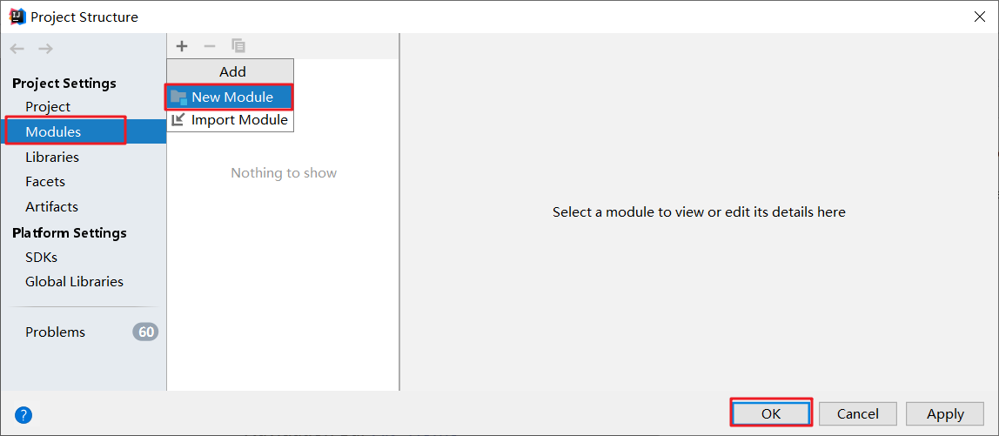
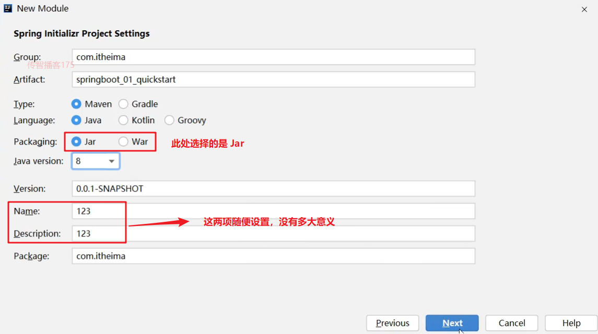
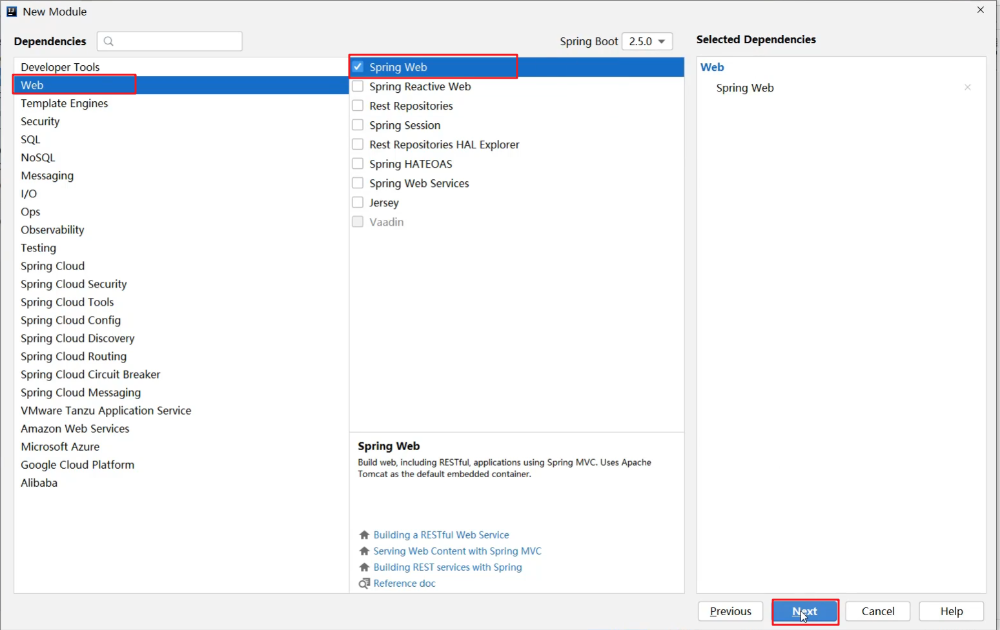
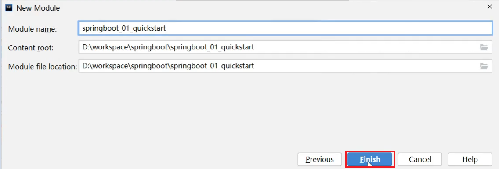
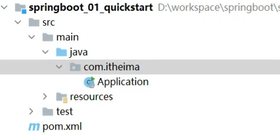

# 问题解决jdk版本问题

1. setting ==>编译器 ==>java编译器
2. 编辑运行/调试配置 ==>编辑配置
3. 项目结构 ==> 模块 ==> 源、依赖

# SpringBoot快速构建

* 点击 `+` 选择 `New Module` 创建新模块



* 选择 `Spring Initializr` ，用来创建 `SpringBoot` 工程

  以前我们选择的是 `Maven` ，今天选择 `Spring Initializr` 来快速构建 `SpringBoot` 工程。而在 `Module SDK` 这一项选择我们安装的 `JDK` 版本。


* 对 `SpringBoot` 工程进行相关的设置

  我们使用这种方式构建的 `SpringBoot` 工程其实也是 `Maven` 工程，而该方式只是一种快速构建的方式而已。

  

  > **注意：打包方式这里需要设置为 `Jar`**

* 选中 `Web`，然后勾选 `Spring Web`

  由于我们需要开发一个 `web` 程序，使用到了 `SpringMVC` 技术，所以按照下图红框进行勾选



* 下图界面不需要任何修改，直接点击 `Finish` 完成 `SpringBoot` 工程的构建



经过以上步骤后就创建了如下结构的模块，它会帮我们自动生成一个 `Application` 类，而该类一会再启动服务器时会用到



# pom.xml

**starter**

* `SpringBoot` 中常见项目名称，定义了当前项目使用的所有项目坐标，以达到减少依赖配置的目的

**parent**

* 所有 `SpringBoot` 项目要继承的项目，定义了若干个坐标版本号（依赖管理，而非依赖），以达到减少依赖冲突的目的

* `spring-boot-starter-parent`（2.5.0）与 `spring-boot-starter-parent`（2.4.6）共计57处坐标版本不同

**实际开发**

* 使用任意坐标时，仅书写GAV中的G和A，V由SpringBoot提供

  > G：groupid
  >
  > A：artifactId
  >
  > V：version

* 如发生坐标错误，再指定version（要小心版本冲突）

# 配置文件

## 多环境配置

### application.properties

#### 多文件版

**主配置文件**

```properties
spring.profiles.active=pro
```

**环境配置文件**

**application-pro.properties**

```properties
server.port=80
```

**application-dev.properties**

```properties
server.port=81
```

### application.yaml/application.yml

#### 单一文件版

```yaml
spring:
	config:
    	activate:
        	on-profile: pro
---
spring:
	profiles: pro
server:
	port: 80
---
spring:
	profiles: dev
server:
	port: 81
---
spring:
	profiles: test
server:
	port: 82
```

#### 多文件版

**主配置文件**

```yaml
spring:
	profiles:
		active: pro		# 启动pro
```

**环境配置文件**

**application-pro.yaml**

```yaml
server:
	port: 80
```

**application-dev.yaml**

```yaml
server:
	port: 81
```

## 配置文件优先级

### 位置优先

1. file ：config/application.yml **【最高】**（file指的是和打包的jar在同一目录下的文件）
2. file ：application.yml
3. classpath：config/application.yml（classpath指在resource下的文件）
4. classpath：application.yml  **【最低】**

### 类型优先

**`application.properties`  >  `application.yml`   >  `application.yaml`**

## 配置文件读取

### 使用 @Value注解注入对应数据

```
@RestController
@RequestMapping("/books")
public class BookController {
    
    @Value("${lesson}")
    private String lesson;
    @Value("${server.port}")
    private Integer port;
    @Value("${enterprise.subject[0]}")
    private String subject_00;

}
```

###  使用Environment对象+@Autowired读取所有数据

```java
@RestController
@RequestMapping("/books")
public class BookController {
    
    @Autowired
    private Environment env;
    
}
```

### 自定义实体类@ConfigurationProperties+@Autowired读取对应数据

`SpringBoot` 还提供了将配置文件中的数据封装到我们自定义的实体类对象中的方式。具体操作如下：

* 将实体类 `bean` 的创建交给 `Spring` 管理。

  在类上添加 `@Component` 注解

* 使用 `@ConfigurationProperties` 注解表示加载配置文件

  在该注解中也可以使用 `prefix` 属性指定只加载指定前缀的数据

**具体代码如下：**

`Enterprise` 实体类内容如下：

```java
@Component
@ConfigurationProperties(prefix = "enterprise")
public class Enterprise {
    private String name;
    private int age;
    private String tel;
    private String[] subject;
	……
}
```

`BookController` 内容如下：

```java
@RestController
@RequestMapping("/books")
public class BookController {
    
    @Autowired
    private Enterprise enterprise;

}
```

#### 宽松绑定

@ConfigurationProperties绑定属性时支持属性名宽松绑定

- 即就是在进行匹配时，配置中的名称要去掉中划线和下划线后，忽略大小写的情况下去与java代码中的属性名进行忽略大小写的等值匹配。
- 但是prefix对应的内容必须使用烤肉串(kebab)模式(case)，即使用-分隔

#### 计量单位类型

**Duration**：表示时间间隔，可以通过@DurationUnit注解描述时间单位，例如上例中描述的单位为小时（ChronoUnit.HOURS）

**DataSize**：表示存储空间，可以通过@DataSizeUnit注解描述存储空间单位，例如上例中描述的单位为MB（DataUnit.MEGABYTES）

```JAVA
@Component
@Data
@ConfigurationProperties(prefix = "servers")
public class ServerConfig {
    @DurationUnit(ChronoUnit.HOURS)
    private Duration serverTimeOut;
    @DataSizeUnit(DataUnit.MEGABYTES)
    private DataSize dataSize;
}

```

#### 数据合法性校验

例如校验是否超过上限和下限

**步骤①**：开启校验框架

```xml
<!--1.导入JSR303规范-->
<dependency>
    <groupId>javax.validation</groupId>
    <artifactId>validation-api</artifactId>
</dependency>
<!--使用hibernate框架提供的校验器做实现-->
<dependency>
    <groupId>org.hibernate.validator</groupId>
    <artifactId>hibernate-validator</artifactId>
</dependency>
```

**步骤②**：在需要开启校验功能的类上使用注解@Validated开启校验功能

**步骤③**：对具体的字段设置校验规则

```JAVA
@Component
@Data
@ConfigurationProperties(prefix = "servers")
//开启对当前bean的属性注入校验
@Validated
public class ServerConfig {
    //设置具体的规则
    @Max(value = 8888,message = "最大值不能超过8888")
    @Min(value = 202,message = "最小值不能低于202")
    private int port;
}
```

​	

# 热部署

## 手动启动热部署

**步骤①**：导入开发者工具对应的坐标

```XML
<dependency>
    <groupId>org.springframework.boot</groupId>
    <artifactId>spring-boot-devtools</artifactId>
    <optional>true</optional>
</dependency>
```

**步骤②**：构建项目，可以使用快捷键激活此功能


​		对应的快捷键一定要记得

```CMD
<CTR>L+<F9>
```

## 自动启动热部署

​		自动热部署其实就是设计一个开关，打开这个开关后，IDE工具就可以自动热部署。因此这个操作和IDE工具有关，以下以idea为例设置idea中启动热部署

**步骤①**：设置自动构建项目

​		打开【File】，选择【settings...】,在面板左侧的菜单中找到【Compile】选项，然后勾选【Build project automatically】，意思是自动构建项目


​		自动构建项目选项勾选后

**步骤②**：允许在程序运行时进行自动构建

​		使用快捷键【Ctrl】+【Alt】+【Shit】+【/】打开维护面板，选择第1项【Registry...】


​		在选项中搜索comple，然后勾选对应项即可


​		这样程序在运行的时候就可以进行自动构建了，实现了热部署的效果。

## 热部署的文件范围配置

```yaml
spring:
  devtools:
    restart:
      # 设置不参与热部署的文件或文件夹
      exclude: static/**,public/**,config/application.yml
```

## 关闭热部署

```yaml
spring:
  devtools:
    restart:
      enabled: false
```

# 测试

## 加载测试专用属性

### 临时属性

```java
@SpringBootTest(properties = {"test.prop=testValue1"})
public class PropertiesAndArgsTest {

    @Value("${test.prop}")
    private String msg;
    
}
```

### 临时参数

```JAVA
@SpringBootTest(args={"--test.prop=testValue2"})
public class PropertiesAndArgsTest {
    
    @Value("${test.prop}")
    private String msg;
    
}
```

### 测试专用配置类

与其他配置类的使用方法一致

## web环境模拟测试

### 使用web环境

```JAVA
@SpringBootTest(webEnvironment = SpringBootTest.WebEnvironment.RANDOM_PORT)
public class WebTest {	
}
```

- MOCK：根据当前设置确认是否启动web环境，例如使用了Servlet的API就启动web环境，属于适配性的配置
- DEFINED_PORT：使用自定义的端口作为web服务器端口
- RANDOM_PORT：使用随机端口作为web服务器端口
- NONE：不启动web环境

### web环境请求结果比对

​		上一节已经在测试用例中成功的模拟出了web环境，并成功的发送了web请求，本节就来解决发送请求后如何比对发送结果的问题。其实发完请求得到的信息只有一种，就是响应对象。至于响应对象中包含什么，就可以比对什么。常见的比对内容如下：

#### 响应状态匹配

```JAVA
@Test
void testStatus(@Autowired MockMvc mvc) throws Exception {
    MockHttpServletRequestBuilder builder = MockMvcRequestBuilders.get("/books");
    ResultActions action = mvc.perform(builder);
    //设定预期值 与真实值进行比较，成功测试通过，失败测试失败
    //定义本次调用的预期值
    StatusResultMatchers status = MockMvcResultMatchers.status();
    //预计本次调用时成功的：状态200
    ResultMatcher ok = status.isOk();
    //添加预计值到本次调用过程中进行匹配
    action.andExpect(ok);
}
```

#### 响应体匹配（非json数据格式）

```JAVA
@Test
void testBody(@Autowired MockMvc mvc) throws Exception {
    MockHttpServletRequestBuilder builder = MockMvcRequestBuilders.get("/books");
    ResultActions action = mvc.perform(builder);
    //设定预期值 与真实值进行比较，成功测试通过，失败测试失败
    //定义本次调用的预期值
    ContentResultMatchers content = MockMvcResultMatchers.content();
    ResultMatcher result = content.string("springboot2");
    //添加预计值到本次调用过程中进行匹配
    action.andExpect(result);
}
```

#### 响应体匹配（json数据格式，开发中的主流使用方式）

```JAVA
@Test
void testJson(@Autowired MockMvc mvc) throws Exception {
    MockHttpServletRequestBuilder builder = MockMvcRequestBuilders.get("/books");
    ResultActions action = mvc.perform(builder);
    //设定预期值 与真实值进行比较，成功测试通过，失败测试失败
    //定义本次调用的预期值
    ContentResultMatchers content = MockMvcResultMatchers.content();
    ResultMatcher result = content.json("{\"id\":1,\"name\":\"springboot2\",\"type\":\"springboot\"}");
    //添加预计值到本次调用过程中进行匹配
    action.andExpect(result);
}
```

#### 响应头信息匹配

```JAVA
@Test
void testContentType(@Autowired MockMvc mvc) throws Exception {
    MockHttpServletRequestBuilder builder = MockMvcRequestBuilders.get("/books");
    ResultActions action = mvc.perform(builder);
    //设定预期值 与真实值进行比较，成功测试通过，失败测试失败
    //定义本次调用的预期值
    HeaderResultMatchers header = MockMvcResultMatchers.header();
    ResultMatcher contentType = header.string("Content-Type", "application/json");
    //添加预计值到本次调用过程中进行匹配
    action.andExpect(contentType);
}
```

## 其他

### 测试事务自动回滚

只要注解@Transactional出现的位置存在注解@SpringBootTest，springboot就会认为这是一个测试程序，无需提交事务，所以也就可以避免事务的提交。

### 随机测试数据

```yaml
testcase:
  book:
    id: ${random.int}
    id2: ${random.int(10)}
    type: ${random.int!5,10!}
    name: ${random.value}
    uuid: ${random.uuid}
    publishTime: ${random.long}
```

# 技术整合

## JUnit

- pom.xml

```xml
<dependency>
    <groupId>org.springframework.boot</groupId>
    <artifactId>spring-boot-starter-test</artifactId>
    <scope>test</scope>
</dependency>
<dependency>
    <groupId>org.junit.jupiter</groupId>
    <artifactId>junit-jupiter</artifactId>
    <version>RELEASE</version>
    <scope>test</scope>
</dependency>
```

- 使用类

```JAVA
@SpringBootTest
class Springboot04JunitApplicationTests {
    //注入你要测试的对象
    @Autowired
    private BookDao bookDao;
    @Test
    void contextLoads() {
        //执行要测试的对象对应的方法
        bookDao.save();
        System.out.println("two...");
    }
}
```

## SQL

### Druid（数据源技术）

- pom.xml

```xml
    <dependency>
        <groupId>com.alibaba</groupId>
        <artifactId>druid-spring-boot-starter</artifactId>
        <version>1.2.6</version>
    </dependency>
```

- application.yml

```YAML
spring:
  datasource:
    druid:
      driver-class-name: com.mysql.cj.jdbc.Driver
      url: jdbc:mysql://localhost:3306/ssm_db?serverTimezone=UTC
      username: root
      password: root
```

### mybatis（持久化技术）

- pom.xml

```xml
    <dependency>
        <groupId>org.mybatis</groupId>
        <artifactId>mybatis</artifactId>
        <version>3.5.6</version>
    </dependency>
    <!--1.导入mybatis与spring整合的jar包-->
    <dependency>
        <groupId>org.mybatis</groupId>
        <artifactId>mybatis-spring</artifactId>
        <version>1.3.0</version>
    </dependency>
```

- MybatisConfig类

```java
//定义mybatis专用的配置类
@Configuration
public class MyBatisConfig {
//    定义创建SqlSessionFactory对应的bean
    @Bean
    public SqlSessionFactoryBean sqlSessionFactory(DataSource dataSource){
        //SqlSessionFactoryBean是由mybatis-spring包提供的，专用于整合用的对象
        SqlSessionFactoryBean sfb = new SqlSessionFactoryBean();
        //设置数据源替代原始配置中的environments的配置
        sfb.setDataSource(dataSource);
        //设置类型别名替代原始配置中的typeAliases的配置
        sfb.setTypeAliasesPackage("com.itheima.domain");
        return sfb;
    }
//    定义加载所有的映射配置
    @Bean
    public MapperScannerConfigurer mapperScannerConfigurer(){
        MapperScannerConfigurer msc = new MapperScannerConfigurer();
        msc.setBasePackage("com.itheima.dao");
        return msc;
    }

}
```

### mybatis-plus(持久化技术)

- pom.xml

```xml
<dependency>
    <groupId>com.baomidou</groupId>
    <artifactId>mybatis-plus-boot-starter</artifactId>
    <version>3.4.3</version>
</dependency>
```

- application.yml

前缀名

```yaml
mybatis-plus:
  global-config:
    db-config:
      table-prefix: tbl_		#设置所有表的通用前缀名称为tbl_
```

### MySQL

## Redis

- pom.xml

```xml
<!-- redis,使用jedis客户端排除lettuce -->
<dependency>
	<groupId>org.springframework.boot</groupId>
	<artifactId>spring-boot-starter-data-redis</artifactId>
	<exclusions>
		<exclusion>
			<groupId>io.lettuce</groupId>
			<artifactId>lettuce-core</artifactId>
		</exclusion>
	</exclusions>
</dependency>
<dependency>
	<groupId>redis.clients</groupId>
	<artifactId>jedis</artifactId>
</dependency>
```

-  application.yml

```yaml
spring:
  redis:
    host: localhost
    port: 6379
    client-type: jedis
```

- 使用类

**RedisTemplate**

```java
@SpringBootTest
class Springboot16RedisApplicationTests {
    @Autowired
    private RedisTemplate redisTemplate;
    @Test
    void set() {
        ValueOperations ops = redisTemplate.opsForValue();
        ops.set("age",41);
    }

}
```

Note：StringRedisTemplate等价于RedisTemplate<Spring, Spring>

## redisson（分布式锁）

```xml
<dependency>
    <groupId>org.redisson</groupId>
    <artifactId>redisson</artifactId>
    <version>3.12.0</version>
</dependency>
```

## web服务器（默认为tomcat）

```xml
<dependency>
    <groupId>org.springframework.boot</groupId>
    <artifactId>spring-boot-starter-web</artifactId>
</dependency>
```

