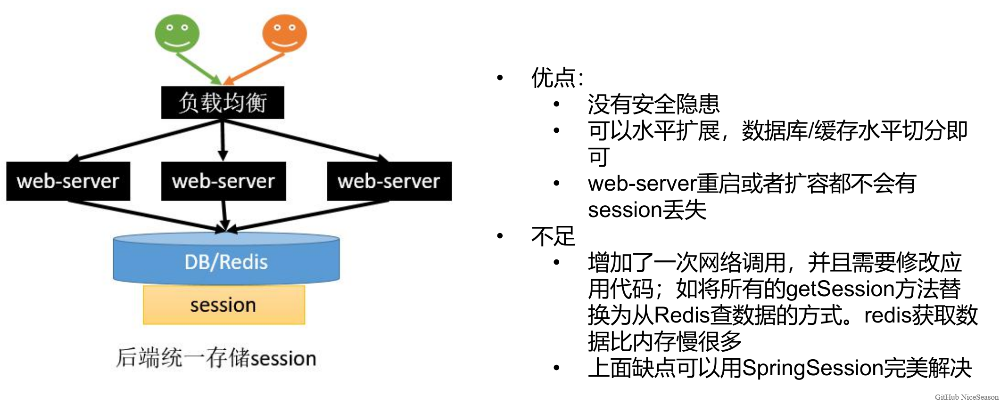

# 运行谷粒商城的步骤

1、vscode打开E:\code\renren\renren-fast-vue运行npm run dev

2、打开centos

3、打开nacos、sentinel（java -jar sentinel-dashboard-1.6.3.jar）

4、运行renrenrenren-fast

5、运行其他模块

6、打开baidu.com可看到客户端界面

7、其他界面

nacos:

http://localhost:8848/

rabbitmq:(密码：guest)

http://192.168.200.120:15672/

kibana:

http://192.168.200.120:5601/

sentinel:（密码：sentinel）

http://localhost:8080/

1、2、3、4、5、6、7、8、9、10、12、13、14、17、18、19、21

[谷粒商城笔记 + 完整代码 + 课件资料（基础篇）（学习记录）_谷粒商城资料-CSDN博客](https://blog.csdn.net/weixin_44190665/article/details/121043585?ops_request_misc=%7B%22request%5Fid%22%3A%22169165864316800188564174%22%2C%22scm%22%3A%2220140713.130102334..%22%7D&request_id=169165864316800188564174&biz_id=0&utm_medium=distribute.pc_search_result.none-task-blog-2~all~top_positive~default-1-121043585-null-null.142^v92^insert_down1&utm_term=谷粒商城&spm=1018.2226.3001.4187)

[03、获取分类属性分组 - 谷粒商城 - 易文档 (easydoc.net)](https://easydoc.net/s/78237135/ZUqEdvA4/OXTgKobR)

[【谷粒商城】框架扩充篇(3/4)_"ctg-data=\"14,20"-CSDN博客](https://blog.csdn.net/hancoder/article/details/107612746)

[【谷粒商城】【rabbitMQ】笔记-CSDN博客](https://blog.csdn.net/hancoder/article/details/114297652)

# 配置虚拟机和主机IP映射一致

1、查看window中ipconfig中VMnet8的地址为192.168.200.1


否则设置网络和Internet/高级网络配置中Vmnet8的IP地址


2、设置虚拟机IP地址


# 修改hosts域名映射却不生效

这是由于clash的bug造成的，将设置 -> 网络和Internet -> 代理 -> 手动设置代理（关掉它），后将clash关闭即可，但是为了方便翻墙本项目将所有\*.gulimall.com的域名改为\*.baidu.com（但是有些域名还是会失效，如client1.baidu.com，此时必须手动把代理服务器关掉才行）

# 跨域问题

[【Java】Java中解决跨域问题的几种方法（建议收藏）_java 跨域-CSDN博客](https://blog.csdn.net/u011397981/article/details/131793685)

1、什么是跨域问题？

指的是`浏览器`不能执行其他网站的脚本，它是由浏览器的同源策略造成的，是浏览器对javascript施加的安全限制。

`同源策略`：是指协议，域名，端口都要相同，其中有一个不同都会产生跨域问题

2、跨域的流程

跨域请求的实现是通过预检请求实现的，先发送一个OPSTIONS探路，收到响应允许跨域后再发送真实请求

3、解决办法1：使用nginx部署为同一域


解决方法2: 配置当次请求允许跨域（实际使用)

- Access-Control-Allow-Origin ： 支持哪些来源的请求跨域

- Access-Control-Allow-Method ： 支持那些方法跨域

- Access-Control-Allow-Credentials ：跨域请求默认不包含cookie，设置为true可以包含cookie

- Access-Control-Expose-Headers ： 跨域请求暴露的字段
  - CORS请求时，XMLHttpRequest对象的getResponseHeader()方法只能拿到6个基本字段：
    Cache-Control、Content-Language、Content-Type、Expires、Last-Modified、Pragma
    如果想拿到其他字段，就必须在Access-Control-Expose-Headers里面指定。
- Access-Control-Max-Age ：表明该响应的有效时间为多少秒。在有效时间内，浏览器无须为同一请求再次发起预检请求。请注意，浏览器自身维护了一个最大有效时间，如果该首部字段的值超过了最大有效时间，将失效。

5、用方法2解决跨域问题： 配置filter，每个请求来了以后，返回给浏览器之前都添加上那些字段

在gulimall-gateway中新建配置类

```java
@Configuration
public class GulimallCorsConfiguration {
    @Bean
    public CorsWebFilter corsWebFilter(){
        UrlBasedCorsConfigurationSource source = new UrlBasedCorsConfigurationSource();

        CorsConfiguration corsConfiguration= new CorsConfiguration();
        //1、配置跨域
        // 允许跨域的头
        corsConfiguration.addAllowedHeader("*");
        // 允许跨域的请求方式
        corsConfiguration.addAllowedMethod("*");
        // 允许跨域的请求来源
        corsConfiguration.addAllowedOrigin("*");
        // 是否允许携带cookie跨域
        corsConfiguration.setAllowCredentials(true);

        // 任意url都要进行跨域配置
        source.registerCorsConfiguration("/**",corsConfiguration);
        return new CorsWebFilter(source);

    }
}
```

6、注释掉renren-fast/src/main/java/io.renren/config/CorsConfig之中的跨域


# 逻辑删除

1、配置统一的全局规则（可以省略）

```yaml
mybatis-plus:
  mapper-locations: classpath:/mapper/**/*.xml
  global-config:
    db-config:
      logic-delete-value: 1 #逻辑删除的对应值
      logic-not-delete-value: #逻辑未删除的对应值
```

2、给对应的属性加上TableLogic注解

```java
@TableLogic(value = "1", delval = "0")
private Integer showStatus;
```


# 配置日志显示sql语句

```yaml
#配置日志级别，在该级别下日志会打印调用的sql语句
logging:
  level:
    com.atguigu.gulimall: debug
```


 # 后端校验JSR303

1、对需要进行校验数据添加注解

- NotBlank注解通常用于验证String类型的字段或参数是否不能为空。如果字符串（trim 之后）为空，也不符合条件
- NotNull注解用于验证集合或数组中是否存在非空的元素。它检查集合的大小不为零
- 在common中新建valid包，里面新建两个空接口`AddGroup`,`UpdateGroup`用来分组
- ListValuez注解为自定义注解，详见3

```java
@Data
@TableName("pms_brand")
public class BrandEntity implements Serializable {
	private static final long serialVersionUID = 1L;

	/**
	 * 品牌id
	 */
	@NotNull(message = "修改必须指定品牌id",groups = {UpdateGroup.class})
	@Null(message = "新增不能指定id",groups = {AddGroup.class})
	@TableId
	private Long brandId;
	/**
	 * 品牌名
	 */
	@NotBlank(message = "品牌名必须提交",groups = {AddGroup.class,UpdateGroup.class})//
	private String name;
	/**
	 * 品牌logo地址
	 */
	@NotBlank(groups = {AddGroup.class})
	@URL(message = "logo必须是一个合法的url地址",groups={AddGroup.class,UpdateGroup.class})
	private String logo;
	/**
	 * 介绍
	 */
	private String descript;
	/**
	 * 显示状态[0-不显示；1-显示]
	 */
	@NotNull(groups = {AddGroup.class, UpdateStatusGroup.class})
	@ListValue(vals={0,1},groups = {AddGroup.class, UpdateStatusGroup.class})
	private Integer showStatus;
	/**
	 * 检索首字母
	 */
	@NotEmpty(groups={AddGroup.class})
	@Pattern(regexp="^[a-zA-Z]$",message = "检索首字母必须是一个字母",groups={AddGroup.class,UpdateGroup.class})
	private String firstLetter;
	/**
	 * 排序
	 */
	@NotNull(groups={AddGroup.class})
	@Min(value = 0,message = "排序必须大于等于0",groups={AddGroup.class,UpdateGroup.class})
	private Integer sort;

}
```

2、进行统一异常管理

```java
@RestControllerAdvice(basePackages = "com.xmh.gulimall.product.controller")
public class GulimallExceptionControllerAdvice {

    //对该类型的异常进行处理
    @ExceptionHandler(value = MethodArgumentNotValidException.class)
    public R handleVaildException(MethodArgumentNotValidException e){
        BindingResult bindingResult = e.getBindingResult();
        Map<String, String> errorMap = new HashMap<>();
        bindingResult.getFieldErrors().forEach((fieldError)->{
            errorMap.put(fieldError.getField(), fieldError.getDefaultMessage());
        });

        return R.error(BizCodeEnume.VALID_EXCEPTION.getCode(),BizCodeEnume.VALID_EXCEPTION.getMsg()).put("data", errorMap);
    }

    //处理全局异常
    @ExceptionHandler(value = Throwable.class)
    public R handleException(Throwable throwable){
        return R.error(BizCodeEnume.UNKNOW_EXEPTION.getCode(), BizCodeEnume.UNKNOW_EXEPTION.getMsg());
    }

}
```

3、自定义校验注解

- 导入包

```xml
        <dependency>
            <groupId>javax.validation</groupId>
            <artifactId>validation-api</artifactId>
            <version>2.0.1.Final</version>
        </dependency>
```

- 自定义校验注解

```java
@Documented
@Constraint(validatedBy = { ListValueConstraintValidator.class })//指定校验器
@Target({ METHOD, FIELD, ANNOTATION_TYPE, CONSTRUCTOR, PARAMETER, TYPE_USE })
@Retention(RUNTIME)
public @interface ListValue {
    String message() default "{com.atguigu.common.valid.ListValue.message}";

    Class<?>[] groups() default { };

    Class<? extends Payload>[] payload() default { };

    int[] vals() default { };
}
```

- 新建配置文件`ValidationMessages.properties`保存注解信息

```properties
com.xmh.common.valid.ListValue.message=必须提交指定的值
```

- 自定义校验器

```java
public class ListValueConstraintValidator implements ConstraintValidator<ListValue,Integer> {

    private Set<Integer> set = new HashSet<>();
    //初始化方法
    @Override
    public void initialize(ListValue constraintAnnotation) {

        int[] vals = constraintAnnotation.vals();
        for (int val : vals) {
            set.add(val);
        }

    }

    //判断是否校验成功

    /**
     *
     * @param value 需要校验的值
     * @param context
     * @return
     */
    @Override
    public boolean isValid(Integer value, ConstraintValidatorContext context) {

        return set.contains(value);
    }
}
```

4、对指定属性（brand）使用指定分组（AddGroup.class）进行校验

- 使用`@Valid`注解可使用全部校验规则

```java
@RequestMapping("/save")
public R save(@Validated(AddGroup.class) @RequestBody BrandEntity brand){
    brandService.save(brand);

    return R.ok();
}
```


# 分页查询

1、设置分页拦截器

这个拦截器MP已经为我们提供好了，我们只需要将其配置成Spring管理的bean对象即可。

```java
@Configuration
@EnableTransactionManagement
@MapperScan("com.atguigu.gulimall.product.dao")
public class MyBatisConfig {

    @Bean
    public PaginationInterceptor paginationInterceptor(){
        //1 创建MybatisPlusInterceptor拦截器对象
        PaginationInterceptor paginationInterceptor=new PaginationInterceptor();
        //设置请求页大于最大页后的操作，true调回首页，false继续请求
        paginationInterceptor.setOverflow(true);
        //设置最大单页限制数量
        paginationInterceptor.setLimit(1000);
        return paginationInterceptor;
    }
}
```

2、使用封装的Query类完成Page对象的构造（IPage是Page的接口类）

3、使用Page对象和QueryWrapper对象构造带约束条件的Page对象

```java
QueryWrapper<AttrGroupEntity> qw = new QueryWrapper();
if (!StringUtils.isEmpty(key)){
    qw.eq("catelog_id", cateLogId)
        .and((obj) -> obj.eq("attr_group_id", key).or().like("attr_group_id", key));
}
IPage<AttrGroupEntity> page = this.page(new Query<AttrGroupEntity>().getPage(params), qw);
```

3、使用封装的PageUtils将Page对象抽取构造为匹配前端交互规则的对象）

Note1：Page分页器由MyBatisPlus提供

Note2：直接构造Page的过程

```java
Page<entity> page = new Page<>(curPage, limit);
Page<entity> page1 = page.addOrder(OrderItem.asc(orderField));
//service中使用
IPage<entity> page2 = this.page(page1, QueryWrapper)
//dao中使用  
IPage<entity> page2 = this.selectPage(page1, QueryWrapper)
```


# 自动填充字段

1、标记自动填充字段及对应规则

	/**
	 * 创建日期
	 */
	@TableField(fill = FieldFill.INSERT)
	private Date createTime;
	/**
	 * 更新日期
	 */
	@TableField(fill = FieldFill.INSERT_UPDATE)
	private Date updateTime;
2、新建MyMetaObjectHandlerl类规定对应规则

```java
@Component // 一定不要忘记把处理器加到IOC容器中！
public class MyMetaObjectHandler implements MetaObjectHandler {
    // 插入时的填充策略
    @Override
    public void insertFill(MetaObject metaObject) {
        log.info("start insert fill.....");
        // setFieldValByName(String fieldName, Object fieldVal, MetaObject
        this.setFieldValByName("createTime",new Date(),metaObject);
        this.setFieldValByName("updateTime",new Date(),metaObject);
    }
    // 更新时的填充策略
    @Override
    public void updateFill(MetaObject metaObject) {
        log.info("start update fill.....");
        this.setFieldValByName("updateTime",new Date(),metaObject);
    }
}
```

3、配置写入的格式

```yaml
#配置输出日期格式   
jackson:
  date-format: yyyy-MM-dd:mm:ss
```


# 全局规范统一

## 全局统一返回

```java
public class R extends HashMap<String, Object> {
	private static final long serialVersionUID = 1L;

	public R setData(Object data) {
		put("data",data);
		return this;
	}

	//利用fastjson进行反序列化
	public <T> T getData(TypeReference<T> typeReference) {
		Object data = get("data");	//默认是map
		String jsonString = JSON.toJSONString(data);
		T t = JSON.parseObject(jsonString, typeReference);
		return t;
	}

	//利用fastjson进行反序列化
	public <T> T getData(String key,TypeReference<T> typeReference) {
		Object data = get(key);	//默认是map
		String jsonString = JSON.toJSONString(data);
		T t = JSON.parseObject(jsonString, typeReference);
		return t;
	}

	public R() {
		put("code", 0);
		put("msg", "success");
	}
	
	public static R error() {
		return error(HttpStatus.SC_INTERNAL_SERVER_ERROR, "未知异常，请联系管理员");
	}
	
	public static R error(String msg) {
		return error(HttpStatus.SC_INTERNAL_SERVER_ERROR, msg);
	}
	
	public static R error(int code, String msg) {
		R r = new R();
		r.put("code", code);
		r.put("msg", msg);
		return r;
	}

	public static R ok(String msg) {
		R r = new R();
		r.put("msg", msg);
		return r;
	}
	
	public static R ok(Map<String, Object> map) {
		R r = new R();
		r.putAll(map);
		return r;
	}
	
	public static R ok() {
		return new R();
	}

	public R put(String key, Object value) {
		super.put(key, value);
		return this;
	}

	public Integer getCode() {

		return (Integer) this.get("code");
	}

}
```


## 全局异常处理

```Java
@Slf4j
@RestControllerAdvice(basePackages = "com.atguigu.gulimall.product.controller")
public class GulimallExceptionControllerAdvice {
    @ExceptionHandler(value = MethodArgumentNotValidException.class)
    public R handleValidException(MethodArgumentNotValidException e){
        log.error("数据校验错误{}", e.getMessage());
        BindingResult bindingResult = e.getBindingResult();

        Map<String, String> errorMap = new HashMap<>();
        bindingResult.getFieldErrors().forEach(fieldError -> {
            errorMap.put(fieldError.getField(),fieldError.getDefaultMessage());
        });
        return R.error(BizCodeEnum.VAILD_EXCEPTION.getCode(), BizCodeEnum.VAILD_EXCEPTION.getMessage()).put("data", errorMap);
    }

    @ExceptionHandler(value = Throwable.class)
    public R handleValidException(Throwable e){
        return R.error(BizCodeEnum.UNKNOW_EXCEPTION.getCode(), BizCodeEnum.UNKNOW_EXCEPTION.getMessage());
    }
}
```


## 全局状态码枚举

1、异常状态码

```java
public enum BizCodeEnum {

    UNKNOW_EXCEPTION(10000,"系统未知异常"),
    VAILD_EXCEPTION(10001,"参数格式校验失败"),
    TO_MANY_REQUEST(10002,"请求流量过大，请稍后再试"),
    SMS_CODE_EXCEPTION(10002,"验证码获取频率太高，请稍后再试"),
    PRODUCT_UP_EXCEPTION(11000,"商品上架异常"),
    USER_EXIST_EXCEPTION(15001,"存在相同的用户"),
    PHONE_EXIST_EXCEPTION(15002,"存在相同的手机号"),
    NO_STOCK_EXCEPTION(21000,"商品库存不足"),
    LOGINACCT_PASSWORD_EXCEPTION(15003,"账号或密码错误"),
    ;

    private Integer code;

    private String message;

    BizCodeEnum(Integer code, String message) {
        this.code = code;
        this.message = message;
    }

    public Integer getCode() {
        return code;
    }

    public String getMessage() {
        return message;
    }
}
```

2、业务状态码

```java
public enum AttrEnum {
    ATTR_TYPE_BASE(1,"基本属性"),
    ATTR_TYPE_SALE(0,"销售属性");

    private int code;

    private String msg;

    public int getCode() {
        return code;
    }

    public String getMsg() {
        return msg;
    }

    AttrEnum(int code, String msg) {
        this.code = code;
        this.msg = msg;
    }

}
```


# 前端输入输出数据抽取成VO

```java
@Data
public class AttrGroupRelationVo {
    private Long attrId;

    private Long attrGroupId;

}
```


# Object类型强转为List<目标对象类型>

```java
Object data = get("data");
TypeReference<List<SkuHasStockVo>> typeReference = new TypeReference<List<SkuHasStockVo>>() {};		
String jsonString = JSON.toJSONString(data);
T t = JSON.parseObject(jsonString, typeReference);
```

# thymeleaf模板引擎

- 由于 **SpringBoot** 使用了**嵌入式 Servlet 容器**。所以 **JSP** 默认是**不能使用**的。

- 如果需要**服务端页面渲染**，优先考虑使用 模板引擎。

  1、`前后分离模式`： `@RestController `响应JSON数据

  2、`前后不分离模式`：@Controller + Thymeleaf模板引擎


模板引擎页面默认放在 src/main/resources/templates

1、导入依赖

```xml
        <dependency>
            <groupId>org.springframework.boot</groupId>
            <artifactId>spring-boot-starter-thymeleaf</artifactId>
        </dependency>
```

2、进行配置

```yaml
spring:  
  thymeleaf:
    cache: false #开启缓存
    prefix: classpath:/templates/ #配置默认前缀，不配置时默认为classpath:/templates/
    suffix: .html #配置默认后缀，不配置时默认为.html
```

3、配置访问映射

```java
    @GetMapping(value = {"/","index.html"})
    private String indexPage(Model model) {

        //1、查出所有的一级分类
        List<CategoryEntity> categoryEntities = categoryService.getLevel1Categorys();
        model.addAttribute("categories",categoryEntities);

        return "login";//将数据转给thymeleaf，thymeleaf会加上前缀和后缀
    }
```

4、前端使用thymeleaf进行数据的调用

# resources资源分离

1、mapper下存放dao的映射文件xml，在这些xml文写具体的sql语句

2、static放静态资源，如img、css、js等

3、templates存放页面，即html

4、配置文件application.properties、application.yml、bootstrap.yml


# 浏览器-nginx-gateway-具体服务链路打通

Note：域名映射的IP中的域名必须是真实存在的域名（gulimall域名已经失效，改为使用baidu.com的域名）

1、更改C:\Windows\System32\drivers\etc\hosts中的域名映射

```
192.168.200.120 baidu.com
192.168.200.120 search.baidu.com
192.168.200.120 item.baidu.com
192.168.200.120 auth.baidu.com
192.168.200.120 cart.baidu.com
192.168.200.120 myorder.baidu.com
192.168.200.120 testmember.baidu.com
127.0.0.1 ssoserver.baidu.com
127.0.0.1 client1.baidu.com
127.0.0.1 client2.baidu.com
```

2、更改nginx的配置文件(/mydata/nginx/conf/)

- baidu.conf

```
server {
    listen       80;			#监听端口
    server_name  baidu.com *baidu.com;		#监听域名

    #charset koi8-r;
    #access_log  /var/log/nginx/log/host.access.log  main;

    location /static/ {			#静态请求映射
        root /usr/share/nginx/html;
    }
    location / {				#动态请求映射
        proxy_pass http://baidu;
        proxy_set_header Host $host;#请求头中的hos不要抛弃
    }
    ……

```

- nginx.conf（**主机IP变动了要及时调整**）

```
	……
	#gzip  on;

   upstream baidu{#动态映射的具体请求地址（192.168.1.1为虚拟机的网关地址）
        # gategway所在的地址
        server http://192.168.1.1:88;
    }
   include /etc/nginx/conf.d/*.conf;
}

```

3、gateway配置地址映射

```yaml
        - id: gulimall_host_route
          uri: lb://gulimall-product
          predicates:
            - Host=baidu.com

        - id: gulimall_search_route
          uri: lb://gulimall-search
          predicates:
            - Host=search.baidu.com
```


# 性能监控jvisualvm

作用监控内存泄漏，跟踪垃圾回收，执行时内存、cpu分析，线程分析


# 并发测试jmeter

进行多线程请求测试


# 切换操作redis的客户端

```java
@Override
public Map<String, List<Catelog2Vo>> getCatalogJson() {
    //得到锁以后，我们应该再去缓存中确定一次，如果没有才需要继续查询
    String catalogJSON = stringRedisTemplate.opsForValue().get("catalogJson");
    //缓存为空时查询数据库
    if (StringUtils.isEmpty(catalogJSON)) {
        Map<String, List<Catelog2Vo>> resultFromDb = getCatalogJsonFromDb();
        catalogJSON = JSON.toJSONString(resultFromDb);
        stringRedisTemplate.opsForValue().set("catalogJSON", catalogJSON);
        return resultFromDb;
    }
    else{
        Map<String, List<Catelog2Vo>> result = JSON.parseObject(catalogJSON, new TypeReference<Map<String, List<Catelog2Vo>>>() {});
        return result;
    }
}
```

上述代码 通过压力测试 产生的问题：堆外内存溢出：outOfDirectMemoryError

产生原因：

1）SpringBoot2.0 以后默认使用 lettuce 作为操作 redis 的客户端。它使用 netty 进行网络通信。

2）lettuce 的bug导致 netty 堆外内存溢出。VM Option = -Xmx300m；netty 如果没有指定堆外内存，默认使用 -Xmx300m

解决方案：不能使用 -Dio.netty.maxDirectMemory 只去调大堆外内存,否则迟早会出现堆外内存溢出

1）升级 lettuce 客户端

2）切换使用 jedis


# SpringCache自动缓存管理

引入spring-boot-starter-cache、spring-boot-starter-redis依赖
开启缓存功能：@EnableCaching
编写配置文件

```yaml
spring.cache.type=redis
#过期时间。毫秒为单位，设置为1小时
spring.cache.redis.time-to-live=3600000
#key的前缀，如果指定了前缀就用我们指定的前缀，如果没有就默认使用缓存的名字作为前缀
spring.cache.redis.key-prefix=CACHE_
#是否使用前缀
spring.cache.redis.use-key-prefix=true
# 是否缓存空值。防止缓存穿透。
spring.cache.redis.cache-null-values=true
```

缓存注解的说明：

@Cacheable：触发将数据保存到缓存的操作
@CacheEvict：触发将数据从缓存中删除的操作，失效模式：先更新数据库，再删除缓存
@CachePut：不影响方法执行更新缓存，双写模式：先更新数据库，再更新缓存
@Caching：组合以上多个操作
@CacheConfig：在类级别共享缓存的相同配置
原理说明：【源码分析】

CacheAutoConfiguration -> RedisCacheConfiguration ->
自动配置了缓存管理器RedisCacheManager -> 初始化所有的缓存 -> 每个缓存解决使用什么配置
-> 如果redisCacheConfiguration有就用已有的，没有就用默认配置
-> 想改缓存的配置，只需要给容器中放一个RedisCacheConfiguration即可
-> 就会应用到当前 RedisCacheManager管理的所有缓存分区中
获取菜单代码进行修改：

```java
 /**

 * 更新本表及关联表，保证冗余字段的数据一致性
 * @CacheEvict：失效模式
 * 1. 同时进行多种缓存操作：@Caching
 * 2. 指定删除某个分区下的所有数据：@CacheEvict(value = "category",allEntries = true)
 * 3. 存储同一个类型的数据，都可以指定成同一个分区。分区名默认就是缓存的前缀。
 */
//    @Caching(evict = {
//        @CacheEvict(value = "category",key = "'getLevel1Categorys'"),
//        @CacheEvict(value = "category",key = "'getCatalogJson'")
//    })
@CacheEvict(value = "category",allEntries = true)//失效模式
//    @CachePut()//双写模式
@Transactional
@Override
public void updateCascade(CategoryEntity category) {
    this.updateById(category);
    if (!StringUtils.isEmpty(category.getName())) {
        // 同步更新其他关联表中的数据
        categoryBrandRelationService.updateCategory(category.getCatId(),category.getName());
        // TODO 更新其他关联表
    }
}

/**

 * 查询所有一级分类
 * 1. 每一个需要缓存的数据我们都来指定要放到那个名字的缓存。【缓存的分区（按照业务划分）】
 * 2. @Cacheable({"category"})：表示当前方法的结果需要缓存，如果缓存中有，方法不用调用。如果缓存中没有，会调用方法，并将方法的结果放入缓存。
 * 3. 默认行为
 * 1）如果缓存中有，方法不用调用
 * 2）key默认自动生成：缓存的名字::SimpleKey []（自动生成key的值）
 * 3）缓存的value的值：默认使用jdk序列换机制。将序列化后的数据存到redis。
 * 4）默认ttl时间是-1。
 * 4. 自定义
 * 1）指定生成缓存使用的key： key属性指定，接收一个SpEL表达式
 * SpEL语法详细：https://docs.spring.io/spring-framework/docs/5.3.19-SNAPSHOT/reference/html/integration.html#cache
 * 2）指定缓存数据的存活时间： 配置文件中修改ttl
 * 3）将数据保存为json格式：
 * 查看源码，自定义RedisCacheConfiguration配置类进行修改
    */
@Cacheable(value = {"category"},key = "#root.method.name")
@Override
public List<CategoryEntity> getLevel1Categorys() {
    System.out.println("getLevel1Categorys....");
    List<CategoryEntity> categoryEntities = baseMapper.selectList(new QueryWrapper<CategoryEntity>().eq("parent_cid", 0));
    return categoryEntities;
}

@Cacheable(value = {"category"},key = "#root.methodName")
@Override
public Map<String, List<Catelog2Vo>> getCatalogJson(){

    ……
}
```

# CompletableFuture异步线程

## 创建异步对象

1、runXxxx 都是没有返回结果的，supplyXxx 都是可以获取返回结果的 2、可以传入自定义的线程池，否则就用默认的线程池；
3、方法不以 Async 结尾，意味着 Action 使用**相同的线程**执行，而 Async 可能会使用其他线程 执行（如果是使用相同的线程池，也可能会被同一个线程选中执行）

## 计算完成时回调方法

1、whenComplete 可以处理正常和异常的计算结果，但不能改变返回值
2、exceptionally 处理异常情况。
3、handle和 complete 一样，可对结果做最后的处理（可处理异常），此外还以改变返回值。

```java
CompletableFuture<Integer> future = CompletableFuture.supplyAsync(() -> {
    System.out.println("当前线程id：" + Thread.currentThreasd().getId());
    int i = 10 / 2;
    System.out.println("运行结果：" + i);
    return i;
}, executorService).whenComplete((res, exception) -> {
    System.out.println("返回结果：" + res + "异常：" + exception);
}).exceptionally(exception -> {
    return 10;
});
```

## 线程串行化

1、thenApply 方法：当一个线程依赖另一个线程时，获取上一个任务返回的结果，并返回当前任务的返回值。（获取上一个结果，且返回当前结果）
2、henAccept 方法：消费处理结果。接收任务的处理结果，并消费处理，无返回结果。 （获取上一个结果，但不返回当前结果）
3、thenRun 方法：只要上面的任务执行完成，就开始执行 thenRun，只是处理完任务后，执行thenRun 的后续操作（不获取上一个结果，也不返回当前结果）

```java
CompletableFuture<Integer> future = CompletableFuture.supplyAsync(……).thenApply(……)
```

## 两个任务都要完成

1、thenCombine：组合两个 future，获取两个 future 的返回结果，并返回当前任务的返回值 
2、thenAcceptBoth：组合两个 future，获取两个 future 任务的返回结果，然后处理任务，没有 返回值。 
3、runAfterBoth：组合两个 future，不需要获取 future 的结果，只需两个 future 处理完任务后， 处理该任务。

```java
CompletableFuture<Integer> future1 = CompletableFuture.supplyAsync(……);

CompletableFuture<Integer> future2 = CompletableFuture.supplyAsync(……);

future1.thenAccceptBoth(future2,(res1, res2)->{……},executorService);
```

## 两任务组合一个完成

1、applyToEither：两个任务有一个执行完成，获取它的返回值，处理任务并有新的返回值。 
2、acceptEither：两个任务有一个执行完成，获取它的返回值，处理任务，没有新的返回值。 
3、runAfterEither：两个任务有一个执行完成，不需要获取 future 的结果，处理任务，也没有返回值。

```java
CompletableFuture<Integer> future1 = CompletableFuture.supplyAsync(……);

CompletableFuture<Integer> future2 = CompletableFuture.supplyAsync(……);

future1.runAfterEither(future2,()->{……},executorService);
```

## 多任务组合

1、allOf：等待所有任务完成 
2、anyOf：只要有一个任务完成

```java
CompletableFuture<Integer> future1 = CompletableFuture.supplyAsync(……);

CompletableFuture<Integer> future2 = CompletableFuture.supplyAsync(……);

CompletableFuture<Integer> future3 = CompletableFuture.supplyAsync(……);

CompletableFuture<VOid> all = CompletableFuture.allOf(future1, future2, future3);
all.get();
```


# 创建自己定义的统一线程池

1、设置配置文件

```properties
gulimall.thread.core-size=20
gulimall.thread.max-size=200
gulimall.thread.keep-alive-time=10
```

2、配置文件映射类

```java
@ConfigurationProperties(prefix = "gulimall.thread")
@Component
@Data
public class ThreadPollConfigProperties {
    private Integer coreSize;
    private Integer maxSize;
    private Integer keepAliveTime;
}
```

3、线程池配置类

```java
@Configuration
@EnableConfigurationProperties(ThreadPollConfigProperties.class)
public class MyThreadConfig {

    @Autowired
    ThreadPollConfigProperties threadPollConfigProperties;

    @Bean
    public ThreadPoolExecutor threadPoolExecutor(){
        return new ThreadPoolExecutor(threadPollConfigProperties.getCoreSize(),
                threadPollConfigProperties.getMaxSize(),
                threadPollConfigProperties.getKeepAliveTime(), TimeUnit.SECONDS,
                new LinkedBlockingDeque<>(100000),
                Executors.defaultThreadFactory(),
                new ThreadPoolExecutor.AbortPolicy());
    }
}

```

4、使用线程池

```java
@Autowired
private ThreadPoolExecutor executor;
```


# 防止表单重复提交

1、对比3种返回方式

```java
    @postMapping("regester")
    private String indexPage(Model model) {
		……	
        //将数据转给thymeleaf，thymeleaf会加上前缀和后缀后的页面进行渲染
        return "reg";
        
        //请求转发到reg.html
        return "forward:reg.html";
        
        //重定向到reg.html
        return "redirect:reg.html";
    }
```

使用重定向代替请求转发，则处理完请求后浏览器的地址栏会跳到对应的静态页面（请求转发会进行留在当前的动态请求地址，每次刷新都会重新提交一次这个动态请求）


# 分布式session解决方案
session要能在**不同服务**和**同服务的集群**的共享

## 同服务的集群

1) session复制
用户登录后得到session后，服务把session也复制到别的机器上，显然这种处理很不好


2) hash一致性
根据用户，到指定的机器上登录。但是远程调用还是不好解决


3) redis统一存储
最终的选择方案，把session放到redis中




## 不同服务

不同子域的session共享


# 单点登录


# 重定向RedirectAttributes详解

**RedirectAttributes** 是Spring mvc 3.1版本之后出来的一个功能，专门用于重定向之后还能带参数跳转的的工具类
他有两种带参的方式：

**第一种：**

redirectAttributes.addAttributie("prama",value); 这种方法相当于在重定向链接地址追加传递的参数，例如:

```java
redirectAttributes.addAttributie("prama1",value1);

redirectAttributes.addAttributie("prama2",value2);

return:"redirect：/path/list" 
```


以上重定向的方法等同于 return:"redirect：/path/list？prama1=value1**&**prama2=value2 " ，注意这种方法直接将传递的参数暴露在链接地址上，非常的不安全，慎用。

**第二种：**

redirectAttributes.addFlashAttributie("prama",value); 这种方法是隐藏了参数，链接地址上不直接暴露，但是能且只能在重定向的页面获取prama参数值。其原理就是放到session中，session在跳到页面后马上移除对象。如果是重定向一个controller中是获取不到该prama属性值的。除非在controller中用(@RequestPrama(value = "prama")String prama)注解，采用传参的方式。页面获值例如：


```java
redirectAttributes.addFlashAttributie("prama1",value1);

redirectAttributes.addFlashAttributie("prama2",value2);

return:"redirect：/path/list.jsp" 
```


# RabbitMQ各端口作用


# Feign丢失请求头问题

1、`feign`远程调用的请求头中没有含有`JSESSIONID`的`cookie`，所以也就不能得到服务端的`session`数据，cart认为没登录，获取不了用户信息


**解决方法为对请求进行拦截加强**

```java
@Configuration
public class GuliFeignConfig {

    @Bean("requestInterceptor")
    public RequestInterceptor requestInterceptor(){
        return new RequestInterceptor() {
            @Override
            public void apply(RequestTemplate requestTemplate) {
                System.out.println("feign请求被拦截器加强");
                ServletRequestAttributes attributes = (ServletRequestAttributes) RequestContextHolder.getRequestAttributes();
                if (attributes != null){
                    HttpServletRequest request = attributes.getRequest();
                    if (request != null){
                        String cookie = request.getHeader("Cookie");//获取旧请求的cookie
                        requestTemplate.header("Cookie", cookie);//将cookie赋给新请求
                    }
                }
            }
        };
    }
}
```

2、由于`RequestContextHolder`使用`ThreadLocal`共享数据，所以在开启异步时获取不到老请求的信息，自然也就无法共享`cookie`了


```java
      RequestAttributes requestAttributes = RequestContextHolder.getRequestAttributes();//将attributes进行跨线程产生
        CompletableFuture<Void> memberFuture = CompletableFuture.runAsync(() -> {
            RequestContextHolder.setRequestAttributes(requestAttributes);//将attributes进行跨线程产生
            List<MemberAddressVo> address = memberFeignService.getAddress(memberResponseVo.getId());
            orderConfirmVo.setMemberAddressVos(address);
        }, executor);

        CompletableFuture<Void> cartItemsFuture = CompletableFuture.runAsync(() -> {
            RequestContextHolder.setRequestAttributes(requestAttributes);//将attributes进行跨线程产生
            List<OrderItemVo> currentCartItems = cartFeignService.getCurrentCartItems();
            orderConfirmVo.setItems(currentCartItems);
        }, executor);
```

# 本地事务失效aspectj

问题描述：事务传播问题中，传播后事务设置还是原来的，如果不想用原来设置，必须new事务。注意同类中调用的话，被调用事务会失效，原因在于aop。事务基于代理，同对象的方法动态代理都是同一个。

```java
@Service()  
public class AServiceImpl implements AService{  
    @Autowired
    AService aService;
    @Transactional  
    public void a() { 
    	b();//直接调用会跳过代理类之间调用原类，使事务失效
        this.b();//同理一样失效
        aService.b();//通过接口调用代理类，事务有效
        AServiceImpl proxy = (AServiceImpl)AopContext.currentProxy();
        proxy.b()//可以成功调用代理类，事务有效
    }  
    @Transactional(propagation = Propagation.REQUIRES_NEW)  
    public void b() {  
    }  
} 
```

解决方案：使用代理对象调用。引用**aop-starter**后，使用aspectJ，开启AspectJ动态代理，原来默认使用的是jdk动态代理。使用**@EnableAspectJAutoProxy(exposeProxy=true)**后，就取代了jdk动态代理。它没有接口也可以创建动态代理。设置true是为了对外暴露代理对象。
**AopContext.currentProxy()**然后强转，就是当前代理对象。


# 分布式事务

分布式情况下，可能出现一些服务事务不一致的情况

- 远程服务假失败
- 远程服务执行完成后，下面其他方法出现异常


## feign传输date类型变量的解析

```yaml
feign:
  jackson:
    date-format: yyyy-MM-dd HH:mm:ss
```


# LocalDateTime时间格式化

```java
private String startTime() {
    LocalDate now = LocalDate.now();//当前时间
    LocalTime min = LocalTime.MIN;//即00:00:00
    LocalDateTime start = LocalDateTime.of(now, min);

    //格式化时间
    String startFormat = start.format(DateTimeFormatter.ofPattern("yyyy-MM-dd HH:mm:ss"));
    return startFormat;
}
```

# 秒杀系统特殊处理


1、单独建立gulimall-seckill模块

2、设置商品秒杀的随机码，如果未到秒杀开始时间不返回随机码，防止被提前获取

3、将商品放在redis中且使用了信号量来控制库存数量

4、nginx动静分离

# rabbitmq实现延时自动关单

建立订单事件交换机；建立延时订单队列、释放订单队列、成功订单队列，创建订单时通过create routingkey路由给延时订单队列，当手动取消订单或延时队列到达ttl时（延时队列通过死信路由器和死信routing-key）将发生通过release routingkey路由给释放订单队列，当订单支付成功后将finish routingkey路由给成功订单队列

# Note1：lambda表达式中的final问题

- Java 8 之前，匿名类中如果要访问局部变量的话，那个局部变量必须显式的声明为 final

- Java 8 之后，如果变量被声明为 final，则变量值不能被修改；如果变量被声明为 effectively final，则变量值可以被修改，但是在 Lambda 表达式中不能被修改。